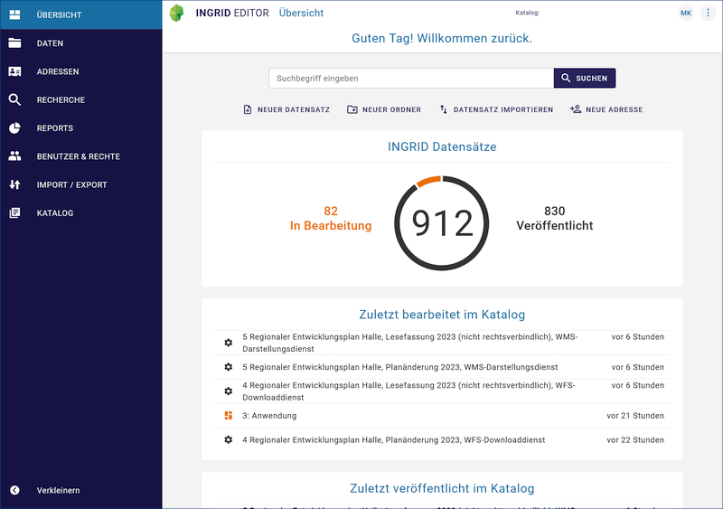

.. meta::
  :description: Der InGrid-OS Metadateneditor IGE-NG
  :keywords: Metadaten, Editor, Geodatensätze, Geodatendienste, Webdienste, Anwendungen, Informationssysteme, Datenbanken, Datensammlungen, Dokumente, Literatur, Projekte, Fachinformationen, Umweltdaten, Geodaten, Erfassung, Beschreibung, Dokumentation, IGE-NG, InGrid Editor - Neue Generation
  :keywords lang=de: Geodatensatz, Geodatendienst, Anwendung, Datenbank, Dokument, Projekt, Fachinformation

   

====================
Bedienungsanleitung
====================
========================================
InGrid Editor - Neue Generation (IGE-NG)
========================================
=========================================
Profil: Hamburger Metadatenkatalog (HMDK)
=========================================

Version der Bedienungsanleitung
   - InGrid Editor-Version: 7.0.1
   - letzte Änderung: 11.04.2024
   - Status: in Bearbeitung

   Abb.: InGrid Editor - Neue Generation (IGE-NG) - Übersicht

..  note::  Die Eingabemasken und die Eingabefelder können sich derzeit noch zum Hamburger Metadatenkatalog unterscheiden.

--------------------------------------------------------------------------------------------------------------

.. toctree::
   :maxdepth: 2
   :caption: Portal

   portal/registrierung-anmeldung/registrierung-anmeldung.rst
   portal/startseite/feld-ankuendigungen.rst
   portal/kartenclient/verfuegbare-kartendienste.rst

--------------------------------------------------------------------------------------------------------------

.. toctree::
   :maxdepth: 4
   :caption: Erfassung von Metadaten

   ingrid-editor/erfassung/erfassung-allgemeines.rst
   ingrid-editor/erfassung/erfassung-adressen.rst
   ingrid-editor/erfassung/erfassung-metadaten.rst
   ingrid-editor/erfassung/datensatztypen/datensatztypen.rst

--------------------------------------------------------------------------------------------------------------

.. toctree::
   :maxdepth: 3
   :caption: Fragen und Antworten
   
   informationen/kontakt/kontakt.rst

--------------------------------------------------------------------------------------------------------------

.. toctree::
   :maxdepth: 3
   :caption: Administration
   
   ingrid-editor/administration/benutzerverwaltung/benutzerverwaltung.rst

--------------------------------------------------------------------------------------------------------------

.. toctree::
   :maxdepth: 2
   :caption: Historie (Software)
   
   informationen/historie/versionen.rst