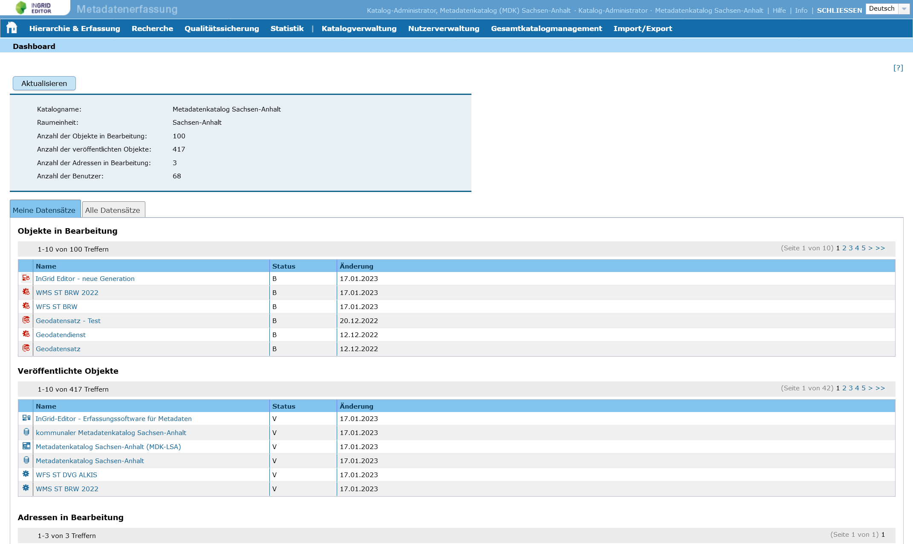

   

   

Bedienungsanleitung InGrid Editor (IGE)
=======================================

Version der Bedienungsanleitung
   - InGrid-Version: 5.14.2
   - letzte Änderung: 05.05.2023
   - Status: in Bearbeitung

.. toctree::
   :maxdepth: 2
   :caption: Portal

   metaver_portal/metaver_registrierung-anmeldung/metaver_registrierung-anmeldung.rst
   metaver_portal/metaver_startseite/metaver_feld-ankuendigungen.rst
   metaver_portal/metaver_kartenclient/metaver_verfuegbare-kartendienste.rst

.. toctree::
   :maxdepth: 3
   :caption: Der Editor
   
   metaver_ige/ige_ingrideditor/ige_ingrideditor.rst
   metaver_ige/ige_ingrideditor/ige_funktionen.rst
   metaver_ige/ige_atom-feed-client/ige_atom-feed-client.rst

.. toctree::
   :maxdepth: 4
   :caption: Erfassung von Metadaten

   metaver_ige/ige_erfassung/erfassung-allgemeines.rst
   metaver_ige/ige_erfassung/erfassung-adressen.rst
   metaver_ige/ige_erfassung/erfassung-objekte.rst
   metaver_ige/ige_erfassung/ige_objektklassen/objektklassen.rst

.. toctree::
   :maxdepth: 3
   :caption: Fragen und Antworten
   
   metaver_informationen/kontakt/metaver_kontakt.rst

.. toctree::
   :maxdepth: 2
   :caption: Administration

   metaver_ige/administration/benutzerverwaltung/ige-benutzerverwaltung.rst

.. toctree::
   :maxdepth: 2
   :caption: Historie (Software)
   
   metaver_informationen/historie/ige-metaver_versionen.rst