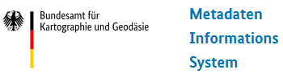

.. meta::
  :description: Der InGrid-OS Metadateneditor IGE-NG
  :keywords: Metadaten, Editor, Geodatensätze, Geodatendienste, Webdienste, Anwendungen, Geodaten, Erfassung, Beschreibung, Dokumentation, IGE-NG, InGrid Editor - Neue Generation
  :keywords lang=de: Geodatensatz, Geodatendienst, Webdienst, Anwendung

    

====================================================
Bedienungsanleitung Metadaten-Editor des BKG
====================================================
----------------------------------------
Software: InGrid IGE - Next Generation
----------------------------------------

Version der Bedienungsanleitung
   - InGrid Editor-Version: 7.2.1, 04.08.2024, 01:52
   - letzte Änderung: 16.06.2025
   - Status: in Bearbeitung

.. figure:: img/portal/uebersicht.png
   :align: left
   :figwidth: 100%

   Abb.: InGrid Editor - Neue Generation (IGE-NG) - Übersicht

..  note::  Diese Anleitung wurde für die Projektgemeinschaft METAVER erstellt und anschließend für die Anwendung BKG-MIS angepasst. Die Abbildungen in dieser Dokumentation zeigen mitunter ein vom BKG-MIS abweichendes Layout. Funktional beschreiben sie die gleiche Situation.

..  hint:: Wenn Probleme im Editor nach Updates auftreten, dann bitte zuerst im privaten Modus testen (Stichwort: Cache-Probleme). Tritt das Problem dann nicht mehr auf, bitte den Browser-Cache leeren. Falls das Problem weiterhin besteht, wenden Sie sich bitte an den Administrator, ggf. fügen Sie einen Screenshot bei. 

--------------------------------------------------------------------------------------------------------------

.. toctree::
   :maxdepth: 2
   :caption: Portal

   portal/registrierung-anmeldung/registrierung-anmeldung.rst
   portal/startseite/feld-ankuendigungen.rst
   

--------------------------------------------------------------------------------------------------------------

.. toctree::
   :maxdepth: 4
   :caption: Erfassung von Metadaten

   ingrid-editor/erfassung/erfassung-allgemeines.rst
   ingrid-editor/erfassung/erfassung-adressen.rst
   ingrid-editor/erfassung/erfassung-metadaten.rst
   ingrid-editor/erfassung/datensatztypen/datensatztypen.rst

--------------------------------------------------------------------------------------------------------------

.. toctree::
   :maxdepth: 3
   :caption: Fragen und Antworten
   
   informationen/kontakt/kontakt.rst

--------------------------------------------------------------------------------------------------------------

.. toctree::
   :maxdepth: 3
   :caption: Administration
   
   ingrid-editor/administration/benutzerverwaltung/benutzerverwaltung.rst

--------------------------------------------------------------------------------------------------------------

.. toctree::
   :maxdepth: 2
   :caption: Historie (Software)
   
   informationen/historie/versionen.rst
