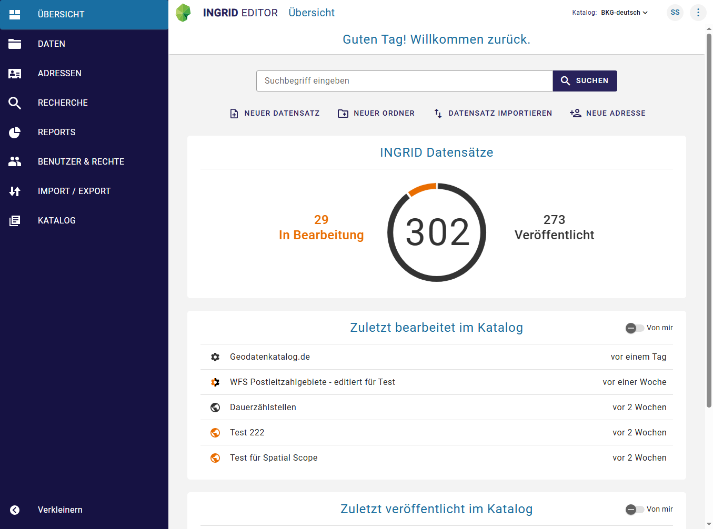

.. meta::
  :description: Der InGrid-OS Metadateneditor IGE-NG
  :keywords: Metadaten, Editor, Geodatensätze, Geodatendienste, Webdienste, Anwendungen, Informationssysteme, Datenbanken, Datensammlungen, Dokumente, Literatur, Projekte, Fachinformationen, Umweltdaten, Geodaten, Erfassung, Beschreibung, Dokumentation, IGE-NG, InGrid Editor - Neue Generation
  :keywords lang=de: Geodatensatz, Geodatendienst, Anwendung, Datenbank, Dokument, Projekt, Fachinformation

   

==================================
Bedienungsanleitung InGrid Editor
==================================

----------------------------------------------------------------------------------------------------------

| **Portal:** HMDK® (Hamburger Metadatenkatalog)
| **Software:** InGrid (Open-Source)
| **InGrid-Version:** 7.3.2
| **Komponente:** InGrid Editor
| **Profil:** HMDK

| **letzte Änderung:** 22.01.2025
| **Status:** in Bearbeitung

---------------------------------------------------------------------------------------------------------
 

Abb.: InGrid Editor - Übersicht

..  note::  Die Eingabemasken und die Eingabefelder können sich derzeit noch zum Hamburger Metadatenkatalog unterscheiden.

..  hint:: Wenn Katalog-Administratoren, Metadaten-Administratoren oder Metadaten-Autoren Probleme im Editor melden, bitte zuerst im privaten Modus testen (Stichwort: Cache-Probleme). Tritt das Problem dann nicht auf, bitte den Browser-Cache leeren. Falls das Problem weiterhin besteht, bitte einen Screenshot mit der Ausgabe der Browserkonsole erstellen. Metadatenautoren und Metadatenadministratoren wenden sich diesbezüglich an den Katalogadministrator.

--------------------------------------------------------------------------------------------------------------

.. toctree::
   :maxdepth: 2
   :caption: Portal

   portal/registrierung-anmeldung/registrierung-anmeldung.rst
   portal/startseite/feld-ankuendigungen.rst
   portal/kartenclient/verfuegbare-kartendienste.rst

--------------------------------------------------------------------------------------------------------------

.. toctree::
   :maxdepth: 4
   :caption: Erfassung von Metadaten

   ingrid-editor/erfassung/erfassung-allgemeines.rst
   ingrid-editor/erfassung/erfassung-adressen.rst
   ingrid-editor/erfassung/erfassung-metadaten.rst
   ingrid-editor/erfassung/datensatztypen/datensatztypen.rst

--------------------------------------------------------------------------------------------------------------

.. toctree::
   :maxdepth: 3
   :caption: Fragen und Antworten
   
   informationen/kontakt/kontakt.rst

--------------------------------------------------------------------------------------------------------------

.. toctree::
   :maxdepth: 3
   :caption: Administration
   
   ingrid-editor/administration/benutzerverwaltung/benutzerverwaltung.rst

--------------------------------------------------------------------------------------------------------------

.. toctree::
   :maxdepth: 2
   :caption: Historie (Software)
   
   informationen/historie/versionen.rst