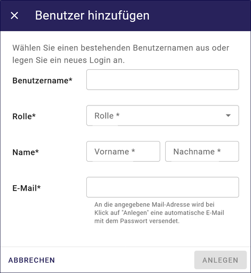

====================
Benutzer neu anlegen
====================

Um einem neuen Benutzer passende Rechte für den InGrid-Editor zuzuweisen, muss in der „Gruppenadministration“ der UVP-Editor-Benutzerverwaltung überprüft werden, ob bereits eine oder mehrere Gruppen existieren, die mit den entsprechenden Rechten ausgestattet sind. Dabei ist darauf zu achten, die Rechte präzise und eindeutig zu definieren. Falls nicht, müssen neue Gruppen erstellt werden.

Abb.: Benutzer Gruppenberechtigung zuordnen

 
Nachdem gehen Sie bitte wie folgt vor:

Durch Anklicken des "HINZUFÜGEN"-Buttons wird ein Dialogfenster geöffnet.

.. figure:: ../../../img/ige/administration/benutzerverwaltung/hinzufuegen.png
   :align: left
   :scale: 40
   :figwidth: 100%

Abb.: Button "HINZUFÜGEN"

Folgende Felder müssen ausgefüllt werden:

Feld Login
----------

Abb.: Dialogfenster - Benutzer hinzufügen

Feld Rolle
----------

Abb.: Rolle zuweisen

.. hint:: Katalog-Administratoren können Metadaten-Administratoren und Autoren anlegen. Metadaten-Administratoren können nur Autoren anlegen. Autoren können keine Benutzer anlegen.

Einem InGrid Editor-Benutzer können eine oder mehrere Gruppen zugewiesen werden. In der Auswahlliste werden alle Gruppen angezeigt, die in der Gruppenadministration definiert sind.

Feld E-Mail
-----------

An die angegebene Email-Adresse wird bei Klick auf "ANLEGEN" eine automatische E-Mail mit dem Passwort versendet.

Jede E-Mail-Adresse kann nur einmal vergeben werden, um eine eindeutige Zuordnung von Benutzernamen zu E-Mail-Adressen zu gewährleisten.

Nachdem alle Felder im Dialogfenster ausgefüllt wurden, muss der Button "ANLEGEN" betätigt werden. Der Benutzer wird angelegt und es können weitere Felder ausgefüllt werden. Abschließend muss dem Benutzer eine Gruppe zugewiesen werden.

Abb.: Gruppe zuweisen

 
Mit "SPEICHERN" (Schaltfläche oben rechts) schließen Sie den Vorgang ab.

Abb.: Button "SPEICHERN"
