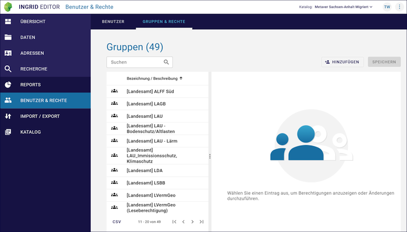
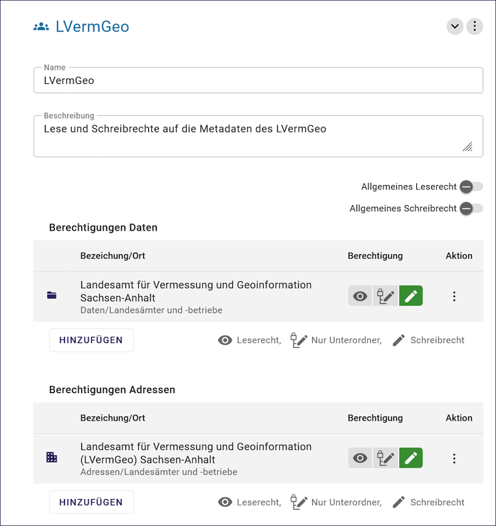
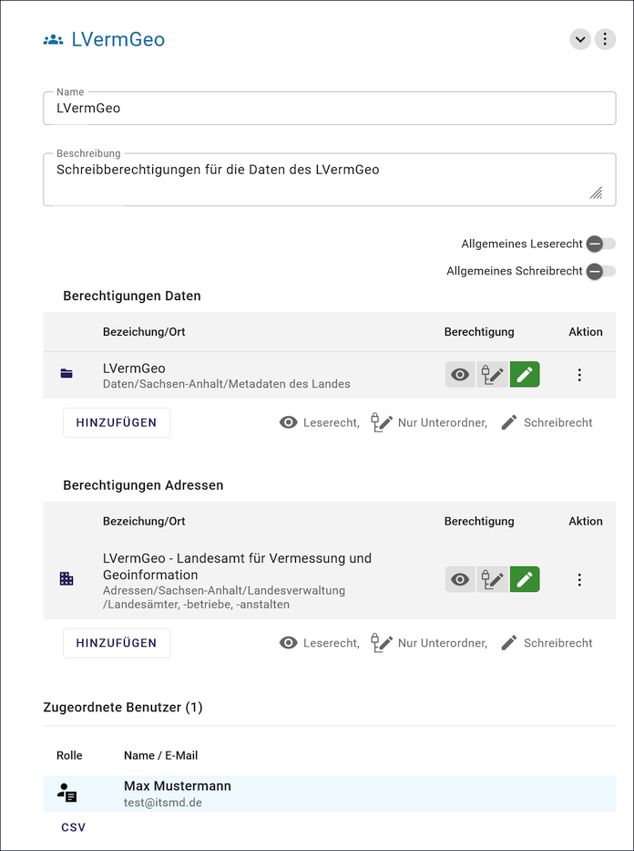

=================
Gruppen & Rechte
=================

In der Gruppenverwaltung werden einen bestimmten Personenkreis die Lese- oder Schreibrechte auf Metadaten und Adressen erteilt.

Gruppen erstellen
-----------------

Um Gruppen in unserem System zu erstellen, gehen Sie wie folgt vor:

1. Klicken Sie auf "Gruppen & Rechte" in der Navigationsleiste.
2. Wählen Sie "HINZUFÜGEN".
3. Geben Sie einen Namen und eine Beschreibung für die Gruppe ein.
4. Wählen Sie die Mitglieder aus der Liste der verfügbaren Benutzer aus.
5. Speichern Sie die Gruppe. Bitte beachten Sie, dass diese Gruppe nur von Benutzern angesehen werden kann, die Teil der Gruppe sind oder Zugriffsberechtigungen haben. Änderungen an den Gruppenmitgliedschaften können jederzeit vorgenommen werden.

Abb.: Verwaltung von Gruppen

Abb.: Gruppe hinzufügen

Abb.: Fenster Gruppe hinzufügen

Abb.: Vergabe von allgemeinen Rechten

Abb.: Vergabe von allgemeinen Rechten

Rechte Vergabe
--------------

Bitte beachten Sie bei der Vergabe von Rechten, dass nur befugtes Personal Zugang zu vertraulichen Informationen hat. Stellen Sie sicher, dass die Rechte auf ein Minimum beschränkt sind und nur den Bedürfnissen der betreffenden Mitarbeiter entsprechen. Überwachen Sie regelmäßig die Vergabe von Rechten und nehmen Sie Änderungen vor, wenn sich die Umgebung oder die Position eines Mitarbeiters ändert.

Abb.: Vergabe von Berechtigungen

Rechtevergabe Daten und Adressen - Bedeutung der Symbole

- Symbol Auge: Leserechtevergabe
- Symbol Strukturbaum: Nur Unterordner
- Symbol Stift Schreibrechte
- Drei Punkte: Bearbeiten

   Abb.: Berechtigungen