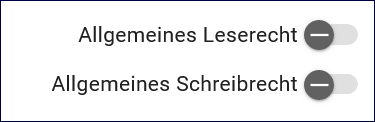

=================
Gruppen & Rechte
=================

In der Gruppenverwaltung werden einen bestimmten Personenkreis die Lese- oder Schreibrechte auf Metadaten und Adressen erteilt.

In der Gruppenadministration können Sie:

Eine Gruppe bearbeiten: Klicken Sie auf den Namen der Gruppe in der Liste links oben im Fenster. Sie können nun den Namen der Gruppe ändern sowie die Rechte für die Gruppe (siehe unten). Änderungen müssen mit Speichern abgeschlossen werden und stehen dann sofort zur Verfügung.

Eine Gruppe neu anlegen: Klicken Sie auf die Schaltfläche Neue Gruppe anlegen. Sie müssen den Gruppennamen angeben und den Vorgang mit Speichern abschließen. Sie können nun die Rechte für die Gruppe angeben (siehe unten).

Eine Gruppe löschen: Klicken Sie mit der rechten Maustaste auf den Namen der Gruppe, die Sie löschen wollen. Wählen Sie Zeile löschen aus dem Kontextmenü und bestätigen Sie den Vorgang in dem sich öffnenden Dialog.

Wichtig: Alle Änderungen an den Gruppeneigenschaften (auch die an den untenstehenden Berechtigungen) müssen über Speichern abgeschlossen werden, damit die Änderungen wirksam werden und nicht verloren gehen.

Gruppen erstellen
-----------------

Um Gruppen im InGrid Editor zu erstellen, gehen Sie wie folgt vor:

1. Klicken Sie auf "Gruppen & Rechte" in der Navigationsleiste.
2. Wählen Sie "HINZUFÜGEN".
3. Geben Sie einen Namen und eine Beschreibung für die Gruppe ein.
4. Wählen Sie die Mitglieder aus der Liste der verfügbaren Benutzer aus.
5. Speichern Sie die Gruppe. Bitte beachten Sie, dass diese Gruppe nur von Benutzern angesehen werden kann, die Teil der Gruppe sind oder Zugriffsberechtigungen haben. Änderungen an den Gruppenmitgliedschaften können jederzeit vorgenommen werden.

.. figure:: ../../../img/ige/administration/benutzerverwaltung/gruppen.png
   :align: left
   :scale: 100
   :figwidth: 100%

Abb.: Verwaltung von Gruppen

Abb.: Gruppe hinzufügen

Abb.: Fenster Gruppe hinzufügen

Abb.: Vergabe von allgemeinen Rechten

Abb.: Vergabe von allgemeinen Rechten

Rechte-Vergabe
--------------

Stellen Sie sicher, dass die Rechte auf ein Minimum beschränkt sind und den Bedürfnissen der betreffenden Mitarbeiter entsprechen.

Abb.: Vergabe von Berechtigungen

Rechtevergabe Daten und Adressen - Bedeutung der Symbole

- Symbol Auge - Vergabe von Leserechten für einen Ordner und die darunter befindlichen Ordner und  Daten.
- Symbol Strukturbaum - Wenn die Berechtigungen auf "Nur Unterordner" gesetzt sind, kann weder der Name noch das Veröffentlichungsrecht des ausgewählten Ordners geändert werden. Der Ordner wird in der Ordnerstruktur grau dargestellt.
- Symbol Stift - Vergabe von Schreibrechten für einen Ordner und die darunter befindlichen Ordner und Adressen.
- Drei Punkte: Bearbeiten/Entfernen

Um Berechtigungen zu vergeben, klicken Sie auf das entsprechende Symbol und wählen Sie in der Ordnerstruktur den Ordner aus, ab dem die Berechtigungen gelten sollen.

.. figure:: ../../../img/ige/administration/benutzerverwaltung/berechtigungen.png
   :align: left
   :scale: 90
   :figwidth: 100%

Abb.: Berechtigungen