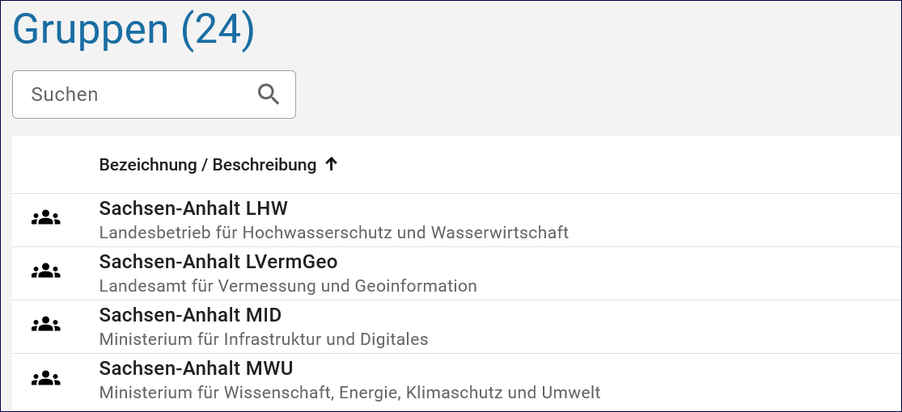

====================
Suche und CSV-Export
====================

Suche
-----

Mit der Suchfunktion in der Benutzer- und Gruppenverwaltung können Benutzer und Gruppen einfach gefunden werden.
Bereits während der Eingabe des Nutzers oder der Gruppe werden passende Einträge automatisch ausgewählt.

Abb.: Suche eines Nutzers

Abb.: Suche einer Gruppe

CSV-Export
----------

Über die CSV-Exportfunktion kann der Administrator die Nutzer als CSV-Datei exportieren und in eine Excel-Tabelle importieren. Diese Funktion ermöglicht es dem Katalogadministrator zum Beispiel, die E-Mail-Adressen der Nutzer aktuell zu selektieren, wenn diese angeschrieben werden sollen.

Abb.: CSV-Export

Abb.: CSV-Export