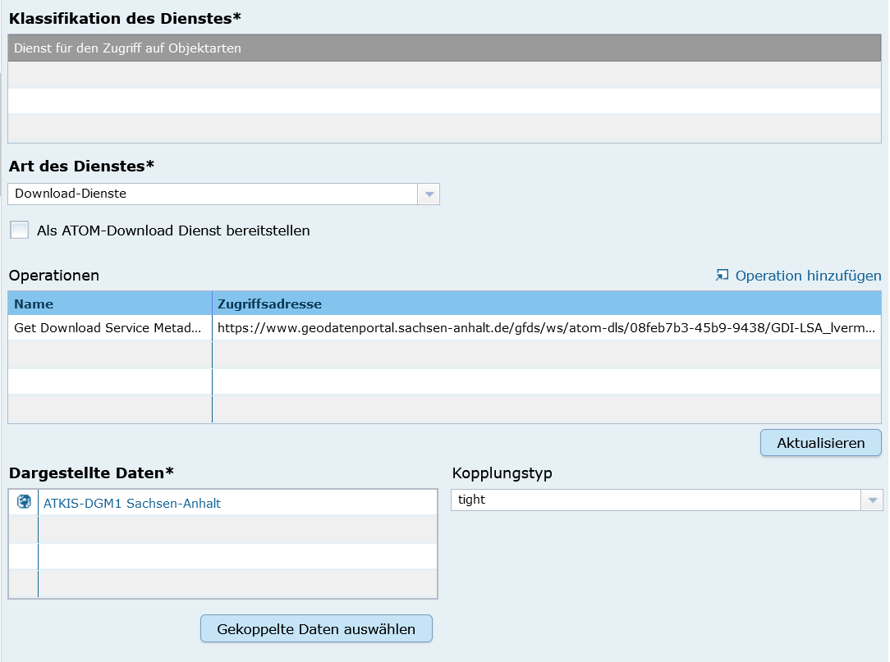
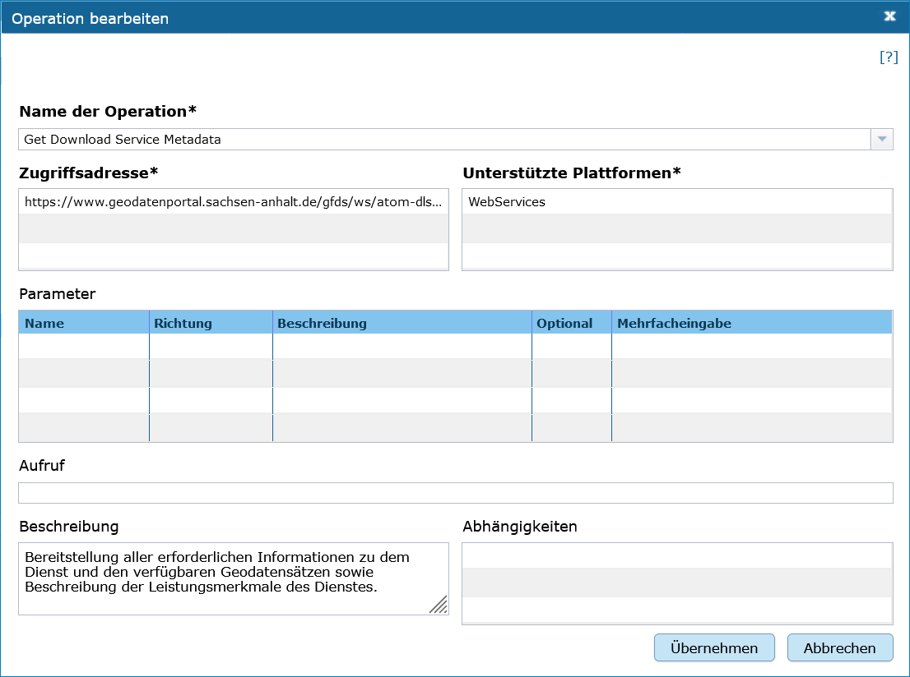
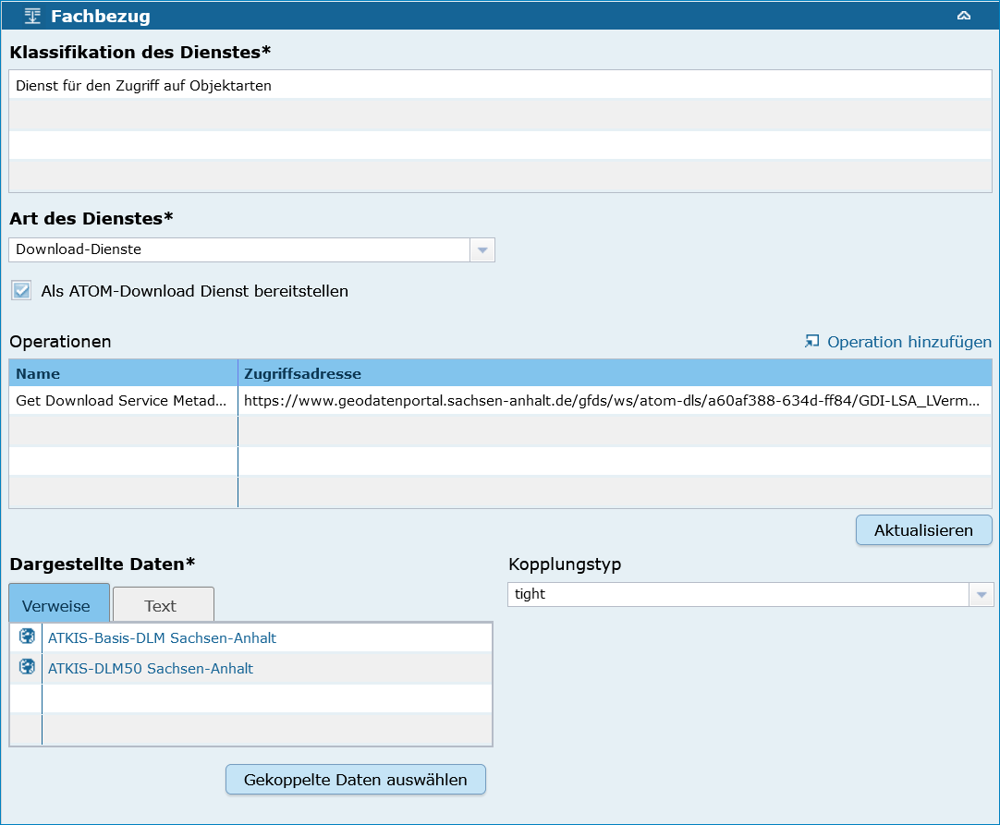
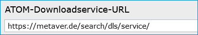
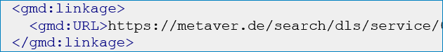
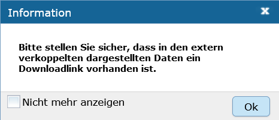
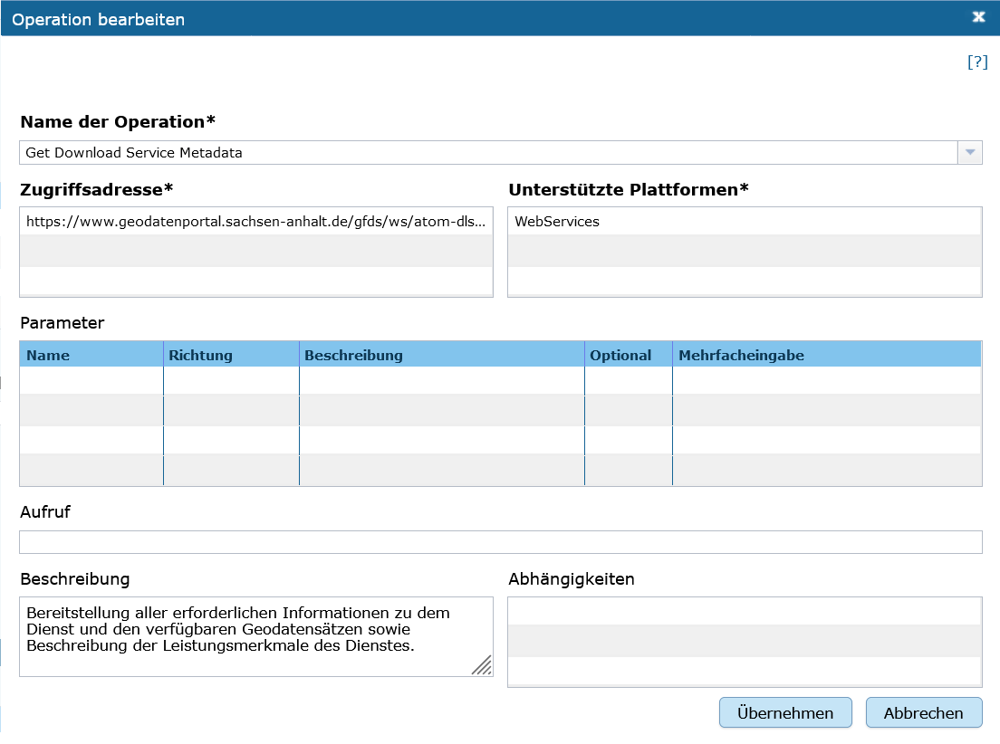

Download-Dienste als ATOM-Feed bereitstellen
^^^^^^^^^^^^^^^^^^^^^^^^^^^^^^^^^^^^^^^^^^^^

Ein ATOM-Downloaddienst ist ein Downloaddienst für (Geo-) Daten, der meist im Zusammenhang mit einer (Geo-) Datenbereitstellung als Open Data bzw. einer Geodatenbereitstellung nach der INSPIRE-Richtlinie verwendet wird.

 
Der Atom-Feed
"""""""""""""

Das (XML-basierte) Web-Feed-Format ATOM ermöglicht die Veröffentlichung und das nutzerseitige Abonnement von Informationen. Es ermöglicht den plattformunabhängigen Download von (Geo-) Daten.

Folgende Voraussetzungen müssen erfüllt sein, damit ATOM-Feeds erstellt und über den `Atom-Feed Client <https://metaver-bedienungsanleitung.readthedocs.io/de/igeng/ingrid-editor/erfassung/datensatztypen/atom-feed/client.html>`_ bereitgestellt werden können:

Erfassung eines externen ATOM-Feeds
^^^^^^^^^^^^^^^^^^^^^^^^^^^^^^^^^^^

Abschnitt Fachbezug
'''''''''''''''''''
.. figure:: ../../../../img_ige/metaver_ige/ige_erfassung/ige_objekte/ige_abschnitt-04_fachbezug/ige-abschnitt_fachbezug.png

Abb.: Einbindung eines externen ATOM-Feeds

Art des Dienstes
''''''''''''''''
Im Feld "Art des Dienstes" muss der Wert "Download-Dienste" ausgewählt werden.

Operationen
^^^^^^^^^^^

Abb.: Fenster - Operationen bearbeiten

Name der Operation
'''''''''''''''''''
Bei ATOM-Downloaddiensten, die nicht über den InGrid Editor generiert und die im Rahmen von INSPIRE bereitgestellt werden, ist als Name der Operation "Get Download Service Metadata" auszuwählen.

Zugriffsadresse
''''''''''''''''

Eindeutige URL über die die Operation aufgerufen werden kann.

Beispiel: https://www.host.de/.../downloads/name_der_datei.zip

Unterstützte Plattformen
''''''''''''''''''''''''

Angaben zur Art der Plattform bzw. Schnittstelle über die der Dienst angesprochen werden kann,
Auswahl: WebService.

Download-URL
''''''''''''

Die Daten, welche für den Download bereitgestellt werden sollen, müssen über das Internet verfügbar sein und über eine URL direkt abrufbar sein. Dabei ist es egal, ob die Daten gezippt oder ungezipt bereitgestellt werden.

Beispiel: Formate für den Daten-Download: .shp, .zip

GetFeature-Request werden dagegen nicht ausgewertet. Der Service-Feed enthält hierbei zwar den Verweis zum Daten-Feed, ruft man aber den Daten-Feed auf, so fehlt der Link zum Download. 

Beispiel: https://www.host.de/.../downloads/name_der_datei.zip

Erstellung eines ATOM-Feeds im IGE
^^^^^^^^^^^^^^^^^^^^^^^^^^^^^^^^^^

Abb.: Erstellung eines ATOM-Feeds im IGE

Checkbox - "Als ATOM-Download Dienst bereitstellen"
'''''''''''''''''''''''''''''''''''''''''''''''''''

Bei aktivierter Option, wird dieser Datensatz im Portal als Download angeboten. Zusätzlich wird die in den Katalogeinstellungen hinterlegte "ATOM-Downloadservice-URL" automatisch in das ISO-Format unter "distributionInfo"/"linkage" abgebildet.

Abb.: Katalogeinstellung - hinterlegte URL

Abb.: ISO-XML

Weiterhin erscheint eine Information.

Abb: Information

.. hint:: Für ATOM-Downloaddienste, die im ATOM-Feed Client erscheinen sollen, muss in der Objektklasse Geodatensatz (unter "Verweise") eine Download-URL angelegt werden.

Operationen
^^^^^^^^^^^

Abb.: Fenster - Operationen bearbeiten

Beispiel: https://www.url.de/ ... /topfeed=1/LVermGeo_ATOM_DTK_COL.atom

