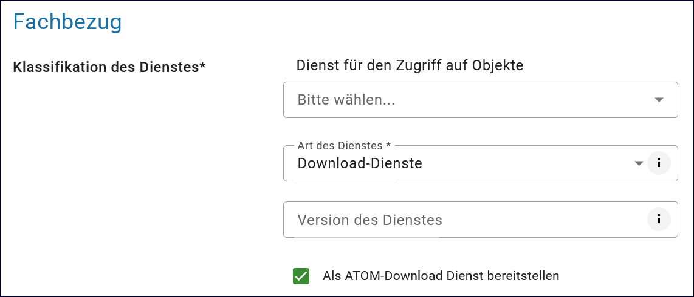

Der ATOM-Feed Client
^^^^^^^^^^^^^^^^^^^^

.. figure:: ../../../../img/ige/erfassung/ige_metadaten/ige_datensatztypen/datensatztyp_geodatendienst/atom-feed-client/atom-feed-client.png
   :align: left
   :scale: 50
   :figwidth: 100%

Abb.: `Der InGrid ATOM-Feed Client mit allen Atom-Feeds <https://metaver.de/search/dls/>`_

Da Webbrowser für den Datendownload von ATOM-Feeds nur Erweiterungen unterstützen, wurde der webbasierte InGrid ATOM-Feed Client als Alternative bereitgestellt. Weitere Informationen dazu finden sich hier: "Als ATOM-Download Dienst bereitstellen" <https://metaver-bedienungsanleitung.readthedocs.io/de/igeng/ingrid-editor/erfassung/datensatztypen/atom-feed/bereitstellung.html>`_. Im InGrid Editor kann der Nutzer das Feld "Als ATOM-Download Dienst bereitstellen" aktivieren, um die Übernahme der ATOM-Dienste vom InGrid Editor in den ATOM-Feed Client zu ermöglichen.

Abb.: Downloaddienst - Als ATOM-Download Dienst bereitstellen

Der ATOM-Feed Client wurde an die spezifischen Anforderungen der Bundesländer und Download-Server angepasst. 

Folgende Partner-Bundesländer verfügen über den ATOM-Feed Client.

.. figure:: ../../../../img/ige/erfassung/ige_metadaten/ige_datensatztypen/datensatztyp_geodatendienst/atom-feed-client/atom-feed-client_bb.png
   :align: left
   :scale: 50
   :figwidth: 100%

Abb.: `ATOM-Feed Client Brandenburg <https://metaver.de/search/dls/?partner=bb>`_

.. figure:: ../../../../img/ige/erfassung/ige_metadaten/ige_datensatztypen/datensatztyp_geodatendienst/atom-feed-client/atom-feed-client_hb.png
   :align: left
   :scale: 50
   :figwidth: 100%
 
Abb.: `ATOM-Feed Client Hansestadt Bremen <https://metaver.de/search/dls/?partner=hb>`_

.. figure:: ../../../../img/ige/erfassung/ige_metadaten/ige_datensatztypen/datensatztyp_geodatendienst/atom-feed-client/atom-feed-client_hh.png
   :align: left
   :scale: 50
   :figwidth: 100%

Abb.: `ATOM-Feed Client Hansestadt Hamburg <https://metaver.de/search/dls/?partner=hh>`_

.. figure:: ../../../../img/ige/erfassung/ige_metadaten/ige_datensatztypen/datensatztyp_geodatendienst/atom-feed-client/atom-feed-client_st.png
   :align: left
   :scale: 50
   :figwidth: 100%

Abb.: `ATOM-Feed Client Sachsen-Anhalt <https://metaver.de/search/dls/?partner=st>`_

.. hint:: Wenn die URL des ATOM-Feeds im InGrid-Editor geändert wird, muss der ATOM-Feed im ATOM-Feed-Client (durch Drücken der F5-Taste) neu geladen werden.
