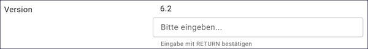
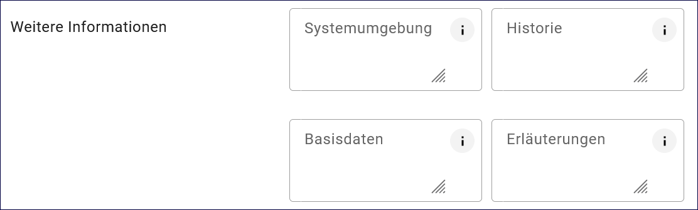
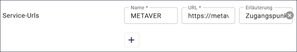

=========
Anwendung
=========

.. csv-table::
    :header: "Portal", "Editor"
    :widths: 20, 20

    .. image:: ../../../img/ige/icons/datensatztypen/portal/anwendung.png, .. image:: ../../../img/ige/icons/datensatztypen/ige/anwendung.png

Mit dem Datensatztyp Anwendung können Softwareprodukte, Webanwendungen oder zentrale Auskunfts- und Anwendunge im Metadatenkatalog beschrieben werden.

.. note:: Die Erfassung dieser Objektklasse erfolgt wie unter `Erfassung von Objekten <https://metaver-bedienungsanleitung.readthedocs.io/de/latest/metaver_ige/ige_erfassung/erfassung-objekte.html>`_ beschrieben. Der hier beschriebene Abschnitt Fachbezug enthält spezielle Eingabefelder für diesen Datensatztyp.

-----------------------------------------------------------------------------------------------------------------------

Abschnitt Fachbezug
-------------------

Feld: Art des Dienstes
^^^^^^^^^^^^^^^^^^^^^^

Abb.: Auswahlfeld - Art des Dienstes

Bitte wählen Sie in diesem Feld die Art des Dienstes aus.

Folgende Einstellungen sind möglich: 

  - Anwendung
  - Anwendung
  - nicht geographischer Dienst

 
 
Feld: Version
^^^^^^^^^^^^^

Abb.: Eingabezeile für die Version

Version des Dienstes. Bitte geben Sie alle unterstützten Versionen des Dienstes an und bestätigen Sie jede Eingabe mit Enter.

 
Weitere Informationen
^^^^^^^^^^^^^^^^^^^^^

Abb.: Textfelder für weitere Informationen

Feld: Systemumgebung
""""""""""""""""""""

Systemumgebung - Informationen über das Betriebssystem, die Software und ggf. die Hardware, die für die Implementierung des Dienstes verwendet werden.

Beispiel:

Die empfohlene Plattform ist Linux (Ubuntu/Redhat).

Das System kann auch unter Windows installiert werden. Dies macht jedoch die Installation von CYGWIN erforderlich.
Systemvoraussetzungen

| JAVA 17 JDK (z.B. OpenJDK)
| Cygwin (unter Windows)
| MySQL, ORACLE oder PostgreSQL (ab InGrid 4.0.2)

Basisinstallation

Diese Konfiguration wird nur für einfache Systeme ohne hohe Last oder zum Testen empfohlen.

| Dual Core CPU
| 4 GB RAM
| 10 GB Plattenplatz

Typische Installation

| Quad Core CPU
| 8 GB RAM
| 100 GB Plattenplatz

Feld: Historie
""""""""""""""

Entwicklungsangaben: Hier können Vorläufer und Nachfolger von Diensten, Anwendungen oder Systemen genannt werden. Informationen über anfängliche Forschungsprojekte oder -programme sind ebenfalls von Interesse.
Beispiel: 

| IGE-NG - InGrid Editor neue Generation (Webanwendung)

  - Konzeption: 2021
  - Entwicklung: seit 2022

| Vorläufer: IGE - InGrid Editor (Webanwendung)

  - Entwicklung seit 2006 bis 2023 (Version 6.2)
 

Feld: Basisdaten
""""""""""""""""

Beschreibung Herkunft und Art der zugrundeliegenden Daten. Im Allgemeinen sind dies die Datensätze, auf denen der Dienst basiert. Im Allgemeinen sollte die Herkunft oder der Ursprung der Daten beschrieben werden, die in dem Dienst, der Anwendung oder dem Anwendung verwendet, gespeichert, angezeigt oder weiterverarbeitet werden. Zusätzlich kann die Art der Daten (z. B. numerisch, automatisch oder aus Erhebungsergebnissen gewonnen, Primärdaten, fehlerbereinigte Daten) angegeben werden.

Beispiel: Das Anwendung enthält Umwelt- und Geodaten der öffentlichen Verwaltung.

**Feld: Erläuterungen**

Zusätzliche Anmerkungen zu dem beschriebenen Dienst, der Anwendung oder dem Anwendung. Hier können zusätzliche Informationen, z.B. technischer Art, gegeben werden, die für das Verständnis des Dienstes, der Anwendung, des Anwendungs erforderlich sind.

Beispiel: Die erfassten Daten werden über den Suchdienst Catalogue Service for the Web (CSW) an andere Datenbanken/Portale übergeben.

Feld: Service-URLs
^^^^^^^^^^^^^^^^^^

Abb.: Felder - Service-URLs

Angaben zur Adresse für den Zugriff auf den Dienst oder die Anwendung. Der Name und die URL sowie eine kurze Erläuterung der Adresse sind anzugeben.

Beispiel: Name: METAVER; URL: https://www.metaver.de; Erläuterung: Zugangspunkt zu Metadaten