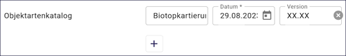
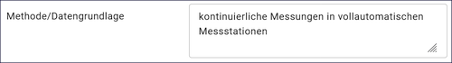
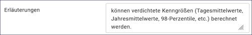

=========
Datenbank
=========

.. csv-table::
    :header: "Portal", "Editor"
    :widths: 20, 20

	 .. image:: ../../../img/ige/icons/datensatztypen/portal/datenbank.png, .. image:: ../../../img/ige/icons/datensatztypen/ige/datenbank.png

Der Datensatztyp "Datenbank" beschreibt gemessene, aufbereitete oder erhobene Daten. Dies können Messdaten, statistische Erhebungen, Modelldaten oder Anlagendaten sein. Dies betrifft Dienste und Anwendungen, Informationssysteme, die in der Regel auf eine oder mehrere Datenbanken zugreifen, um die enthaltenen Daten zugänglich zu machen.

.. note:: Die Erfassung dieses Datensatztyps erfolgt wie unter `Metadaten erfassen <https://metaver-bedienungsanleitung.readthedocs.io/de/latest/ingrid-editor/erfassung/erfassung-metadaten.html>`_ beschrieben. Der hier beschriebene Abschnitt Fachbezug enthält spezielle Eingabefelder für diesen Datensatztyp.

-----------------------------------------------------------------------------------------------------------------------

Feld: Typ
^^^^^^^^^

Unter Typ können weitere Eigenschaften (Eingabefelder) für den Metadatensatz definiert werden.

Abb.: Optionen für weitere Eigenschaften

.. seealso:: Beschreibungen der Optionen: `INSPIRE-relevant | <https://metaver-bedienungsanleitung.readthedocs.io/de/latest/ingrid-editor/erfassung/datensatztypen/option/inspire-relevant.html>`_ `AdV-kompatibel | <https://metaver-bedienungsanleitung.readthedocs.io/de/latest/ingrid-editor/erfassung/datensatztypen/option/adv-kompatibel.html>`_ `Open Data <https://metaver-bedienungsanleitung.readthedocs.io/de/latest/ingrid-editor/erfassung/datensatztypen/option/opendata.html>`_

-----------------------------------------------------------------------------------------------------------------------

Abschnitt Fachbezug
-------------------

Feld: Objektartenkatalog
^^^^^^^^^^^^^^^^^^^^^^^^

Abb.: Tabelle - Objektartenkatalog

Hier kann der den Daten zugrunde liegende Klassifizierungsschlüssel angegeben werden. Es können mehrere Kataloge mit Datum und Version eingegeben werden.

Beispiel:  Biotoptypenschlüssel Hamburg (tt.mm.jjjj), Version (xx.xx)

Feld: Inhalte der Datensammlung/Datenbank
^^^^^^^^^^^^^^^^^^^^^^^^^^^^^^^^^^^^^^^^^^

Abb.: Felder für Inhalte der Datensammlung/Datenbank

Feld: Parameter
"""""""""""""""
 
Angabe der wichtigsten Parameter der Datenbank oder Datensammlung. Um einen qualifizierten Überblick über die beschriebene Datensammlung oder Datenbank zu erhalten, werden hier die wichtigsten Parameter der gespeicherten Daten aufgeführt. Bei Messdaten werden die wichtigsten Messparameter wie z.B. NOx, SO2, Windgeschwindigkeit und pH-Wert angegeben. Bei statistischen Erhebungen werden Erhebungsgrößen wie Wasserverbrauch pro Kopf und Bevölkerungsdichte angegeben. Bei Modelldaten werden die Modellparameter wie Meeresspiegel, CO2-Gehalt der Luft und globale Temperatur dargestellt.

Beispiel für Trinkwasserwerte: °C, °dH, [ph-Einheiten], [µS/cm], [mg/l], [Anz./100ml]

Feld: Ergänzenden Angaben
"""""""""""""""""""""""""

Es können zusätzliche Angaben zu Parametern angegeben werden, wie zum Beispiel: Maßeinheiten, Genauigkeiten, Nachweisgrenzen, Probenmatrizen oder spezifische Angaben zur Messmethode.

Beispiel: Grenzwert 100/1 ml

Feld: Methode / Datengrundlage
^^^^^^^^^^^^^^^^^^^^^^^^^^^^^^

Abb.: Tabelle - Methode/Datengrundlage

Angaben zu den verwendeten Methoden und zur Datengrundlage. Die zur Datenerhebung verwendeten Methoden, wie z. B. Mess- und Erhebungsverfahren, sind anzugeben und zu beschreiben. Darüber hinaus können Angaben zur Qualität und zum Umfang der Datengrundlage gemacht werden.

Beispiel: kontinuierliche Messungen in vollautomatischen Messstationen
 

Feld: Erläuterungen
^^^^^^^^^^^^^^^^^^^^

Abb.: Textfeld - Erläuterungen

Weitere Informationen zur Datensammlung bzw. zur Datenbank.

Beispiel: Datengewinnung erfolgt im hydrologischen Messdienst, Datensammler, Beobachter