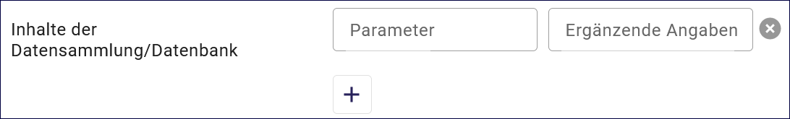
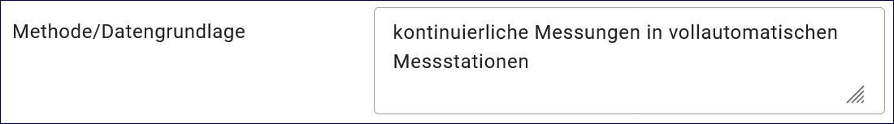

Datensammlung
=============

.. csv-table::
    :header: "Portal", "Editor"
    :widths: 20, 20

	 .. image:: ../../../img/ige/icons/datensatztypen/portal/datensammlung.png, .. image:: ../../../img/ige/icons/datensatztypen/ige/datensammlung.png

Der Datensatztyp Datenerhebung dient der Beschreibung gemessener, aufbereiteter oder erhobener Daten. Dazu gehören Messdaten, statistische Erhebungen, Modelldaten oder Anlagendaten (Dienste/Anwendungen/Informationssysteme: zentrale Informationssysteme, die in der Regel auf eine oder mehrere Datenbanken zugreifen und diese zugänglich machen).

.. important:: Die Erfassung dieses Datensatztyps erfolgt wie unter `Metadaten erfassen <https://metaver-bedienungsanleitung.readthedocs.io/de/igeng/ingrid-editor/erfassung/erfassung-metadaten.html>` beschrieben. Der hier beschriebene Abschnitt Fachbezug enthält spezielle Eingabefelder für diesen Datensatztyp.

-----------------------------------------------------------------------------------------------------------------------

Abschnitt Fachbezug
-------------------

Feld: Objektartenkatalog
^^^^^^^^^^^^^^^^^^^^^^^^

.. figure:: ../../../img/ige/erfassung/ige_metadaten/datensatztypen/datensatztyp_datensammlung/fachbezug_objektartenkatalog.png
   :align: left
   :scale: 50
   :figwidth: 100%

Abb.: Tabelle - Objektartenkatalog

Hier können die den Daten zugrunde liegenden Klassifikationsschlüssel benannt werden. Es können mehrere Kataloge mit zugehörigem Datum (Pflichteintrag) und Version (Optional) eingegeben werden.

Beispiel: Biotoptypenschlüssel, Datum 29.08.2023, Version 6.1

Feld: Inhalte der Datensammlung/Datenbank
^^^^^^^^^^^^^^^^^^^^^^^^^^^^^^^^^^^^^^^^^^

Abb.: Tabelle - Inhalte der Datensammlung

Feld: Parameter
"""""""""""""""

Angabe der wichtigsten Parameter der Datenbank bzw. der Datensammlung. Um einen qualifizierten Überblick über die beschriebene Datensammlung bzw. Datenbank zu erhalten, sollen hier die aussagekräftigen Parameter der vorgehaltenen Daten genannt werden. Diese Parameter sind in der linken Spalte aufgeführt. Beispiele für Parameter: Bei Messdaten werden die wichtigsten Messparameter (z.B. NOx, SO2, Windgeschwindigkeit, pH-Wert), bei statistischen Erhebungen die Erhebungsgrößen (z.B. Wasserverbrauch pro Kopf, Bevölkerungsdichte), bei Modelldaten die Modellparameter (z.B. Meeresspiegel, CO2-Gehalt der Luft, globale Temperatur) angegeben.

Feld: Ergänzenden Angaben
"""""""""""""""""""""""""

In der rechten Spalte können zu jedem Parameter weitere Angaben gemacht werden. Dies können z.B. Angaben zur Maßeinheit, Genauigkeit, Nachweisgrenze, Probenmatrix oder parameterspezifische Angaben zur Messmethode sein.

Beispiel: Blei / in Trinkwasser, Nachweisgrenze: 10 ppb Cadmium / in Schlacke, Nachweisgrenze: 3 ppm

Feld: Methode / Datengrundlage
^^^^^^^^^^^^^^^^^^^^^^^^^^^^^^

Abb.: Tabelle - Methode/Datengrundlage

Angabe der verwendeten Methoden und der Herkunft der Daten. Hier sind die angewandten Methoden der Datenerhebung (z.B. Messmethode, Erhebungsmethode) zu benennen und zu beschreiben. Darüber hinaus können Angaben z.B. zur Qualität oder zum Umfang der Datengrundlage gemacht werden. Die Eingabe kann direkt über den Reiter "Text" oder als Verweis über den Reiter "Verweise" erfolgen.

Beispiel: Ionenchromatographie nach DIN 38405-D20 (Sept. 2023)
 

Feld: Erläuterungen
^^^^^^^^^^^^^^^^^^^^

.. figure:: ../../../img/ige/erfassung/ige_metadaten/datensatztypen/datensatztyp_datensammlung/fachbezug_erlaeuterungen.png
   :align: left
   :scale: 50
   :figwidth: 100%

Abb.: Textfeld - Erläuterungen

Weitere Informationen zur Datensammlung/Datenbank

Beispiel: Die angegebenen Inhalte der Datenbank stellen nur eine Auswahl aller gemessenen Parameter dar (insgesamt ca. 300) dar.
