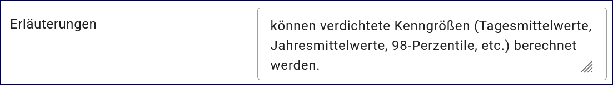

Datensammlung
=============

.. csv-table::
    :header: "Portal", "Editor"
    :widths: 20, 20

	 .. image:: ../../../img/ige/icons/datensatztypen/portal/datensammlung.png, .. image:: ../../../img/ige/icons/datensatztypen/ige/datensammlung.png

Der Datensatztyp "Datensammlung" beschreibt gemessene, aufbereitete oder erhobene Daten. Dazu gehören Messdaten, statistische Erhebungen, Modelldaten oder Anlagendaten. Dies betrifft Dienste und Anwendungen, Informationssysteme, die in der Regel auf eine oder mehrere Datenbanken zuzugreifen um die enthaltenen Daten zugänglich zu machen.

.. important::  Die Erfassung dieses Datensatztyps erfolgt gemäß den Anweisungen unter `Metadaten erfassen <https://metaver-bedienungsanleitung.readthedocs.io/de/igeng/ingrid-editor/erfassung/erfassung-metadaten.html>`_. Der Abschnitt "Fachbezug" beinhaltet spezielle Eingabefelder für diesen Datensatztyp.

-----------------------------------------------------------------------------------------------------------------------

Abschnitt Fachbezug
-------------------

Feld: Objektartenkatalog
^^^^^^^^^^^^^^^^^^^^^^^^

.. figure:: ../../../img/ige/erfassung/ige_metadaten/datensatztypen/datensatztyp_datensammlung/fachbezug_objektartenkatalog.png
   :align: left
   :scale: 50
   :figwidth: 100%

Abb.: Tabelle - Objektartenkatalog

An dieser Stelle besteht die Möglichkeit, den Klassifizierungsschlüssel zu benennen, der den Daten zugrunde liegt. Dabei ist die Eingabe mehrerer Kataloge mit zugehörigem Datum und Version möglich.

Beispiel:  Biotoptypenschlüssel Hamburg (tt.mm.jjjj), Version (xx.xx)

Feld: Inhalte der Datensammlung/Datenbank
^^^^^^^^^^^^^^^^^^^^^^^^^^^^^^^^^^^^^^^^^^

.. figure:: ../../../img/ige/erfassung/ige_metadaten/datensatztypen/datensatztyp_datensammlung/fachbezug_inhalt.png
   :align: left
   :scale: 50
   :figwidth: 80%

Abb.: Felder für Inhalte der Datensammlung

Feld: Parameter
"""""""""""""""
 
Um einen umfassenden Überblick über die beschriebene Datensammlung oder Datenbank zu erhalten, werden hier die relevanten Parameter aufgelistet. Die Parameter sind in der linken Spalte aufgeführt. Hier sind einige Beispiele für Parameter: Bei Messdaten werden die relevanten Messgrößen angegeben, wie beispielsweise NOx, SO2, Windgeschwindigkeit und pH-Wert. Bei statistischen Erhebungen werden die erhobenen Größen aufgeführt, wie etwa der Wasserverbrauch pro Kopf oder die Bevölkerungsdichte. Bei Modelldaten werden die Modellparameter wie Meeresspiegel, CO2-Gehalt der Luft und globale Temperatur angegeben.

Feld: Ergänzenden Angaben
"""""""""""""""""""""""""

In der rechten Spalte können zusätzliche Angaben zu jedem Parameter hinterlegt werden, wie zum Beispiel Maßeinheiten, Genauigkeiten, Nachweisgrenzen, Probenmatrizen oder spezifische Angaben zur Messmethode.

Beispiel: Blei in Trinkwasser, Nachweisgrenze: 10 ppb Cadmium / in Schlacke, Nachweisgrenze: 3 ppm

Feld: Methode / Datengrundlage
^^^^^^^^^^^^^^^^^^^^^^^^^^^^^^

.. figure:: ../../../img/ige/erfassung/ige_metadaten/datensatztypen/datensatztyp_datensammlung/fachbezug_methode.png
   :align: left
   :scale: 50
   :figwidth: 100%

Abb.: Tabelle - Methode/Datengrundlage

Angaben zu den verwendeten Methoden und der Datengrundlage. Hierbei sind die angewandten Methoden der Datenerhebung, wie z.B. Messmethode und Erhebungsmethode, zu nennen und zu beschreiben. Darüber hinaus können Informationen zur Qualität und zum Umfang der Datengrundlage angeführt werden.

Beispiel: Ionenchromatographie nach DIN 38405-D20 (Sept. 2023)
 

Feld: Erläuterungen
^^^^^^^^^^^^^^^^^^^^

Abb.: Textfeld - Erläuterungen

Weitere Informationen zur Datensammlung bzw. zur Datenbank.