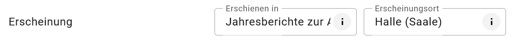
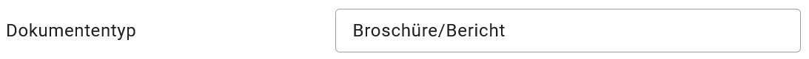
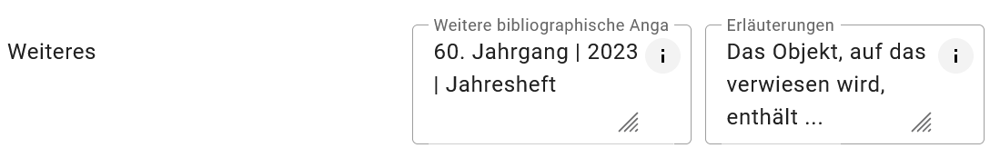

========
Dokument
========

.. csv-table::
    :header: "Portal", "Editor"
    :widths: 20, 20

	 .. image:: ../../../img/ige/icons/datensatztypen/portal/literatur.png, .. image:: ../../../img/ige/icons/datensatztypen/ige/literatur.png

Mit dem Datensatztyp Literatur können Leitfäden, Handlungsempfehlungen, Berichte, Gutachten, Studien, Genehmigungen, Rechtsdokumente, Broschüren, Bücher, Aufsätze oder Dissertationen beschrieben werden.

.. important:: Die Erfassung dieses Datensatztyps erfolgt wie unter `Metadaten erfassen <https://metaver-bedienungsanleitung.readthedocs.io/de/igeng/ingrid-editor/erfassung/erfassung-metadaten.html>`_ beschrieben. Der hier beschriebene Abschnitt Fachbezug enthält spezielle Eingabefelder für diesen Datensatztyp.

-----------------------------------------------------------------------------------------------------------------------

Abschnitt Fachbezug
-------------------

Feld: Autor/Verfasser
^^^^^^^^^^^^^^^^^^^^^

.. figure:: ../../../img/ige/erfassung/ige_metadaten/datensatztypen/datensatztyp_dokument/fachbezug_autor-verfasser.png
   :align: left
   :scale: 50
   :figwidth: 100%

Abb.: Textfeld - Autor/Verfasser

Angabe des Autors oder Verfassers des Dokuments. Mehrere Personen sind durch Semikolon zu trennen.

Beispiel: Lieschen Müller, Max Mustermann, Reiner Zufall

Angabe der zuständigen Kontaktperson in der Reihenfolge Name, Vorname, Titel, getrennt durch ein Trennzeichen.

Feld: Herausgeber
^^^^^^^^^^^^^^^^^

.. figure:: ../../../img/ige/erfassung/ige_metadaten/datensatztypen/datensatztyp_dokument/fachbezug_herausgeber.png
   :align: left
   :scale: 50
   :figwidth: 100%

Abb.: Eingabezeile - Herausgeber

Angabe des Herausgebers. Der Herausgeber ist z. B. die Institution, für die der Autor arbeitet und in deren Auftrag er geschrieben hat. Es kann sich aber auch um einen Verlag, eine Vereinigung oder eine andere Einrichtung handeln, die Beiträge zu einem Thema sammelt und als Buch herausgibt oder Bücher zu einem Thema als Reihe herausgibt.

Beispiel: Ministerium für ...

Name der verantwortlichen Kontaktperson in der Reihenfolge Name, Vorname, Titel, getrennt durch ein Trennzeichen.

Felder: Erscheinung
^^^^^^^^^^^^^^^^^^^

Abb.: Felder Erscheinung

Feld: Erschienen in ...
"""""""""""""""""""""""

Bezeichnung der Serie oder des Datensatzes, zu der/dem der Datensatz gehört.

Angabe des Sammelwerks, in dem der Aufsatz erschienen ist. Aufsätze und andere nicht selbstständige Dokumente erscheinen häufig als Teil einer Zeitschrift oder eines Buches oder als gedruckte Fassung eines Tagungsbeitrags. Hier ist der Titel der Zeitschrift bzw. des Sammelwerkes (Tagungsband, Jahresbericht etc.) anzugeben, in dem das beschriebene Dokument erschienen ist. Unter diesem Titel kann der Artikel beim Verlag bezogen werden.

Beispiel: Jahresberichte zur Abfallwirtschaft

Feld: Erscheinungsort
""""""""""""""""""""""

Angabe, wo das Dokument veröffentlicht wurde. Diese Angabe bezieht sich auf das Dokument und nicht auf den Inhalt des Dokuments. Die räumliche Zuordnung des Dokumentinhalts erfolgt in den Angaben zum Raumbezug des aktuellen Metadatensatzes.

Beispiel: Hamburg

Feld: Band/Heft
""""""""""""""""

Angabe der Zählung des betreffenden Bandes einer Reihe. Zeitschriften und Sammelwerke bzw. Reihen werden fortlaufend seit ihrem Erscheinen oder pro Jahrgang gezählt. Hier ist die Zählung des Bandes anzugeben, in dem der Artikel oder Bericht erschienen ist.

Beispiel: Band 1 - Landkreise Dahme-Spreewald, Elbe-Elster, Oberspreewald-Lausitz, Spree-Neiße und Stadt Cottbus

Feld: Seiten
""""""""""""

Angabe der Seitenzahl des Dokuments. Bei einem Buch ist die Anzahl der Seiten anzugeben. Bei einem Artikel aus einer Zeitschrift sind die Seitenzahlen am Anfang und am Ende des Artikels anzugeben.

Beispiele: 345; 256-268

Feld: Erscheinungsjahr
"""""""""""""""""""""""

Angabe des Erscheinungsjahres des Dokuments. Das Erscheinungsjahr ist vor allem bei regelmäßig erscheinenden Dokumenten, wie z.B. jährlich erscheinenden Tagungsbänden, für die Identifizierung von großer Bedeutung. Das Erscheinungsjahr kann von den entsprechenden Angaben im Zeitbezug des Objekts abweichen, die sich auf den Inhalt des Dokuments und nicht auf das Dokument selbst beziehen.

Beispiel: 2023

Feld: Standort
^^^^^^^^^^^^^^

.. figure:: ../../../img/ige/erfassung/ige_metadaten/datensatztypen/datensatztyp_dokument/fachbezug_standort.png
   :align: left
   :scale: 50
   :figwidth: 100%

Abb.: Textfeld - Standort

Angabe des Aufbewahrungsortes und ggf. des Bezugsortes des Dokuments, falls ein Bezug über die üblichen Wege (Handel, Bibliotheken) nicht möglich ist.

Beispiele: Bibliothek des Landesamtes für ... oder Online-Shop XY

Feld: ISBN-Nr.
^^^^^^^^^^^^^^

.. figure:: ../../../img/ige/erfassung/ige_metadaten/datensatztypen/datensatztyp_dokument/fachbezug_isbn.png
   :align: left
   :scale: 50
   :figwidth: 100%

Abb.: Eingabezeile - ISBN-Nr.

Angabe der Identifikationsnummer der Literatur  (Internationale Standardbuchnummer - ISBN).

Beispiele: ISBN-10-Stellig: 3942062356, ISBN-13-Stellig: 978-3942062350

Feld: Verlag
^^^^^^^^^^^^

.. figure:: ../../../img/ige/erfassung/ige_metadaten/datensatztypen/datensatztyp_dokument/fachbezug_verlag.png
   :align: left
   :scale: 50
   :figwidth: 100%

Abb.: Eingabezeile - Verlag

Angabe des Verlags, in dem das Dokument erschienen ist.

Beispiel: Natur und Text

Feld: Dokumententyp
^^^^^^^^^^^^^^^^^^^

Abb.: Auswahlfeld - Dokumententyp

Angabe der Art des Dokuments. Es ist eine kurze Beschreibung der Art des Dokuments anzugeben. Die Eingabe kann direkt oder über eine Auswahlliste erfolgen, die über den Pfeil am rechten Ende des Feldes geöffnet werden kann.

Beispiel: Broschüre/Bericht

Feld: Basisdaten
^^^^^^^^^^^^^^^^

.. figure:: ../../../img/ige/erfassung/ige_metadaten/datensatztypen/datensatztyp_dokument/fachbezug_basisdaten.png
   :align: left
   :scale: 50
   :figwidth: 100%

Abb.: Textfeld - Basisdaten

Verweis auf zugrundeliegende Daten. Hier werden Verweise auf andere Objekte dieses Katalogs angelegt, die Auskunft über Herkunft und Art der zugrunde liegenden Daten geben. Über den Link (Verweis anlegen/bearbeiten) kann ein neuer Verweis angelegt werden.

Beispiel: Deponieüberwachung (Ort), Statistikauswertungen seit (mm.jjjj)

Feld: Weiteres
^^^^^^^^^^^^^^

Abb.: Textfelder für weitere bibliographische Angaben

Feld: Weitere bibliographische Angaben
""""""""""""""""""""""""""""""""""""""

Hier können bibliographische Angaben gemacht werden, für die kein explizites Feld vorgesehen ist. Dies können z.B. Angaben zu Abbildungen oder zum Format sein. Wichtig ist auch ein Hinweis, ob das Dokument in Papierform oder als Datendownload vorliegt, ob es gebraucht oder neu ist.

Beispiel: Gebundene Ausgabe, Sprache: deutsch, Abmessungen: 18.3 x 4.2 x 24.7 cm, Preis: XX,XX €

Feld: Erläuterungen
"""""""""""""""""""

Ergänzende Anmerkungen zum beschriebenen Dokument.

Beispiel: Der Artikel basiert auf der Dissertation des Autors von 2023 an der ... Universität (Ort).