Geodatendienst
==============

.. csv-table::
    :header: "Portal", "Editor"
    :widths: 20, 20

    .. image:: ../../../img/ige/icons/datensatztypen/portal/geodatendienst.png, .. image:: ../../../img/ige/icons/datensatztypen/ige/geodatendienst.png

Ein Geodatendienst ist ein in der Regel über das Internet angebotener Dienst, mit dessen Hilfe man Geodaten anschauen, einbinden, bearbeiten oder abfragen kann. Geodatendienste sind Webservices, die raumbezogene Informationen verarbeiten und vom Open Geospatial Consortium (OGC) auf Basis von ISO-Normen international standardisiert wurden.

Einem Geodatendienst kann ein Geodatensatz zu geordnet werden, dieser beschreibt die Daten die im Geodatendienst enthalten sind. Einem Geodatendienst können auch mehrere Geodatensätze zugeordnet werden, diese beschreiben dann die Layer, die im Geodatendienst enthalten sind. 
Einem Geodatensatz können unterschiedliche Geodatendienste zugeordnet werden (z.B. WMS-, WFS-, Atom-Dienste), der Geodatensatz beschreibt dann die Daten, die durch die Geodatendienste bereitgestellt werden.

Wenn ein Geodatensatz einem Geodatendienst zugeordnet wird, dann werden diese Metadatensätze miteinander gekoppelt (Datenkopplung). Das bedeutet, der Geodatensatz verweist durch eine Verlinkung auf den Geodatendienst und der Geodatendienst wiederum verweist durch eine Verlinkung auf den Geodatensatz.

.. note:: Die Erfassung dieses Datensatztyps erfolgt wie unter `Metadaten erfassen <https://metaver-bedienungsanleitung.readthedocs.io/de/igeng/ingrid-editor/erfassung/erfassung-metadaten.html>`_  beschrieben. Der hier beschriebene Abschnitt Fachbezug beinhaltet für diesen Datensatztyp spezielle Eingabefelder.

-----------------------------------------------------------------------------------------------------------------------

Erfassung
---------

Abschnitt Erweiterte Erfassung
^^^^^^^^^^^^^^^^^^^^^^^^^^^^^^

Funktion: Der GetCapabilities-Assistent
"""""""""""""""""""""""""""""""""""""""

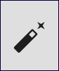
   
Abb.: GetCapabilitie-Assistent - Symbol (Zauberstab) in der Symbolleiste

.. seealso:: Hier wird die Erfassung von Metadaten mit dem `GetCapabilities-Assistent <https://metaver-bedienungsanleitung.readthedocs.io/de/igeng/ingrid-editor/erfassung/datensatztypen/erfassungsassistent/getcapabilitie-assistent.html>`_  beschrieben.

-----------------------------------------------------------------------------------------------------------------------

Feld: Typ
"""""""""

Unter Typ können weitere Eigenschaften (Eingabefelder) für den Metadatensatz festgelegt werden.

.. seealso:: Beschreibungen zu den Optionen: `INSPIRE-relevant | <https://metaver-bedienungsanleitung.readthedocs.io/de/igeng/ingrid-editor/erfassung/datensatztypen/option/inspire-relevant.html>`_ `AdV kompatibel | <https://metaver-bedienungsanleitung.readthedocs.io/de/igeng/ingrid-editor/erfassung/datensatztypen/option/adv-kompatibel.html>`_ `Open Data <https://metaver-bedienungsanleitung.readthedocs.io/de/igeng/ingrid-editor/erfassung/datensatztypen/option/opendata.html>`_

.. `(InVeKoS) <https://metaver-bedienungsanleitung.readthedocs.io/de/igeng/ingrid-editor/erfassung/datensatztypen/option/invekos.html>`_

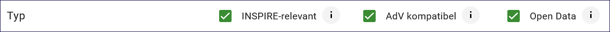

Abb.: Optionen für weitere Eigenschaften

-----------------------------------------------------------------------------------------------------------------------

Abschnitt Allgemeines
^^^^^^^^^^^^^^^^^^^^^

.. hint:: Dieser Abschnitt ist unter `Metadaten erfassen <https://metaver-bedienungsanleitung.readthedocs.io/de/igeng/ingrid-editor/erfassung/erfassung-metadaten.html>`_ beschrieben.

-----------------------------------------------------------------------------------------------------------------------

Abschnitt Verschlagwortung
^^^^^^^^^^^^^^^^^^^^^^^^^^

.. hint:: Dieser Abschnitt ist unter `Metadaten erfassen <https://metaver-bedienungsanleitung.readthedocs.io/de/igeng/ingrid-editor/erfassung/erfassung-metadaten.html>`_ beschrieben.

.. seealso:: Beschreibungen zu den Optionen: `INSPIRE-relevant | <https://metaver-bedienungsanleitung.readthedocs.io/de/igeng/ingrid-editor/erfassung/datensatztypen/option/inspire-relevant.html>`_ `AdV kompatibel | <https://metaver-bedienungsanleitung.readthedocs.io/de/igeng/ingrid-editor/erfassung/datensatztypen/option/adv-kompatibel.html>`_ `Open Data <https://metaver-bedienungsanleitung.readthedocs.io/de/igeng/ingrid-editor/erfassung/datensatztypen/option/opendata.html>`_

.. `(InVeKoS) <https://metaver-bedienungsanleitung.readthedocs.io/de/igeng/ingrid-editor/erfassung/datensatztypen/option/invekos.html>`_

-----------------------------------------------------------------------------------------------------------------------

Abschnitt Fachbezug
^^^^^^^^^^^^^^^^^^^

Feld: Klassifikation des Dienstes
"""""""""""""""""""""""""""""""""

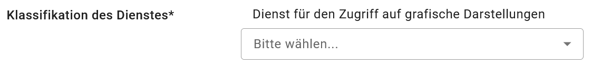

Abb.: Feld "Klassifikation des Dienstes"

`Auswahlliste - Klassifikation des Dienstes <https://metaver-bedienungsanleitung.readthedocs.io/de/igeng/ingrid-editor/auswahllisten/auswahlliste_fachbezug_geodatendienst_klassifikation.html>`_

Aus der vorgegebenen Auswahlliste ist der Eintrag zu wählen, der auf den Dienst zutrifft. Bei WebMapDiensten (WMS) kann beispielsweise „Dienst für den Zugriff auf grafische Darstellungen ausgewählt werden. Dieses Feld dient in erster Linie der Identifikation eines Dienstes durch den recherchierenden Nutzer. 

Feld: Art des Dienstes
""""""""""""""""""""""

In diesem Pflichtfeld kann die Art des Dienstes ausgewählt werden. Über das Feld werden die zur weiteren Befüllung auszuwählenden Angaben zu Operationen gesteuert (siehe Tabelle unter Punkt: Name der Operation).

Abb.: Feld "Art des Dienstes"

Beispiel Darstellungsdienst: Dienst für den Zugriff auf grafische Daten

Beispiel Downloaddienst: Download-Dienste

`Auswahlliste - Art des Dienstes <https://metaver-bedienungsanleitung.readthedocs.io/de/igeng/ingrid-editor/auswahllisten/auswahlliste_fachbezug_geodatendienst_dienstarten.html>`_

.. hint:: Die Auswahl der Dienstart hat Auswirkungen auf das Feld Konformität. Je nach gewählter Art des Dienstes wird das Feld Konformität schon vorbelegt (gilt nicht für alle Dienstarten).

Beispiel: Darstellungsdienst (automatischer Eintrag in Konformität/Spezifikation: "Technical Guidance for the implementation of INSPIRE View Services")

Feld: Version des Dienstes
""""""""""""""""""""""""""

Angaben zur Version der Spezifikation, die dem Dienst zugrunde liegt

Bitte alle Versionen eintragen, die vom Dienst unterstützt werden.

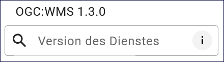

Abb.: Feld "Version des Dienstes"

Beispiele Darstellungsdienste: OGC: WMS 1.3.0, OGC: WMS 1.1.1, OGC: WMTS 1.0.0

Beispiele Downloaddienste: OGC: WFS 2.0, WFS 1.1.0, predefined ATOM

Option: Als ATOM-Download Dienst bereitstellen
^^^^^^^^^^^^^^^^^^^^^^^^^^^^^^^^^^^^^^^^^^^^^^

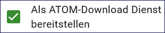

Abb.: Checkbox "Als ATOM-Download Dienst bereitstellen"

.. seealso:: Beschreibung der Funktion: `Als ATOM-Download Dienst bereitstellen <https://metaver-bedienungsanleitung.readthedocs.io/de/igeng/ingrid-editor/erfassung/datensatztypen/atom-feed/bereitstellung.html>`_

Anwendung: Der ATOM-Feed Client
^^^^^^^^^^^^^^^^^^^^^^^^^^^^^^^^

.. seealso:: Beschreibung des `Atom-Feed Clients <https://metaver-bedienungsanleitung.readthedocs.io/de/igeng/ingrid-editor/erfassung/datensatztypen/atom-feed/client.html>`_

Feld: Operationen
"""""""""""""""""

Die Eingabefelder für die Operationen wurden im neuen Editor vereinfacht. Im Feld "Name" muss die getCapabilitie-URL eingetragen werden, in das Feld "Beschreibung" wird die Bezeichnung für den Dienst eingetragen und in das Feld "Zugriffs-URL" die entsprechende URL.

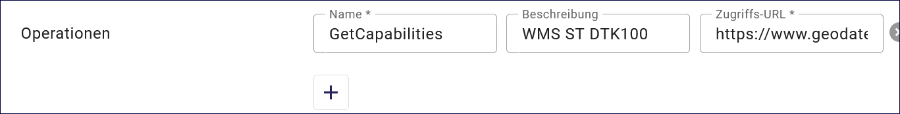

Abb.: Felder für Operationen

Feld: Erstellungsmaßstab
"""""""""""""""""""""""""

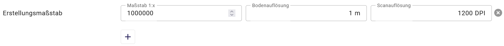

Abb.: Erstellungsmaßstab

Angabe des Erstellungsmaßstabes, der sich auf die erstellte Karte und/oder Digitalisiergrundlage bei Geodaten bezieht. Maßstab: Maßstab der Karte, z.B 1:12 Bodenauflösung: Einheit geteilt durch Auflösung multipliziert mit dem Maßstab (Angabe in Meter, Fließkommazahl) Scanauflösung: Auflösung z.B. einer eingescannten Karte, z.B. 120dpi (Angabe in dpi, Integerzahl). Es handelt sich um ein optionales INSPIRE-Feld.

Beispiel: Bodenauflösung: Auflösungseinheit in Linien/cm; Einheit: z.B. 1 cm geteilt durch 400 Linien multipliziert mit dem Maßstab 1:25.000 ergibt 62,5 cm als Bodenauflösung

Felder: Systemumgebung & Historie
"""""""""""""""""""""""""""""""""

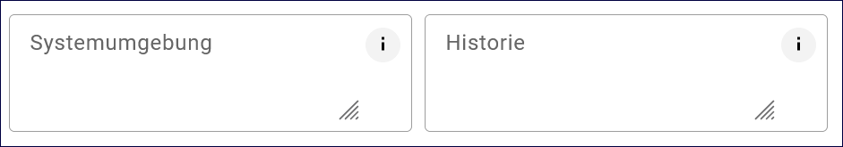

Abb.: Felder "Systemumgebung und Historie"
Feld Systemumgebung: Angaben zum Betriebssystem und der Software, ggf. auch Hardware, die zur Implementierung des Dienstes eingesetzt wird.

Feld Historie: Angaben zur Implementierungsgeschichte des Dienstes.

Feld: Erläuterungen
"""""""""""""""""""

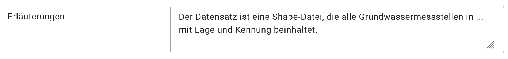

Abb.: Feld "Erläuterungen"

Zusätzliche Anmerkungen zu dem beschriebenen Dienst. Hier können weitergehende Angaben z. B. technischer Art gemacht werden, die zum Verständnis des Dienstes notwendig sind.

Beispiel: Der Datensatz ist eine ...-Datei, die alle Grundwassermessstellen in (Ortsangabe) mit Lage und Kennung beinhaltet.

-----------------------------------------------------------------------------------------------------------------------

Daten-Dienstekopplung
^^^^^^^^^^^^^^^^^^^^^

Felder für Dargestellte Daten
"""""""""""""""""""""""""""""

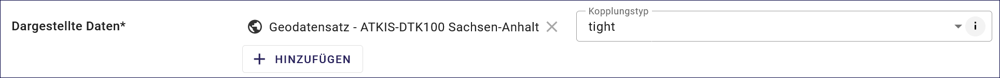

Abb.: Felder für Dargestellte Daten

Feld: Dargestellte Daten
''''''''''''''''''''''''

Beschreibung Herkunft und Art der zugrundeliegenden Daten. Bei einem OGC Web Service können Verweise auf ein oder mehrere Geodatensätze eingefügt werden, die mit dem Dienst verknüpft sind. Im Allgemeinen sind dies die Datensätze, auf die der Dienst aufgesetzt ist. Allgemein sollen die Herkunft oder die Ausgangsdaten der Daten beschrieben werden, die in dem Dienst benutzt, werden.

Als bevorzugte Methode können über "Gekoppelte Daten auswählen" Geodatensätze aus dem gleichen Katalog ausgewählt werden oder externe Metadatensätze über einen GetRecordsByID HTTP-GET-Request referenziert werden. Bei der Angabe eines GetRecordsByID HTTP-GET-Request wird die Resource analysiert und zusätzlich noch der Titel und der Resource-Identfier ermittelt und gespeichert.

Die Angabe eines Textes beschreibt die dargestellten Daten in Form eines Textes. Zusätzlich kann hier auch die Art der Daten (z. B. digital, automatisch ermittelt oder aus Umfrageergebnissen, Primärdaten, fehlerbereinigte Daten) angegeben werden.

..hint:: Ist die Option "Als ATOM-Download Dienst bereitstellen" ausgewählt, so muss darauf geachtet werden, dass die extern verkoppelten dargestellten Daten einen Downloadlink besitzen.

Feld: Kopplungstyp
''''''''''''''''''

Die Art der Kopplung vom Service zu den Daten. Der Typ 'tight' bewirkt, dass ein Verweis zu einem Datensatz existieren muss.

Option: Zugang geschützt
""""""""""""""""""""""""

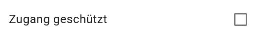

Abb.: Option Zugang geschützt

Die Option "Zugang geschützt" sollte aktiviert werden, wenn der Zugang zu dem Dienst z.B. durch ein Passwort geschützt ist. Bei aktiviertem Kontrollkästchen wird kein direkter Link (Zeige Karte) aus dem Portal zu dem Dienst generiert. In der Portalansicht erscheint am Dienst eine Grafik als Vorhängeschloss.

-----------------------------------------------------------------------------------------------------------------------

Abschnitt Zusatzinformation
^^^^^^^^^^^^^^^^^^^^^^^^^^

Feld: Konformität
"""""""""""""""""

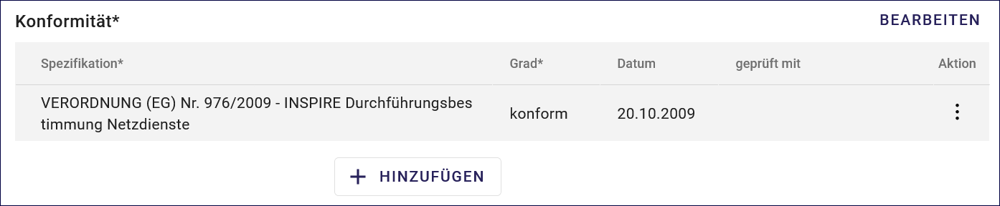

Abb.: Konformität

Hier muss angegeben werden, zu welcher Durchführungsbestimmung der INSPIRE-Richtlinie bzw. zu welcher anderweitigen Spezifikation die beschriebenen Daten konform sind. (INSPIRE-Pflichtfeld)

Dieses Feld wird bei der Auswahl der "INSPIRE-Themen" oder der "Art des Dienstes" automatisch befüllt. Es muss dann nur der Grad der Konformität manuell eingetragen werden.

Bitte entsprechend den Empfehlungen des AdV-Metadatenprofils nur die Werte "konform" und "nicht konform" im Feld "Grad der Konformität" verwenden. Für alle nicht INSPIRE-Objekte, sollte hier die „INSPIRE-Richtlinie“ mit dem Wert „nicht evaluiert“ ausgewählt werden.

.. hint:: Die Abschnitte Raumbezugsystem, Zeitbezug, Zusatzinformation, Verfügbarkeit und Verweise sind ausführlich unter `Metadaten erfassen <https://metaver-bedienungsanleitung.readthedocs.io/de/igeng/ingrid-editor/erfassung/erfassung-metadaten.html>`_ beschrieben, da sie auf mehrere Metadatentypen zutreffen.