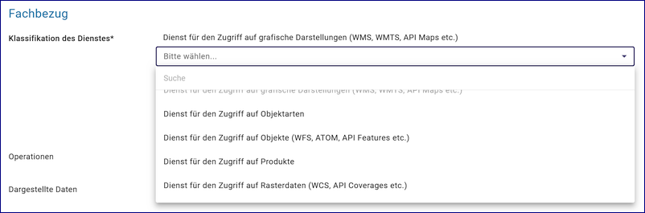
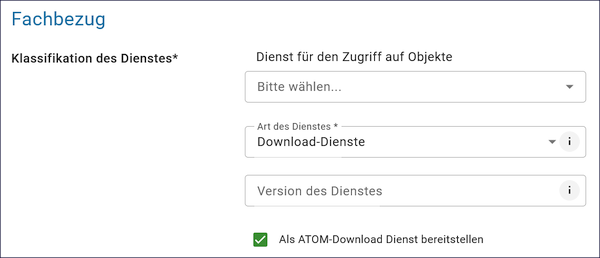
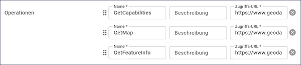

==============
Geodatendienst
==============

.. csv-table::
    :header: "Portal", "Editor"
    :widths: 20, 20

    .. image:: ../../../img/ige/icons/datensatztypen/portal/geodatendienst.png, .. image:: ../../../img/ige/icons/datensatztypen/ige/geodatendienst.png

Ein Geodatendienst ist ein in der Regel über das Internet angebotener Dienst, mit dem Geodaten visualisiert, integriert, verarbeitet oder abgefragt werden können. Geodatendienste sind Webdienste, die raumbezogene Informationen verarbeiten und vom Open Geospatial Consortium (OGC) auf der Basis von ISO-Normen international standardisiert wurden.

Einem Geodatendienst kann ein Geodatensatz zugeordnet werden, der die im Geodatendienst enthaltenen Daten beschreibt. Einem Geodatendienst können auch mehrere Geodatensätze zugeordnet werden, diese beschreiben dann die im Geodatendienst enthaltenen Layer. Einem Geodatensatz können verschiedene Geodatendienste (z.B. WMS, WFS, Atom) zugeordnet werden, der Geodatensatz beschreibt dann die durch die Geodatendienste bereitgestellten Daten.

Wird ein Geodatensatz einem Geodatendienst zugeordnet, so werden diese Metadatensätze miteinander gekoppelt (Datenkopplung). Das bedeutet, dass der Geodatensatz über einen Link auf den Geodatendienst verweist und der Geodatendienst wiederum über einen Link auf den Geodatensatz verweist.

.. note:: Die Erfassung dieses Datensatztyps erfolgt wie unter `Metadaten erfassen <https://metaver-bedienungsanleitung.readthedocs.io/de/igeng/ingrid-editor/erfassung/erfassung-metadaten.html>`_ beschrieben. Der hier beschriebene Abschnitt Fachbezug enthält spezielle Eingabefelder für diesen Datensatztyp.

-----------------------------------------------------------------------------------------------------------------------

Erweiterte Datenerfassung
-------------------------

Funktion: Der GetCapabilities-Assistent
^^^^^^^^^^^^^^^^^^^^^^^^^^^^^^^^^^^^^^^

.. figure:: ../../../img/ige/erfassung/ige_metadaten/datensatztypen/datensatztyp_geodatendienst/assistent/getcapabilties-assistent_symbol.png
   :align: left
   :scale: 50
   :figwidth: 100%
   
Abb.: GetCapabilitie-Assistent - Symbol (Zauberstab) in der Symbolleiste

.. seealso:: Hier wird die Erfassung von Metadaten mit dem `GetCapabilities-Assistenten <https://metaver-bedienungsanleitung.readthedocs.io/de/igeng/ingrid-editor/erfassung/datensatztypen/erfassungsassistent/getcapabilitie-assistent.html>`_  beschrieben.

-----------------------------------------------------------------------------------------------------------------------

Feld: Typ
^^^^^^^^^

Unter Typ können weitere Eigenschaften (Eingabefelder) für den Metadatensatz definiert werden.

.. seealso:: Beschreibungen der Optionen: `INSPIRE-relevant | <https://metaver-bedienungsanleitung.readthedocs.io/de/igeng/ingrid-editor/erfassung/datensatztypen/option/inspire-relevant.html>`_ `AdV-kompatibel | <https://metaver-bedienungsanleitung.readthedocs.io/de/igeng/ingrid-editor/erfassung/datensatztypen/option/adv-kompatibel.html>`_ `Open Data <https://metaver-bedienungsanleitung.readthedocs.io/de/igeng/ingrid-editor/erfassung/datensatztypen/option/opendata.html>`_

.. `(InVeKoS) <https://metaver-bedienungsanleitung.readthedocs.io/de/igeng/ingrid-editor/erfassung/datensatztypen/option/invekos.html>`_

Abb.: Optionen für weitere Eigenschaften

-----------------------------------------------------------------------------------------------------------------------

Abschnitt Allgemeines
---------------------

.. hint:: Dieser Abschnitt ist unter `Metadaten erfassen <https://metaver-bedienungsanleitung.readthedocs.io/de/igeng/ingrid-editor/erfassung/erfassung-metadaten.html>`_ beschrieben.

-----------------------------------------------------------------------------------------------------------------------

Abschnitt Verschlagwortung
---------------------------

.. hint:: Dieser Abschnitt ist unter `Metadaten erfassen <https://metaver-bedienungsanleitung.readthedocs.io/de/igeng/ingrid-editor/erfassung/erfassung-metadaten.html>`_ beschrieben.

.. seealso:: Beschreibungen der Optionen: `INSPIRE-relevant | <https://metaver-bedienungsanleitung.readthedocs.io/de/igeng/ingrid-editor/erfassung/datensatztypen/option/inspire-relevant.html>`_ `AdV-kompatibel | <https://metaver-bedienungsanleitung.readthedocs.io/de/igeng/ingrid-editor/erfassung/datensatztypen/option/adv-kompatibel.html>`_ `Open Data <https://metaver-bedienungsanleitung.readthedocs.io/de/igeng/ingrid-editor/erfassung/datensatztypen/option/opendata.html>`_

.. `(InVeKoS) <https://metaver-bedienungsanleitung.readthedocs.io/de/igeng/ingrid-editor/erfassung/datensatztypen/option/invekos.html>`_

-----------------------------------------------------------------------------------------------------------------------

Abschnitt Fachbezug
-------------------

Feld: Klassifikation des Dienstes
^^^^^^^^^^^^^^^^^^^^^^^^^^^^^^^^^^

Abb.: Feld "Klassifikation des Dienstes"

`Auswahlliste - Klassifizierung des Dienstes <https://metaver-bedienungsanleitung.readthedocs.io/de/igeng/ingrid-editor/auswahllisten/auswahlliste_fachbezug_geodatendienst_klassifikation.html>`_

Aus der vorgegebenen Auswahlliste ist der für den Dienst zutreffende Eintrag auszuwählen. Für WebMap-Dienste (WMS) kann beispielsweise "Dienst für den Zugriff auf grafische Darstellungen" ausgewählt werden. Dieses Feld dient in erster Linie der Identifikation eines Dienstes durch den recherchierenden Nutzer. 

Feld: Art des Dienstes
^^^^^^^^^^^^^^^^^^^^^^

In diesem Pflichtfeld kann die Art des Vorgangs ausgewählt werden. Das Feld steuert, welche Vorgangsdetails zur weiteren Befüllung ausgewählt werden (siehe Tabelle unter Punkt: Name der Operation).

Abb.: Feld "Art des Dienstes"

Beispiel Darstellungsdienst: Dienst für den Zugriff auf grafische Daten

Beispiel Downloaddienst: Download-Dienste

`Auswahlliste - Art des Dienstes <https://metaver-bedienungsanleitung.readthedocs.io/de/igeng/ingrid-editor/auswahllisten/auswahlliste_fachbezug_geodatendienst_dienstarten.html>`_

.. hint:: Die Auswahl der Dienstart wirkt sich auf das Feld Konformität aus. Je nach gewählter Dienstart ist das Feld Konformität bereits vorbelegt (gilt nicht für alle Dienstarten).

Beispiel: Darstellungsdienst (automatischer Eintrag in Konformität/Spezifikation: "Technical Guidance for the implementation of INSPIRE View Services")

Feld: Version des Dienstes
^^^^^^^^^^^^^^^^^^^^^^^^^^

Angaben zur Version der Spezifikation, die dem Dienst zugrunde liegt

Bitte alle Versionen eintragen, die vom Dienst unterstützt werden.

Abb.: Feld "Version des Dienstes"

Beispiele Darstellungsdienste: OGC: WMS 1.3.0, OGC: WMS 1.1.1, OGC: WMTS 1.0.0

Beispiele Downloaddienste: OGC: WFS 2.0, WFS 1.1.0, predefined ATOM

ATOM-Downloaddienste erstellen
-------------------------------

Option: Als ATOM-Download Dienst bereitstellen
^^^^^^^^^^^^^^^^^^^^^^^^^^^^^^^^^^^^^^^^^^^^^^

Abb.: Checkbox "Als ATOM-Download Dienst bereitstellen"

.. seealso:: Beschreibung der Funktion: `Als ATOM-Download Dienst bereitstellen <https://metaver-bedienungsanleitung.readthedocs.io/de/igeng/ingrid-editor/erfassung/datensatztypen/atom-feed/bereitstellung.html>`_

Anwendung: Der ATOM-Feed Client
^^^^^^^^^^^^^^^^^^^^^^^^^^^^^^^

.. seealso:: Beschreibung des `Atom-Feed Clients <https://metaver-bedienungsanleitung.readthedocs.io/de/igeng/ingrid-editor/erfassung/datensatztypen/atom-feed/client.html>`_

Feld: Operationen
^^^^^^^^^^^^^^^^^

Die Eingabefelder für die Operationen wurden im neuen Editor vereinfacht. Im Feld "Name" muss die getCapabilitie-URL, im Feld "Beschreibung" die Beschreibung des Dienstes und im Feld "Zugriffs-URL" die entsprechende URL eingegeben werden.

Abb.: Felder für Operationen

.. important:: In der Capabilities-URL **müssen** nach dem Fragezeichen folgende Angaben stehen: REQUEST=GetCapabilities&SERVICE=WMS

Beispiel GetCapabilities URL: https://www.geodatenportal.sachsen-anhalt.de/wss/service/INSPIRE_LAU_Schutzgebiete_WMS/guest?REQUEST=GetCapabilities&SERVICE=WMS

Sind alle Felder ausgefüllt, kann der Dienst durch Betätigen des Buttons "AKTUALISIEREN" (vor dem Abschnitt "Allgemeines") abgerufen werden. Nach dem Abrufen werden die im Dienst hinterlegten Metadaten angezeigt. Hier können Operationen durch Anklicken aktiviert werden. Durch Betätigen des Buttons "ÜBERNEHMEN" werden weitere URLs zu den Diensten nachgeladen. Für die Ausgabe in den Portalen wird jedoch nur die CetCapabilitie-URL benötigt.

Abb.: Button AKTUALISIEREN

.. figure:: ../../../img/ige/erfassung/ige_metadaten/datensatztypen/datensatztyp_geodatendienst/fachbezug_operationen_wms.png
   :align: left
   :scale: 50
   :figwidth: 100%

Abb.: URLs WMS

Abb.: URLs WFS

Abb.: Felder für Operationen

.. seealso:: Erstellung eines Geodatendienstes mit dem  `GetCapabilitie Assistenten <https://metaver-bedienungsanleitung.readthedocs.io/de/igeng/ingrid-editor/erfassung/datensatztypen/erfassungsassistent/getcapabilitie-assistent.html>`_.

Feld: Erstellungsmaßstab
^^^^^^^^^^^^^^^^^^^^^^^^

Abb.: Erstellungsmaßstab

Angabe des Erstellungsmaßstabes, der sich auf die erstellte Karte bzw. bei Geodaten auf die Digitalisierungsgrundlage bezieht. Maßstab: Maßstab der Karte, z. B. 1:12 Bodenauflösung: Einheit geteilt durch Auflösung multipliziert mit Maßstab (Angabe in Meter, Fließkommazahl) Scanauflösung: Auflösung z. B. einer gescannten Karte, z. B. 120 dpi. Dies ist ein optionales INSPIRE-Feld.

Beispiel: Bodenauflösung: Auflösungseinheit in Linien/cm; Einheit: z.B. 1 cm geteilt durch 400 Linien multipliziert mit dem Maßstab 1:25.000 ergibt 62,5 cm als Bodenauflösung

Felder: Systemumgebung & Historie
^^^^^^^^^^^^^^^^^^^^^^^^^^^^^^^^^

Abb.: Felder "Systemumgebung und Historie"

Feld Systemumgebung: Angaben zum Betriebssystem und zur Software, ggf. auch zur Hardware, die zur Implementierung des Dienstes verwendet werden.

Feld Historie: Informationen zur Implementierungsgeschichte des Dienstes.

Feld: Erläuterungen
^^^^^^^^^^^^^^^^^^^

Abb.: Feld "Erläuterungen"

Zusätzliche Bemerkungen zum beschriebenen Dienst. Hier können zusätzliche Informationen, z.B. technischer Art, gegeben werden, die für das Verständnis des Dienstes notwendig sind.

Beispiel: Der Datensatz ist eine ...-Datei, die alle Grundwassermessstellen in (Ortsangabe) mit Lage und Kennung enthält.

-----------------------------------------------------------------------------------------------------------------------

Daten-Dienstekopplung
---------------------

Felder für Dargestellte Daten
^^^^^^^^^^^^^^^^^^^^^^^^^^^^^^

Abb.: Felder für Dargestellte Daten

Feld: Dargestellte Daten
""""""""""""""""""""""""

Beschreibung Ursprung und Art der zugrunde liegenden Daten. Ein OGC Web Service kann Verweise auf einen oder mehrere Geodatensätze enthalten, die mit dem Dienst verknüpft sind. In der Regel sind dies die Datensätze, auf denen der Dienst basiert. Im Allgemeinen sollte der Ursprung oder die Ausgangsdaten der im Dienst verwendeten Daten beschrieben werden.

Die bevorzugte Methode ist die Auswahl von Geodatensätzen aus demselben Katalog über "Gekoppelte Daten auswählen" oder die Referenzierung externer Metadatensätze über einen GetRecordsByID HTTP-GET-Request. Bei der Angabe eines GetRecordsByID HTTP-GET-Requests wird die Ressource analysiert und zusätzlich der Titel und der Ressource-Identifier ermittelt und gespeichert.

Die Angabe eines Textes beschreibt die dargestellten Daten in Textform. Zusätzlich kann hier die Art der Daten (z.B. numerisch, automatisch oder aus Erhebungsergebnissen gewonnen, Primärdaten, fehlerbereinigte Daten) angegeben werden.

.. hint:: Wird die Option "Als ATOM-Download Dienst bereitstellen" gewählt, ist darauf zu achten, dass die extern dargestellten Daten über einen Downloadlink verfügen.

Feld: Kopplungstyp
""""""""""""""""""

Die Art der Kopplung vom Service zu den Daten. Der Typ 'tight' bewirkt, dass ein Verweis zu einem Datensatz existieren muss.

Option: Zugang geschützt
^^^^^^^^^^^^^^^^^^^^^^^^

Abb.: Option Zugang geschützt

Die Option "Zugriff geschützt" sollte aktiviert werden, wenn der Zugriff auf den Dienst z.B. durch ein Passwort geschützt ist. Wenn das Kontrollkästchen aktiviert ist, wird kein direkter Link (Karte anzeigen) vom Portal zum Dienst erzeugt. In der Portalansicht erscheint eine Grafik in Form eines Vorhängeschlosses neben dem Dienst.

-----------------------------------------------------------------------------------------------------------------------

Abschnitt Zusatzinformation
---------------------------

Feld: Konformität
^^^^^^^^^^^^^^^^^

Abb.: Konformität

Anzugeben ist, welcher Durchführungsbestimmung der INSPIRE-Richtlinie oder sonstigen Spezifikation die beschriebenen Daten entsprechen. (INSPIRE-Pflichtfeld)

Dieses Feld wird automatisch ausgefüllt, wenn "INSPIRE-Themen" oder "Art des Dienstes" ausgewählt wird. Es muss dann nur noch der Konformitätsgrad manuell eingegeben werden.

Gemäß den Empfehlungen des AdV-Metadatenprofils sind im Feld "Konformitätsgrad" nur die Werte "konform" und "nicht konform" zu verwenden. Für alle Nicht-INSPIRE-Objekte ist hier die „INSPIRE-Richtlinie“ mit dem Wert „nicht evaluiert“ auszuwählen.

.. hint:: Die Abschnitte Raumbezug, Zeitbezug, Zusatzinformationen, Verfügbarkeit und Verweise werden unter `Metadaten erfassen <https://metaver-bedienungsanleitung.readthedocs.io/de/igeng/ingrid-editor/erfassung/erfassung-metadaten.html>`_ ausführlich beschrieben, da sie für mehrere Metadatentypen gelten.