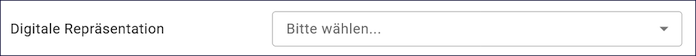
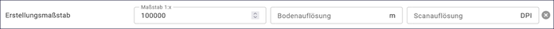

============
Geodatensatz
============

.. csv-table::
    :header: "Portal", "Editor"
    :widths: 20, 20

    .. image:: ../../../img/ige/icons/datensatztypen/portal/geodatensatz.png, .. image:: ../../../img/ige/icons/datensatztypen/ige/geodatensatz.png

Der Datensatztyp Geodatensatz dient der Beschreibung von Daten mit direktem oder indirektem Raumbezug (digital oder analog).

Beispiele sind: GIS-Daten, analoge Karten oder Kartenwerke

Metadaten werden nach der ISO-Norm 19115 „Geographic Information - Metadata“ erfasst.

ISO 19115 definiert einen international gültigen Standard zur Beschreibung von Geoinformationen und zugehörigen Diensten. Dieser Standard soll es ermöglichen, Geodaten mit Hilfe von Metadaten so zu beschreiben, dass ihre Eignung für bestimmte Anwendungszwecke beurteilt oder auch sinnvolle Präsentations- und Verarbeitungsmethoden abgeleitet werden können. Das Schema der ISO 19115 enthält unter anderem Informationen über den Inhalt, den räumlich-zeitlichen Bezug, die Datenqualität, die Zugriffsmöglichkeiten auf die Daten oder die Nutzungsrechte. (Quelle: `Wikipedia <https://de.wikipedia.org/wiki/ISO_19115>`_)

.. note:: Die Erfassung dieses Datensatztyps erfolgt wie unter `Metadaten erfassen <https://metaver-bedienungsanleitung.readthedocs.io/de/hmdk/ingrid-editor/erfassung/erfassung-metadaten.html>`_ beschrieben. Der hier beschriebene Abschnitt Fachbezug enthält spezielle Eingabefelder für diesen Datensatztyp.

-----------------------------------------------------------------------------------------------------------------------

Erweiterte Datenerfassung
-------------------------

Feld: Typ
^^^^^^^^^^

Unter Typ können weitere Eigenschaften (Eingabefelder) für den Metadatensatz definiert werden.

.. figure:: ../../../img/ige/erfassung/ige_metadaten/datensatztypen/option/hmdk_optionen.png
   :align: left
   :scale: 80
   :figwidth: 100%

Abb.: Optionen für weitere Eigenschaften

.. seealso:: Optionen: `INSPIRE-relevant | <https://metaver-bedienungsanleitung.readthedocs.io/de/hmdk/ingrid-editor/erfassung/datensatztypen/option/inspire-relevant.html>`_ `AdV kompatibel | <https://metaver-bedienungsanleitung.readthedocs.io/de/hmdk/ingrid-editor/erfassung/datensatztypen/option/adv-kompatibel.html>`_ `Open Data | <https://metaver-bedienungsanleitung.readthedocs.io/de/hmdk/ingrid-editor/erfassung/datensatztypen/option/opendata.html>`_ `Veröffentlichung gemäß HmbTG <https://metaver-bedienungsanleitung.readthedocs.io/de/hmdk/ingrid-editor/erfassung/datensatztypen/option/hmbtg.html>`_

.. note:: Es gibt Datensätze, die nicht unter das Transparenzgesetz fallen, aber freiwillig nach Open Data (GovData) veröffentlicht werden können. Bei diesen Objekten sollte im InGrid-Editor nur die Checkbox „Open Data“ angehakt werden. Die Checkbox „Veröffentlichung gemäß HmbTG“ muss deaktiviert sein.

Feld: InVeKoS
^^^^^^^^^^^^^

Das Auswahlfeld InVeKoS erscheint in INSPIRE-relevanten Geodatensätzen, wenn es in der Katalogverwaltung aktiviert wurde.

.. figure:: ../../../img/ige/erfassung/ige_metadaten/datensatztypen/option/invekos/auswahlfeld-invekos.png
   :align: left
   :scale: 100
   :figwidth: 100%

Abb.: Auswahlfeld InVeKoS

.. seealso:: Funktionsbeschreibung Feld: `InVeKoS <https://metaver-bedienungsanleitung.readthedocs.io/de/hmdk/ingrid-editor/erfassung/datensatztypen/option/invekos.html>`_

Feld: Datensatz/Datenserie
^^^^^^^^^^^^^^^^^^^^^^^^^^

Es wird unterschieden, ob es sich bei den beschriebenen Daten um einen einzelnen Datensatz mit einem bestimmten räumlichen Bezug oder um eine Datenserie mit einem einheitlichen thematischen Bezug und mehreren Datensätzen mit unterschiedlichen räumlichen Bezügen handelt.

 
Abb.: Auswahlfeld Datensatz / Datenserie

-----------------------------------------------------------------------------------------------------------------------

Abschnitt Allgemeines
---------------------

.. hint:: Dieser Abschnitt ist unter `Metadaten erfassen <https://metaver-bedienungsanleitung.readthedocs.io/de/hmdk/ingrid-editor/erfassung/erfassung-metadaten.html>`_ beschrieben.

-----------------------------------------------------------------------------------------------------------------------

Abschnitt Verschlagwortung
--------------------------

Feld: ISO 19115 - Themenkategorie
^^^^^^^^^^^^^^^^^^^^^^^^^^^^^^^^^^

Dieses Feld erfordert die Angabe von Themen, die die Daten beschreiben.
Die Auswahl erfolgt über die vorgegebene Auswahlliste.

`Auswahlliste - ISO 19115 Themenkategorien <https://metaver-bedienungsanleitung.readthedocs.io/de/hmdk/ingrid-editor/auswahllisten/auswahlliste_verschlagwortung_iso-themenkategorie.html>`_

.. figure:: ../../../img/ige/erfassung/ige_metadaten/datensatztypen/datensatztyp_geodatensatz/verschlagwortung_iso-themenkategorie.png
   :align: left
   :scale: 70
   :figwidth: 100%

Abb.: Auswahlfeld ISO Themenkategorie

Optionale Verschlagwortung
^^^^^^^^^^^^^^^^^^^^^^^^^^

.. hint:: Die Erfassung von freien bzw. optionalen Schlagwörtern und die Schlagwortanalyse sind unter `Metadaten erfassen <https://metaver-bedienungsanleitung.readthedocs.io/de/hmdk/ingrid-editor/erfassung/erfassung-metadaten.html#abschnitt-verschlagwortung>`_ beschrieben.

Beschreibung der Optionen: `INSPIRE-relevant | <https://metaver-bedienungsanleitung.readthedocs.io/de/hmdk/ingrid-editor/erfassung/datensatztypen/option/inspire-relevant.html>`_ `AdV-kompatibel | <https://metaver-bedienungsanleitung.readthedocs.io/de/hmdk/ingrid-editor/erfassung/datensatztypen/option/adv-kompatibel.html>`_ `Open Data <https://metaver-bedienungsanleitung.readthedocs.io/de/hmdk/ingrid-editor/erfassung/datensatztypen/option/opendata.html>`_

.. `(InVeKoS) <https://metaver-bedienungsanleitung.readthedocs.io/de/hmdk/ingrid-editor/erfassung/datensatztypen/option/invekos.html>`_

-----------------------------------------------------------------------------------------------------------------------

Abschnitt Fachbezug
-------------------

Feld: Fachliche Grundlage
^^^^^^^^^^^^^^^^^^^^^^^^^

(INSPIRE-Pflichtfeld für Datasets und Data series)

In diesem Feld soll eine kurze Zusammenfassung über die Entstehung der zu beschreibenden Geodaten gegeben werden. Dazu können die Datengrundlage, die Methode der Datenerhebung und der Verarbeitungsprozess genannt werden. Der Eintrag sollte in Textform erfolgen.

.. hint:: Für genauere Angaben sind die Felder Datenquelle und Herstellungsprozess zu verwenden.

Beispiele:

Kombination verschiedener Vektordatenquellen zu einem harmonisierten digitalen Kartenmodell.

Die Grunddatenerfassung erfolgte durch Digitalisierung der Übersichtskarte 1:500 000 (ÜK500). Die laufende Aktualisierung erfolgt durch Auswertungen der aktuellen Ausgaben der
ATKIS Basis-DLM der Länder, der Digitalen Topographischen Karte 1:200 000 (DTK200) und anderer Quellen.

Abb.: Eingabefeld Fachliche Grundlage

.. tip:: Das Eingabefeld lässt sich an der rechten unteren Ecke vergrößern.

Feld: Identifikator der Datenquelle
^^^^^^^^^^^^^^^^^^^^^^^^^^^^^^^^^^^

Hier muss ein Identifikator (ein eindeutiger Name) für die hier beschriebene Ressource (den Datensatz) vergeben werden. Dieser muss unverändert bleiben. Er soll eine auflösbare URL sein, die den Direktzugriff auf das XML des Daten-Metadatensatzes ermöglicht. Der Identifikator setzt sich aus einem Namensraum, einem Schrägstrich und einer lokalen ID zusammen (namespace/localId). Soll der Identifikator den im Editor voreingestellten Namensraum beinhalten, ist die Eingabe einer lokalen ID ausreichend. 

Der Identifier kann manuell oder über die Schaltfläche "Erzeuge ID" eingegeben werden. Bei der automatischen Generierung wird eine UUID als Identifikator in dieses Feld eingetragen. Da diese UUID keinen Namensraum enthält, wird bei dieser Variante immer der Namensraum aus der Katalogverwaltung hinzugefügt.

Alternativ kann hier eine aufrufbare URL als individueller Identifikator manuell eingegeben werden. Diese wird dann unverändert übernommen.

Beispiel:

| Namensraum: https://registry.gdi-de.org/id/de.bund.bkg.csw
| lokale ID: 1371b05a-055b-4749-8390-95cda942f40c
| Identifikator: https://registry.gdi-de.org/id/de.bund.bkg.csw/1371b05a-055b-4749-8390-95cda942f40c

 
Abb.: Feld Identifikator der Datenquelle

Feld: Digitale Repräsentation
^^^^^^^^^^^^^^^^^^^^^^^^^^^^^^
(optionales INSPIRE-Feld)

Es kann angegeben werden, mit welcher Methode die räumlichen Daten dargestellt werden. Die Auswahl erfolgt über eine vorgegebene Liste.

Auswahlliste: Raster, Gitter, Stereomodell, Text, Tabelle, TIN, Vektor, Video

Abb.: Auswahlfeld Digitale Repräsentation

`Auswahlliste Digitale Repräsentation  <https://metaver-bedienungsanleitung.readthedocs.io/de/hmdk/ingrid-editor/auswahllisten/auswahlliste_fachbezug_geodatensatz_digitale-repraesentation.html>`_

Auswahl: Vektor
^^^^^^^^^^^^^^^

Abb.: Auswahl Vektor

Felder: Topologieinformation
^^^^^^^^^^^^^^^^^^^^^^^^^^^^

.. hint:: Diese Felder sind nur aktiv, wenn im Feld "Digitale Repräsentation" die Option "Vektor" gewählt wurde.

Abb.: Felder für Topologieinformationen

`Auswahlliste Topologieinformation <https://metaver-bedienungsanleitung.readthedocs.io/de/hmdk/ingrid-editor/auswahllisten/auswahlliste_fachbezug_geodatensatz_topologieinformation.html>`_

`Auswahlliste Geometrietyp <https://metaver-bedienungsanleitung.readthedocs.io/de/hmdk/ingrid-editor/auswahllisten/auswahlliste_fachbezug_geodatensatz_topologieinformation_geometrietyp.html>`_

Hier können Topologieinformationen, Geometrietyp (Angabe der geometrischen Objekte zur Beschreibung der geometrischen Lage) und Elementanzahl (Angabe der Anzahl der Punkt- oder Vektortypelemente) angegeben werden.

Feld: Erstellungsmaßstab
^^^^^^^^^^^^^^^^^^^^^^^^
(optionales INSPIRE-Feld)

Angabe des Erstellungsmaßstabes, der sich auf die erstellte Karte und/oder Digitalisiergrundlage bei Geodaten bezieht. 
 - Maßstab 1:x: Maßstab der Karte, z.B. 1:12 
 - Bodenauflösung (m): Einheit geteilt durch Auflösung multipliziert mit dem Maßstab (Angabe in Meter, Fließkommazahl) 
 - Scanauflösung (DPI): Auflösung z.B. einer eingescannten Karte, z.B. 120dpi (Angabe in dpi, Integerzahl)

Beispiel: Bodenauflösung: Auflösungseinheit in Linien/cm; Einheit: z.B. 1 cm geteilt durch 400 Linien multipliziert mit dem Maßstab 1:25.000 ergibt 62,5 cm als Bodenauflösung

 
Abb.: Feld Erstellungsmaßstab

Feld: Darstellender Dienst
^^^^^^^^^^^^^^^^^^^^^^^^^^

Geodatensätze können mit Geodatendiensten gekoppelt werden. Das heißt, dass in einem Portal von einem Geodatensatz auf einen Geodendienst verwiesen wird und umgekehrt.
Die Kopplung der Daten erfolgt in einem Geodatendienst. Der gekoppelte Dienst wird in der Eingabemaske des Geodatensatzes angezeigt.

 
Abb.: Feld Darstellender Dienst

Feld: Datengrundlage
^^^^^^^^^^^^^^^^^^^^

Angabe der Unterlagen (Luftbilder, Karten, Datensammlungen), die zur Erstellung der Karte oder der Geoinformation (des digitalen Datenbestands) verwendet wurden.

 
Abb.: Feld Datengrundlage - Beispiel: Kartieroriginale der Pflanzenerfassung

Feld: Herstellungsprozess
^^^^^^^^^^^^^^^^^^^^^^^^^^

Angabe der Methode, die zur Erstellung des Datenobjektes geführt hat. Der Eintrag kann in Textform erfolgen, indem die Registerkarte "Text" ausgewählt wird.

.. figure:: ../../../img/ige/erfassung/ige_metadaten/datensatztypen/datensatztyp_geodatensatz/fachbezug_herstellungsprozess.png
   :align: left
   :scale: 90
   :figwidth: 100%
 
Abb.: Feld Herstellungsprozess - Beispiel: Feldkartierung

Feld: Symbolkatalog
^^^^^^^^^^^^^^^^^^^^

Für die Darstellung von normierten Objekten und Sachverhalten können für die Nutzer der Daten zur Kartenherstellung abgestimmte Symbole vorgegeben werden. Die Angabe einer oder mehrerer analoger oder digitaler Symbolpaletten mit zugehörigem Datum (Pflichteintrag) und Version (Optional) ist hier möglich.

Beispiel: Planzeichenverordnung, Datum 03.08.2023, Version 6.0

 
Abb.: Feld Symbolkatalog

Feld: Schlüsselkatalog
^^^^^^^^^^^^^^^^^^^^^^

Hier können die den Daten zugrunde liegenden Klassifikationsschlüssel benannt werden. Es können mehrere Kataloge mit zugehörigem Datum (Pflichtfeld) und Version (optional) angegeben werden. Das Feld Schlüsselkatalog wird zum Pflichtfeld, wenn in der Tabelle Sachdaten/Attributinformation ein Eintrag vorgenommen wurde.

Beispiel: Biotoptypenschlüssel, Datum 03.08.2023, Version 6.0

 
Abb.: Feld Schlüsselkatalog

Feld: Sachdaten/Attributinformation
^^^^^^^^^^^^^^^^^^^^^^^^^^^^^^^^^^^^

Angabe der mit der Geoinformation/Karte verbundenen Sachdaten. Bei Bedarf kann hier eine Auflistung der Attribute des Datensatzes erfolgen. Die hauptsächliche Verwendung dieses Feldes ist für digitale Geoinformationen vorgesehen.

.. figure:: ../../../img/ige/erfassung/ige_metadaten/datensatztypen/datensatztyp_geodatensatz/fachbezug_sachdaten-attributinformation.png
   :align: left
   :scale: 80
   :figwidth: 100%
 
Abb.: Feld Sachdaten/Attributinformation - Beispiel: Baumkartei

.. hint:: Mit einem Eintrag unter Sachdaten/Attributinformation werden die Eingabefelder für den Schlüsselkatalog zu Pflichtfeldern. Bitte geben Sie dort den Schlüsselkatalog an, in dem das eingetragene Attribut verzeichnet ist.

-----------------------------------------------------------------------------------------------------------------------

Abschnitt Datenqualität
-----------------------

.. note:: Die optionalen Felder zur `Datenqualität sind hier <https://metaver-bedienungsanleitung.readthedocs.io/de/hmdk/ingrid-editor/erfassung/datensatztypen/qualitaetssicherung/abschnitt_datenqualitaet.html>`_ beschrieben.

-----------------------------------------------------------------------------------------------------------------------

.. note:: Die Abschnitte Raumbezugsystem, Zeitbezug, Zusatzinformation, Verfügbarkeit und Verweise sind ausführlich unter `Metadaten erfassen <https://metaver-bedienungsanleitung.readthedocs.io/de/hmdk/ingrid-editor/erfassung/erfassung-metadaten.html>`_  beschrieben, da sie auf mehrere Datensatztypen zutreffen.

-----------------------------------------------------------------------------------------------------------------------

Abschnitt Zusatzinformation
---------------------------
  
Feld: Zeichensatz des Datensatzes
^^^^^^^^^^^^^^^^^^^^^^^^^^^^^^^^^

Angabe des Zeichensatzes, der in dem beschriebenen Datensatz verwendet wird, z. B. UTF-8.

 
Abb.: Feld Zeichensatz des Datensatzes

`Auswahlliste Zeichensatz des Datensatzes <https://metaver-bedienungsanleitung.readthedocs.io/de/hmdk/ingrid-editor/auswahllisten/auswahlliste_zusatzinformation_zeichensatz.html>`_
  

Feld: Konformität
^^^^^^^^^^^^^^^^^

Hier kann angegeben werden, mit welcher Spezifikation die beschriebenen Daten konform sind. Die Eingaben in diesem Feld erfolgen über die Schaltfläche Konformität "+ Hinzufügen". Es kann aus vordefinierten Listen ausgewählt werden oder eine freie Eingabe erfolgen.

Wenn die zu beschreibenden Daten INSPIRE-relevant sind, muss die zutreffende Durchführungsbestimmung der INSPIRE-Richtlinie angegeben werden (INSPIRE-Pflichtfeld).

Beschreibung unter der Option: `INSPIRE-relevant <https://metaver-bedienungsanleitung.readthedocs.io/de/hmdk/ingrid-editor/erfassung/datensatztypen/option/inspire-relevant.html>`_

Dieses Feld wird automatisch ausgefüllt, wenn Einträge unter "INSPIRE-Themen" oder "Art des Dienstes" vorgenommen werden. Lediglich der "Konformitätsgrad" muss manuell angepasst werden.

.. hint:: Bei Aktivierung des Kontrollkästchens "AdV-kompatibel" bitte gemäß den Empfehlungen des AdV-Metadatenprofils nur die Werte "konform" und "nicht konform" für "Grad der Konformität" verwenden.

Beschreibung unter der Option: `AdV kompatibel <https://metaver-bedienungsanleitung.readthedocs.io/de/hmdk/ingrid-editor/erfassung/datensatztypen/option/adv-kompatibel.html>`_

Das Feld "geprüft mit" ist im Editor eine optionale Angabe, laut der ISO ist es aber verpflichtend.

.. figure:: ../../../img/ige/erfassung/ige_metadaten/datensatztypen/datensatztyp_geodatensatz/zusatzinformation_konformitaet.png
   :align: left
   :scale: 70
   :figwidth: 100%
 
Abb.: Feld Konformität

 
Abb.: Feld Konformität - Spezifikation