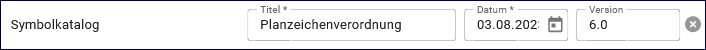

Geodatensatz
============

.. csv-table::
    :header: "Portal", "Editor"
    :widths: 20, 20

    .. image:: ../../../img/ige/icons/datensatztypen/portal/geodatensatz.png, .. image:: ../../../img/ige/icons/datensatztypen/ige/geodatensatz.png

Der Datensatztyp Geodatensatz dient der Beschreibung von Daten mit direktem oder indirektem Raumbezug (digital oder analog).

Beispiele: GIS-Daten, analoge Karten oder Kartenwerke

Die Metadaten werden nach der ISO-Norm 19115 „Geographic Information – Metadata“ erfasst.

.. hint:: Die Erfassung dieses Datensatztyps erfolgt wie unter `Metadaten erfassen <https://metaver-bedienungsanleitung.readthedocs.io/de/igeng/ingrid-editor/erfassung/erfassung-metadaten.html>`_  beschrieben. Der hier beschriebene Abschnitt Fachbezug beinhaltet für diesen Datensatztyp spezielle Eingabefelder.

-----------------------------------------------------------------------------------------------------------------------

Erfassung
---------

Typ
'''
Unter Typ werden weitere Eigenschaften des Metadatensatzes festgelegt.

Es können folgende Optionen gewählt werden:
    
Typ: `INSPIRE-relevant, <https://metaver-bedienungsanleitung.readthedocs.io/de/igeng/ingrid-editor/erfassung/datensatztypen/option/inspire-relevant.html>`_
`AdV kompatibel,  <https://metaver-bedienungsanleitung.readthedocs.io/de/igeng/ingrid-editor/erfassung/datensatztypen/option/adv-kompatibel.html>`_
`Open Data, <https://metaver-bedienungsanleitung.readthedocs.io/de/igeng/ingrid-editor/erfassung/datensatztypen/option/opendata.html>`_
`(InVeKoS) <https://metaver-bedienungsanleitung.readthedocs.io/de/igeng/ingrid-editor/erfassung/datensatztypen/option/invekos.html>`_ (Erläuterungen zu diesen Optionen)

.. image:: ../../../img/ige/erfassung/ige_metadaten/ige_datensatztypen/datensatztyp_geodatensatz/typ_optionen.png

Abb.: Optionen

-----------------------------------------------------------------------------------------------------------------------

Abschnitt Allgemeines
^^^^^^^^^^^^^^^^^^^^^

.. hint:: Dieser Abschnitt ist unter `Metadaten erfassen <https://metaver-bedienungsanleitung.readthedocs.io/de/igeng/ingrid-editor/erfassung/erfassung-metadaten.html>`_ beschrieben.

-----------------------------------------------------------------------------------------------------------------------

Abschnitt Verschlagwortung
^^^^^^^^^^^^^^^^^^^^^^^^^^

ISO 19115 - Themenkategorie
'''''''''''''''''''''''''''

Die Norm ISO 19115 - Geographic Information – Metadata

.. note:: Die ISO 19115 definiert einen international gültigen Standard zur Beschreibung geographischer Informationen und zugehöriger Dienstleistungen. Mit dieser Norm soll es ermöglicht werden, Geodaten anhand von Metadaten so zu beschreiben, dass damit ihre Eignung für bestimmte Anwendungszwecke beurteilt, oder auch sinnvolle Präsentations- und Verarbeitungsmethoden abgeleitet werden können. Das Schema der ISO 19115 beinhaltet u. a. Informationen über den Inhalt, räumlich-zeitliche Bezüge, Datenqualität, Datenzugangsmöglichkeit oder Nutzungsrechte. (Quelle: `Wikipedia <https://de.wikipedia.org/wiki/ISO_19115>`_)

Dieses Feld verlangt die Angabe von Themen, welche die Daten beschreiben.
Die Auswahl erfolgt über die vorgegebene Auswahlliste.

`Auswahlliste - ISO 19115 Themenkategorien <https://metaver-bedienungsanleitung.readthedocs.io/de/igeng/ingrid-editor/auswahllisten/auswahlliste_verschlagwortung_iso-themenkategorie.html>`_

Abb.: Auswahlfeld ISO Themenkategorie

Optionale Verschlagwortung
''''''''''''''''''''''''''

.. hint:: Die Erfassung von freien bzw. optionalen Schlagworten und die Schlagwortanalyse sind unter `Metadaten erfassen <https://metaver-bedienungsanleitung.readthedocs.io/de/igeng/ingrid-editor/erfassung/erfassung-metadaten.html#abschnitt-verschlagwortung>`_ beschrieben.

-----------------------------------------------------------------------------------------------------------------------

Abschnitt Fachbezug
^^^^^^^^^^^^^^^^^^^

Fachliche Grundlage
"""""""""""""""""""

(INSPIRE-Pflichtfeld für Datasets und Data series)

In diesem Feld soll eine kurze Zusammenfassung zur Erstellung der zu beschreibenden Geodaten erfolgen. Hierzu können die Datengrundlage, die Methode der Datenerhebung und der Verarbeitungsprozess erwähnt werden. Der Eintrag soll in Textform erfolgen. 

.. hint:: Für genauere Angaben sind die Felder Datenquelle und Herstellungsprozess zu verwenden.

Beispiele:

Kombination verschiedenster Vektordatenquellen zu einem harmonisierten digitalen kartographischen Modell.

Die Grunddatenerfassung erfolgte durch Digitalisierung der Übersichtskarte 1:500 000 (ÜK500). Die fortlaufende Aktualisierung erfolgt durch Auswertungen der jüngsten Editionen des
ATKIS Basis-DLM der Bundesländer, der Digitalen Topographischen Karte 1:200 000 (DTK200) und anderen Quellen.

Abb.: Eingabefeld Fachliche Grundlage

.. tip:: Das Eingabefeld lässt sich an der rechten unteren Ecke vergrößern.

Identifikator der Datenquelle
"""""""""""""""""""""""""""""

Hier muss ein eindeutiger Name (Identifikator) für die im Geodatensatz beschriebene Datenquelle (z.B. eine Karte) vergeben/eingetragen werden. Der Identifikator soll aus einem Namensraum (=codespace), sowie einem Code bestehen. (INSPIRE-Pflichtfeld).
Wenn der Identifikator keinen Namensraum enthält, so wird dem Identifikator bei der Abgabe der Metadaten derjenige Wert vorangestellt, welcher im Bereich Katalogverwaltung/Katalogeinstellungen unter "Namensraum des Katalogs" eingetragen ist.
Der Identifikator kann von Hand eingetragen werden oder mit Hilfe des Buttons "Erzeuge ID". Bei der automatischen Erzeugung wird eine UUID als Identifikator in dieses Feld eingetragen. Da diese UUID keinen Namespace enthält, wird bei dieser Variante immer der Namensraum aus der Katalogverwaltung hinzugefügt.

Hier muss ein Identifikator (ein eindeutiger Name) für die hier beschriebene Ressource (den Datensatz) vergeben werden. Dieser muss unverändert bleiben. Er soll eine auflösbare URL sein, die den Direktzugriff auf das XML des Daten-Metadatensatzes ermöglicht. Der Identifikator setzt sich aus einem Namensraum, einem Schrägstrich und einer lokalen ID zusammen (namespace/localId). (Pflichtfeld).

Soll der Identifikator den im Editor voreingestellten Namensraum beinhalten, ist die Eingabe einer lokalen ID ausreichend. Für die Erzeugung kann der Button "Erzeuge ID" verwendet werden. Der endgültige Identifikator wird anschließend unter dem Feld angezeigt. Ist durch den Katalogadministrator kein Namensraum definiert, wird ein Defaultwert (https://registry.gdi-de.org/id/) verwendet.

Alternativ kann hier eine aufrufbare URL als individueller Identifikator manuell eingegeben werden. Diese wird unverändert übernommen.

Beispiel:

| Namensraum: https://registry.gdi-de.org/id/de.bund.bkg.csw
| lokale ID: 1371b05a-055b-4749-8390-95cda942f40c
| Identifikator: https://registry.gdi-de.org/id/de.bund.bkg.csw/1371b05a-055b-4749-8390-95cda942f40c

.. image:: ../../../img/ige/erfassung/ige_metadaten/ige_datensatztypen/datensatztyp_geodatensatz/fachbezug_identifikator_01.png
   :width: 500
 
Abb.: Identifikator der Datenquelle

Digitale Repräsentation
"""""""""""""""""""""""

Es kann eine Angabe der Methode erfolgen, mit der räumliche Daten präsentiert werden. Die Auswahl erfolgt über eine vorgegebene Liste.

Auswahlliste: Raster, Gitter, Stereomodell, Text, Tabelle, TIN, Vektor, Video

.. image:: ../../../img/ige/erfassung/ige_metadaten/ige_datensatztypen/datensatztyp_geodatensatz/fachbezug_digitale-repaesentation.png
 
Abb.: Auswahlfeld Digitale Repräsentation

Datensatz/Datenserie
''''''''''''''''''''

 
Abb.: Auswahlfeld Datensatz / Datenserie

Bei Daten dieser Klasse ist zwischen einem "Datensatz" und einer "Datenserie" zu unterscheiden. Katalogintern ist stets der Datensatz vorausgewählt.

Datensatz
''''''''''

Als Datensatz wird eine in sich abgeschlossene Sammlung von Geodaten (Daten mit Raumbezug) bezeichnet, z.B. ein digitaler Bestand zu einem bestimmten fachlichen Thema.

Beispiel:
Stadtplanwerk, bestehend aus 8 Einzelblättern: Das Stadtplanwerk als solches ist eine Datenserie. Jedes einzelne der 8 Blätter hingegen kann als Datensatz beschrieben werden.

Datenserie
'''''''''''

Eine Datenserie stellt eine Folge oder Gruppierung von gleichartigen Datenbeständen dar, die sich z.B. im abgedeckten räumlichen Bereich oder in der zeitlichen Aussage zum Gültigkeitszeitraum unterscheiden.

Beispiel:

Komplexe Darstellung der städtischen Verwaltungsstruktur aus unterschiedlichen dargestellten Grenzen: Es werden die Grenzen der Müllabfuhrbezirke, die Grenzen der Wahlbezirke, der Stadteile, der Schuleinzugsgebiete usw. inhaltlich gezeigt. Alle diese Grenzen für sich genommen könnten als Datensatz beschrieben werden. Die komplexe aufbereitete Darstellung, die diese unterschiedlichen Grenzen vereint, also der Geodatensatz "Komplexe Darstellung der städtischen Verwaltungsstruktur" an sich, wäre in diesem Falle jedoch eine Datenserie.

Vektorformat
''''''''''''

.. image:: ../../../img/ige/erfassung/ige_metadaten/ige_datensatztypen/datensatztyp_geodatensatz/fachbezug_vektorformat.png
 
Abb.: Feld Vektorformat

.. hint:: Dieses Feld ist nur aktiv nach Auswahl von "Vektor" im Feld "Digitale Repräsentation".

Es können hier Topologie Informationen, Geometrietyp (Angabe der geometrischen Objekte, zur Beschreibung der geometrischen Lage) und Elementanzahl (Angaben der Anzahl der Punkt- oder Vektortypelemente) angegeben werden.

Auswahlliste Topologieinformation: 3D-Oberfläche, Flächen, Flächen flächendeckend, Geometrie ohne Topologie, geschlossene Linien eben, geschlossene Linien flächendeckend, Körper, Linien, topologisches Gebilde ohne geometrischen Raum

Erstellungsmaßstab
''''''''''''''''''

.. image:: ../../../img/ige/erfassung/ige_metadaten/ige_datensatztypen/datensatztyp_geodatensatz/fachbezug_erstellungsmassstab.png
 
Abb.: Feld Erstellungsmaßstab

Angabe des Erstellungsmaßstabes, der sich auf die erstellte Karte und/oder Digitalisiergrundlage bei Geodaten bezieht. 
 - Maßstab 1:x: Maßstab der Karte, z.B. 1:12 
 - Bodenauflösung (m): Einheit geteilt durch Auflösung multipliziert mit dem Maßstab (Angabe in Meter, Fließkommazahl) 
 - Scanauflösung (DPI): Auflösung z.B. einer eingescannten Karte, z.B. 120dpi (Angabe in dpi, Integerzahl)

Beispiel: Bodenauflösung: Auflösungseinheit in Linien/cm; Einheit: z.B. 1 cm geteilt durch 400 Linien multipliziert mit dem Maßstab 1:25.000 ergibt 62,5 cm als Bodenauflösung

 
Symbolkatalog
'''''''''''''

 
Abb.: Feld Symbolkatalog

Für die Präsentation genormter Objekte und Sachverhalte können für die Nutzer der Daten zur Herstellung von Karten abgestimmte Symbole vorgegeben werden. Die Angabe eines oder mehrerer analoger oder digitaler Symbolpaletten mit zugehörigem Datum (Pflichteintrag) und Version (Optional) ist hier möglich.

Beispiel: Planzeichenverordnung, Datum 01.01.1998, Version 1.0

 
Schlüsselkatalog
'''''''''''''''''

 
Abb.: Feld Schlüsselkatalog

An dieser Stelle besteht die Möglichkeit, den Daten zugrunde liegende Klassifizierungs-schlüssel zu benennen. Dabei ist die Eingabe mehrerer Kataloge mit zugehörigem Datum (Pflichteintrag) und Version (Optional) möglich. 

Beispiel: Biotoptypenschlüssel, Datum 01.01.2016, Version 2.0

.. hint:: Das Feld Schüsselkatalog wird zum Pflichtfeld, wenn in der Tabelle Sachdaten/Attributinformationen ein Eintrag vorgenommen wurde.

Um die Verpflichtung wieder zu entfernen, muss die beschriebene Zeile in der Tabelle "Sachdaten" komplett gelöscht werden (Zeile markieren, rechte Maustaste – Kontextmenü "Zeile löschen"). Es reicht nicht aus, einfach den Text in der Zelle zu löschen.

Angabe der mit der Geo-Information/Karte verbundenen Sachdaten. Bei Bedarf kann hier eine Auflistung der Attribute des Datenbestandes erfolgen. Die hauptsächliche Nutzung dieses Feldes ist für digitale Geo-Informationen vorgesehen.

Beispiel: Baumkartei

.. hint:: Mit einem Eintrag unter Sachdaten/Attributinformation wird die Tabelle Schlüsselkatalog zum Pflichtfeld. Bitte geben Sie dort den Schlüsselkatalog an, welcher das eingetragene Attribut verzeichnet.

Sachdaten/Attributinformation
''''''''''''''''''''''''''''''

 
Abb.: Feld Sachdaten/Attributinformation

Angabe der mit der Geo-Information/Karte verbundenen Sachdaten. Bei Bedarf kann hier eine Auflistung der Attribute des Datenbestandes erfolgen. Die hauptsächliche Nutzung dieses Feldes ist für digitale Geo-Informationen vorgesehen.

**Achtung:**
*Mit einem Eintrag unter Sachdaten/Attributinformation wird die Tabelle Schlüsselkatalog zum Pflichtfeld. Bitte geben Sie dort den Schlüsselkatalog an, welcher das eingetragene Attribut verzeichnet.*

**Beispiel:** *Baumkataster*

Darstellender Dienst
''''''''''''''''''''

 
Abb.: Feld Darstellender Dienst

`Datenkopplung im Geodatendienst <https://metaver-bedienungsanleitung.readthedocs.io/de/latest/img/ige/erfassung/ige_objektklassen/objektklasse-geodatendienst.html#daten-dienstekopplung>`_

Werden die beschriebenen Daten durch einen Webdienst (z.B. OGC Web-Mapping-Service (WMS)) im Internet bereitgestellt, dann sollte auf diesen Dienst, welcher als eigenes Objekt des Typs „Geodatendienst“ beschrieben ist, verwiesen werden (siehe Daten-Dienste-Kopplung).

Georeferenzierte Daten, die Basisdaten eines OGC Web-Dienstes sind, können über dieses Feld einen Verweis auf einen beschriebenen OGC Web-Dienst erhalten. Diese Geodaten sind in der Regel eng mit dem Dienst verknüpft ("tightly coupled") und über den verknüpften OGC Web Service direkt erreichbar.

Werden beispielsweise die fachlichen Inhalte eines WMS-Dienstes beschrieben, sollte an dieser Stelle unbedingt ein Verweis zu dem WMS-Dienst vorgenommen werden. Durch diese Verknüpfung kann sich der Nutzer die Daten direkt in der Kartenkomponente des MDK über den WMS-Dienst anzeigen lassen (siehe Daten-Dienste-Kopplung). 

Zum Eintragen eines gekoppelten Dienstes kann nun unterhalb der Tabelle „Darstellender Dienst“ auf den Button "Gekoppelten Dienst auswählen" geklickt werden. 

.. image:: ../../../img/ige/erfassung/ige_metadaten/ige_datensatztypen/datensatztyp_geodatensatz/fachbezug_daten-dienste-kopplung_dargestellte-daten.png
 
Abb.: Eintrag im Geodatendienst - Verweis auf Datensatz: "ATKIS-DGM1 Sachsen-Anhalt"

In dem daraufhin erscheinenden Dialog muss aus dem Hierarchiebaum der Dienst ausgewählt werden, mit dem die Daten gekoppelt werden sollen. Es können nur Objekte des Typs „Geodatendienst“ selektiert werden. 
Mit einem Klick auf den Button „Zuweisen“ wechselt der Editor automatisch zu diesem Geodatendienst-Objekt.  

.. image:: ../../../img/ige/erfassung/ige_metadaten/ige_datensatztypen/datensatztyp_geodatensatz/fachbezug_daten-dienste-kopplung_objekt-waehlen.png
 
Abb.: Hierarchiebaum - Dienst auswählen

Es öffnet sich daraufhin ein neues Fenster mit der Information, dass man zu dem ausgewählten Dienst weitergeleitet worden ist.

.. image:: ../../../img/ige/erfassung/ige_metadaten/ige_datensatztypen/datensatztyp_geodatensatz/fachbezug_daten-dienste-kopplung_verweis-anlegen.png
 
Abb.: Medung - Verweis im Dienst angelegt

Es wurde außerdem der Verweis zu den eigentlichen Daten im Dienste-Objekt eingetragen.

Durch ein „Zwischenspeichern“ wird die Kopplung zwischen den Daten und dem Dienst übernommen, in dem automatisch beide Metadatenobjekte (Daten und Dienst) gespeichert werden. 

Sowohl im Metadatenobjekt der Daten als auch im Objekt des Dienstes ist nun die Kopplung eingetragen. 

.. image:: ../../../img/ige/erfassung/ige_metadaten/ige_datensatztypen/datensatztyp_geodatensatz/fachbezug_daten-dienste-kopplung_darstellender-dienst.png
 
Abb.: Eintrag im Geodatensatz - Verweis auf Geodatendienst: „ATKIS-DGM1 Sachsen-Anhalt (ATOM-Downloaddienst)“, Verweis auf Geodatendienst: „ATKIS-DGM1 Sachsen-Anhalt (WMS 1.3)“

.. image:: ../../../img/ige/erfassung/ige_metadaten/ige_datensatztypen/datensatztyp_geodatensatz/fachbezug_daten-dienste-kopplung_dienst.png
 
Abb.: Um eine Daten-Kopplung wieder zu entfernen, muss diese im Dienste-Objekt gelöscht werden.

Datengrundlage
''''''''''''''

.. image:: ../../../img/ige/erfassung/ige_metadaten/ige_datensatztypen/datensatztyp_geodatensatz/fachbezug_datengrundlage.png
 
Abb.: Feld Datengrundlage - Beispiel: "Kartieroriginale der Pflanzenerfassung"

Angabe der Unterlagen (Luftbilder, Karten, Datensammlungen), die bei der Erstellung der Karte oder der Geo-Information (des digitalen Datenbestandes) Verwendung finden. Der Eintrag kann in Textform erfolgen, indem die Karteikarte "Text" ausgewählt wird. Außerdem kann durch Auswahl der Registerkarte "Verweise" ein Verweis zu einem anderen Objekt im aktuellen Katalog erstellt werden.

Herstellungsprozess
'''''''''''''''''''

.. image:: ../../../img/ige/erfassung/ige_metadaten/ige_datensatztypen/datensatztyp_geodatensatz/fachbezug_herstellungsprozess.png
 
Abb.: Feld Herstellungsprozess - Beispiel: Feldkartierung

Angabe der Methode, die zur Erstellung des Datenobjektes geführt hat. Der Eintrag kann in Textform erfolgen, indem die Registerkarte "Text" ausgewählt wird. Außerdem kann durch Auswahl der Registerkarte "Verweise" ein Verweis erstellt werden.

-----------------------------------------------------------------------------------------------------------------------

Abschnitt Datenqualität
^^^^^^^^^^^^^^^^^^^^^^^

Der `Abschnitt Datenqualität <https://metaver-bedienungsanleitung.readthedocs.io/de/latest//img/ige/erfassung/ige_objektklassen/qualitaetssicherung/ige_auswahllisten/abschnitt_datenqualitaet.html>`_ wird nur angezeigt, dieser in der Katalogverwaltung aktiviert wurde.

**Hinweis:** Die Abschnitte Raumbezugsystem, Zeitbezug, Zusatzinformation, Verfügbarkeit und Verweise sind ausführlich unter `Erfassung von Objekten <https://metaver-bedienungsanleitung.readthedocs.io/de/latest/img/ige/erfassung/erfassung-objekte.html>`_  beschrieben, da sie auf mehrere Metadatentypen zutreffen.

-----------------------------------------------------------------------------------------------------------------------

Abschnitt Zusatzinformation
^^^^^^^^^^^^^^^^^^^^^^^^^^^
  
Zeichensatz des Datensatzes
'''''''''''''''''''''''''''

.. image:: ../../../img/ige/erfassung/ige_metadaten/ige_datensatztypen/datensatztyp_geodatensatz/zusatzinformation_zeichensatz.png
 
Abb.: Feld Zeichensatz des Datensatzes

Angaben zu dem im beschriebenen Datensatz benutzten Zeichensatz z.B. UTF-8.

`Auswahlliste Zeichensatz des Datensatzes <https://metaver-bedienungsanleitung.readthedocs.io/de/latest/img/ige/ige_auswahllisten/auswahlliste_zusatzinformation_zeichensatz.html>`_
  

Konformität
'''''''''''

.. image:: ../../../img/ige/erfassung/ige_metadaten/ige_datensatztypen/datensatztyp_geodatensatz/zusatzinformation_konformitaet.png
 
Abb.: Feld Konformität

Hier muss angegeben werden, zu welcher Durchführungsbestimmung der INSPIRE-Richtlinie bzw. zu welcher anderweitigen Spezifikation die beschriebenen Daten konform sind. (INSPIRE-Pflichtfeld)

Dieses Feld wird bei der Auswahl der "INSPIRE-Themen" oder der "Art des Dienstes" automatisch befüllt. Es muss dann nur der Grad der Konformität manuell eingetragen werden.

Beschreibung unter der Option `INSPIRE-relevant <https://metaver-bedienungsanleitung.readthedocs.io/de/latest/img/ige/erfassung/ige_objektklassen/option/inspire-relevant.html>`_.

