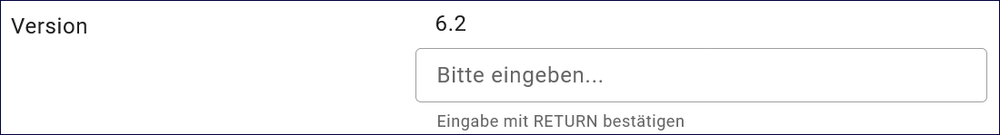
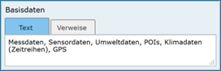
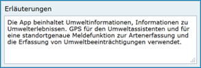

Informationssystem
==================

Mit dem Datensatztyp Informationssystem können Softwareprodukte, Webanwendungen oder zentrale Auskunfts- und Informationssysteme im Metadatenkatalog beschrieben werden.

.. important:: Die Erfassung dieser Objektklasse erfolgt wie unter `Erfassung von Objekten <https://metaver-bedienungsanleitung.readthedocs.io/de/latest/metaver_ige/ige_erfassung/erfassung-objekte.html>`_ beschrieben. Der hier beschriebene Abschnitt Fachbezug enthält spezielle Eingabefelder für diesen Datensatztyp.

-----------------------------------------------------------------------------------------------------------------------

Erfassung
---------

Abschnitt Fachbezug
^^^^^^^^^^^^^^^^^^^

Feld: Art des Dienstes
""""""""""""""""""""""

Abb.: Auswahlfeld - Art des Dienstes

Bitte wählen Sie in diesem Feld die Art des Dienstes aus.

Folgende Einstellungen stehen zur Verfügung: 

  - Anwendung
  - Informationssystem
  - nicht geographischer Dienst

 
 
Version
"""""""

Abb.: Eingabezeile für die Version

Versionsangaben des Dienstes. Bitte geben Sie sämtliche unterstützten Versionen des Dienstes an und bestätigen Sie jede Eingabe mit Enter.

 
Weitere Informationen
"""""""""""""""""""""

**Feld: Systemumgebung**

.. figure:: ../../../img/ige/erfassung/ige_metadaten/datensatztypen/datensatztyp_informationssystem/fachbezug_weitere-informationen.png
   :align: left
   :scale: 50
   :figwidth: 100%

Abb.: Textfeld - Systemumgebung

Systemumgebung - Informationen über das Betriebssystem, die Software und ggfs. Hardware, die für die Implementierung des Dienstes verwendet wird.

Beispiel:

Die empfohlene Plattform ist Linux (Ubuntu/Redhat).

Das System kann auch unter Windows installiert werden. Dies macht jedoch die Installation von CYGWIN erforderlich.
Systemvoraussetzungen

| JAVA 17 JDK (z.B. OpenJDK)
| Cygwin (unter Windows)
| MySQL, ORACLE oder PostgreSQL (ab InGrid 4.0.2)

Basisinstallation

Diese Konfiguration wird nur für einfache Systeme ohne hohe Last oder zum Testen empfohlen.

| Dual Core CPU
| 4 GB RAM
| 10 GB Plattenplatz

Typische Installation

| Quad Core CPU
| 8 GB RAM
| 100 GB Plattenplatz

 
**Feld: Historie**

Entwicklungsangaben: Hier können Vorläufer und Folgedienste oder -anwendungen bzw. -systeme genannt werden. Auch Informationen zu Initialforschungsprojekten oder -programmen sind von Interesse.

Beispiel: 

| **IGE-NG - InGrid Editor neue Generation (Webanwendung)**

  - Konzeption: 2021
  - Entwicklung: seit 2022
  - Anwendungsbeispiele:

METAVER (MetadatenVerbund) - ist das gemeinsame Metadatenportal der Länder Brandenburg, der Freien Hansestadt Bremen, der Freien und Hansestadt Hamburg, Hessen, Mecklenburg-Vorpommern, des Saarlands, Sachsens und Sachsen-Anhalts.

UVP-Portal der Länder -  Informationen zu UVP-pflichtigen Vorhaben, deren Verfahrensstand, Auslegungs- und Erörterungsterminen, eingestellten Unterlagen, Berichten und Empfehlungen sowie der anschließenden Entscheidung in den Bundesländern.

| **Vorläufer: IGE - InGrid Editor (Webanwendung)**

  - Entwicklung seit 2006 bis 2023 Version 6.2
  - Verwendung: PortalU (Umweltportal Deutschland)

PortalU war ein Online-Dienst der Umweltverwaltungen des Bundes und der Länder Deutschlands.

| **Vorläufer: Umweldatenkatalog (UDK) 1996 - 2015**

  - Windows UDK mit UDK-Explorer, HTML-UDK
  - Desktopanwendung, Client-Server Version, Web-UDK
  - Verwendung: German Environmental Information Network - GEIN (Portal - Umweltinformationsnetz Deutschland)

GEIN vereinte ein breites Spektrum an Umweltinformationen von öffentlichen Einrichtungen und Behörden im Internet, die zuvor nur über zahlreiche individuelle Websites erreichbar waren.  

| **Konzeption Umweltdatenkatalog (UDK) 1991 - 1995**

  - Konzeption im Niedersächsischen Umweltministerium

Der Umweltdatenkatalog (UDK) ist ein System zur Metadatenbeschreibung von Umweltdaten der öffentlichen Verwaltung. 

Basisdaten
''''''''''

Abb.: Textfeld - Basisdaten

Herkunft und Art der zugrundeliegenden Daten.
Im Allgemeinen sind dies die Datensätze, auf die der Dienst aufgesetzt ist. Allgemein sollen die Herkunft oder die Ausgangsdaten der Daten beschrieben werden, die in dem Dienst / der Anwendung bzw. dem Informationssystem benutzt, gespeichert, angezeigt oder weiterverarbeitet werden. Zusätzlich kann die Art der Daten (z. B. digital, automatisch ermittelt oder aus Umfrageergebnissen, Primärdaten, fehlerbereinigte Daten) angegeben werden.

Der Eintrag kann hier direkt über die Auswahl der Registerkarte "Text" erfolgen oder es können Verweise eingetragen werden, indem der Link "Verweis anlegen" angewählt wird.

Erläuterungen
'''''''''''''

Abb.: Textfeld - Erläuterungen

Zusätzliche Anmerkungen zu dem beschriebenen Dienst, der Anwendung oder dem Informationssystem. Hier können weitergehende Angaben z. B. technischer Art gemacht werden, die zum Verständnis des Dienstes, der Anwendung, des Informationssystems notwendig sind.

Beispiel:
Die App beinhaltet Umweltinformationen, Informationen zu Umwelterlebnissen. GPS für den Umweltassistenten und für eine standortgenaue Meldefunktion zur Artenerfassung und die Erfassung von Umweltbeeinträchtigungen verwendet.
