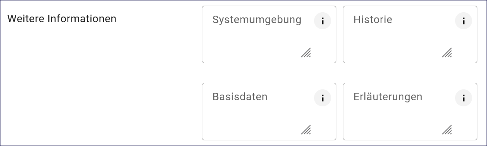
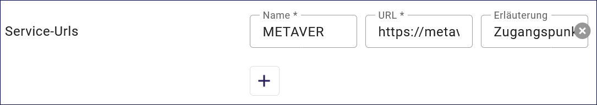

Informationssystem
==================

Mit dem Datensatztyp Informationssystem können Softwareprodukte, Webanwendungen oder zentrale Auskunfts- und Informationssysteme im Metadatenkatalog beschrieben werden.

.. important:: Die Erfassung dieser Objektklasse erfolgt wie unter `Erfassung von Objekten <https://metaver-bedienungsanleitung.readthedocs.io/de/latest/metaver_ige/ige_erfassung/erfassung-objekte.html>`_ beschrieben. Der hier beschriebene Abschnitt Fachbezug enthält spezielle Eingabefelder für diesen Datensatztyp.

-----------------------------------------------------------------------------------------------------------------------

Erfassung
---------

Abschnitt Fachbezug
^^^^^^^^^^^^^^^^^^^

Feld: Art des Dienstes
""""""""""""""""""""""

.. figure:: ../../../img/ige/erfassung/ige_metadaten/datensatztypen/datensatztyp_informationssystem/fachbezug_dienstart.png
   :align: left
   :scale: 50
   :figwidth: 100%

Abb.: Auswahlfeld - Art des Dienstes

Bitte wählen Sie in diesem Feld die Art des Dienstes aus.

Folgende Einstellungen stehen zur Verfügung: 

  - Anwendung
  - Informationssystem
  - nicht geographischer Dienst

 
 
Feld: Version
"""""""""""""

.. figure:: ../../../img/ige/erfassung/ige_metadaten/datensatztypen/datensatztyp_informationssystem/fachbezug_version.png
   :align: left
   :scale: 50
   :figwidth: 100%

Abb.: Eingabezeile für die Version

Versionsangaben des Dienstes. Bitte geben Sie sämtliche unterstützten Versionen des Dienstes an und bestätigen Sie jede Eingabe mit Enter.

 
Weitere Informationen
"""""""""""""""""""""

Abb.: Textfelder für weitere Informationen

**Feld: Systemumgebung**

Systemumgebung - Informationen über das Betriebssystem, die Software und ggfs. Hardware, die für die Implementierung des Dienstes verwendet wird.

Beispiel:

Die empfohlene Plattform ist Linux (Ubuntu/Redhat).

Das System kann auch unter Windows installiert werden. Dies macht jedoch die Installation von CYGWIN erforderlich.
Systemvoraussetzungen

| JAVA 17 JDK (z.B. OpenJDK)
| Cygwin (unter Windows)
| MySQL, ORACLE oder PostgreSQL (ab InGrid 4.0.2)

Basisinstallation

Diese Konfiguration wird nur für einfache Systeme ohne hohe Last oder zum Testen empfohlen.

| Dual Core CPU
| 4 GB RAM
| 10 GB Plattenplatz

Typische Installation

| Quad Core CPU
| 8 GB RAM
| 100 GB Plattenplatz

 
**Feld: Historie**

Entwicklungsangaben: Hier können Vorläufer und Folgedienste oder -anwendungen bzw. -systeme genannt werden. Auch Informationen zu Initialforschungsprojekten oder -programmen sind von Interesse.

Beispiel: 

| IGE-NG - InGrid Editor neue Generation (Webanwendung)

  - Konzeption: 2021
  - Entwicklung: seit 2022

| Vorläufer: IGE - InGrid Editor (Webanwendung)

  - Entwicklung seit 2006 bis 2023 (Version 6.2)
 

**Feld: Basisdaten**

Beschreibung Herkunft und Art der zugrundeliegenden Daten. Im Allgemeinen sind dies die Datensätze, auf die der Dienst aufgesetzt ist. Allgemein sollen die Herkunft oder die Ausgangsdaten der Daten beschrieben werden, die in dem Dienst, der Anwendung bzw. dem Informationssystem benutzt, gespeichert, angezeigt oder weiterverarbeitet werden. Zusätzlich kann die Art der Daten (z. B. digital, automatisch ermittelt oder aus Umfrageergebnissen, Primärdaten, fehlerbereinigte Daten) angegeben werden.

Beispiel: Das Informationssystem enthält umweltbezogene Daten und Geodaten der öffentlichen Verwaltung.

**Feld: Erläuterungen**

Zusätzliche Anmerkungen zu dem beschriebenen Dienst, der Anwendung oder dem Informationssystem. Hier können zusätzliche Informationen, z.B. technischer Art, gegeben werden, die für das Verständnis des Dienstes, der Anwendung, des Informationssystems erforderlich sind.

Beispiel: Die erfassten Daten werden über den Suchdienst Catalogue Service for the Web (CSW) an andere Datenbanken/Portale übergeben.

Feld: Service-URLs
""""""""""""""""""

Abb.: Felder - Service-URLs

Angaben zur Adresse für den Zugriff auf den Dienst oder die Anwendung. Der Name und die URL sowie eine kurze Erläuterung der Adresse sind anzugeben.

Beispiel: Name: METAVER; URL: https://www.metaver.de; Erläuterung: Zugangspunkt zu Metadaten