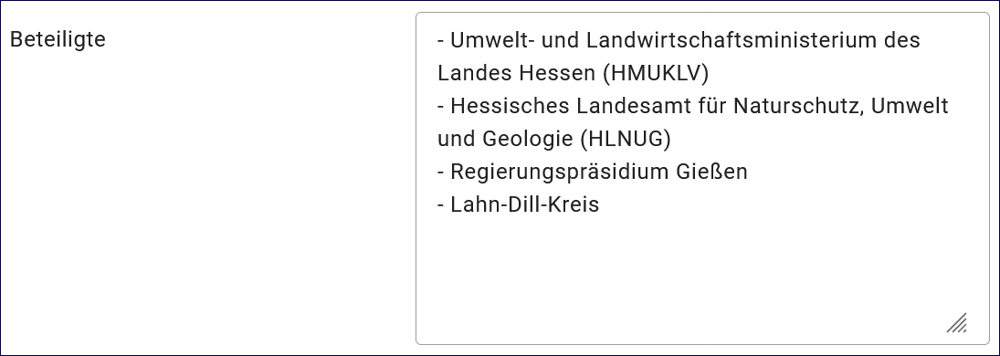
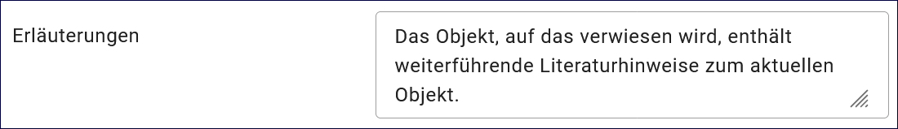

Projekt
=======

.. csv-table::
    :header: "Portal", "Editor"
    :widths: 20, 20

    .. image:: ../../../img/ige/icons/datensatztypen/portal/projekt.png, .. image:: ../../../img/ige/icons/datensatztypen/ige/projekt.png

Der Datensatztyp Projekt wird verwendet, wenn laufende oder abgeschlossene Vorhaben, Projekte bzw. Programme beschrieben werden sollen. Dazu gehören: Forschungs- und Entwicklungsvorhaben, Projekte unter Beteiligung anderer Institutionen oder privater Unternehmen, Schutzprogramme, von besonderem Interesse sind Vorhaben/Projekte/Programme, in denen umweltrelevante Datenbestände entstehen.

.. important:: Die Erfassung dieses Datensatztyps erfolgt wie unter `Metadaten erfassen <https://metaver-bedienungsanleitung.readthedocs.io/de/igeng/ingrid-editor/erfassung/erfassung-metadaten.html>`_ beschrieben. Der hier beschriebene Abschnitt Fachbezug beinhaltet für diesen Datensatztyp spezielle Eingabefelder.

Abschnitt Fachbezug
-------------------

Feld: Beteiligte
^^^^^^^^^^^^^^^^

Abb.: Textfeld für die Angabe von Personen oder Organisationen

Angabe von Personen oder Organisationen, die an dem Projekt, Programm oder Vorhaben beteiligt sind. Der Eintrag soll Hinweise auf wichtige Institutionen oder Personen geben, die beteiligt waren oder sind und über die ggf. nähere Informationen eingeholt werden können. Über "Adressen HINZUFÜGEN" können weitere Adressen oder Organisationen gesucht oder über die Ordnerstruktur ausgewählt werden.

Feld: Projektleiter
^^^^^^^^^^^^^^^^^^^

Abb.: Angabe des Projektleiters

Weitere Adressen können über den Link "Adresse HINZUFÜGEN" gesucht oder über die Objektstruktur ausgewählt werden, sofern sie zuvor angelegt wurden.

 
Feld: Erläuterungen
^^^^^^^^^^^^^^^^^^^

Abb.: Textfeld für Erläuterungen

Zusätzliche Angaben zu einem Projekt oder Programm.  Hier können weitere wichtige Angaben eingetragen werden, z.B. Finanzierung, Förderkennzeichen, Bearbeitungsstatus.