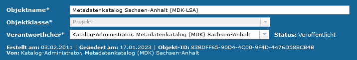
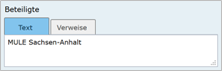
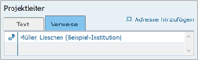
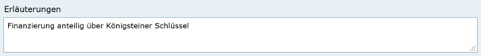

Projekt
=======

.. csv-table::
    :header: "Portal", "Editor"
    :widths: 20, 20

   .. image:: ../../../img/ige/icons/datensatztypen/portal/projekt.png, .. image:: ../../../img/ige/icons/datensatztypen/ige/projekt.png

Der Datensatztyp Projekt wird verwendet, wenn laufende oder abgeschlossene Vorhaben, Projekte bzw. Programme beschrieben werden sollen. Dazu gehören: Forschungs- und Entwicklungsvorhaben, Projekte unter Beteiligung anderer Institutionen oder privater Unternehmen, Schutzprogramme, von besonderem Interesse sind Vorhaben/Projekte/Programme, in denen umweltrelevante Datenbestände entstehen.

.. important:: Die Erfassung dieser Objektklasse erfolgt wie unter `Erfassung von Objekten <https://metaver-bedienungsanleitung.readthedocs.io/de/latest/metaver_ige/ige_erfassung/erfassung-objekte.html>`_ beschrieben. Lediglich der hier beschriebene Abschnitt Zeitbezug beinhaltet für diese Objektklasse spezielle Eingabefelder.

Erfassung
---------

Abschnitt Fachbezug
^^^^^^^^^^^^^^^^^^^^

.. image:: ../../../img_ige/metaver_ige/ige_erfassung/ige_objekte/ige_abschnitt-04_fachbezug/ige-abschnitt_fachbezug.png
   :width: 700

Abb.: Objektklasse Projekt - Kopf der Erfassungsmaske

Beteiligte
''''''''''

Abb.: Textfeld - Beteiligte

Angabe von Personen oder Institutionen, die am Projekt bzw. am Programm oder Vorhaben beteiligt sind. Der Eintrag soll Hinweise auf wichtige Institutionen oder Personen geben, die beteiligt waren bzw. sind und über die evtl. weitere genauere Informationen zu erfahren sind. Der Eintrag kann direkt über die Auswahl der Registerkarte "Text" erfolgen oder es können Adressverweise eingetragen werden, indem die Registerkarte "Verweise" aktiviert wird. Über "Adresse hinzufügen" kann nach Adressen und Institutionen gesucht werden oder man kann diese über den Hierarchiebaum ausgewählten.

Projektleiter
'''''''''''''

 

Abb.: Textfeld - Projektleiter

Angabe des Projektleiters. Der Eintrag kann direkt über die Auswahl der Registerkarte "Text" erfolgen oder es können Adressverweise ausgewählt werden, in dem die Registerkarte "Verweise" aktiviert wird. Über den Link "Adresse hinzufügen" kann nach Adressen gesucht werden oder es können diese mit Hilfe des Hierachiebaums ausgewählt werden.

 
Erläuterungen
'''''''''''''

Abb.: Textfeld - Erläuterungen

Weitere Angaben zum Projekt bzw. Programm oder Vorhaben. Hier können zusätzliche wichtige Angaben eingetragen werden, z.B. Finanzierung, Förderkennzeichen, Bearbeitungsstatus.
 