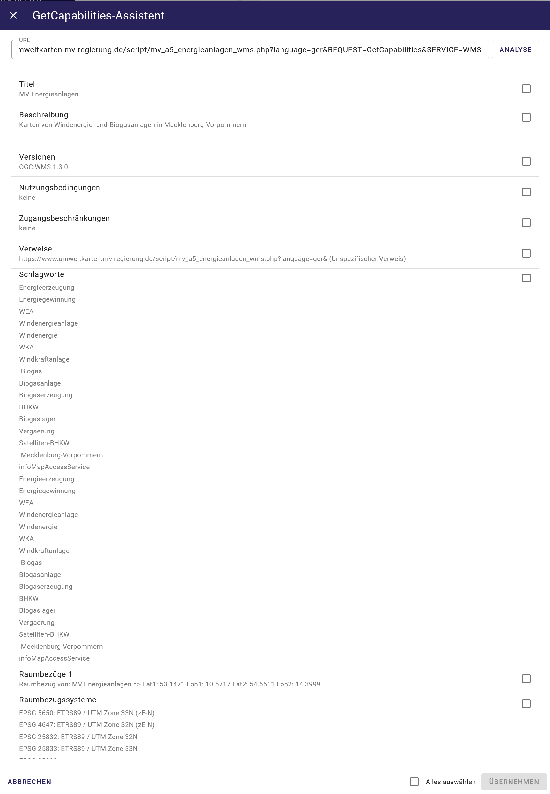
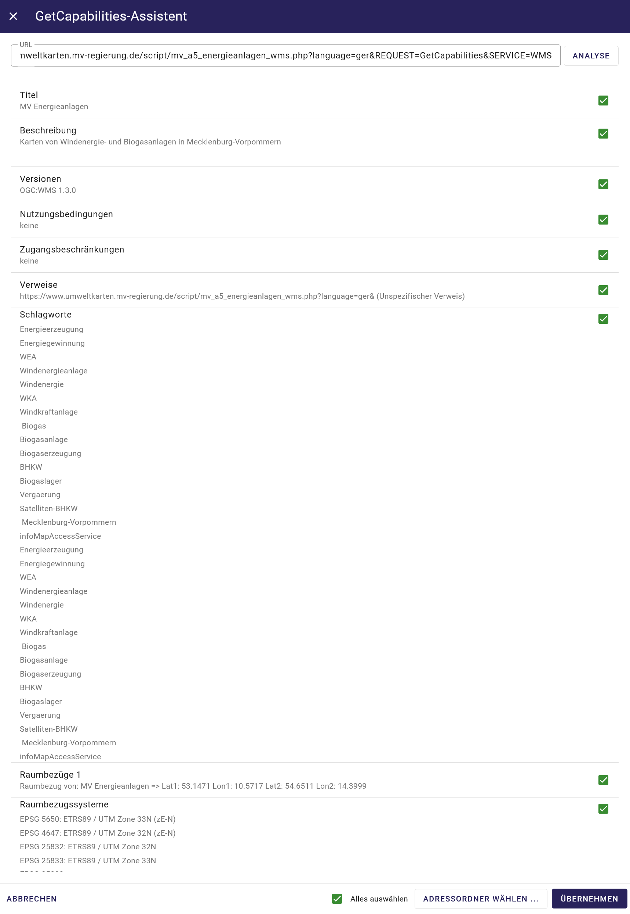

Der GetCapabilitie-Assistent
^^^^^^^^^^^^^^^^^^^^^^^^^^^^

.. figure:: ../../../../img/ige/erfassung/ige_metadaten/ige_datensatztypen/datensatztyp_geodatendienst/assistent/getcapabilties-assistent_symbol.png
   :width: 50
   
Abb.: GetCapabilitie-Assistent - Symbol (Zauberstab)

Wird für einem Geodatendienst ein neuer Metadatensatz erstellt, kann für die Erfassung der Metadaten der getCapabilties-Assistent (Symbol Zauberstab in der Symbolleiste) verwendet werden.

Der GetCapabilities-Assistent ist ein Erfassungsassistent, der Metadatenerfasser bei der Erstellung von Metadaten zu Geodatendiensten unterstützt.

Startern Sie den Assistenten über das Symbol Zauberstab in der Symbolleiste. Geben Sie in das Fenster die getCapability-URL des Dienstes ein und betätigen Sie den Button "ÜBERNEHMEN".

   
Abb.: GetCapabilitie-Assistent - URL Eingabe

Der Assistent ruft den Dienst über die eingetragene URL ab und zeigt alle in der getCapability verfügbaren Metadaten an. Der Erfasser kann dann die Metainformationen auswählen, die in das Erfassungsformular übernommen werden sollen.

Abb.: GetCapabilitie-Assistent - Metadaten

Der getCapabilties-Assistent ruft die Metadaten aus der XML des Geodatendienstes ab. Diese können für das Befüllen des Datensatztyps "Geodatendienst" verwendet werden.

Abb.: GetCapabilitie-Assistent - Metadatenauswahl

Mit der Funktion ABBRECHEN schließen Sie den Assistenten und starten mit einem leeren Objekt.

   
Abb.: GetCapabilitie-Assistent - übernommene Metadaten

Der "getCapabilities Assistent" unterstützt folgende Dienste-Typen:

 - WMS - Web Map Service
 - WMTS - Web Map Tile Service
 - WFS - Web Feature Service
 - WCS - Web Coverage Service
 - WCS-T - Web Coverage Service – Transaktion
 - CSW - Catalogue Service for the Web
 
Eine Ausnahme ist der Atom-Feed, dieser kann nicht über den GetCapabilitie Assistent abgerufen bzw. erstellt werden.

Die Metadaten, die aus einem Dienst in die Erfassungsmaske übernommen wurden, lassen sich über die GetCapabilitie-Aktualisierung (am Anfang der Erfassungsmaske) erneuern.

   
Abb.: GetCapabilitie-Aktualisierung am Anfang der Erfassungsmaske