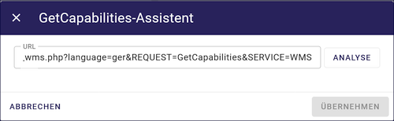

Der GetCapabilitie-Assistent
^^^^^^^^^^^^^^^^^^^^^^^^^^^^

.. figure:: ../../../../img/ige/erfassung/ige_metadaten/datensatztypen/datensatztyp_geodatendienst/assistent/getcapabilties-assistent_symbol.png
   :align: left
   :scale: 50
   :figwidth: 100%

Abb.: GetCapabilitie-Assistent - Symbol (Zauberstab)

Wenn ein neuer Metadatensatz für einen Geodatendienst erstellt wird, kann der Assistent getCapabilities (Zauberstab-Symbol in der Symbolleiste) verwendet werden, um die Metadaten zu erfassen.

Der GetCapabilities Assistent ist ein Erfassungsassistent, der Metadatenerfasser bei der Erstellung von Metadaten für Geodatendienste unterstützt.

Starten Sie den Assistenten über das Zauberstab-Symbol in der Symbolleiste. Geben Sie die getCapability-URL des Dienstes in das Fenster ein und klicken Sie auf "ÜBERNEHMEN".

Abb.: GetCapabilitie-Assistent - URL Eingabe

Der Assistent ruft die Dienst-URL ab und listet alle in getCapabilitie verfügbaren Metadaten auf. Der Erfasser kann dann die Metainformationen auswählen, die ins Erfassungsformular übernommen werden sollen.

Abb.: GetCapabilitie-Assistent - Metadaten

Der Assistent "GetCapabilities" extrahiert Metadaten aus der XML des Geodatendienstes. Diese können genutzt werden, um den Datensatztyp "Geodatendienst" zu füllen.

Abb.: GetCapabilitie-Assistent - Metadatenauswahl

Werden die Adressen aus den Metadaten übernommen, erscheint im Assistenten der Button "Adressordner wählen".  Klicken Sie darauf und wählen Sie dann den Ordner aus dem Editor aus, unter dem die neue Adresse angelegt werden soll.

Mit der Funktion ABBRECHEN können Sie den Assistenten schließen und mit einem leeren Objekt starten.

Abb.: GetCapabilitie-Assistent - übernommene Metadaten

Der "getCapabilities Assistent" unterstützt folgende Dienste-Typen:

 - WMS - Web Map Service
 - WMTS - Web Map Tile Service
 - WFS - Web Feature Service
 - WCS - Web Coverage Service
 - WCS-T - Web Coverage Service – Transaktion
 - CSW - Catalogue Service for the Web
 
Eine Ausnahme bildet der Atom-Feed, da dieser nicht über den GetCapabilities-Assistenten abgerufen oder erstellt werden kann.

Die übernommenen Metadaten können mithilfe des Buttons "AKTUALISIEREN" am Anfang der Erfassungsmaske aktualisiert werden.

Abb.: GetCapabilitie-Aktualisierung am Anfang der Erfassungsmaske