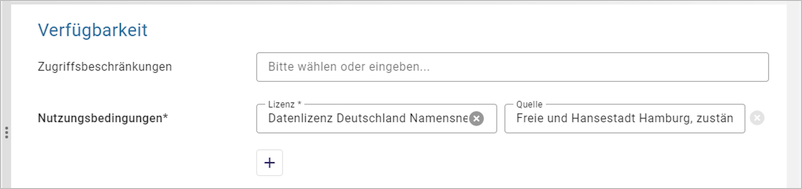

--------------------------------------
Option 2: Veröffentlichung gemäß HmbTG
--------------------------------------

.. hint:: Metadaten die nur im Transparenzportal und nicht bei GovData veröffentlicht werden sollen, benötigen nur das Häkchen bei „Veröffentlichung gemäß HmbTG“.

.. figure:: ../../../../img/ige/erfassung/ige_metadaten/datensatztypen/hamburg/hmbtg/hmdk_hmbtg-checkbox.png
   :align: left
   :scale: 70
   :figwidth: 100%

Abb.: Checkbox - Veröffentlichung gemäß HmbTG

Nach dem erstmaligen Aktivieren erscheint die folgende Meldung, die Sie bitte jeweils mit „OK“ bestätigen.

.. figure:: ../../../../img/ige/erfassung/ige_metadaten/datensatztypen/hamburg/hmbtg/hmdk_hmbtg-hinweis-checkbox.png
   :align: left
   :scale: 70
   :figwidth: 100%

Abb.: Fenster - Hinweis zur Veröffentlichung im Hamburger Transparentportal

Abb.: Fenster - Hinweis zu den Zugriffsbeschränkungen

2.1 Pflichtfelder
^^^^^^^^^^^^^^^^^^
Wird die Checkbox „Veröffentlichung gemäß HmbTG“ angehakt, werden folgende Felder automatisch zum Pflichtfeld:

2.1.1. Informationsgegenstand
"""""""""""""""""""""""""""""

.. figure:: ../../../../img/ige/erfassung/ige_metadaten/datensatztypen/hamburg/hmbtg/hmdk_hmbtg-informationsgegenstand.png
   :align: left
   :scale: 70
   :figwidth: 100%

Abb.: Fenster - Hinweis zu den Zugriffsbeschränkungen

Es muss mindestens ein Informationsgegenstand der Auswahlliste ausgewählt werden. Möglich ist auch die Angabe „Ohne gesetzliche Verpflichtung“.

Wird der Haken bei der Checkbox wieder entfernt, so werden automatisch auch die ausgewählten Informationsgegenstände gelöscht.

2.1.2 Adressen
""""""""""""""

•  Es muss mindestens einen 'Ansprechpartner MD' geben.
•  Es muss mindestens einen 'Herausgeber' geben

2.1.3 Open Data Kategorie
"""""""""""""""""""""""""

Abb.: Feld - Hinweis zu den Zugriffsbeschränkungen

Über die Auswahlliste muss mindestens eine Open Data DCAT-AP-DE Kategorie ausgewählt werden.
Die folgenden Kategorien stehen zur Verfügung:

.. figure:: ../../../../img/ige/erfassung/ige_metadaten/datensatztypen/hamburg/hmbtg/hmdk_hmbtg-opendata-kategorie-liste.png
   :align: left
   :scale: 50
   :figwidth: 100%

Abb.: Open Data Kategorien

`Auswahlliste der Open Data Kategorien <https://metaver-bedienungsanleitung.readthedocs.io/de/hmdk/ingrid-editor/auswahllisten/auswahlliste_allgemeines_opendata-kategorien.html>`_

2.1.4 Veröffentlichungsrecht
""""""""""""""""""""""""""""

Die Veröffentlichung für Objekte, die für das Hamburger Transparenzportal gekennzeichnet sind, müssen auf „Internet“ gesetzt sein. Bitte kontrollieren!

Siehe drei Punkte Menü neben dem Titel

Abb.: Veröffentlichungsrecht setzen

Abb.: Fenster - Veröffentlichungsrecht

2.1.5 Nutzungsbedingeungen
""""""""""""""""""""""""""

Abb.: Feld - Nutzungsbedingungen

Durch das Anklicken der Checkbox wird bei den Nutzungsbedingungen automatisch der Eintrag „Datenlizenz Deutschland Namensnennung 2.0“ gesetzt. Eventuell bereits vorhandene ältere Einträge werden überschrieben.

**Quellenvermerk**

Der Quellenvermerk wird automatisch mit „Freie und Hansestadt Hamburg, zuständige Behörde“ gefüllt
Bitte nicht vergessen, den Eintrag „zuständige Behörde“ durch die eigene Behörde zu ersetzen (z.B. Behörde für Umwelt und Energie).
Zugriffsbeschränkungen
Das Feld „Zugriffsbeschränkungen“ wird jetzt nur noch mit „Es gelten keine Zugriffsbeschränkungen“ befüllt, wenn zusätzlich zu Open Data die Checkbox „INSPIRE-relevant“ aktiv ist.

**Begründung:** 

*Das Feld Zugriffsbeschränkungen wird nur mit INSPIRE-relevanten Werten befüllt und findet daher nur im INSPIRE-Kontext Verwendung. Datensätze mit Open Data-Kennzeichnung und ohne INSPIRE-Relevanz sollten nicht gezwungenermaßen eine Wertangabe mit INSPIRE-Bezug beinhalten. Für Open Data-MD, insbesondere bei Weiterleitung über den Geodatenkatalog.de nach GovData, ist diese Angabe nicht notwendig. (Anmerkung: Hier ist demnächst eine Änderung eingeplant).*

2.1.6 Verweise vom Typ Datendownload
""""""""""""""""""""""""""""""""""""

Abb.: Feld - Verweise

Da über das Hamburger Transparenzportal die echten Daten heruntergeladen werden sollen, muss im HMDK bei den HmbTG-Objekten ebenfalls ein Verweis zum Download der eigentlichen Daten eingetragen sein. Aus diesem Grund wird bei Anhaken der Checkbox „Veröffentlichung gemäß HmbTG“ das Anlegen eines Verweises vom Typ „Datendownload“ Pflicht. Der Verweistyp wird im Dialog „Verweis anlegen“ über die vorgegebene Liste ausgewählt. 

Abb.: Fenster - Eintrag bearbeiten

Dateiformat:

Bitte geben Sie an dieser Stelle das Format der eigentlichen Daten an. Handelt es sich beispielsweise um JPEG-Dateien, die in einer ZIP-Datei bereitgestellt werden, ist als Dateiformat des Verweises „JPEG“ auszuwählen.

2.1.7 Schlagworte (Keywords)
""""""""""""""""""""""""""""

Das keyword für Veröffentlichung gemäß HmbTG ist „hmbtg“, es wird automatisch beim Anklicken der Checkbox „Veröffentlichung gemäß HmbTG“ gesetzt. Es erscheint im Portal bei Schlagworte, sowie in der ISO im Element <gmd:keyword>

.. figure:: ../../../../img/ige/erfassung/ige_metadaten/datensatztypen/hamburg/hmbtg/hmdk_hmbtg-keyword-hmbtg.png
   :align: left
   :scale: 50
   :figwidth: 100%

Abb.: XML Keyword - hmbtg

Neben dem fest vorgegebenen Schlagwort „hmbtg“ wird zusätzlich das Kürzel des ausgewählten Informationsgegenstandes gesetzt (z.B. „hmbtg_09_geodaten“ für den Informationsgegenstand „Geodaten“).

.. figure:: ../../../../img/ige/erfassung/ige_metadaten/datensatztypen/hamburg/hmbtg/hmdk_hmbtg-keyword-hmbtg_09_geodaten.png
   :align: left
   :scale: 50
   :figwidth: 100%

Abb.: XML Keyword - hmbtg_09_geodaten