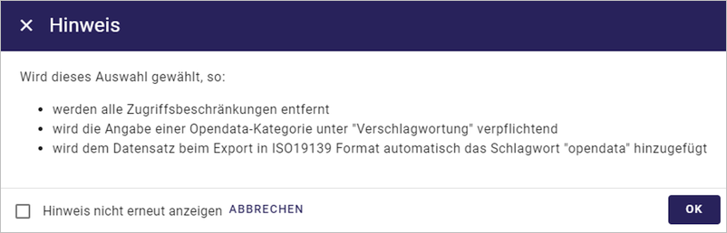
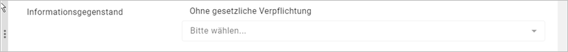
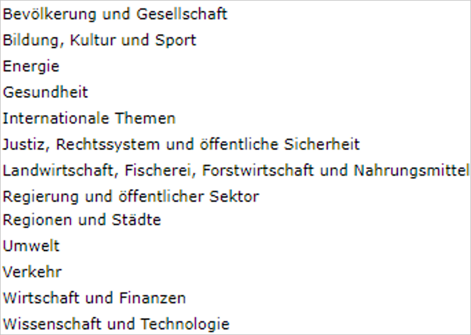
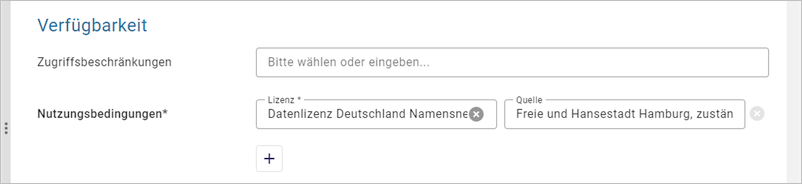

-----------------
Open Data
-----------------

Open Data - Erläuterungen
^^^^^^^^^^^^^^^^^^^^^^^^^^

Open Data bezeichnet Daten, die von jedermann für jeden Zweck ohne technische und rechtliche Einschränkungen genutzt, verbreitet und weiterverarbeitet werden können. Wichtig ist dabei, dass die Quelle bzw. der Urheber der Daten bei der Weiterverwendung stets genannt wird. Diese Praxis ermöglicht den freien Zugang zu digitalen Daten und deren Weiterverwendung ohne technische, rechtliche oder finanzielle Bedingungen. Beispiele für offene Daten sind Unterrichtsmaterialien, Geodaten, Statistiken, Verkehrsinformationen, wissenschaftliche Publikationen, medizinische Forschungsergebnisse oder Radio- und Fernsehsendungen. Wichtig ist jedoch, dass offene Daten keine personenbezogenen Daten oder Daten, die dem Datenschutz unterliegen, enthalten dürfen.

**Offene Verwaltungsdaten**

Offene Verwaltungsdaten sind nicht personenbezogene Daten, die von öffentlichen Stellen gesammelt, erstellt oder bezahlt wurden und der Allgemeinheit kostenlos zur Verfügung gestellt werden. Diese Daten stellen eine Basisinfrastruktur für die Digitalisierung dar.

**Offene Verwaltungsdaten sollen maschinenlesbar, frei verfügbar, vollständig, aktuell und dauerhaft zugänglich, sie sollen gut strukturiert und für die Allgemeinheit nützlich sein.**

| **Maschinenlesbarkeit:** Die Daten sollten in einem standardisierten Format vorliegen, das von Computern verarbeitet werden kann. Beispiele sind CSV, JSON oder XML.
| **Freie Verfügbarkeit:** Die Daten sollten ohne Einschränkungen kostenlos zugänglich sein. Es dürfen keine technischen oder rechtlichen Hürden bestehen.
| **Vollständigkeit:** Die bereitgestellten Daten sollten so umfassend wie möglich sein und alle relevanten Informationen enthalten.
| **Aktualität:** Die Daten sollten regelmäßig aktualisiert werden, um ihre Relevanz zu gewährleisten.
| **Dauerhafte Zugänglichkeit:** Die Verwaltungsdaten sollten über einen längeren Zeitraum hinweg verfügbar sein, um ihre Nutzung zu ermöglichen.

.. hint:: `GovData - Informationen <https://www.govdata.de/web/guest/open-government>`_ und `DCAT-AP.de <https://www.dcat-ap.de>`_ und `Open-Data-Leitfaden Schleswig-Holstein <https://opendata.schleswig-holstein.de/leitfaden/>`_

-----------------------------------------------------------------------------------------------------------------------

Erfassung
^^^^^^^^^

Option: Open Data
""""""""""""""""""

.. hint:: Es gibt Datensätze, die nicht unter das Transparenzgesetz fallen, aber freiwillig nach Open Data (GovData) veröffentlicht werden können. Bei diesen Objekten sollte im InGrid-Editor nur die Checkbox „Open Data“ angehakt werden. Die Checkbox „Veröffentlichung gemäß HmbTG“ muss deaktiviert sein.

.. figure:: ../../../../img/ige/erfassung/ige_metadaten/datensatztypen/hamburg/open-data/hmdk_checkbox-opendata.png
   :align: left
   :scale: 90
   :figwidth: 100%

Abb.: Option: Open Data

Wird die Checkbox „Open Data“ aktiviert, erscheint diese Meldung und es werden folgende Felder automatisch zum Pflichtfeld:

Abb.: Fenster - Hinweis

Durch die Aktivierung der Option "Open Data" wird das Schlüsselwort "opendata" im ISO-XML gesetzt.

.. figure:: ../../../../img/ige/erfassung/ige_metadaten/datensatztypen/hamburg/open-data/iso-xml-opendata.png
   :align: left
   :scale: 60
   :figwidth: 100%

Abb.: ISO-XML - Angabe des Schlüsselwortes "opendata"

Im Folgenden werden die Felder beschrieben, die nach Aktivierung der Option "Open Data" in der Erfassungsmaske zusätzlich ausgefüllt werden müssen.

Folgende Eigenschaften ändern sich bei der Aktivierung der Option "Open Data":

 - Im Abschnitt "Verschlagwortung" muss in der Tabelle "Kategorien" mindestens ein Wert ausgewählt werden.
 - Im Abschnitt „Verfügbarkeit“ muss in der Tabelle "Nutzungsbedingungen" eine Lizenz ausgewählt werden.
 - Im Abschnitt „Verweise“ muss ein Verweis vom Typ "Datendownload" eingegeben werden.

.. figure:: ../../../../img/ige/erfassung/ige_metadaten/datensatztypen/hamburg/open-data/open-data_hinweis.png
   :align: left
   :scale: 80
   :figwidth: 100%

Abb.: Fenster - Hinweis

1.1 Pflichtfelder
^^^^^^^^^^^^^^^^^

1.1.1 Informationsgegenstand
""""""""""""""""""""""""""""

Abb.: Feld - Informationsgegenstand

Wird die Open Data Checkbox angehakt, wird gleichzeitig die Checkbox „Veröffentlichung gemäß HmbTG“ aktiviert. Sind die Daten von der Veröffentlichungspflicht nach dem Hamburger Transparenzgesetz ausgenommen sollte der Haken bei „Veröffentlichung gemäß HmbTG“ wieder entfernt werden.
(In den meisten Fällen hängt jedoch die Veröffentlichung in GovData auch mit der Veröffentlichung im Transparenzportal zusammen.)
Sobald jedoch nur Open Data aktiv ist, wird automatisch im Feld „Informationsgegenstand“ der Wert „Ohne gesetzliche Verpflichtung“ gesetzt. Wird der Haken bei Open Data wieder entfernt, wird der Eintrag bei Informationsgegenstand gelöscht.

1.1.2 Adressen
"""""""""""""""

 - Es muss mindestens einen 'Ansprechpartner MD' geben.
 - Es muss mindestens einen 'Herausgeber' geben

1.1.3 Open Data Kategorie
""""""""""""""""""""""""""

(Open Data) Kategorien
'''''''''''''''''''''''

Die Tabelle "Kategorien" enthält eine Auswahlliste zur näheren Bestimmung des OpenData-Objekts.

`Auswahlliste der Open Data Kategorien <https://metaver-bedienungsanleitung.readthedocs.io/de/hmdk/ingrid-editor/auswahllisten/auswahlliste_allgemeines_opendata-kategorien.html>`_

Abb.: Open Data Kategorien

`Auswahlliste der Open Data Kategorien <https://metaver-bedienungsanleitung.readthedocs.io/de/hmdk/ingrid-editor/auswahllisten/auswahlliste_allgemeines_opendata-kategorien.html>`_

1.1.4 Veröffentlichungsrecht
"""""""""""""""""""""""""""""

Die Veröffentlichung für Objekte, die für Open Data gekennzeichnet sind, müssen auf „Internet“ gesetzt sein. Bitte kontrollieren!

Siehe drei Punkte Menü neben dem Titel

.. figure:: ../../../../img/ige/erfassung/ige_metadaten/datensatztypen/hamburg/open-data/hmdk_opendata-veroeffentlichungsrecht-setzen.png
   :align: left
   :scale: 70
   :figwidth: 100%

Abb.: Feld - Veröffentlichungsrecht setzen

.. figure:: ../../../../img/ige/erfassung/ige_metadaten/datensatztypen/hamburg/open-data/hmdk_opendata-veroeffentlichungsrecht.png
   :align: left
   :scale: 90
   :figwidth: 100%

Abb.: Fenster - Veröffentlichungsrecht

1.1.5 Nutzungsbedingungen
""""""""""""""""""""""""""

Abb.: Fenster - Nutzungsbedingungen

Durch das Anklicken der Checkbox wird bei den Nutzungsbedingungen automatisch der Eintrag "Datenlizenz Deutschland Namensnennung 2.0" gesetzt. Eventuell bereits vorhandene ältere Einträge werden überschrieben.

**Quellenvermerk**

Der Quellenvermerk wird automatisch mit „Freie und Hansestadt Hamburg, zuständige Behörde“ gefüllt
Bitte nicht vergessen, den Eintrag „zuständige Behörde“ durch die eigene Behörde zu ersetzen (z.B. Behörde für Umwelt und Energie).

**Zugriffsbeschränkungen**

Das Feld „Zugriffsbeschränkungen“ wird jetzt nur noch mit „Es gelten keine Zugriffsbeschränkungen“ befüllt, wenn zusätzlich zu Open Data die Checkbox „INSPIRE-relevant“ aktiv ist.

**Begründung:** *Das Feld Zugriffsbeschränkungen wird nur mit INSPIRE-relevanten Werten befüllt und findet daher nur im INSPIRE-Kontext Verwendung. Datensätze mit Open Data-Kennzeichnung und ohne INSPIRE-Relevanz sollten nicht gezwungenermaßen eine Wertangabe mit INSPIRE-Bezug beinhalten. Für Open Data-MD, insbesondere bei Weiterleitung über den Geodatenkatalog.de nach GovData, ist diese Angabe nicht notwendig. (Anmerkung: Hier ist demnächst eine Änderung eingeplant).*

1.1.6 Verweise vom Typ Datendownload
"""""""""""""""""""""""""""""""""""""

.. figure:: ../../../../img/ige/erfassung/ige_metadaten/datensatztypen/hamburg/open-data/hmdk_opendata-verweise.png
   :align: left
   :scale: 80
   :figwidth: 100%

Abb.: Feld - Verweise

Da über das Transparenzportal mindestens ein Bezug zu den echten Daten hergestellt werden sollte, muss im HMDK bei den betroffenen Objekten ebenfalls ein Verweis zum Download der eigentlichen Daten eingetragen werden. Aus diesem Grund wird bei Anhaken der Open Data Checkbox das Anlegen eines Verweises vom Typ „Datendownload“ Pflicht. Der Verweistyp wird im Dialog „Verweise Hinzufügen“ über die vorgegebene Liste ausgewählt.

.. figure:: ../../../../img/ige/erfassung/ige_metadaten/datensatztypen/hamburg/open-data/hmdk_opendata-verweise-eintrag-bearbeiten.png
   :align: left
   :scale: 70
   :figwidth: 100%

Abb.: Fenster - Eintrag bearbeiten

Dateiformat:

Bitte geben Sie an dieser Stelle das Format der eigentlichen Daten an. Handelt es sich beispielsweise um JPEG-Dateien, die in einer ZIP-Datei bereitgestellt werden, ist als Dateiformat des Verweises „JPEG“ auszuwählen.

1.1.7 Schlagworte (Keyword)
""""""""""""""""""""""""""""

Das keyword für Open Data ist „opendata“, es wird automatisch beim Anklicken der Checkbox „Open Data“ gesetzt. Es erscheint im Portal bei Schlagworte, sowie in der ISO im Element <gmd:keyword>

.. figure:: ../../../../img/ige/erfassung/ige_metadaten/datensatztypen/hamburg/open-data/hmdk_opendata-keyword-opendata.png
   :align: left
   :scale: 90
   :figwidth: 100%

Abb.: XML Keyword - opendata

Neben dem fest vorgegebenen Schlagwort „opendata“ wird zusätzlich das Kürzel des ausgewählten Informationsgegenstandes gesetzt (z.B. „hmbtg_09_geodaten“ für den Informationsgegenstand „Geodaten“).

Abb.: XML Keyword - hmbtg_09_geodaten