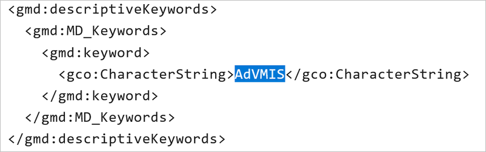

------------------------
Merkmal: AdV kompatibel
------------------------

AdV - Bedeutung
^^^^^^^^^^^^^^^

AdV: Arbeitsgemeinschaft der Vermessungsverwaltungen

.. hint:: Informationen zum `Metainformationssystem (MIS) <https://www.adv-online.de/AdV-Produkte/Metadateninformationssystem/>`_ der Arbeitsgemeinschaft der Vermessungsverwaltungen (AdV).

-----------------------------------------------------------------------------------------------------------------------

Erfassung
^^^^^^^^^

Merkmal: AdV kompatibel
"""""""""""""""""""""""

Mit der Aktivierung der Option "AdV kompatibel", wird die Kompatibilität der Metadaten mit dem Metadatenprofil der Arbeitsgemeinschaft der Vermessungsverwaltungen (AdV) sichergestellt. 

Die Metadaten werden über die CSW-Schnittstelle an das `Metainformationssystem (MIS) <https://advmis.geodatenzentrum.de/>`_ der AdV abgegeben.

Abb.: Merkmal AdV kompatibel

Durch die Aktivierung der Option "AdV kompatibel" wird das Schlüsselwort "AdVMIS" im ISO-XML gesetzt.

Abb.: ISO-XML - Angabe des Schlüsselwortes "AdVMIS"

Im Folgenden werden die Felder beschrieben, die nach Aktivierung der Option "AdV-kompatibel" in der Erfassungsmaske zusätzlich ausgefüllt werden müssen.

Folgende Eigenschaften ändern sich bei der Aktivierung der Option "AdV kompatibel":

 - Abschnitt Verschlagwortung: Aktivierung der Tabelle "AdV-Produktgruppe"

-----------------------------------------------------------------------------------------------------------------------

Abschnitt Verschlagwortung
""""""""""""""""""""""""""

.. figure:: ../../../../img/ige/erfassung/ige_metadaten/datensatztypen/merkmale_beschreibung/adv-kompatibel/verschlagwortung_adv-produktgruppe.png
   :alt: AdV-Produktgruppe
   :align: left
   :scale: 100
   :figwidth: 100%

Abb.: Tabelle "AdV-Produktgruppe" - (Pflichtangaben)

`Auswahlliste - AdV-Produktgruppe <https://metaver-bedienungsanleitung.readthedocs.io/de/hmdk/ingrid-editor/auswahllisten/auswahlliste_verschlagwortung_adv_produktgruppe.html>`_
