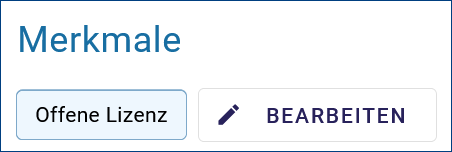
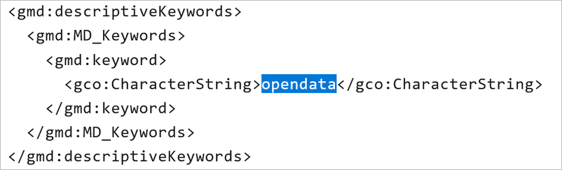

------------------
Merkmal: Open Data
------------------

Open Data - Erläuterungen
^^^^^^^^^^^^^^^^^^^^^^^^^^

Open Data bezeichnet Daten, die von jedermann für jeden Zweck ohne technische und rechtliche Einschränkungen genutzt, verbreitet und weiterverarbeitet werden können. Wichtig ist dabei, dass die Quelle bzw. der Urheber der Daten bei der Weiterverwendung stets genannt wird. Diese Praxis ermöglicht den freien Zugang zu digitalen Daten und deren Weiterverwendung ohne technische, rechtliche oder finanzielle Bedingungen. Beispiele für offene Daten sind Unterrichtsmaterialien, Geodaten, Statistiken, Verkehrsinformationen, wissenschaftliche Publikationen, medizinische Forschungsergebnisse oder Radio- und Fernsehsendungen. Wichtig ist jedoch, dass offene Daten keine personenbezogenen Daten oder Daten, die dem Datenschutz unterliegen, enthalten dürfen.

**Offene Verwaltungsdaten**

Offene Verwaltungsdaten sind nicht personenbezogene Daten, die von öffentlichen Stellen gesammelt, erstellt oder bezahlt wurden und der Allgemeinheit kostenlos zur Verfügung gestellt werden. Diese Daten stellen eine Basisinfrastruktur für die Digitalisierung dar.

**Offene Verwaltungsdaten sollen maschinenlesbar, frei verfügbar, vollständig, aktuell und dauerhaft zugänglich, sie sollen gut strukturiert und für die Allgemeinheit nützlich sein.**

| **Maschinenlesbarkeit:** Die Daten sollten in einem standardisierten Format vorliegen, das von Computern verarbeitet werden kann. Beispiele sind CSV, JSON oder XML.
| **Freie Verfügbarkeit:** Die Daten sollten ohne Einschränkungen kostenlos zugänglich sein. Es dürfen keine technischen oder rechtlichen Hürden bestehen.
| **Vollständigkeit:** Die bereitgestellten Daten sollten so umfassend wie möglich sein und alle relevanten Informationen enthalten.
| **Aktualität:** Die Daten sollten regelmäßig aktualisiert werden, um ihre Relevanz zu gewährleisten.
| **Dauerhafte Zugänglichkeit:** Die Verwaltungsdaten sollten über einen längeren Zeitraum hinweg verfügbar sein, um ihre Nutzung zu ermöglichen.

.. hint:: `GovData - Informationen <https://www.govdata.de/web/guest/open-government>`_ und `DCAT-AP.de <https://www.dcat-ap.de>`_ und `Open-Data-Leitfaden Schleswig-Holstein <https://opendata.schleswig-holstein.de/leitfaden/>`_

-----------------------------------------------------------------------------------------------------------------------

Erfassung
^^^^^^^^^

Merkmal: Open Data
""""""""""""""""""

Wenn das Merkmal "Offene Lizenz" ausgewählt und der Metadatenkatalog über die Schnittstelle DCAT-AP.de an `GovData <https://www.govdata.de/>`_ angebunden ist, werden die mit dem Schlüsselwort "opendata" gekennzeichneten Metadaten an dieses Portal übergeben. In einem weiteren Schritt werden diese Daten von `data.europa.eu <https://data.europa.eu/de/trening/what-open-data>`_, einem Portal der Europäischen Kommission, geharvested (geerntet).

Abb.: Merkmal Open Data / Offene Lizenz

Durch die Aktivierung des Merkmals "Offene Lizenz" wird das Schlüsselwort "opendata" im ISO-XML gesetzt.

Abb.: ISO-XML - Angabe des Schlüsselwortes "opendata"

Im Folgenden werden die Felder beschrieben, die nach Aktivierung der Option "Open Data" in der Erfassungsmaske zusätzlich ausgefüllt werden müssen.

Folgende Eigenschaften ändern sich bei der Aktivierung der Option "Open Data":

 - Im Abschnitt "Verschlagwortung" muss in der Tabelle "Kategorien" mindestens ein Wert ausgewählt werden.
 - Im Abschnitt „Verfügbarkeit“ muss in der Tabelle "Nutzungsbedingungen" eine Lizenz ausgewählt werden.
 - Im Abschnitt „Verweise“ muss ein Verweis vom Typ "Datendownload" eingegeben werden.

.. figure:: ../../../../img/ige/erfassung/ige_metadaten/datensatztypen/merkmal_beschreibung/open-data/open-data_hinweis.png
   :align: left
   :scale: 80
   :figwidth: 100%

Abb.: Hinweis

-----------------------------------------------------------------------------------------------------------------------

Abschnitt Verschlagwortung
""""""""""""""""""""""""""

(Open Data) Kategorien
'''''''''''''''''''''''

Die Tabelle "Kategorien" enthält eine Auswahlliste zur näheren Bestimmung des OpenData-Objekts.

`Auswahlliste der Open Data Kategorien <https://metaver-bedienungsanleitung.readthedocs.io/de/latest/ingrid-editor/auswahllisten/auswahlliste_allgemeines_opendata-kategorien.html>`_

Abb.: Auswahlfeld - Open Data Kategorien

-----------------------------------------------------------------------------------------------------------------------

Abschnitt Verfügbarkeit
"""""""""""""""""""""""

In den Nutzungsbedingungen muss eine Lizenz ausgewählt werden, die die Nutzung der Daten unter bestimmten Bedingungen erlaubt. 

Abb.: Nutzungsbedingungen - Lizenz

Im Feld Quelle kann eine Datenquelle angegeben werden, z.B: *Quelle © Daten: Landesamt für ...* oder *Quellenvermerk: © GeoBasis-DE / LVermGeo LSA*. Diese Angabe ist z.B. in Basiskarten relevant, da diese Information in einem Kartenviewer in der Basiskarte angezeigt werden muss.

.. figure:: ../../../../img/ige/erfassung/ige_metadaten/datensatztypen/option/merkmal_beschreibung/open-data_nutzungsbedingungen_quelle.png
   :align: left
   :scale: 80
   :figwidth: 100%

Abb.: Nutzungsbedingungen - Quellenangabe

.. figure:: ../../../../img/kartenclient/metaver-kartenviewer_angabe-copyright.png
   :align: left
   :scale: 70
   :figwidth: 100%

Abb.: Beispiel: Angabe Copyright in einer Basiskarte

Im Bereich Verweise kann auf Nutzungsbedingungen verwiesen werden, die die Nutzung der Daten regeln. Die datenhaltende Stelle ist dann dafür verantwortlich, dass die verlinkte Seite jederzeit zugänglich ist.

-----------------------------------------------------------------------------------------------------------------------

Abschnitt Verweise
""""""""""""""""""

Wenn ein Metadatensatz als Open Data gekennzeichnet ist, muss der Metadatensatz einen Download-Link zu den beschriebenen Daten enthalten. Dies geschieht an dieser Stelle. Der Datenhalter ist dafür verantwortlich, dass die verlinkten Daten jederzeit verfügbar sind.

Abb.: Datendownload anlegen

Abb.: angelegter Datendownload

