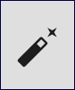
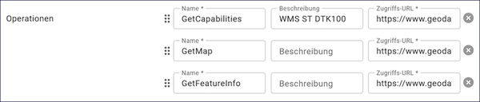

Operationen
^^^^^^^^^^^

Abb.: Feld - Operationen

In der Regel werden die Metadaten für Geodatendienste mit dem `GetCapabilities Assistent <https://metaver-bedienungsanleitung.readthedocs.io/de/hmdk/ingrid-editor/erfassung/datensatztypen/erfassungsassistent/getcapabilitie-assistent.html>`_ aus dem Dienst übernommen, da beim Aufruf des Dienstes die Metadaten angezeigt werden, die in den Editor übernommen werden können. Wenn der Dienst korrekt aufgesetzt wurde und dieser einen Identifikator für die Datenquelle enthält, können die zugehörigen Geodatensätze gleich automatisch mit angelegt werden.
(Beispiel: https://www.....de/wss/service/.._..._..._WMS_OpenData/.....?REQUEST=GetCapabilities&SERVICE=WMS)

Wenn der Metadatensatz ohne den Assistenten erstellt wurde, müssen die Felder für die Operationen ausgefüllt werden. Dabei ist darauf zu achten, dass die URL korrekt angegeben wird. Das bedeutet, dass nach dem Fragezeichen der Requestparameter für den Dienst angegeben werden muss.

Nach Eingabe der URL kann der Dienst über den Button "AKTUALISIEREN" am Anfang des Eingabeformulars aufgerufen werden. Wenn die URL korrekt eingegeben wurde, werden die Metadaten des Dienstes angezeigt und können in den Editor übernommen werden.

Abb.: Funktionen

.. hint:: Wenn die Operationen aus dem Service in den Metadatensatz übernommen werden, sind die Funktionen (GetMap, GetFeatureInfo für den WMS und DescribeFeatureType, GetFeature für den WFS) nur im Editor verfügbar. Im Portal wird nur die URL GetCapabilitie angezeigt.