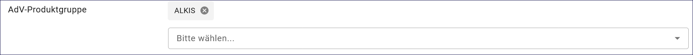
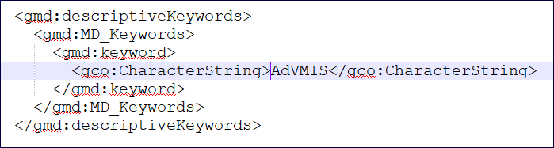

Option - AdV kompatibel
-----------------------

AdV - Bedeutung
^^^^^^^^^^^^^^^

AdV: Arbeitsgemeinschaft der Vermessungsverwaltungen

Grundlage
^^^^^^^^^

Mit der Aktivierung dieser Option, wird die Kompatibilität der Metadaten mit dem Metadatenprofil der Arbeitsgemeinschaft der Vermessungsverwaltungen (AdV) sichergestellt.

.. hint:: Nachfolgend werden die Felder beschrieben, die nach der Aktivierung dieser Option zusätzlich in der Erfassungsmaske angezeigt werden.

Erfassung
^^^^^^^^^

Checkbox AdV kompatibel
'''''''''''''''''''''''

Abb.: Checkbox AdV kompatibel

Wird die Checkbox "AdV kompatibel" aktiviert,  werden die Anforderungen des AdV-Metadatenprofils umgesetzt.

Folgende Eigenschaften ändern sich bei der Aktivierung der Checkbox AdV kompatibel:
 - Abschnitt Verschlagwortung: Aktivierung der Tabelle "AdV-Produktgruppe"
 - Aktivierung des Schlagwortes "AdVMIS" in der ISO-XML

-----------------------------------------------------------------------------------------------------------------------

Abschnitt Verschlagwortung
''''''''''''''''''''''''''

Abb.: Tabelle "AdV-Produktgruppe" - (Pflichtangaben)

`Auswahlliste - AdV-Produktgruppe <https://metaver-bedienungsanleitung.readthedocs.io/de/latest/metaver_ige/ige_auswahllisten/auswahlliste_verschlagwortung_adv_produktgruppe.html>`_

Abb.: ISO-XML - Angabe des Schlüsselwortes "AdVMIS"

