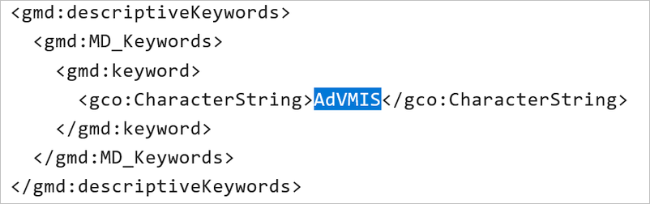

Option: AdV kompatibel
----------------------

AdV - Bedeutung
^^^^^^^^^^^^^^^

AdV: Arbeitsgemeinschaft der Vermessungsverwaltungen

.. note:: Mit der Aktivierung der Option AdV kompatibel, wird die Kompatibilität der Metadaten mit dem Metadatenprofil der Arbeitsgemeinschaft der Vermessungsverwaltungen (AdV) sichergestellt. Die Metadaten werden über die CSW-Schnittstelle an das `AdV Metainformationssystem (AdV-MIS) <https://advmis.geodatenzentrum.de/>`_ abgegeben. 

-----------------------------------------------------------------------------------------------------------------------

Erfassung
^^^^^^^^^

Option: AdV kompatibel
"""""""""""""""""""""""

Wenn die Option "INSPIRE-relevant" aktiviert ist, werden die Metadaten an den `Geodatenkatalog Deutschland <https://gdk.gdi-de.org/>`_, an das `Geoportal der Geodateninfrastruktur-Deutschland (GDI-DE) <https://www.geoportal.de/>`_ und an das `INSPIRE Geoportal <https://inspire-geoportal.ec.europa.eu/>`_ der EU geliefert und veröffentlicht. Die Daten und Metadaten unterliegen damit der INSPIRE-Richtlinie.

Der Geodatensatz wird über die Registry der GDI-DE an die EU gemeldet und im Rahmen eines `Monitoringprozesses <https://registry.gdi-de.org/register/moni/>`_ überwacht.

Abb.: Option: AdV kompatibel

Durch die Aktivierung der Option "AdV kompatibel" wird das Schlüsselwort "AdVMIS" im ISO-XML gesetzt.

Abb.: ISO-XML - Angabe des Schlüsselwortes "advmis"

Im Folgenden werden die Felder beschrieben, die nach Aktivierung der Option "AdV-kompatibel" in der Erfassungsmaske zusätzlich ausgefüllt werden müssen.

Folgende Eigenschaften ändern sich bei der Aktivierung der Option "AdV kompatibel":

 - Abschnitt Verschlagwortung: Aktivierung der Tabelle "AdV-Produktgruppe"
 - Aktivierung des Schlagwortes "AdVMIS" in der ISO-XML

-----------------------------------------------------------------------------------------------------------------------

Abschnitt Verschlagwortung
""""""""""""""""""""""""""

Abb.: Tabelle "AdV-Produktgruppe" - (Pflichtangaben)

`Auswahlliste - AdV-Produktgruppe <https://metaver-bedienungsanleitung.readthedocs.io/de/latest/metaver_ige/ige_auswahllisten/auswahlliste_verschlagwortung_adv_produktgruppe.html>`_
