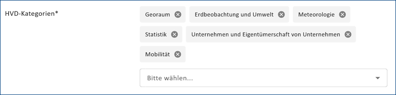

--------------------------------------
Option - Hochwertige Datensätze (HVD)
--------------------------------------

Grundlage
^^^^^^^^^

Der öffentliche Sektor verfügt über eine Vielzahl von Informationen - z. B. Statistiken, Satellitenbilder, Umwelt- und Mobilitätsdaten -, die für das Gemeinwohl und/oder die Wirtschaft von Nutzen sein können. Um das gesamtgesellschaftliche und wirtschaftliche Potenzial besonders relevanter Daten auszuschöpfen und gleichzeitig deren Nutzung zu regeln, hat die Europäische Kommission 2013 die EU-Richtlinie über offene Daten und die Weiterverwendung von Informationen des öffentlichen Sektors, kurz PSI-Richtlinie (nach dem englischen Titel »Re-use of Public Sector Information«), verabschiedet. Ziel ist es, den Zugang zu Daten des öffentlichen Sektors zu vereinfachen.

(Quelle: Fraunhofer FOKUS / Offene Daten in der EU: Studie zu "High Value Datasets")

Im Jahr 2019 wurde die PSI-Richtlinie überarbeitet: Die überarbeitete Richtlinie sieht unter anderem die Definition von hochwertigen Datensätzen, sogenannten High Value Datasets (HVD), vor.

High-Value-Datasets (HVD) sind besonders hochwertige Datensätze, die von öffentlichen Stellen kostenfrei und unter einer offenen Lizenz zur Verfügung gestellt werden sollen. Die Europäische Kommission hat eine Liste solcher Datensätze veröffentlicht, die seit dem 9. Juni 2024 gilt. Diese Datensätze sind in der Metadatenbeschreibung als solche zu kennzeichnen und die entsprechende Kategorie ist anzugeben. Die Metadaten der HVDs müssen die für die jeweilige Kategorie spezifizierten Eigenschaften enthalten

**High-Value-Datasets (HVD) sollen von Behörden oder öffentlichen Unternehmen als Open Data kostenlos, maschinenlesbar und über Schnittstellen zur Verfügung gestellt werden. Gegebenenfalls können sie auch als Massendownload zur Verfügung gestellt werden. Beispiele für maschinen lesbare Datenformate sind CSV, JSON oder XML.**

-----------------------------------------------------------------------------------------------------------------------

Erfassung
^^^^^^^^^

Option: High-Value-Dataset (HVD) im Metadatentyp Geodatensatz
"""""""""""""""""""""""""""""""""""""""""""""""""""""""""""""

.. figure:: ../../../../img/ige/erfassung/ige_metadaten/datensatztypen/option/checkboxen/metaver_checkbox_typ_opendata+hvd.png
   :align: left
   :scale: 90
   :figwidth: 100%

Abb.: Option: High-Value-Dataset (HVD) + Option Open Data

.. hint:: Wenn die Option „High-Value-Dataset (HVD)” ausgewählt wird, wird automatisch auch die Option `„Open Data” <https://metaver-bedienungsanleitung.readthedocs.io/de/latest/ingrid-editor/erfassung/datensatztypen/option/opendata.html>`_ ausgewählt. Die darunter beschriebenen Felder müssen entsprechend ausgefüllt werden.

Wenn die Option "Open Data" ausgewählt und der Metadatenkatalog über die Schnittstelle DCAT-AP.de an `GovData <https://www.govdata.de/>`_ angebunden ist, werden die als "Open Data" gekennzeichneten Metadaten an dieses Portal übergeben. In einem weiteren Schritt werden diese Daten von `data.europa.eu <https://data.europa.eu/de/trening/what-open-data>`_, einem Portal der Europäischen Kommission, geharvested (geerntet). Der Metadatenkatalog RP ist nicht an DCAT-AP.de angebunden, da die Daten über geoportal.rlp.de angebunden sind.

Wird die Option HVD gewählt, so:

  - werden alle Zugriffsbeschränkungen entfernt
  - wird die Angabe einer Opendata-Kategorie unter "Verschlagwortung" verpflichtend
  - wird dem Datensatz beim Export in ISO19139 Format automatisch das Schlagwort "opendata" hinzugefügt

Abb.: HVD-Kategorien in der Verschlagwortung des Metadatentyps Geodatensatz
