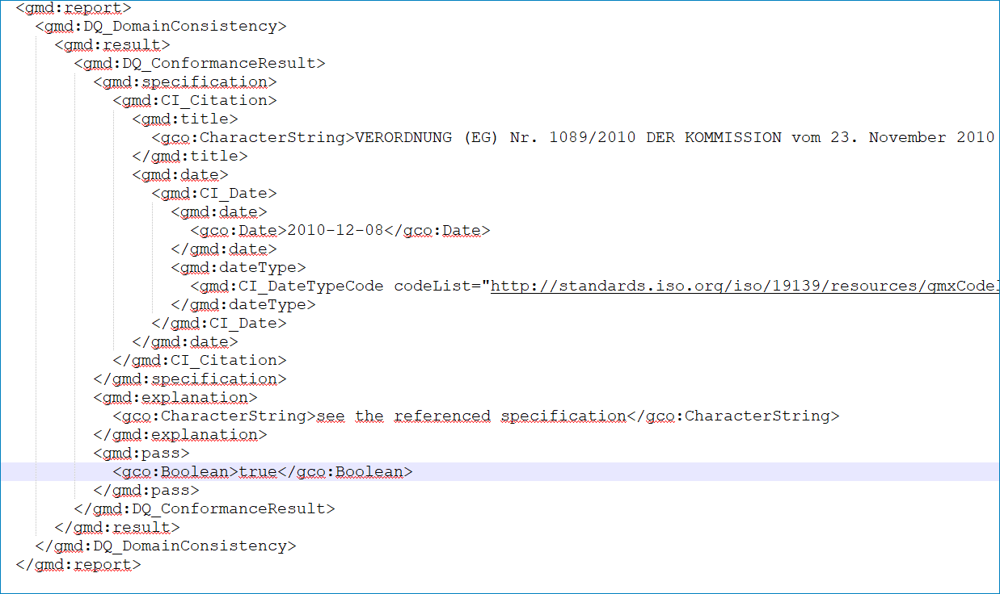
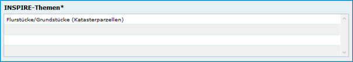
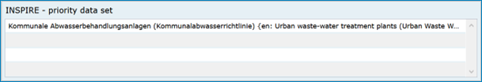
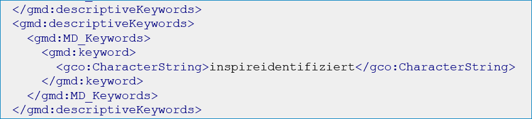
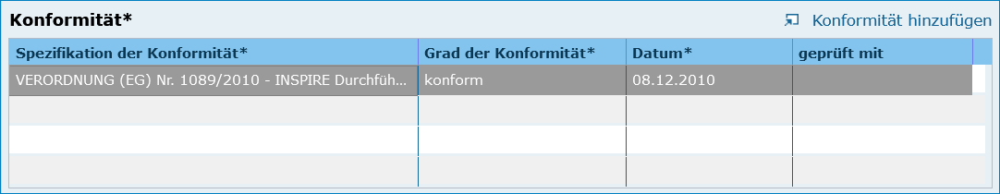
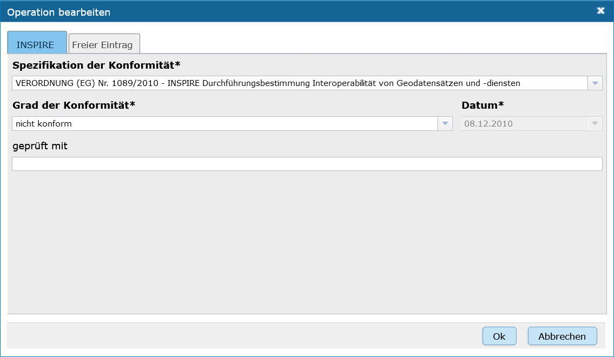
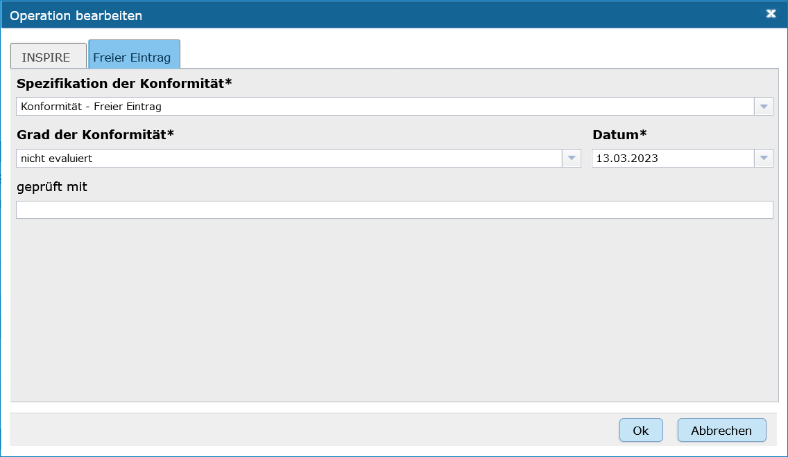

Option - INSPIRE relevant
-------------------------

Grundlage
^^^^^^^^^

Die Infrastructure for Spatial Information in the European Community (INSPIRE, deutsch Geodateninfrastruktur in der Europäischen Gemeinschaft) ist eine Initiative der europäischen Kommission mit dem Ziel, eine europäische Geodateninfrastruktur für die Zwecke einer gemeinschaftlichen Umweltpolitik zu schaffen. Die Richtlinie 2007/2/EG vom 14. März 2007 des Europäischen Parlaments und des Rates zur Schaffung einer Geodateninfrastruktur in der Europäischen Gemeinschaft (INSPIRE), in Kraft seit dem 15. Mai 2007, verpflichtet die Mitgliedstaaten, Geobasisdaten sowie Geofachdaten, die in einem der 34 Anhangthemen aufgeführt sind, stufenweise zunächst konform und dann interoperabel über Netzdienste bereitzustellen. Die Verpflichtung, Daten verfügbar zu machen, gilt nur für bereits vorhandene und in digitaler Form vorliegende Geodaten; die Richtlinie fordert nicht die Neuerfassung von analog vorliegenden Geodaten. 

(Quelle: `Wikipedia <https://de.wikipedia.org/wiki/Infrastructure_for_Spatial_Information_in_the_European_Community>`_)

.. hint:: Nachfolgend werden die Felder beschrieben, die in der Erfassungsmaske speziell für diese Option angezeigt werden.

Erfassung
^^^^^^^^^

Alle im Rahmen von INSPIRE zu erfassenden Geodaten müssen als Objektklasse „Geodatensatz“ angelegt werden.

Beispiele:

 - INSPIRE ST Geografische Bezeichnungen ATKIS Basis-DLM
 - INSPIRE ST Gewässernetz - Gewässerkundlicher Landesdienst
 - INSPIRE ST Umweltüberwachung - Gewässerkundlicher Landesdienst

Checkbox INSPIRE-relevant
'''''''''''''''''''''''''

Abb.: Checkbox INSPIRE-relevant

.. image:: ../../../../img/ige/erfassung/ige_metadaten/ige_datensatztypen/option/inspire-relevant/checkbox-inspire-relevant.png

Abb.: Checkbox INSPIRE relevant

Wenn diese Checkbox aktiviert ist, werden die Metadaten an das `INSPIRE Geoportal <https://inspire-geoportal.ec.europa.eu/>`_ der EU weitergeleitet und veröffentlicht. Die Daten und die Metadaten unterliegen in dem Fall der INSPIRE-Richtlinie.

Der Geodatensatz wird über die Registry der GDI-DE an die EU gemeldet und in einem `Monitoringprozess <https://registry.gdi-de.org/register/moni.st/>`_ überwacht.

Folgende Eigenschaften ändern sich bei der Aktivierung der Checkbox INSPIRE-relevant:
 - Checkbox INSPIRE-relevant: Aktivierung der Optionen "konform" / "nicht konform"
 - Abschnitt Verschlagwortung: Aktivierung der Tabelle "INSPIRE-Themen" - (Pflichtangaben)
 - Abschnitt Verschlagwortung: Auswahlliste - INSPIRE - Räumlicher Anwendungsbereich - (Pflichtangabe)
 - Abschnitt Verschlagwortung: Aktivierung der Tabelle - INSPIRE - priority data set - (optionale Angabe)
 - Abschnitt Zusatzinformation: Es erscheint die Tabelle - "Konformität" (Pflichtangaben)
 - Aktivierung des Schlagwortes "inspireidentifiziert" während der ISO-XML Generierung

Option konform
''''''''''''''

Abb.: Optionen INSPIRE konformität

Der Geodatensatz wird an INSPIRE gemeldet und liegt im INSPIRE-Datenschema vor. Der Grad der Konformität (im Abschnitt: "Zusatzinformation", Tabelle: Konformität) zur Spezifikation (VO 1089/2010) wird auf "konform" gesetzt.

In der ISO-XML erscheint "true".

**Hinweis:** *Diese Option erscheint nur, wenn vorher die Checkbox "INSPIRE-relevant" aktiviert wurde.*

Abb.: Darstellung in der ISO-XML - true

Option nicht konform
''''''''''''''''''''

Abb: Option INSPIRE konform
  
  
Geodatensatz wird an INSPIRE gemeldet, liegt aber nicht im INSPIRE-DatenSchema vor. Der Grad der Konformität zur Spezifikation (VO 1089/2010) kann durch den Anwender (im Abschnitt: "Zusatzinformation", Tabelle: Konformität) nur auf "false" oder "nicht evaluiert" gesetzt werden.

.. hint:: Diese Option erscheint nur, wenn vorher die Checkbox "INSPIRE-relevant" aktiviert wurde.

.. image:: ../../../../img_ige/metaver_ige/ige_erfassung/ige_objekte/ige_objektklassen/objektklasse_geodatensatz/option-inspire-relevant/iso-xml-konformitaet-false.png

Abb.: Darstellung in der ISO-XML - false

Abschnitt Verschlagwortung
''''''''''''''''''''''''''

Abb.: Tabelle "INSPIRE-Themen" - (Pflichtangaben)

`Auswahlliste - INSPIRE-Themen <https://metaver-bedienungsanleitung.readthedocs.io/de/latest/metaver_ige/ige_auswahllisten/auswahlliste_verschlagwortung_inspire_themen.html>`_

 
Abb.: Auswahlliste - INSPIRE - Räumlicher Anwendungsbereich - (Pflichtangabe)

`Auswahlliste - INSPIRE - Räumlicher Anwendungsbereich <https://metaver-bedienungsanleitung.readthedocs.io/de/latest/metaver_ige/ige_auswahllisten/auswahlliste_verschlagwortung_inspire_raeumlicher-anwendungsbereich.html>`_

 
Abb.: Tabelle - INSPIRE - priority data set - (optionale Angabe)

`Auswahlliste - INSPIRE - priority data set <https://metaver-bedienungsanleitung.readthedocs.io/de/latest/metaver_ige/ige_auswahllisten/auswahlliste_verschlagwortung_inspire_priority-data-set.html>`_

Abb.: ISO-XML - Angabe des Schlüsselwortes "inspireidentifiziert"

Abschnitt Zusatzinformation
'''''''''''''''''''''''''''

.. image:: ../../../../img_ige/metaver_ige/ige_erfassung/ige_objekte/ige_abschnitt-03_verschlagwortung/ige-abschnitt_verschlagwortung.png

Konformität
'''''''''''

.. image:: ../../../img_ige/metaver_ige/ige_erfassung/ige_objekte/ige_objektklassen/objektklasse_geodatensatz/zusatzinformation_konformitaet.png
 
Abb.: Feld Konformität

Hier muss angegeben werden, zu welcher Durchführungsbestimmung der INSPIRE-Richtlinie bzw. zu welcher anderweitigen Spezifikation die beschriebenen Daten konform sind. (INSPIRE-Pflichtfeld)

Dieses Feld wird bei der Auswahl der "INSPIRE-Themen" oder der "Art des Dienstes" automatisch befüllt. Es muss dann nur der Grad der Konformität manuell eingetragen werden.

.. important:: Bitte entsprechend den Empfehlungen des AdV-Metadatenprofils nur die Werte "konform" und "nicht konform" im Feld "Grad der Konformität" verwenden. Für alle nicht INSPIRE-Objekte, sollte hier die „INSPIRE-Richtlinie“ mit dem Wert „nicht evaluiert“ ausgewählt werden. 

.. image:: ../../../../img_ige/metaver_ige/ige_erfassung/ige_objekte/ige_abschnitt-08_zusatzinformation/ige-abschnitt_zusatzinformation.png

Abb.: Tabelle "Konformität" - Grad der Konformität: konform

Abb.: Tabelle "Konformität" - Grad der Konformität: nicht konform

Abb.: Tabelle "Konformität" - Konformität hinzufügen oder Operation bearbeiten / INSPIRE

Abb.: Tabelle "Konformität" - Konformität hinzufügen oder Operation bearbeiten / freier Eintrag