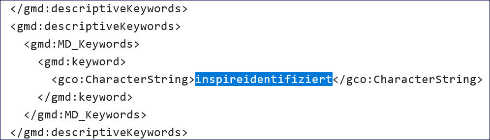
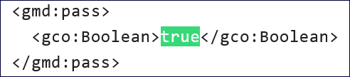
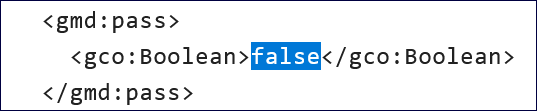
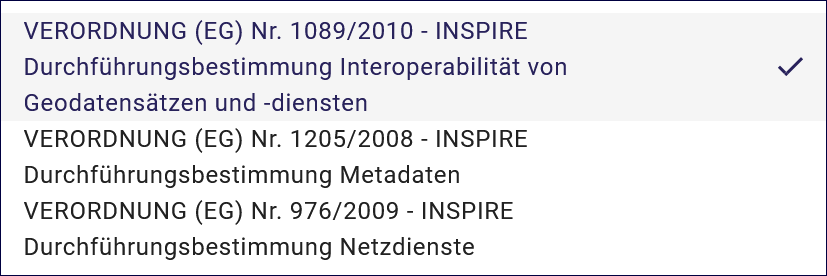

Option: INSPIRE relevant
-------------------------

INSPIRE - Bedeutung
^^^^^^^^^^^^^^^^^^^

| INSPIRE: Infrastructure for Spatial Information in the European Community
| Übersetzt: Geodateninfrastruktur (GDI) in der Europäischen Gemeinschaft

Grundlage
^^^^^^^^^

INSPIRE ist eine Initiative der europäischen Kommission mit dem Ziel, eine europäische Geodateninfrastruktur für die Zwecke einer gemeinschaftlichen Umweltpolitik zu schaffen. Die Richtlinie 2007/2/EG vom 14. März 2007 des Europäischen Parlaments und des Rates zur Schaffung einer Geodateninfrastruktur in der Europäischen Gemeinschaft (INSPIRE), in Kraft seit dem 15. Mai 2007, verpflichtet die Mitgliedstaaten, Geobasisdaten sowie Geofachdaten, die in einem der 34 Anhangthemen aufgeführt sind, stufenweise zunächst konform und dann interoperabel über Netzdienste bereitzustellen. Die Verpflichtung, Daten verfügbar zu machen, gilt nur für bereits vorhandene und in digitaler Form vorliegende Geodaten; die Richtlinie fordert nicht die Neuerfassung von analog vorliegenden Geodaten. 

(Quelle: `Wikipedia <https://de.wikipedia.org/wiki/Infrastructure_for_Spatial_Information_in_the_European_Community>`_)

.. hint:: Nachfolgend werden die Felder beschrieben, die nach der Aktivierung dieser Option zusätzlich in der Erfassungsmaske angezeigt werden.

Erfassung
^^^^^^^^^

Alle im Rahmen von INSPIRE zu erfassenden Geodaten müssen als Datensatztyp „Geodatensatz“ angelegt werden.

Beispiele:
 - INSPIRE ST Geografische Bezeichnungen ATKIS Basis-DLM
 - INSPIRE ST Gewässernetz - Gewässerkundlicher Landesdienst
 - INSPIRE ST Umweltüberwachung - Gewässerkundlicher Landesdienst

Checkbox INSPIRE-relevant
'''''''''''''''''''''''''

Abb.: Checkbox INSPIRE-relevant

Abb.: Checkbox INSPIRE relevant

Mit der Aktivierung wird in der ISO-XML das Schlüsselwort "inspireidentifiziert" gesetzt.

Abb.: ISO-XML - Angabe des Schlüsselwortes "inspireidentifiziert"

Wenn diese Checkbox aktiviert ist, werden die Metadaten an den `Geodatenkatalog Deutschland <https://gdk.gdi-de.org/>`_, an das `Geoportal der Geodateninfrastruktur-Deutschland (GDI-DE) <https://www.geoportal.de/>`_ und an das `INSPIRE Geoportal <https://inspire-geoportal.ec.europa.eu/>`_ der EU abgegeben und veröffentlicht. Die Daten und die Metadaten unterliegen in dem Fall der INSPIRE-Richtlinie.

Der Geodatensatz wird über die Registry der GDI-DE an die EU gemeldet und in einem `Monitoringprozess <https://registry.gdi-de.org/register/moni/>`_ überwacht.

 - Checkbox INSPIRE-relevant: Aktivierung der Optionen "konform ja / nein
 - Abschnitt Verschlagwortung: Aktivierung der Tabelle "INSPIRE-Themen"
 - Abschnitt Verschlagwortung: Aktivierung der Tabelle "INSPIRE - priority data set"
 - Abschnitt Verschlagwortung: Auswahlliste "INSPIRE - Räumlicher Anwendungsbereich"
 - Abschnitt Zusatzinformation: Aktivierung der Tabelle "Konformität"
 - Aktivierung des Schlagwortes "inspireidentifiziert" in der ISO-XML

Option konform
''''''''''''''

.. image:: ../../../../img/ige/erfassung/ige_metadaten/ige_datensatztypen/option/inspire-relevant/checkbox-inspire-relevant_konform.png
   :width: 400

Abb.: INSPIRE-Optionen konform

Abb.: Hinweis

Der Geodatensatz wird an INSPIRE gemeldet und liegt im INSPIRE-Datenschema vor. Der Grad der Konformität (im Abschnitt: "Zusatzinformation", Tabelle: Konformität) zur Spezifikation (VO 1089/2010) wird auf "konform" gesetzt.

In der ISO-XML erscheint "true".

Abb.: Darstellung in der ISO-XML

Option nicht konform
''''''''''''''''''''

Abb: INSPIRE-Option nicht konform

Abb.: Hinweis
  
  
Geodatensatz wird an INSPIRE gemeldet, liegt aber nicht im INSPIRE-DatenSchema vor. Der Grad der Konformität zur Spezifikation (VO 1089/2010) kann durch den Anwender (im Abschnitt: "Zusatzinformation", Tabelle: Konformität) nur auf "false" oder "nicht evaluiert" gesetzt werden.

In der ISO-XML erscheint "false".

Abb.: Darstellung in der ISO-XML

-----------------------------------------------------------------------------------------------------------------------

Abschnitt Verschlagwortung
''''''''''''''''''''''''''

Aktivierung der Tabelle "INSPIRE-Themen" mit Pflichtangaben.

`Auswahlliste - INSPIRE-Themen <https://metaver-bedienungsanleitung.readthedocs.io/de/latest/metaver_ige/ige_auswahllisten/auswahlliste_verschlagwortung_inspire_themen.html>`_

Abb.: Tabelle "INSPIRE-Themen", Beispiel

Aktivierung der Tabelle "INSPIRE - priority data set" mit optionalen Angaben.

`Auswahlliste - INSPIRE - priority data set <https://metaver-bedienungsanleitung.readthedocs.io/de/latest/metaver_ige/ige_auswahllisten/auswahlliste_verschlagwortung_inspire_priority-data-set.html>`_

 
Abb.: Tabelle "INSPIRE - priority data set", Beispiel

Aktivierung der Auswahlliste "INSPIRE - Räumlicher Anwendungsbereich" mit Pflichtangaben.

`Auswahlliste - INSPIRE - Räumlicher Anwendungsbereich <https://metaver-bedienungsanleitung.readthedocs.io/de/latest/metaver_ige/ige_auswahllisten/auswahlliste_verschlagwortung_inspire_raeumlicher-anwendungsbereich.html>`_

 
Abb.: Auswahlliste - INSPIRE - Räumlicher Anwendungsbereich, Beispiel

----------------------------------------------------------------------------------------------------------------------

Abschnitt Zusatzinformation
'''''''''''''''''''''''''''

 
Abb.: Tabelle Konformität

Hier muss angegeben werden, zu welcher Durchführungsbestimmung der INSPIRE-Richtlinie bzw. zu welcher anderweitigen Spezifikation die beschriebenen Daten konform sind. (INSPIRE-Pflichtfeld)

Dieses Feld wird bei der Auswahl der "INSPIRE-Themen" oder der "Art des Dienstes" automatisch befüllt. Es muss dann nur der Grad der Konformität manuell eingetragen werden.

Abb.: Feld Konformität - Aktion / Bearbeiten

 
Abb.: Feld Konformität - Auswahlmöglichkeiten

Abb.: Tabelle "Konformität" - Grad der Konformität - Auswahlmöglichkeit

Feld Datum: Angabe des Datums, wann der Datensatz geprüft wurde.

Feld "geprüft mit": Angabe des Validators

z.B.: https://testsuite.gdi-de.org/#/ oder https://testsuite.gdi-de.org/#/quicktest