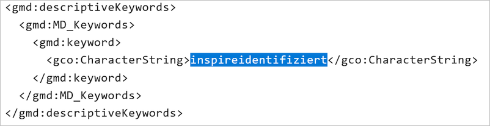

-------------------------
Option: INSPIRE relevant
-------------------------

INSPIRE - Bedeutung
^^^^^^^^^^^^^^^^^^^

| INSPIRE: Infrastructure for Spatial Information in the European Community
| Übersetzt: Geodateninfrastruktur (GDI) in der Europäischen Gemeinschaft

.. note:: INSPIRE ist eine Initiative der Europäischen Kommission zur Schaffung einer europäischen Geodateninfrastruktur für die Zwecke der gemeinschaftlichen Umweltpolitik. Die am 15. Mai 2007 in Kraft getretene Richtlinie 2007/2/EG des Europäischen Parlaments und des Rates vom 14. März 2007 zur Schaffung einer Geodateninfrastruktur in der Europäischen Gemeinschaft (INSPIRE) verpflichtet die Mitgliedstaaten, Geobasisdaten und Geofachdaten, die in einem der 34 Themen des Anhangs aufgeführt sind, schrittweise zunächst konform und dann interoperabel über Geodatendienste bereitzustellen. Die Verpflichtung zur Datenbereitstellung gilt nur für bereits vorhandene Geodaten, die in digitaler Form vorliegen; eine Neuerfassung analog vorliegender Geodaten wird durch die Richtlinie nicht gefordert. (Quelle: `Wikipedia <https://de.wikipedia.org/wiki/Infrastructure_for_Spatial_Information_in_the_European_Community>`_)

.. hint:: Nachfolgend werden die Felder beschrieben, die nach der Aktivierung dieser Option zusätzlich in der Erfassungsmaske angezeigt werden.

-----------------------------------------------------------------------------------------------------------------------

Erfassung
^^^^^^^^^

Alle im Rahmen von INSPIRE zu erfassenden Geodaten müssen als Datensatztyp „Geodatensatz“ angelegt werden.

Beispiele:
 - INSPIRE ST Geografische Bezeichnungen ATKIS Basis-DLM
 - INSPIRE ST Gewässernetz - Gewässerkundlicher Landesdienst
 - INSPIRE ST Umweltüberwachung - Gewässerkundlicher Landesdienst

Checkbox INSPIRE-relevant
"""""""""""""""""""""""""

Abb.: Checkbox INSPIRE-relevant

.. figure:: ../../../../img/ige/erfassung/ige_metadaten/datensatztypen/option/inspire-relevant/checkbox-inspire-relevant.png
   :align: left
   :scale: 50
   :figwidth: 100%

Abb.: Checkbox INSPIRE relevant

Mit der Aktivierung wird das Schlüsselwort "inspireidentified" im ISO-XML gesetzt.

Abb.: ISO-XML - Angabe des Schlüsselwortes "inspireidentifiziert"

Wenn diese Checkbox aktiviert ist, werden die Metadaten an den `Geodatenkatalog Deutschland <https://gdk.gdi-de.org/>`_, an das `Geoportal der Geodateninfrastruktur-Deutschland (GDI-DE) <https://www.geoportal.de/>`_ und an das `INSPIRE Geoportal <https://inspire-geoportal.ec.europa.eu/>`_ der EU geliefert und veröffentlicht. Die Daten und Metadaten unterliegen damit der INSPIRE-Richtlinie.

Der Geodatensatz wird über die Registry der GDI-DE an die EU gemeldet und im Rahmen eines `Monitoringprozesses <https://registry.gdi-de.org/register/moni/>`_ überwacht.

 - Checkbox INSPIRE-relevant: Aktivierung der Optionen "konform ja / nein
 - Abschnitt Verschlagwortung: Aktivierung der Tabelle "INSPIRE-Themen"
 - Abschnitt Verschlagwortung: Aktivierung der Tabelle "INSPIRE - priority data set"
 - Abschnitt Verschlagwortung: Auswahlliste "INSPIRE - Räumlicher Anwendungsbereich"
 - Abschnitt Zusatzinformation: Aktivierung der Tabelle "Konformität"
 - Aktivierung des Schlagwortes "inspireidentifiziert" in der ISO-XML

Option konform
""""""""""""""

.. figure:: ../../../../img/ige/erfassung/ige_metadaten/datensatztypen/option/inspire-relevant/checkbox-inspire-relevant_konform.png
   :align: left
   :scale: 50
   :figwidth: 100%

Abb.: INSPIRE-Optionen konform

.. figure:: ../../../../img/ige/erfassung/ige_metadaten/datensatztypen/option/inspire-relevant/checkbox-inspire-relevant_konform-hinweis.png
   :align: left
   :scale: 50
   :figwidth: 100%

Abb.: Hinweis

Der Geodatensatz ist an INSPIRE gemeldet und liegt im INSPIRE-Datenschema vor. Der Konformitätsgrad (im Abschnitt: "Weitere Informationen", Tabelle: Konformität) mit der Spezifikation (VO 1089/2010) ist auf "konform" gesetzt.

In der ISO-XML erscheint "true".

.. figure:: ../../../../img/ige/erfassung/ige_metadaten/datensatztypen/option/inspire-relevant/iso-xml-inspireidentifiziert_true.png
   :align: left
   :scale: 50
   :figwidth: 100%

Abb.: Darstellung in der ISO-XML

Option nicht konform
""""""""""""""""""""

.. figure:: ../../../../img/ige/erfassung/ige_metadaten/datensatztypen/option/inspire-relevant/checkbox-inspire-relevant_nicht-konform.png
   :align: left
   :scale: 50
   :figwidth: 100%

Abb: INSPIRE-Option nicht konform

.. figure:: ../../../../img/ige/erfassung/ige_metadaten/datensatztypen/option/inspire-relevant/checkbox-inspire-relevant_konform-hinweis.png
   :align: left
   :scale: 50
   :figwidth: 100%

Abb.: Hinweis

Geodatensatz wird an INSPIRE gemeldet, liegt aber nicht im INSPIRE-DatenSchema vor. Der Grad der Konformität zur Spezifikation (VO 1089/2010) kann durch den Anwender (im Abschnitt: "Zusatzinformation", Tabelle: Konformität) nur auf "false" oder "nicht evaluiert" gesetzt werden.

In der ISO-XML erscheint "false".

.. figure:: ../../../../img/ige/erfassung/ige_metadaten/datensatztypen/option/inspire-relevant/iso-xml-inspireidentifiziert_false.png
   :align: left
   :scale: 50
   :figwidth: 100%

Abb.: Darstellung in der ISO-XML

-----------------------------------------------------------------------------------------------------------------------

Abschnitt Verschlagwortung
""""""""""""""""""""""""""

Bei der Beschreibung von INSPIRE-konformen Daten ist die Angabe einer ISO-Themenkategorie erforderlich. Um eine inhaltlich korrekte Zuordnung von INSPIRE-Themen zu ISO-Themenkategorien zu gewährleisten und dem Erfasser die Arbeit zu erleichtern, übernimmt die InGrid-Software diese Zuordnung. Bei der Auswahl eines INSPIRE-Themas wird die entsprechende ISO-Kategorie automatisch hinzugefügt. Der Benutzer wird durch einen Tooltip auf diese Automatik hingewiesen.

Beispiel: 
Wenn das INSPIRE-Thema "Energiequellen" ausgewählt wird, wird automatisch die entsprechende ISO-Themenkategorie "Wirtschaft" hinzugefügt.

Wenn versucht wird, eine ISO-Kategorie zu löschen, die mit einem INSPIRE-Thema verknüpft ist, wird dies verhindert und der Benutzer wird durch einen Tooltip darüber informiert. Die ISO-Kategorie kann nur gelöscht werden, wenn das INSPIRE-Thema gelöscht wird.

Umgekehrt gilt der Automatismus nicht: Beim Hinzufügen einer ISO-Kategorie wird kein INSPIRE-Thema gesetzt.

**Aktivierung der Tabelle "INSPIRE-Themen" mit Pflichtangaben.**

`Auswahlliste - INSPIRE-Themen <https://metaver-bedienungsanleitung.readthedocs.io/de/latest/metaver_ige/ige_auswahllisten/auswahlliste_verschlagwortung_inspire_themen.html>`_

Abb.: Auswahl des INSPIRE-Themas "Energiequellen" ...

Abb.: es erfolgt die automatische Zuordnung der ISO-Themenkategorie "Wirtschaft"

**Aktivierung der Tabelle "INSPIRE - priority data set" mit optionalen Angaben.**

`Auswahlliste - INSPIRE - priority data set <https://metaver-bedienungsanleitung.readthedocs.io/de/latest/metaver_ige/ige_auswahllisten/auswahlliste_verschlagwortung_inspire_priority-data-set.html>`_

 
Abb.: Feld INSPIRE - priority data set, Beispiel: "ausgewiesene Gewässer ..."

**Aktivierung der Auswahlliste "INSPIRE - Räumlicher Anwendungsbereich" mit Pflichtangaben.**

`Auswahlliste - INSPIRE - Räumlicher Anwendungsbereich <https://metaver-bedienungsanleitung.readthedocs.io/de/latest/metaver_ige/ige_auswahllisten/auswahlliste_verschlagwortung_inspire_raeumlicher-anwendungsbereich.html>`_

 
Abb.: Feld INSPIRE - Räumlicher Anwendungsbereich, Beispiel: "Regional"

----------------------------------------------------------------------------------------------------------------------

Abschnitt Zusatzinformation
"""""""""""""""""""""""""""

 
Abb.: Tabelle Konformität

Anzugeben ist, welcher Durchführungsbestimmung der INSPIRE-Richtlinie oder sonstigen Spezifikation die beschriebenen Daten entsprechen. (INSPIRE-Pflichtfeld)

Dieses Feld wird bei der Auswahl der "INSPIRE-Themen" oder der "Art des Dienstes" automatisch befüllt. Es muss dann nur der Grad der Konformität manuell eingetragen werden.

.. figure:: ../../../../img/ige/erfassung/ige_metadaten/datensatztypen/option/inspire-relevant/zusatzinformation-konformitaet_bearbeiten.png
   :align: left
   :scale: 50
   :figwidth: 100%

Abb.: Feld Konformität - Aktion / Bearbeiten

.. figure:: ../../../../img/ige/erfassung/ige_metadaten/datensatztypen/option/inspire-relevant/zusatzinformation-konformitaet_auswahl.png
   :align: left
   :scale: 50
   :figwidth: 100%
 
Abb.: Feld Konformität - Auswahlmöglichkeiten

.. figure:: ../../../../img/ige/erfassung/ige_metadaten/datensatztypen/option/inspire-relevant/zusatzinformation-konformitaet_grad.png
   :align: left
   :scale: 50
   :figwidth: 100%

Abb.: Tabelle "Konformität" - Grad der Konformität - Auswahlmöglichkeit

Feld Datum: Angabe des Datums, wann der Datensatz geprüft wurde.

Feld "geprüft mit": Angabe des Validators

z.B.: https://testsuite.gdi-de.org/#/ oder https://testsuite.gdi-de.org/#/quicktest