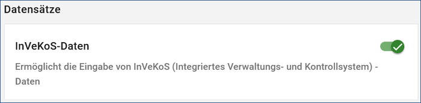
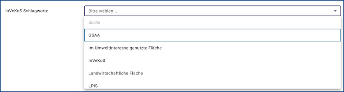

Option: InVekoS
---------------

**InVeKoS** - Integriertes Verwaltungs- und Kontrollsystem in Agrarsektor

.. note:: Das InVeKoS ist ein System von Verordnungen zur Durchführung einer einheitlichen Agrarpolitik in den Mitgliedstaaten der Europäischen Union. Die schrittweise Einführung des Integrierten Verwaltungs- und Kontrollsystems durch die Europäische Kommission wurde im Zuge der Reform der Gemeinsamen Agrarpolitik (GAP) im Jahr 1992 beschlossen. Das InVeKoS ist ein wesentliches Instrument zur Kontrolle der Agrarausgaben der EU. Die durch das InVeKoS gewonnenen Daten fließen in das Rechnungsabschlussverfahren der EU ein. Konzeption, Koordinierung und Kontrolle des InVeKoS erfolgen durch die Europäische Kommission, die konkrete Umsetzung obliegt den EU-Mitgliedstaaten. (Quelle: `Wikipedia <https://de.wikipedia.org/wiki/Integriertes_Verwaltungs-_und_Kontrollsystem>`_)

Die InVeKoS-Funktionalität wird im Folgenden beschrieben.

-----------------------------------------------------------------------------------------------------------------------

Erfassung
^^^^^^^^^

Auswahlfeld InVeKoS
"""""""""""""""""""

Damit die Eingabefelder für InVeKoS in der Erfassungsmaske des Geodatensatzes erscheinen, muss in der Katalogverwaltung unter Verhalten / Datensätze der Schalter für InVeKoS-Daten eingeschaltet sein. Zusätzlich muss im Geodatensatz die Checkbox INSPIRE-relevant angekreuzt sein, dann erscheint darunter das Auswahlfeld für InVeKoS. Hier kann eine von drei Optionen ausgewählt werden. Weiterhin erscheint im Abschnitt Verschlagwortung neben den INSPIRE-Feldern auch das Auswahlfeld für die InVeKoS-Schlagworte.

Abb.: Katalogverwaltung - Schalter InVeKoS-Daten anzeigen

.. figure:: ../../../../img/ige/erfassung/ige_metadaten/datensatztypen/option/invekos/auswahlfeld-invekos.png
   :align: left
   :scale: 100
   :figwidth: 100%

Abb.: Auswahlfeld InVeKoS

Abb.: InVeKoS-Schlagworte

-----------------------------------------------------------------------------------------------------------------------

Die EU-Kommission erwartet eine INSPIRE-Kompatibilität der GIS-InVeKoS-Daten. Dies bedeutet zunächst die Bereitstellung von Metadaten zu den relevanten Daten.

Die Anforderungen an die InVeKoS-Metadaten wurden von der GDI-DE im April 2023 bekannt gegeben.

Das Auswahlfeld InVeKoS erscheint in INSPIRE-identifizierten Geodatensätzen. Folgende Funktionalitäten sind hinterlegt.

**Option 1: InVeKoS/IACS (GSAA)**

Die folgenden Schlagworte werden dem Datensatz im Abschnitt Verschlagwortung hinzugefügt:

  - InVeKoS: InVeKoS + GSAA
  - Gemet: Gemeinsame Agrarpolitik
  - ISO-Themenkategorie: Landwirtschaft
  - INSPIRE-Themen: Bodennutzung

**Option 2: InVeKoS/IACS (LPIS)**

Die folgenden Schlagworte werden dem Datensatz im Abschnitt Verschlagwortung hinzugefügt:

  - InVeKoS: InVeKoS + LPIS
  - Gemet: Gemeinsame Agrarpolitik
  - ISO-Themenkategorie: Landwirtschaft
  - INSPIRE-Themen: Bodenbedeckung

-----------------------------------------------------------------------------------------------------------------------

**Glossar**

**InVeKoS** - Integriertes Verwaltungs- und Kontrollsystem in Agrarsektor

**IACS** - Integrated Administration and Control System

**GSAA** - Geospatial Aid Application (Antrag auf raumbezogene Hilfe)

**LPIS** - Land Parcel Identification System (Identifizierung landwirtschaftlicher Parzellen)

-----------------------------------------------------------------------------------------------------------------------

Erläuterungen
"""""""""""""

**InVeKoS**

**Definition:**
Integriertes Verwaltungs- und Kontrollsystem gemäß Artikel 67 der Verordnung (EG) Nr. 1306/2013

**Beschreibung:**
Von den Mitgliedstaaten angewendetes System für bestimmte Zahlungen gemäß der Verordnung (EU) Nr. 1307/2013 und der Verordnung (EU) Nr. 1305/2013

**GSAA**

**Definition:**
Geodatenbezogener Beihilfeantrag als Teil des Teilsystems „Beihilfeanträge“ des InVeKoS gemäß Artikel 68 der Verordnung (EG) Nr. 1306/2013.

**Beschreibung:**
Abgrenzung landwirtschaftlicher Parzellen mit Kulturpflanzen oder Kulturgruppen gemäß den Angaben des Betriebsinhabers in einem bestimmten Jahr

**LPIS**

**Definition:**
System zur Identifizierung landwirtschaftlicher Parzellen, ein Teilsystem des Integrierten Verwaltungs- und Kontrollsystems (InVeKoS) wie in Artikel 68 der Verordnung (EG) Nr. 1306/2013 definiert. Subsystem des InVeKoS im Sinne von Artikel 68 der Verordnung (EG) Nr. 1306/2013.

**Beschreibung:**
Geodatensatz mit der Abgrenzung von Referenzparzellen, Arten landwirtschaftlicher Flächen und stabilen im Umweltinteresse genutzten Flächen.