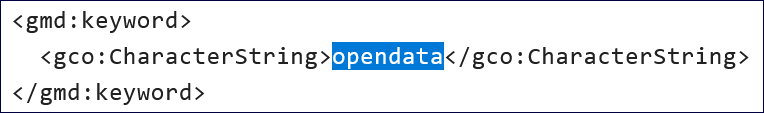
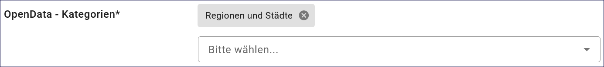
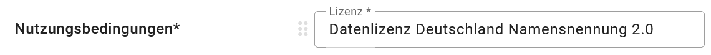
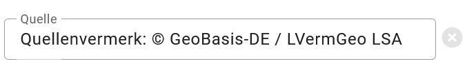
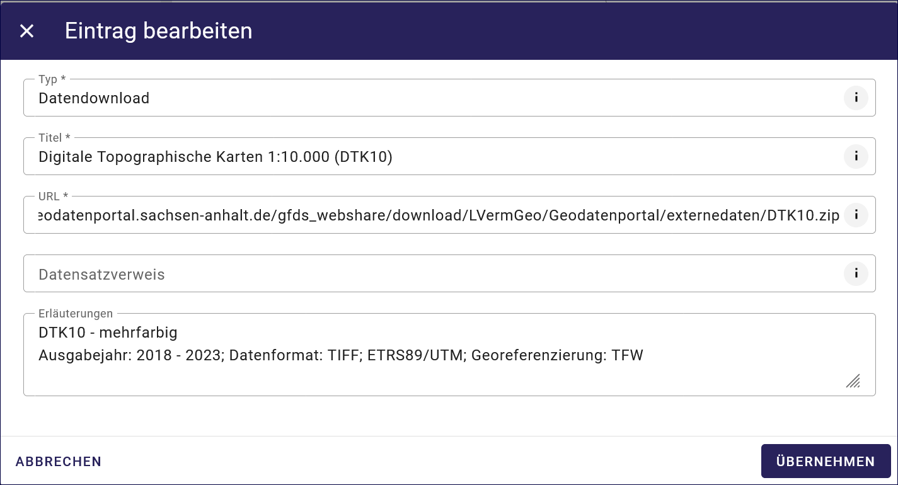
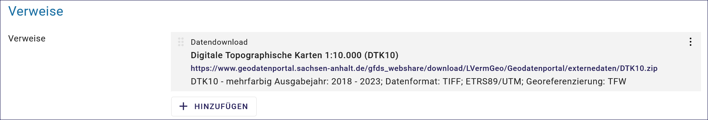

Option: Open Data
-----------------

Open Data - Bedeutung
^^^^^^^^^^^^^^^^^^^^^

Open Data - offene Verwaltungsdaten

Grundlage
^^^^^^^^^

Als Open Data werden Daten bezeichnet, die von allen zu jedem Zweck genutzt, weiterverbreitet und weiterverwendet werden dürfen. Einschränkungen der Nutzung sind nur erlaubt, um Ursprung und Offenheit des Wissens zu sichern. Die Forderung danach beruht auf der Annahme, dass frei nutzbare Daten zu mehr Transparenz und Zusammenarbeit führen. Um die Nachnutzbarkeit zu gewährleisten, werden Freie Lizenzen verwendet. Die Bereitstellung offener Daten durch die öffentliche Hand wird als eine Voraussetzung für Open Government angesehen.

(Quelle: `Wikipedia <https://de.wikipedia.org/wiki/Open_Data>`_)

.. hint:: Nachfolgend werden die Felder beschrieben, die nach der Aktivierung dieser Option zusätzlich in der Erfassungsmaske befüllt werden müssen.

Abb.: Checkbox Open Data

Diese Checkbox kennzeichnet den Metadatensatz als "Open Data" es wird in der ISO-XML das Schlagwort "opendata" generiert. Wenn das Bundesland der GovData-Kooperation beigetreten ist, und die DCAT-AP.de Schnittstelle des Bundeslandes im Portal GovData aktiviert ist, werden diese Metadaten an das Portal `GovData <https://www.govdata.de/>`_ abgegeben. In einem weiteren Schritt werden diese Daten vom Portal `data.europa.eu <https://data.europa.eu/de/trening/what-open-data>`_ der Europäischen Kommission geharvestet (abgeerntet/abgeholt). 

Abb.: Darstellung in der ISO-XML

Folgende Eigenschaften ändern sich bei der Aktivierung der Checkbox Open Data:

 - Im Abschnitt "Verschlagwortung", in der Tabelle "Kategorien" muss mindestens ein Wert ausgewählt und eingetragen werden.
 - Im Abschnitt „Verfügbarkeit“, in der Tabelle "Nutzungsbedingung" muss eine Lizenz angegeben werden.
 - Im Abschnitt „Verweise“ muss ein Verweis vom Typ "Datendownload" eingetragen werden.

 .. image:: ../../../../img/ige/erfassung/ige_metadaten/ige_datensatztypen/option/open-data/open-data_hinweis.png
  :width: 500

Abb.: Hinweis

-----------------------------------------------------------------------------------------------------------------------

Abschnitt Verschlagwortung
''''''''''''''''''''''''''

(Open Data) Kategorien
'''''''''''''''''''''''

Die Tabelle "Kategorien" enthält eine Auswahlliste, die das OpenData-Objekt näher bestimmen.

`Auswahlliste der Open Data Kategorien <https://metaver-bedienungsanleitung.readthedocs.io/de/latest/metaver_ige/ige_auswahllisten/auswahlliste_allgemeines_opendata-kategorien.html>`_

Abb.: Auswahlfeld - Open Data Kategorien

-----------------------------------------------------------------------------------------------------------------------

Abschnitt Verfügbarkeit
'''''''''''''''''''''''

Unter den Nutzungsbedingungen muss eine Linzenz gewählt werden, die die Nutzung der Daten zu bestimmten Bedingungen erlaubt. 

Abb.: Nutzungsbedingungen - Lizenz

Im Feld Quelle kann eine Angabe zu einer Datenquelle erfolgen. z.B.: *Quellenvermerk: © Daten: Landesamt für ...* oder *Quellenvermerk: © GeoBasis-DE / LVermGeo LSA*. Diese Angabe ist z.B. in Basiskarten relevant, da diese Information in einem Kartenviewer, in der Basiskarte vermerkt werden muss.

Abb.: Nutzungsbedingungen - Quellenangabe

.. image:: ../../../../img/kartenclient/metaver-kartenviewer_angabe-copyright.png
  :width: 400

Abb.: Beispiel: Angabe Copyright in einer Basiskarte

Im Abschnitt Verweise kann eine Verlinkung auf Nutzungsbedingungen angelegt werden, die die Nutzung der Daten regelt. Die Datenhaltendestelle ist dann dafür verantwortlich, dass die verlinkte Seite immer erreichbar ist.

-----------------------------------------------------------------------------------------------------------------------

Abschnitt Verweise
''''''''''''''''''

Wenn ein Metadatensatz als Open Data gekennzeichnet ist, muss im Metadatensatz ein Downloadlink auf die beschriebenen Daten enthalten sein. Dies erfolgt an dieser Stelle. Die Datenhaltendestelle ist dann dafür verantwortlich, dass die verlinkten Daten immer erreichbar sind.

Abb.: Datendownload anlegen

Abb.: angelegter Datendownload

