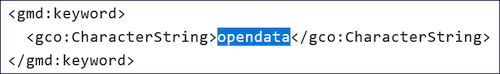

-----------------
Option: Open Data
-----------------

Open Data - Bedeutung
^^^^^^^^^^^^^^^^^^^^^

Open Data - offene Verwaltungsdaten

.. note:: Open Data sind Daten, die von jedermann für jeden Zweck genutzt, weiterverbreitet und weiterverwendet werden können. Nutzungseinschränkungen sind nur zulässig, um den Ursprung und die Offenheit des Wissens zu gewährleisten. Dahinter steht die Annahme, dass frei nutzbare Daten zu mehr Transparenz und Kooperation führen. Um die Nachnutzbarkeit zu gewährleisten, werden freie Lizenzen verwendet. Die Bereitstellung offener Daten durch die öffentliche Hand wird als Voraussetzung für Open Government angesehen. (Quelle: `Wikipedia <https://de.wikipedia.org/wiki/Open_Data>`_)

.. hint:: Nachfolgend werden die Felder beschrieben, die nach der Aktivierung dieser Option zusätzlich in der Erfassungsmaske befüllt werden müssen.

Abb.: Checkbox Open Data

Diese Checkbox kennzeichnet den Metadatensatz als "Open Data", es wird das Schlagwort "opendata" im ISO-XML generiert. Wenn das Bundesland der GovData-Kooperation beigetreten ist und die DCAT-AP.de Schnittstelle des Bundeslandes im Portal GovData aktiviert ist, werden diese Metadaten an das Portal `GovData <https://www.govdata.de/>`_ übergeben. In einem weiteren Schritt werden diese Daten vom Portal `data.europa.eu <https://data.europa.eu/de/trening/what-open-data>`_ der Europäischen Kommission geharvestet (abgeerntet). 

Abb.: Darstellung in der ISO-XML

Folgende Eigenschaften ändern sich bei der Aktivierung der Checkbox Open Data:

 - Im Abschnitt "Verschlagwortung" muss in der Tabelle "Kategorien" mindestens ein Wert ausgewählt werden.
 - Im Abschnitt „Verfügbarkeit“ muss in der Tabelle "Nutzungsbedingungen" eine Lizenz ausgewählt werden.
 - Im Abschnitt „Verweise“ muss ein Verweis vom Typ "Datendownload" eingegeben werden.

.. figure:: ../../../../img/ige/erfassung/ige_metadaten/datensatztypen/option/open-data/open-data_hinweis.png
   :align: left
   :scale: 50
   :figwidth: 100%

Abb.: Hinweis

-----------------------------------------------------------------------------------------------------------------------

Abschnitt Verschlagwortung
""""""""""""""""""""""""""

(Open Data) Kategorien
'''''''''''''''''''''''

Die Tabelle "Kategorien" enthält eine Auswahlliste zur näheren Bestimmung des OpenData-Objekts.

`Auswahlliste der Open Data Kategorien <https://metaver-bedienungsanleitung.readthedocs.io/de/latest/metaver_ige/ige_auswahllisten/auswahlliste_allgemeines_opendata-kategorien.html>`_

.. figure:: ../../../../img/ige/erfassung/ige_metadaten/datensatztypen/option/open-data/open-data_kategorie.png
   :align: left
   :scale: 50
   :figwidth: 100%

Abb.: Auswahlfeld - Open Data Kategorien

-----------------------------------------------------------------------------------------------------------------------

Abschnitt Verfügbarkeit
"""""""""""""""""""""""

In den Nutzungsbedingungen muss eine Lizenz ausgewählt werden, die die Nutzung der Daten unter bestimmten Bedingungen erlaubt. 

.. figure:: ../../../../img/ige/erfassung/ige_metadaten/datensatztypen/option/open-data/open-data_nutzungsbedingungen_lizenz.png
   :align: left
   :scale: 50
   :figwidth: 100%

Abb.: Nutzungsbedingungen - Lizenz

Im Feld Quelle kann eine Datenquelle angegeben werden, z.B: *Quelle © Daten: Landesamt für ...* oder *Quellenvermerk: © GeoBasis-DE / LVermGeo LSA*. Diese Angabe ist z.B. in Basiskarten relevant, da diese Information in einem Kartenviewer in der Basiskarte angezeigt werden muss.

.. figure:: ../../../../img/ige/erfassung/ige_metadaten/datensatztypen/option/open-data/open-data_nutzungsbedingungen_quelle.png
   :align: left
   :scale: 50
   :figwidth: 100%

Abb.: Nutzungsbedingungen - Quellenangabe

.. figure:: ../../../../img/kartenclient/metaver-kartenviewer_angabe-copyright.png
   :align: left
   :scale: 50
   :figwidth: 100%

Abb.: Beispiel: Angabe Copyright in einer Basiskarte

Im Bereich Verweise kann auf Nutzungsbedingungen verwiesen werden, die die Nutzung der Daten regeln. Die datenhaltende Stelle ist dann dafür verantwortlich, dass die verlinkte Seite jederzeit zugänglich ist.

-----------------------------------------------------------------------------------------------------------------------

Abschnitt Verweise
""""""""""""""""""

Wenn ein Metadatensatz als Open Data gekennzeichnet ist, muss der Metadatensatz einen Download-Link zu den beschriebenen Daten enthalten. Dies geschieht an dieser Stelle. Der Datenhalter ist dafür verantwortlich, dass die verlinkten Daten jederzeit verfügbar sind.

.. figure:: ../../../../img/ige/erfassung/ige_metadaten/datensatztypen/option/open-data/open-data_verweis.png
   :align: left
   :scale: 50
   :figwidth: 100%

Abb.: Datendownload anlegen

.. figure:: ../../../../img/ige/erfassung/ige_metadaten/datensatztypen/option/open-data/open-data_verweis_angelegt.png
   :align: left
   :scale: 50
   :figwidth: 100%

Abb.: angelegter Datendownload

