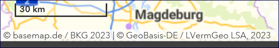

-----------------
Option: Open Data
-----------------

Open Data - Bedeutung
^^^^^^^^^^^^^^^^^^^^^

Open Data - offene Verwaltungsdaten

.. tip:: `GovData - Informationen <https://www.govdata.de/web/guest/open-government>`_ und `Open-Data-Leitfaden Schleswig-Holstein <https://opendata.schleswig-holstein.de/leitfaden/>`_

-----------------------------------------------------------------------------------------------------------------------

Erfassung
^^^^^^^^^

Option: Open Data
""""""""""""""""""

Wenn die Option "Open Data" ausgewählt und der Metadatenkatalog über die Schnittstelle DCAT-AP.de an `GovData <https://www.govdata.de/>`_ angebunden ist, werden die als "Open Data" gekennzeichneten Metadaten an dieses Portal übergeben. In einem weiteren Schritt werden diese Daten von `data.europa.eu <https://data.europa.eu/de/trening/what-open-data>`_, einem Portal der Europäischen Kommission, geharvested (geerntet).

.. figure:: ../../../../img/ige/erfassung/ige_metadaten/datensatztypen/option/checkboxen/metaver_checkbox_typ_opendata.png
   :align: left
   :scale: 90
   :figwidth: 100%

Abb.: Option: Open Data

Durch die Aktivierung der Option "Open Data" wird das Schlüsselwort "opendata" im ISO-XML gesetzt.

.. figure:: ../../../../img/ige/erfassung/ige_metadaten/datensatztypen/option/open-data/iso-xml-opendata.png
   :align: left
   :scale: 60
   :figwidth: 100%

Abb.: ISO-XML - Angabe des Schlüsselwortes "opendata"

Im Folgenden werden die Felder beschrieben, die nach Aktivierung der Option "Open Data" in der Erfassungsmaske zusätzlich ausgefüllt werden müssen.

Folgende Eigenschaften ändern sich bei der Aktivierung der Option "Open Data":

 - Im Abschnitt "Verschlagwortung" muss in der Tabelle "Kategorien" mindestens ein Wert ausgewählt werden.
 - Im Abschnitt „Verfügbarkeit“ muss in der Tabelle "Nutzungsbedingungen" eine Lizenz ausgewählt werden.
 - Im Abschnitt „Verweise“ muss ein Verweis vom Typ "Datendownload" eingegeben werden.

.. figure:: ../../../../img/ige/erfassung/ige_metadaten/datensatztypen/option/open-data/open-data_hinweis.png
   :align: left
   :scale: 80
   :figwidth: 100%

Abb.: Hinweis

-----------------------------------------------------------------------------------------------------------------------

Abschnitt Verschlagwortung
""""""""""""""""""""""""""

(Open Data) Kategorien
'''''''''''''''''''''''

Die Tabelle "Kategorien" enthält eine Auswahlliste zur näheren Bestimmung des OpenData-Objekts.

`Auswahlliste der Open Data Kategorien <https://metaver-bedienungsanleitung.readthedocs.io/de/latest/ingrid-editor/auswahllisten/auswahlliste_allgemeines_opendata-kategorien.html>`_

.. figure:: ../../../../img/ige/erfassung/ige_metadaten/datensatztypen/option/open-data/open-data_kategorie.png
   :align: left
   :scale: 80
   :figwidth: 100%

Abb.: Auswahlfeld - Open Data Kategorien

-----------------------------------------------------------------------------------------------------------------------

Abschnitt Verfügbarkeit
"""""""""""""""""""""""

In den Nutzungsbedingungen muss eine Lizenz ausgewählt werden, die die Nutzung der Daten unter bestimmten Bedingungen erlaubt. 

.. figure:: ../../../../img/ige/erfassung/ige_metadaten/datensatztypen/option/open-data/open-data_nutzungsbedingungen_lizenz.png
   :align: left
   :scale: 90
   :figwidth: 100%

Abb.: Nutzungsbedingungen - Lizenz

Im Feld Quelle kann eine Datenquelle angegeben werden, z.B: *Quelle © Daten: Landesamt für ...* oder *Quellenvermerk: © GeoBasis-DE / LVermGeo LSA*. Diese Angabe ist z.B. in Basiskarten relevant, da diese Information in einem Kartenviewer in der Basiskarte angezeigt werden muss.

.. figure:: ../../../../img/ige/erfassung/ige_metadaten/datensatztypen/option/open-data/open-data_nutzungsbedingungen_quelle.png
   :align: left
   :scale: 80
   :figwidth: 100%

Abb.: Nutzungsbedingungen - Quellenangabe

Abb.: Beispiel: Angabe Copyright in einer Basiskarte

Im Bereich Verweise kann auf Nutzungsbedingungen verwiesen werden, die die Nutzung der Daten regeln. Die datenhaltende Stelle ist dann dafür verantwortlich, dass die verlinkte Seite jederzeit zugänglich ist.

-----------------------------------------------------------------------------------------------------------------------

Abschnitt Verweise
""""""""""""""""""

Wenn ein Metadatensatz als Open Data gekennzeichnet ist, muss der Metadatensatz einen Download-Link zu den beschriebenen Daten enthalten. Dies geschieht an dieser Stelle. Der Datenhalter ist dafür verantwortlich, dass die verlinkten Daten jederzeit verfügbar sind.

.. figure:: ../../../../img/ige/erfassung/ige_metadaten/datensatztypen/option/open-data/open-data_verweis.png
   :align: left
   :scale: 90
   :figwidth: 100%

Abb.: Datendownload anlegen

.. figure:: ../../../../img/ige/erfassung/ige_metadaten/datensatztypen/option/open-data/open-data_verweis_angelegt.png
   :align: left
   :scale: 100
   :figwidth: 100%

Abb.: angelegter Datendownload

