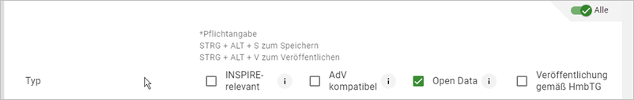
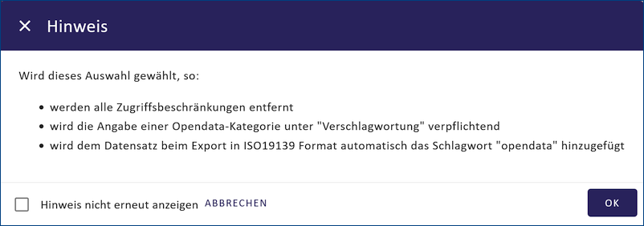
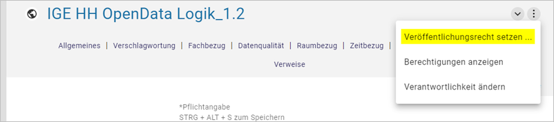
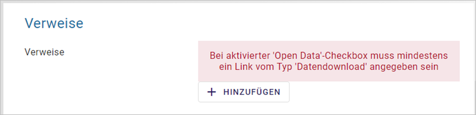
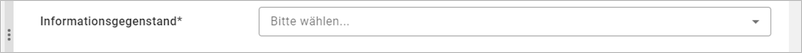

-----------------
Option: Open Data
-----------------

Open Data - Bedeutung
^^^^^^^^^^^^^^^^^^^^^

Open Data - offene Verwaltungsdaten

.. note:: Open Data sind Daten, die von jedermann für jeden Zweck genutzt, weiterverbreitet und weiterverwendet werden können. Nutzungseinschränkungen sind nur zulässig, um den Ursprung und die Offenheit des Wissens zu gewährleisten. Dahinter steht die Annahme, dass frei nutzbare Daten zu mehr Transparenz und Kooperation führen. Um die Nachnutzbarkeit zu gewährleisten, werden freie Lizenzen verwendet. Die Bereitstellung offener Daten durch die öffentliche Hand wird als Voraussetzung für Open Government angesehen. (Quelle: `Wikipedia <https://de.wikipedia.org/wiki/Open_Data>`_)

.. hint:: Es gibt Datensätze, die nicht unter das Transparenzgesetz fallen, aber freiwillig nach Open Data (GovData) veröffentlicht werden können. Bei diesen Objekten sollte im InGrid-Editor nur die Checkbox „Open Data“ angehakt werden. Die Checkbox „Veröffentlichung gemäß HmbTG“ muss deaktiviert sein.

Abb.: Checkbox Open Data

Wird die Checkbox „Open Data“ aktiviert, erscheint diese Meldung und es werden folgende Felder automatisch zum Pflichtfeld:

Abb.: Fenster - Hinweis

Pflichtfelder
""""""""""""""

Informationsgegenstand
'''''''''''''''''''''''

.. figure:: ../../../../img/ige/erfassung/ige_metadaten/datensatztypen/option/open-data/open-data_hmdk_pflichtfelder-informationsgegenstand.png
   :align: left
   :scale: 70
   :figwidth: 100%

Abb.: Feld - Informationsgegenstand

Wird die Open Data Checkbox angehakt, wird gleichzeitig die Checkbox „Veröffentlichung gemäß HmbTG“ aktiviert. Sind die Daten von der Veröffentlichungspflicht nach dem Hamburger Transparenzgesetz ausgenommen sollte der Haken bei „Veröffentlichung gemäß HmbTG“ wieder entfernt werden.
(In den meisten Fällen hängt jedoch die Veröffentlichung in GovData auch mit der Veröffentlichung im Transparenzportal zusammen.)
Sobald jedoch nur Open Data aktiv ist, wird automatisch im Feld „Informationsgegenstand“ der Wert „Ohne gesetzliche Verpflichtung“ gesetzt. Wird der Haken bei Open Data wieder entfernt, wird der Eintrag bei Informationsgegenstand gelöscht.

Adressen
"""""""""

 - Es muss mindestens einen 'Ansprechpartner MD' geben.
 - Es muss mindestens einen 'Herausgeber' geben

OpenData Kategorie
"""""""""""""""""""

Abb.: Feld - Kategorie

Über die Auswahlliste muss mindestens eine Open Data DCAT-AP-DE Kategorie ausgewählt werden.
Die folgenden Kategorien stehen zur Verfügung:

.. figure:: ../../../../img/ige/erfassung/ige_metadaten/datensatztypen/option/open-data/open-data_hmdk_pflichtfelder-kategorie-liste.png
   :align: left
   :scale: 50
   :figwidth: 100%

Abb.: Feld - Kategorieauswahlliste

Veröffentlichungsrecht
"""""""""""""""""""""""

Die Veröffentlichung für Objekte, die für Open Data gekennzeichnet sind, müssen auf „Internet“ gesetzt sein. Bitte kontrollieren!

Siehe drei Punkte Menü neben dem Titel

Abb.: Feld - Veröffentlichungsrecht setzen

Abb.: Fenster - Veröffentlichungsrecht

Nutzungsbedingungen
""""""""""""""""""""

.. figure:: ../../../../img/ige/erfassung/ige_metadaten/datensatztypen/option/open-data/open-data_hmdk_pflichtfelder-verfuegbarkeit.png
   :align: left
   :scale: 70
   :figwidth: 100%

Abb.: Fenster - Nutzungsbedingungen

Durch das Anklicken der Checkbox wird bei den Nutzungsbedingungen automatisch der Eintrag "Datenlizenz Deutschland Namensnennung 2.0" gesetzt. Eventuell bereits vorhandene ältere Einträge werden überschrieben.

**Quellenvermerk**

Der Quellenvermerk wird automatisch mit „Freie und Hansestadt Hamburg, zuständige Behörde“ gefüllt
Bitte nicht vergessen, den Eintrag „zuständige Behörde“ durch die eigene Behörde zu ersetzen (z.B. Behörde für Umwelt und Energie).

**Zugriffsbeschränkungen**

Das Feld „Zugriffsbeschränkungen“ wird jetzt nur noch mit „Es gelten keine Zugriffsbeschränkungen“ befüllt, wenn zusätzlich zu Open Data die Checkbox „INSPIRE-relevant“ aktiv ist.

**Begründung:** *Das Feld Zugriffsbeschränkungen wird nur mit INSPIRE-relevanten Werten befüllt und findet daher nur im INSPIRE-Kontext Verwendung. Datensätze mit Open Data-Kennzeichnung und ohne INSPIRE-Relevanz sollten nicht gezwungenermaßen eine Wertangabe mit INSPIRE-Bezug beinhalten. Für Open Data-MD, insbesondere bei Weiterleitung über den Geodatenkatalog.de nach GovData, ist diese Angabe nicht notwendig. (Anmerkung: Hier ist demnächst eine Änderung eingeplant).*

Verweise vom Typ Datendownload
"""""""""""""""""""""""""""""""

Abb.: Feld - Verweise

Da über das Transparenzportal mindestens ein Bezug zu den echten Daten hergestellt werden sollte, muss im HMDK bei den betroffenen Objekten ebenfalls ein Verweis zum Download der eigentlichen Daten eingetragen werden. Aus diesem Grund wird bei Anhaken der Open Data Checkbox das Anlegen eines Verweises vom Typ „Datendownload“ Pflicht. Der Verweistyp wird im Dialog „Verweise Hinzufügen“ über die vorgegebene Liste ausgewählt.

Abb.: Fenster - Eintrag bearbeiten

**Feld Dateiformat:**
Bitte geben Sie an dieser Stelle das Format der eigentlichen Daten an. Handelt es sich beispielsweise um JPEG-Dateien, die in einer ZIP-Datei bereitgestellt werden, ist als Dateiformat des Verweises „JPEG“ auszuwählen.

Schlagworte (Keyword)
""""""""""""""""""""""

Das keyword für Open Data ist „opendata“, es wird automatisch beim Anklicken der Checkbox „Open Data“ gesetzt. Es erscheint im Portal bei Schlagworte, sowie in der ISO im Element <gmd:keyword>

Abb.: Fenster - Keyword opendata

Neben dem fest vorgegebenen Schlagwort „opendata“ wird zusätzlich das Kürzel des ausgewählten Informationsgegenstandes gesetzt (z.B. „hmbtg_09_geodaten“ für den Informationsgegenstand „Geodaten“).

Abb.: Fenster - Keyword hmbtg_09_geodaten

Veröffentlichung gemäß HMBTG
^^^^^^^^^^^^^^^^^^^^^^^^^^^^^^

Metadaten die nur im Transparenzportal und nicht bei GovData veröffentlicht werden sollen, benötigen nur das Häkchen bei „Veröffentlichung gemäß HmbTG“.

Abb.: Checkbox - Veröffentlichung gemäß HmbTG

Nach dem erstmaligen Aktivieren erscheint die folgende Meldung, die Sie bitte jeweils mit „OK“ bestätigen.

.. figure:: ../../../../img/ige/erfassung/ige_metadaten/datensatztypen/option/open-data/open-data_hmdk_hmbtg-hinweis.png
   :align: left
   :scale: 50
   :figwidth: 100%

Abb.: Fenster - Hinweis zur Veröffentlichung im Hamburger Transparentportal

.. figure:: ../../../../img/ige/erfassung/ige_metadaten/datensatztypen/option/open-data/open-data_hmdk_hmbtg-zugriffsbeschraenkungen.png
   :align: left
   :scale: 50
   :figwidth: 100%

Abb.: Fenster - Hinweis zu den Zugriffsbeschränkungen

Pflichtfelder
""""""""""""""
Wird die Checkbox „Veröffentlichung gemäß HmbTG“ angehakt, werden folgende Felder automatisch zum Pflichtfeld:

Informationsgegenstand
'''''''''''''''''''''''

Abb.: Fenster - Hinweis zu den Zugriffsbeschränkungen

Es muss mindestens ein Informationsgegenstand der Auswahlliste ausgewählt werden. Möglich ist auch die Angabe „Ohne gesetzliche Verpflichtung“.

Wird der Haken bei der Checkbox wieder entfernt, so werden automatisch auch die ausgewählten Informationsgegenstände gelöscht.

Adressen
'''''''''

•  Es muss mindestens einen 'Ansprechpartner MD' geben.
•  Es muss mindestens einen 'Herausgeber' geben

Open Data Kategorie
''''''''''''''''''''

.. figure:: ../../../../img/ige/erfassung/ige_metadaten/datensatztypen/option/open-data/open-data_hmdk_hmbtg-opendata-kategorie.png
   :align: left
   :scale: 50
   :figwidth: 100%

Abb.: Fenster - Hinweis zu den Zugriffsbeschränkungen

Über die Auswahlliste muss mindestens eine Open Data DCAT-AP-DE Kategorie ausgewählt werden.
Die folgenden Kategorien stehen zur Verfügung:

.. figure:: ../../../../img/ige/erfassung/ige_metadaten/datensatztypen/option/open-data/open-data_kategorie.png
   :align: left
   :scale: 50
   :figwidth: 100%

Abb.: Fenster - Hinweis zu den Zugriffsbeschränkungen

-----------------------------------------------------------------------------------------------------------------------

Abschnitt Verschlagwortung
""""""""""""""""""""""""""

(Open Data) Kategorien
'''''''''''''''''''''''

Die Tabelle "Kategorien" enthält eine Auswahlliste zur näheren Bestimmung des OpenData-Objekts.

`Auswahlliste der Open Data Kategorien <https://metaver-bedienungsanleitung.readthedocs.io/de/latest/metaver_ige/ige_auswahllisten/auswahlliste_allgemeines_opendata-kategorien.html>`_

.. figure:: ../../../../img/ige/erfassung/ige_metadaten/datensatztypen/option/open-data/open-data_kategorie.png
   :align: left
   :scale: 50
   :figwidth: 100%

Abb.: Auswahlfeld - Open Data Kategorien

-----------------------------------------------------------------------------------------------------------------------

Abschnitt Verfügbarkeit
"""""""""""""""""""""""

In den Nutzungsbedingungen muss eine Lizenz ausgewählt werden, die die Nutzung der Daten unter bestimmten Bedingungen erlaubt. 

.. figure:: ../../../../img/ige/erfassung/ige_metadaten/datensatztypen/option/open-data/open-data_nutzungsbedingungen_lizenz.png
   :align: left
   :scale: 50
   :figwidth: 100%

Abb.: Nutzungsbedingungen - Lizenz

Im Feld Quelle kann eine Datenquelle angegeben werden, z.B: *Quelle © Daten: Landesamt für ...* oder *Quellenvermerk: © GeoBasis-DE / LVermGeo LSA*. Diese Angabe ist z.B. in Basiskarten relevant, da diese Information in einem Kartenviewer in der Basiskarte angezeigt werden muss.

.. figure:: ../../../../img/ige/erfassung/ige_metadaten/datensatztypen/option/open-data/open-data_nutzungsbedingungen_quelle.png
   :align: left
   :scale: 50
   :figwidth: 100%

Abb.: Nutzungsbedingungen - Quellenangabe

.. figure:: ../../../../img/kartenclient/metaver-kartenviewer_angabe-copyright.png
   :align: left
   :scale: 50
   :figwidth: 100%

Abb.: Beispiel: Angabe Copyright in einer Basiskarte

Im Bereich Verweise kann auf Nutzungsbedingungen verwiesen werden, die die Nutzung der Daten regeln. Die datenhaltende Stelle ist dann dafür verantwortlich, dass die verlinkte Seite jederzeit zugänglich ist.

-----------------------------------------------------------------------------------------------------------------------

Abschnitt Verweise
""""""""""""""""""

Wenn ein Metadatensatz als Open Data gekennzeichnet ist, muss der Metadatensatz einen Download-Link zu den beschriebenen Daten enthalten. Dies geschieht an dieser Stelle. Der Datenhalter ist dafür verantwortlich, dass die verlinkten Daten jederzeit verfügbar sind.

.. figure:: ../../../../img/ige/erfassung/ige_metadaten/datensatztypen/option/open-data/open-data_verweis.png
   :align: left
   :scale: 50
   :figwidth: 100%

Abb.: Datendownload anlegen

.. figure:: ../../../../img/ige/erfassung/ige_metadaten/datensatztypen/option/open-data/open-data_verweis_angelegt.png
   :align: left
   :scale: 50
   :figwidth: 100%

Abb.: angelegter Datendownload

