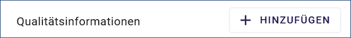
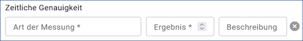

Abschnitt Datenqualität
^^^^^^^^^^^^^^^^^^^^^^^

Datendefizit

 

Abb.: Feld Datendefizit

Eingabe einer Prozentangabe zum Anteil der Daten, die im Vergleich zum beschriebenen Geltungsbereich fehlen. Diese kann sich auf die Anzahl der Kartenblätter aber auch auf das Datendefizit einer Gesamtkarte beziehen.

Beispiel: 55

Wenn der Erfassungsgrad bei 100% liegt, ist in dem Feld Datendefizit 0% einzutragen. (Datendefizit = 100 – Erfassungsgrad) 

Datengenauigkeit
""""""""""""""""

 
Abb.: Felder für die Datengenauigkeit

**Höhengenauigkeit**

Angabe über die Genauigkeit der Höhe z.B. in einem Geländemodell.

Beispiel: 3 (m)

**Lagegenauigkeit**

Angabe über die Genauigkeit z.B. in einer Karte.

Beispiel: 3 (m)

.. hint:: Die folgenden Eingabefelder erscheinen bei der Auswahl (Verschlagwortung) der INSPIRE-Themen: Adressen, Gewässernetz, Schutzgebiete, Verwaltungseinheiten und Verkehrsnetze.

 
Abb.: Feld+ für weitere Qualitätsinformationen

Datenüberschuss
"""""""""""""""

 
Abb.: Feld Datenüberschuss

Auswahlmöglichkeit für das Feld Art der Messung:
- Number of duplicate feature instances
- Rate of excess items

Angaben zu den überschüssigen Features, Attributen oder ihren Relationen.

Beispiel: Anzahl der überflüssigen Elemente zur Anzahl der gesamten Elemente: 11,2%

..hint:: Es wird nur eine Zahl angegeben; kein %-Zeichen.

Konzeptionelle Konsistenz
"""""""""""""""""""""""""

 
Abb.: Feld Konzeptionelle Konsistenz

Auswahlmöglichkeit für das Feld Art der Messung:
- Compliance rate with the rules of the conceptual schema
- Conceptual Schema compliance
- Number of invalid overlaps of surfaces

Angaben zu Fehlern bezüglich der Verletzung der Regeln des konzeptionellen Schemas

Beispiel: Anzahl der überlappenden Oberflächen innerhalb des Datensatzes: 23

Konsistenz des Wertebereichs
""""""""""""""""""""""""""""

 
Abb.: Feld Konsistenz des Wertebereichs

Auswahlmöglichkeit für das Feld Art der Messung:
- Value domain non conformance rate

Angaben zur Übereinstimmung des Wertebereichs - Angegeben wird die Anzahl der Übereinstimmungen im Verhältnis zur Gesamtmenge der Elemente.

Formatkonsistenz
""""""""""""""""

.. figure:: ../../../../img/ige/erfassung/ige_metadaten/abschnitt-05_datenqualitaet/kosistenz-format.png
   :align: left
   :scale: 50
   :figwidth: 100%
 
Abb.: Feld Formatkonsistenz

Auswahlmöglichkeit für das Feld Art der Messung:
- Physical structure conflict rate

Angaben darüber, wie viele Elemente sich im Konflikt zu der physikalischen Struktur des Datensatzes befinden.

Topologische Konsistenz
"""""""""""""""""""""""

 
Abb.: Feld Topologische Konsistenz

Auswahlmöglichkeit für das Feld Art der Messung:
- Number of closed watercourse links
- Number of faulty point-curve connections
- Number of invalid overlaps of surfaces
- Number of invalid self-intersect errors
- Number of invalid self-overlap errors

Angaben zu topologischen Fehlern, die zwischen verschiedenen Unterelementen des Datensatzes auftreten.

Beispiel: Anzahl fehlender Verbindungen zwischen Unterelementen aufgrund von Undershoots/Überschreitungen.

 
Zeitliche Genauigkeit
"""""""""""""""""""""

 
Abb.: Feld Zeitliche Genauigkeit

Auswahlmöglichkeit für das Feld Art der Messung:
- Percentage of items that are correctly events ordered

Angabe der Anzahl der zeitlich korrekt zugeordneten Elemente zur Gesamtzahl der Elemente.

Korrektheit der thematischen Klassifizierung
""""""""""""""""""""""""""""""""""""""""""""

Abb.: Feld Korrektheit der thematischen Klassifizierung

Auswahlmöglichkeit für das Feld Art der Messung:
- Misclassification rate

Angabe der Anzahl der thematisch falsch klassifizierten Elemente zur Gesamtanzahl der Elemente.

Genauigkeit nicht-quantitativer Attribute
"""""""""""""""""""""""""""""""""""""""""

.. figure:: ../../../../img/ige/erfassung/ige_metadaten/abschnitt-05_datenqualitaet/genauigkeit-nicht-qualitativer-attribute.png
 
   :align: left
   :scale: 50
   :figwidth: 100%
 
Abb.: Feld Genauigkeit nicht-quantitativer Attribute

Auswahlmöglichkeit für das Feld Art der Messung:
- Number of incorrect attribute values
- Rate of incorrect classification for national identifier

Angabe der Anzahl der inkorrekten nicht-quantitativen Attributwerte im Verhältnis zur Gesamtzahl der Attribute.

Genauigkeit quantitativer Attribute
"""""""""""""""""""""""""""""""""""

.. figure::  ../../../../img/ige/erfassung/ige_metadaten/abschnitt-05_datenqualitaet/genauigkeit-qualitativer-attribute.png
 
   :align: left
   :scale: 50
   :figwidth: 100%
 
Abb.: Feld Genauigkeit quantitativer Attribute

Auswahlmöglichkeit für das Feld Art der Messung:
- Attribute value uncertainty at 95 % significance level

Angabe der Anzahl der quantitativen Attribute, die inkorrekt sind.

Beispiel: Anzahl aller quantitativen Werte, die nicht mit 95% Wahrscheinlichkeit dem wahren Wert entsprechen.

Relative Positionsgenauigkeit
"""""""""""""""""""""""""""""

.. figure::  ../../../../img/ige/erfassung/ige_metadaten/abschnitt-05_datenqualitaet/relative-positionsgenauihkeit.png
 
   :align: left
   :scale: 50
   :figwidth: 100%
 
Abb.: Feld Relative Positionsgenauigkeit

Auswahlmöglichkeit für das Feld Art der Messung:
- mean value of positional uncertainties (1D)
- mean value of positional uncertainties (2D)
- mean value of positional uncertainties (3D)

Genauigkeitsangabe bezüglich einer als richtig akzeptierten Bezugs- oder Sollposition