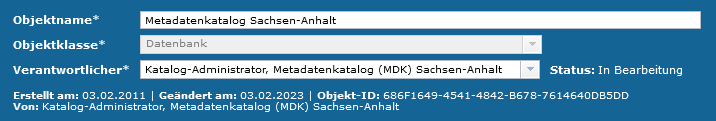
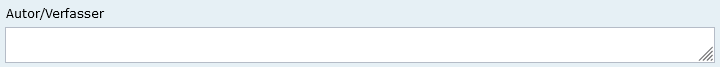
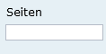
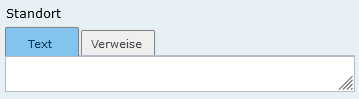
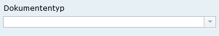
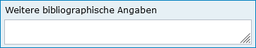
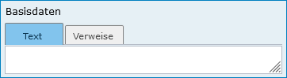

Literatur
=========

.. csv-table::
    :header: "Portal", "Editor"
    :widths: 20, 20

	.. image:: ../../../img/ige/icons/objekte/portal/literatur.png, .. image:: ../../../img/ige/icons/objekte/ige/literatur.png

Mit der Objektklasse Literatur lassen sich Leitfäden, Handlungsempfehlungen, Berichte, Gutachten, Studien, Genehmigungen, Rechtsdokumente, Broschüren, Bücher, Aufsätze oder Abschlussarbeiten beschreiben.

..important:: Die Erfassung dieser Objektklasse erfolgt wie unter `Erfassung von Objekten <https://metaver-bedienungsanleitung.readthedocs.io/de/latest/metaver_ige/ige_erfassung/erfassung-objekte.html>`_ beschrieben. Lediglich der hier beschriebene Abschnitt Zeitbezug beinhaltet für diese Objektklasse spezielle Eingabefelder.

Erfassung
---------

Abschnitt Fachbezug
^^^^^^^^^^^^^^^^^^^

.. image:: ../../../img_ige/metaver_ige/ige_erfassung/ige_objekte/ige_abschnitt-04_fachbezug/ige-abschnitt_fachbezug.png

Abb.: Objektklasse Dokument - Kopf der Erfassungsmaske

Autor/Verfasser
'''''''''''''''

Abb.: Textfeld - Autor/Verfasser

Angabe des Autors bzw. des Verfassers der Literatur. Der Eintrag mehrerer Personen ist durch Semikolon zu trennen.

**Beispiel:** *Angelika Müller; Hans Meier*

Angabe der zuständigen Kontaktperson in der Reihenfolge Name, Vorname, Titel durch Trennzeichen getrennt.

Herausgeber
'''''''''''

Abb.: Eingabezeile - Herausgeber

Angabe des Herausgebers. Der Herausgeber ist z. B. die Institution, in der ein Autor arbeitet und in deren Auftrag er geschrieben hat. Es kann auch ein Verlag, ein Verein oder eine andere Körperschaft sein, der/die Beiträge zu einem Thema sammelt und als Buch erscheinen lässt bzw. Bücher zu einem Thema als Reihe herausgibt.

**Beispiel:** *Umweltbundesamt*

Name der zuständigen Kontaktperson in der Reihenfolge Name, Vorname, Titel durch Trennzeichen getrennt

Erschienen in
'''''''''''''

Abb.: Eingabezeile - Erschienen in

Angabe des Sammelwerkes, in dem ein Aufsatz erschienen ist. Aufsätze und andere nicht selbständige Literatur sind häufig als Teil einer Zeitschrift oder eines Buches erschienen oder als gedruckte Version eines Vortrages im Rahmen einer Tagung. Hier ist der Titel der Zeitschrift bzw. des Sammelwerkes (Tagungsband (Proceedings), Jahresberichte etc.) anzugeben, in der bzw. in dem die beschriebene Literatur erschienen ist. Unter diesem Titel kann ein Artikel beim Herausgeber bezogen werden.

**Beispiel:** *Jahresberichte zur Abfallwirtschaft*

Bezeichnung der Serie oder des Gesamtdatenbestands, wozu der Datenbestand gehört.

Erscheinungsort
'''''''''''''''

Abb.: Eingabezeile - Erscheinungsort

Angabe des Publikationsortes der Literatur. Diese Angabe bezieht sich auf die Literatur und nicht auf die Inhalte der Literatur. Die räumliche Zuordnung der Inhalte der Literatur erfolgt in den Angaben zum Raumbezug des aktuellen Objektes.

Beispiel: Hamburg - Ortsname (Stadt, Gemeinde)

Band, Heft
''''''''''

Abb.: Eingabezeile - Band, Heft

Angabe der Zählung des betreffenden Bandes einer Reihe. Zeitschriften und Sammelwerke bzw. Reihen haben eine durchgängige Zählung seit ihrem Erscheinen oder pro Jahr. Hier ist die Zählung des Bandes anzugeben, in dem der Artikel bzw. der Bericht erschienen ist.

**Beispiel:** *Band IV (Kennung eines Elements einer Serie)*

Seiten
''''''

Abb.: Eingabezeile - Seiten

Angabe der Anzahl der Seiten der Literatur. Hier ist die Anzahl der Seiten anzugeben, wenn es sich um ein Buch handelt. Bei einem Artikel, der in einer Zeitschrift erschienen ist, sollen die Seitenzahlen des Artikelanfangs und des Endes eingegeben werden.

Beispiel: 345; 256-268 (Seitenangabe zum Artikel in einer Publikation)*

Erscheinungsjahr
''''''''''''''''

Abb.: Eingabezeile - Erscheinungsjahr

Angabe der Jahreszahl der Publikation der Literatur. Das Erscheinungsjahr ist vor allem für regelmäßig erscheinende Literatur wie z.B. jährliche Tagungsbände äußerst wichtig zur Identifikation. Das Erscheinungsjahr kann sich von den entsprechenden Angaben im Zeitbezug des Objektes unterscheiden, die sich auf den Inhalt der Literatur beziehen und nicht auf die Literatur selbst.

Beispiel: 1996 (Erscheinungsdatum der Ausgabe oder der Version)

Standort
''''''''

Abb.: Textfeld - Standort

Angabe des Aufbewahrungsortes und evtl. Bezugsort der Literatur, für den Fall, dass ein Bezug auf üblichem Wege (Handel, Bibliotheken) nicht möglich ist. Der Eintrag kann direkt über die Auswahl der Registerkarte "Text" erfolgen oder es können Adressverweise eingetragen werden, indem die Registerkarte "Verweise" aktiviert und der Link "Adresse hinzufügen" betätigt werden. Es können Adressen nach Vorname, Nachname oder Name der Einheit/Institution des aktuellen Kataloges gesucht werden. Alternativ kann der Eintrag über den Hierarchiebaum erfolgen.

Beispiel: Bibliothek Umweltbundesamt (zusätzliche Angaben wie oder wann die verantwortliche Person oder Organisation zu erreichen ist)

ISBN-Nr.
''''''''

Abb.: Eingabezeile - ISBN-Nr.

Angabe der 10-stelligen Identifikationsnummer der Literatur.

Beispiel: 3-456-7889-X (Internationale Standardbuchnummer)

Verlag
''''''

Abb.: Eingabezeile - Verlag

Angabe des Verlages, in dem die Literatur erschienen ist.

Beispiel: econ (Bezeichnung der verantwortlichen Organisation)

Dokumenttyp
'''''''''''

Abb.: Auswahlfeld - Dokumententyp

Angabe der Art des Dokumentes. Es ist eine Kurzcharakteristik über die Art der Literatur anzugeben. Der Eintrag kann direkt erfolgen oder mit Hilfe einer Auswahlliste, die über den Pfeil am rechten Ende des Feldes geöffnet werden kann.

Beispiel: Zeitschriftenartikel (Format der Ressource: Formatbeschreibung der Ressource)*

Weitere bibliographische Angaben
''''''''''''''''''''''''''''''''

Abb.: Textfeld - Weitere bibliographische Angaben

Hier können bibliographische Angaben gemacht werden, für die kein Feld explizit vorgesehen ist. Dies können z.B. Angaben zu Abbildungen oder zum Format sein. Wichtig ist auch ein Hinweis, wenn dem Dokument eine Diskette oder eine CD-ROM beiliegt bzw. es identisch auf CD-ROM erschienen ist.

Beispiel: Das Kartenwerk ist im DIN A3-Format erschienen. (Information, welche für eine vollständige Ressourcenbeschreibung benötigt wird und in keinem anderen Metadatenelement erfasst wurde.)

Basisdaten
''''''''''

Abb.: Textfeld - Basisdaten

Verweis auf zugrunde liegende Daten. Hier sollen Verweise zu anderen Objekten dieses Katalogs gelegt werden, die Auskunft über Herkunft und Art der zugrunde liegenden Daten geben. Es kann über den Link (Verweis anlegen/bearbeiten) ein neuer Verweis angelegt werden.

Beispiel: Deponieüberwachung Berlin-Tegel, Statistikauswertungen seit 1974 (detaillierte Beschreibung der Ebene der Quelldaten)

Erläuterung
'''''''''''

Abb.: Textfeld - Erläuterungen

Zusätzliche Anmerkungen zur beschriebenen Literatur.

Beispiel: Der Artikel beruht auf der Diplomarbeit des Autors aus dem Jahr 1995 an der Universität (Ergänzende, den Datenbestand beschreibende Information.)