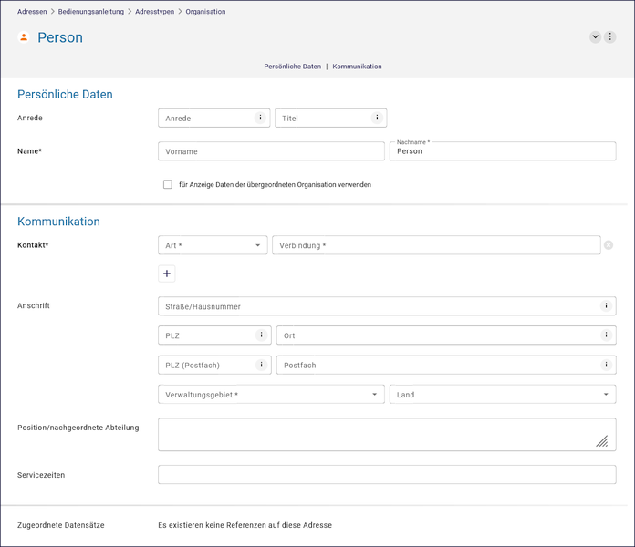
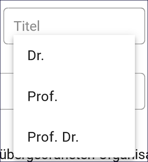
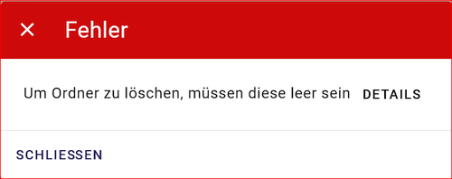
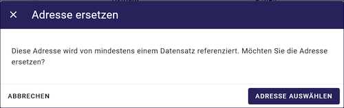

=================
Adressen erfassen
=================

Für eine effiziente Adressverwaltung empfiehlt es sich, hierarchische Strukturen aufzubauen, so dass erkennbar wird, welchem Referat bzw. welchem Fachbereich innerhalb welcher Institution der jeweilige Ansprechpartner angehört. Für Personen, die keiner Institution zugeordnet werden können, besteht die Möglichkeit, diese im Adress-Strukturbaum unterhalb des Bereiches "Freie Adressen" anzulegen. 

Abb.: Anlegen einer Adressstruktur

Zum Anlegen einer neuen Adresse muss zunächst eine Ordnerstruktur erstellt werden. Darunter können dann die Entsprechenden Adresstypen angelegt werden. 

Ordner/Adresse anlegen
----------------------

Im Strukturbaum den entsprechenden Ordner oder eine vorhandene Adresse auswählen. In der Symbolleiste auf das entsprechende Symbol klicken "Neue Adresse anlegen" oder "Ordner erstellen". Für die Strukturierung der Adressdaten kann zwischen Adresstypen "Organisation" und "Person" gewählt werden.

Abb.: Auswahl der Adresstypen

.. figure:: ../../img/ige/adressen/typ-waehlen.png
   :align: left
   :scale: 50
   :figwidth: 100%

Abb.: Adresstypen
 
Nach Auswahl des Adresstyps erscheint die Eingabemaske für die  Adresse rechts im Inhaltsfenster. Hier sehen Sie alle verfügbaren Felder und Informationen zu der ausgewählten Adresse. Diese Felder sind je nach Adresstyp unterschiedlich.

Standardmäßig werden zunächst nur die Pflichtfelder angezeigt. Neben den verpflichtenden Angaben (Bezeichnung / Name, Kontakt) können weitere Adressangaben (Anschrift, usw.) gespeichert werden. Durch einen Klick auf "+ HINZUFÜGEN", können weitere Kommunikationsmöglichkeiten eingetragen werden.

Abb.: Eingabemaske für Adressen

Abb.: Eingabefenster für die Wahl des Adresstyps

Abb.: Auswahlfeld Anrede

Abb.: Auswahlfeld Titel

.. hint:: Das Feld "Kontakt" ist ein Pflichtfeld und muss ausgefüllt werden. Es ist erforderlich, mindestens eine E-Mail-Adresse anzugeben. Fehlt diese Angabe, kann die Adresse zwar gespeichert werden, bei der Veröffentlichung kommt es jedoch zu folgender Fehlermeldung:
 

Abb.: Hinweis - alle Pflichtfelder ausfüllen

Wenn Sie die Reihenfolge der Kommunikationsmöglichkeiten ändern möchten, können Sie dies ganz einfach tun, indem Sie die sechs Punkte auf der linken Seite mit der Maus festhalten und die ganze Zeile nach oben oder unten verschieben.

Soll ein vorhandener Eintrag unter Kommunikation entfernt werden, ist es erforderlich, auf das Kreuz in der Zeile (rechts) zu klicken.

Abb.: Zeile löschen

.. hint:: In den Adressen vom Typ "Person" gibt es eine Checkbox mit dem Titel "Daten der übergeordneten Organisation für die Anzeige verwenden". Wenn diese Checkbox aktiviert ist, werden nur die Kontaktdaten der übergeordneten Organisation im Portal angezeigt, jedoch keine personenbezogenen Daten.

Abb.: Checkbox - für Anzeige Daten der übergeordneten Organisation verwenden

.. hint:: Es ist nicht notwendig, persönliche Adressen zu veröffentlichen. Es wird empfohlen, stattdessen nur die Organisation anzugeben.

Am Ende des Adressformulars befindet sich der Bereich "Zugeordnete Datensätze". Über den Button "ANZEIGEN" werden alle Metadatensätze aufgelistet, die mit diesem Adressdatensatz verknüpft sind.

Abb: Zugeordnete Datensätze anzeigen

Abb.: Zugeordnete Datensätze

Sind alle erforderlichen Felder ausgefüllt, kann die Adresse mit dem Button "VERÖFFENTLICHEN" für des Internet freigegeben werden.

Abb.: Veröffentlichen

.. hint:: Metadatensätze können erst veröffentlicht werden, wenn der verknüpfte Adressdatensatz zuvor veröffentlicht wurde.

Ordner/Adresse löschen
----------------------

Wenn versucht wird, einen Ordner/Adressdatensatz zu löschen, dem weitere Adressdatensätze untergeordnet sind, erscheint eine Fehlermeldung.

Abb: Fehlermeldung - Adresse löschen mit Unteradressen

.. hint:: Eine Adresse kann nur gelöscht werden, wenn ihr keine Metadatensätze mehr zugeordnet sind. Das heißt, die Liste der zugeordneten (Meta-)Datensätze muss leer sein.

Abb.: Hinweis zum Löschen des Adressdatensatzes

Wenn ein Adressdatensatz gelöscht werden soll und dieser noch mit (Meta-)Datensätzen verknüpft ist, müssen diese erst einer anderen Adresse zugeordnet werden. 

Abb.: Adresse ersetzen