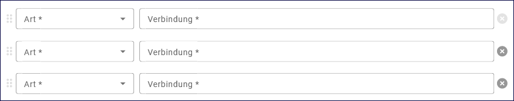

Adressen erfassen
=================

Für eine effiziente Adressverwaltung empfiehlt es sich, hierarchische Strukturen aufzubauen, so dass erkennbar wird, welchem Referat bzw. welchem Fachbereich innerhalb welcher Institution der jeweilige Ansprechpartner angehört. Für Personen, die keiner Institution zugeordnet werden können, besteht die Möglichkeit, diese im Adress-Strukturbaum unterhalb des Bereiches "Freie Adressen" anzulegen. 

Abb.: Anlegen einer Adressstruktur

Zum Anlegen einer neuen Adresse muss zunächst eine Ordnerstruktur erstellt werden. Darunter können dann die Entsprechenden Adresstypen angelegt werden. 

Anlegen eines Ordners oder einer Adresse
----------------------------------------

Im Strukturbaum den entsprechenden Ordner oder eine vorhandene Adresse auswählen. In der Symbolleiste auf das entsprechende Symbol klicken "Neue Adresse anlegen" oder "Ordner erstellen". Für die Strukturierung der Adressdaten kann zwischen Adresstypen "Organisation" und "Person" gewählt werden.

Abb.: Auswahl der Adresstypen

Abb.: Adresstypen
 
Nach Auswahl des Adresstyps erscheint die Eingabemaske für die  Adresse rechts im Inhaltsfenster. Hier sehen Sie alle verfügbaren Felder und Informationen zu der ausgewählten Adresse. Diese Felder sind je nach Adresstyp unterschiedlich.

Standardmäßig werden zunächst nur die Pflichtfelder angezeigt. Neben den verpflichtenden Angaben (Bezeichnung / Name, Kontakt) können weitere Adressangaben (Anschrift, usw.) gespeichert werden. Durch einen Klick auf "+ HINZUFÜGEN", können weitere Kommunikationsmöglichkeiten eingetragen werden.

Abb.: Eingabemaske für Adressen

Abb.: Eingabefenster für die Wahl des Adresstyps

Abb.: Auswahlfeld Anrede

Abb.: Auswahlfeld Titel

.. hint:: Das Feld „Kontakt“ ist ein Pflichtfeld und muss ausgefüllt werden (es muss mindestens eine E-Mail-Adresse angegeben werden). Fehlt diese Angabe, kann die Adresse zwar gespeichert werden, bei der Veröffentlichung kommt es jedoch zu folgender Fehlermeldung:

.. image:: ../../img/ige/meldungen/ige-ng_fehler_felder-korrekt-ausfuellen.png
   :width: 300

Abb.: Hinweis - alle Pflichtfelder ausfüllen

Sollen die Kommunikationsmöglichkeiten in ihrer Reihenfolge geändert werden, sind auf der linken Seite sechs Punkte, diese (mit der Maus) festhalten und die ganze Zeile nach oben oder unten verschieben.

Soll ein bestehender Eintrag unter Kommunikation gelöscht werden, muss in der Zeile auf das Kreuz (rechts) geklickt werden.

Abb.: Zeile löschen

.. hint::In den Adressen vom Typ "Person" gibt es die Checkbox "für Anzeige Daten der übergeordneten Organisation verwenden". Ist diese Checkbox aktiviert, werden im Portal die Kontaktdaten der übergeordneten Organisation angezeigt, die personenbezogen Daten nicht.

Abb.: Checkbox - für Anzeige Daten der übergeordneten Organisation verwenden

.. hint:: Es besteht keine Verpflichtung zur Veröffentlichung von persönlichen Adressen. Die Angabe einer Organisation ist ausreichend und wird empfohlen.

Am Ende der Eingabemaske für Adressen befindet sich der Abschnitt "Zugeordnete Datensätze". Über den Button "ANZEIGEN" können alle Metadatensätze aufgelistet werden, die mit diesem Adressdatensatz verknüpft sind.

Abb.: Zugeordnete Datensätze

Sind alle erforderlichen und zusätzlich Felder ausgefüllt, kann die Adresse mit dem Button "VERÖFFENTLICHEN" für das Internet freigegeben werden. 

Abb.: Veröffentlichen

.. hint:: Metadatensätze können nur veröffentlicht werden, wenn der verknüpfte Adressdatensatz vorher veröffentlicht wurde.

Löschen eines Ordners oder einer Adresse
----------------------------------------

Wird versucht einen Ordner/Adressdatensatz zu löschen, dem weitere Adressdatensätze untergeordent sind. erscheint die Fehlermeldung: Um Ordner zu löschen, müssen diese leer sein.

Abb: Fehlermeldung - Adresse löschen mit Unteradressen

.. hint:: Eine Adresse kann immer nur dann gelöscht werden, wenn dieser Adresse keine Metadatensätze mehr zugeordnet sind, d.h. die oben abgebildete Liste der zugeordneten Metadatensätze muss leer sein.

Abb.: Hinweis zum Löschen des Adressdatensatzes

Abb.: Adresse ersetzen