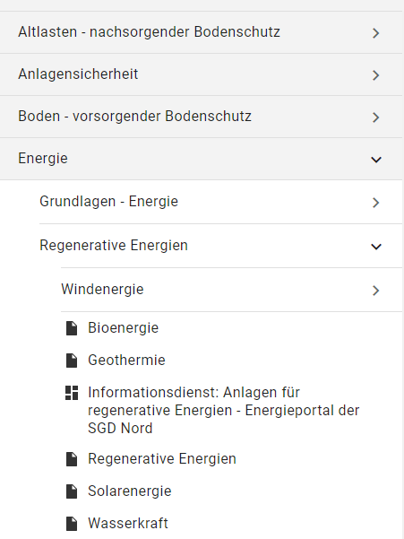
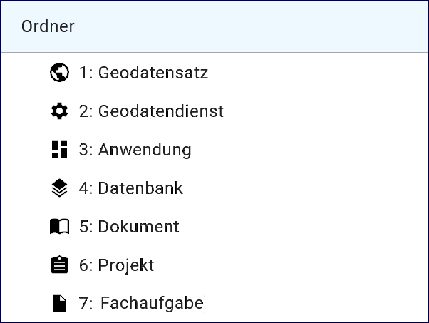
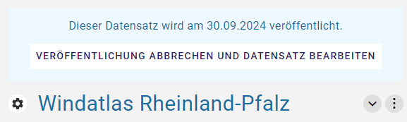
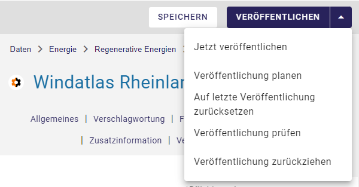

Der neue InGrid Editor
======================

Der neue InGrid Editor ist fertig programmiert und kann für die Erfassung von Metadaten eingesetzt werden.
Es sind viele Neuerungen eingeflossen. Es wurden Erfahrungen aus den letzten Jahren, eine benutzerfreundliche Bedienung, die Barrierefreiheit, ein responsives Layout (Darstellung auf unterschiedlichen Bildschirmen), eine Touch Bedienung für Tablets und Touch-Monitoren berücksichtigt.
Eine intuitive Bedienung soll die Eingabe von Daten erleichtern. Die Bedienungsanleitung wird fortlaufend an den Neuerungen des Editors angepasst und befindet sich noch in der Bearbeitung. Sie können uns gerne zum neuen InGrid Editor und zur Bedienungsanleitung ein Feedback über das `METAVER Kontaktformular <https://metaver.de/kontakt>`_ senden, wir sind an Ihrer Meinung interessiert.

InGrid Editor im Ausgangszustand
--------------------------------
 
Nach dem Laden des InGrid Editors wird die Übersicht angezeigt. Dargestellt werden Metadaten bzw. Adressen die zuletzt bearbeitet wurden und eine Statistik wie viele Metadaten sich in Bearbeitung befinden und wie viele veröffentlicht wurden.

.. figure:: ../../img/ige/allgemein/uebersicht.png
   
Abb.: Übersicht

Aufbau der Benutzeroberfläche
-----------------------------

.. figure:: ../../img/ige/allgemein/benutzeroberflaeche.png
   
Abb.: InGrid Editor - Benutzeroberfläche

Aufbau der Benutzeroberfläche:

* linke Seite - Navigation
* Seitenmitte - Ordnerstruktur
* rechte Seite - Datenerfassung

Strukturierung der Daten
------------------------

Im InGrid Editor können die Daten mit Hilfe von Ordnern strukturiert werden.

Abb.: InGrid - Ordnersymbol im Eingabeformular

   
Abb.: InGrid Editor - Aufbau der Ordnerstruktur

Durch Klicken auf den Pfeil nach rechts wird die Ordnerstruktur ausgeklappt bzw. durch Anklicken des Pfeils nach unten wird die Struktur geschlossen.
 

Metadatentypen
--------------

Im InGrid Editor gibt es verschiedene Metadatentypen bzw. Adresstypen. 

**Daten**

Abb.: Metadatentypen in der Ordnerstruktur

**Adressen**

Abb.: Adresstypen in der Ordnerstruktur

Symbole - Bearbeitungsstatus
----------------------------

Neben Metadatentypen bzw. dem Adresstyp zeigen die Icons zusätzlich den jeweiligen Bearbeitungsstatus an.

.. csv-table::
   :widths: 50, 150, 300

   Symbol , Farbe , Beschreibung
   .. figure:: ../../img/ige/allgemein/icon_bearbeitungsstatus-gespeichert.png , orange , Der Metadatensatz bzw. die Adresse wurde angelegt und gespeichert und befinden sich in Bearbeitung.
	.. figure:: ../../img/ige/allgemein/icon_bearbeitungsstatus-veroeffentlicht.png, schwarz , Der Metadatensatz bzw. die Adresse wurde veröffentlicht
   .. figure:: ../../img/ige/allgemein/icon_bearbeitungsstatus-in-bearbeitung.png , orange und schwarz , Es handelt sich um eine veröffentlichte Version des Metadatensatzes bzw. der Adresse - der Metadatensatz wurde bearbeitet aber noch nicht erneut veröffentlicht.

Berechtigungen zu den Metadaten
-------------------------------

Über das Drei-Punkte-Menü, auf der rechten Seite der Erfassungsmaske können verschiedene Berechtigungen vergeben werden.

.. figure:: ../../img/ige/allgemein/auswahl_veroeffentlichungsrecht.png
   :align: left
   :scale: 50
   :figwidth: 100%

Veröffenlichungsrecht setzten ...
^^^^^^^^^^^^^^^^^^^^^^^^^^^^^^^^^^

Abb.: Veröffentlichungsrecht setzten

An den Symbolen wird durch einen Punkt die Veröffentlichungsbreite der Adresse oder des Metadatensatzes angezeigt.

.. csv-table::
   :widths: 50, 150, 300

   Symbol , Markierung , Beschreibung
   .. figure:: ../../img/ige/allgemein/icon_veroeffentlichungsrecht-internet.png , ohne Punkt , Der Metadatensatz bzw. die Adresse wird im Internet veröffentlicht
   .. figure:: ../../img/ige/allgemein/icon_veroeffentlichungsrecht-intranet.png, blauer Punkt , Der Metadatensatz bzw. die Adresse wird im Intranet veröffentlicht
   .. figure:: ../../img/ige/allgemein/icon_veroeffentlichungsrecht-amtsintern.png , roter Punkt , Der Metadatensatz bzw. die Adresse ist auf amtsintern gesetzt und wird nicht veröffentlicht.

Verantwortlichkeit ändern
^^^^^^^^^^^^^^^^^^^^^^^^^

Berechtigungen anzeigen
^^^^^^^^^^^^^^^^^^^^^^^

Menü
----

.. figure:: ../../img/ige/allgemein/menue.png
   :width: 300
   
Abb.: Menü Symbole mit Beschriftung

.. figure:: ../../img/ige/allgemein/menu_verkleinern.png
   :width: 150
   
Abb.: Menü verkleinern

.. figure:: ../../img/ige/allgemein/menue_verkleinert.png
   :height: 300
   
Abb.: Menü (verkleinernert) - Symbole

.. figure:: ../../img/ige/allgemein/menue_vergroessern.png
   :width: 50
   
Abb.: Menü vergrößern

Symbolleiste
------------

.. figure:: ../../img/ige/allgemein/toolbar.png
   :width: 600
   
Abb.: Symbolleiste

Hier im Einzelnen die zur Verfügung stehenden Werkzeuge: 

.. csv-table::
   :widths: 30, 400

    Symbol , Bezeichnung
    .. figure:: ../../img/ige/allgemein/symbolleiste_metadaten-anlegen.png , Adressdaten oder Metadaten anlegen
    .. figure:: ../../img/ige/allgemein/symbolleiste_ordner-erstellen.png , Ordner erstellen
    .. figure:: ../../img/ige/allgemein/symbolleiste_assistent.png , GetCapabilities-Assistent für Geodatendienste
	 .. figure:: ../../img/ige/allgemein/symbolleiste_vorschau-druckfunktion.png, Vorschau- und Druckfunktion 
    .. figure:: ../../img/ige/allgemein/symbolleiste_kopieren-verschieben.png , Kopieren / Verschieben
    .. figure:: ../../img/ige/allgemein/symbolleiste_iso.png , ISO-Ansicht
	 .. figure:: ../../img/ige/allgemein/symbolleiste_loeschen.png , Löschen
	 .. figure:: ../../img/ige/allgemein/symbolleiste_zum-letzten-dokument.png , Springe zum letzten Dokument
	 .. figure:: ../../img/ige/allgemein/symbolleiste_zum-naechsten-dokument.png , Springe zum nächsten Dokument

Abb.: Symbolleiste - Untermenü für Kopieren / Verschieben

Der getCapabilities Assistent
-----------------------------

Abb.: Symbolleiste -  getCapabilities-Assistent

Für die Erfassung von Geodatendiensten (WMS, WFS, WCS, WCTS, WMTS und CSW) kann der getCapabilities-Assistent genutzt werden. Neu ist, dass der Assistent über die Symbolleiste aufgerufen werden muss. In dem sich öffnenden Fenster ist die getCapabilitie-URL einzutragen. Mit den Button "ÜBERNEHMEN" die Opreationen im Hintergrund verarbeitet, so dass die Erfassung von OGC konformen Diensten erheblich vereinfacht wird. Die Ergebnisse der Analyse werden angezeigt, es kann eine Auswahl der Metadaten vorgenommen werden, die in den Metadatensatz übernommen werden sollen. Anschließend kann der Datensatz im InGrid Editor weiterbearbeitet und gespeichert werden.

Eine ausführliche Beschreibung für diese Funktion erfolgt im Datensatztyp `Geodatendienst <https://metaver-bedienungsanleitung.readthedocs.io/de/igeng/ingrid-editor/erfassung/datensatztypen/datensatztyp-geodatendienst.html>`_.

.. hint:: Der Allgemeine Erfassungsassistent ist im neuen InGrid Editor entfallen.

Alle - Felder anzeigen
----------------------

Je nach Auswahl des Datensatztyps, werden in der Erfassungsmaske des InGrid Editors unterschiedliche Felder angezeigt. Die Pflichtfelder unterscheiden sich zwischen den Datensatztypen. Am umfangreichsten ist der Datensatztyp "Geodatensatz", der Typ "Fachaufgabe" ist dagegen am schnellsten zu befüllen.

Über den Schalter "Alle" oben. rechts (im grauen Bereich) können weitere Optionalke Felder eingeblendet werde.

.. figure:: ../../img/ige/allgemein/alle.png
   :align: left
   :scale: 50
   :figwidth: 100%

Abb.: Schalter für das Ein- und Ausblenden von optionalen Feldern

.. hint:: Grundsätzlich wird empfohlen, nicht nur die Pflichtfelder auszufüllen, sondern auch die optionalen Felder (soweit möglich) mit Einträgen zu versehen, um einen Mehrwert zu erzielen.

Ordner-Navigation
-----------------

Im grauen Bereich der Erfassungsmaske befindet sich die Ordner-Navigation. Hier benommen Benutzer anzeigt, in welcher Ordner-Ebene sie sich gerade befinden.

.. figure:: ../../img/ige/allgemein/ordner-navigation.png
   :align: left
   :scale: 50
   :figwidth: 100%

Abb.: Ordner-Navigation

Sprungmarken
------------

Unter dem Titel des Datensates (ebenfalls im grauen Bereich) befindet sich die Sprungmarken, über diese Navigation können Benutzer schnell in die verschiedenen Abschnitte der Erfassungsmaske springen ohne lange scrollen zu müssen.

.. figure:: ../../img/ige/allgemein/sprungmarken.png
   :align: left
   :scale: 50
   :figwidth: 100%

Abb.: Sprungmarken

Eingabefelder
-------------

Im InGrid Editor gibt es eine Vielzahl von Feldern, die ausgefüllt werden können, es müssen jedoch nicht immer alle Felder belegt werden. Für jedes Verfahren bzw. jede Adresse gibt es jedoch sogenannte Pflichtfelder, die auf jeden Fall ausgefüllt werden müssen. Ohne die Befüllung dieser Pflichtfelder lässt sich der Datensatz nicht abspeichern! Gekennzeichnet sind diese Pflichtfelder durch ein Sternchen. 

.. figure:: ../../img/ige/allgemein/felder.png

Abb.: Eingabefelder mit * sind Pflichtfelder

Unterschiedliche Feldtypen
--------------------------

**Textfelder**

Zum Füllen von Textfeldern klicken Sie in das Feld. Zum Vergrößern des Feldes, ziehen Sie mit der Maus an der rechten unteren Ecke (linke Maustaste gedrückt halten).

.. figure:: ../../img/ige/allgemein/feldtyp_textfeld.png

Abb.:  Feldtyp - Textfeld

In Textfeldern dürfen die folgenden Tags verwendet werden:
<b></b>, <i></i>, <u></u>, 

,    , <strong></strong>, <ul></ul>, <ol></ol>, <li></li>

**Datumsangaben**

Der Kalender wird über das Kalendersymbol an der rechten Seite des Feldes aufgeklappt.

**Auswahllisten**

Auswahllisten werden über den Pfeil an der rechten Seite des Feldes aufgeklappt. Das „Autocomplete Feature“ sorgt dafür, dass bei der Eingabe Vorschläge angezeigt werden.

.. figure:: ../../img/ige/allgemein/feldtyp_auswahl.png
   :width: 500

Abb.: Feldtyp - Auswahllisten und Datumsangabe

Speichern & Veröffentlichen
---------------------------

Im InGrid Editor werden zwei Speicherarten unterschieden: 

Das "SPEICHERN" speichert den geänderten bzw. neu erfassten Datensatz, die Daten werden allerdings noch nicht für die Veröffentlichung im Internet freigegeben, d.h. sie bleiben weiterhin nur in der Ordnerstruktur des InGrid Editors sichtbar. Das Speichern ist jederzeit möglich, auch wenn noch nicht alle Pflichtfelder ausgefüllt sind.

.. figure:: ../../img/ige/allgemein/speichern.png
   :width: 300

Abb.: Speichern

Mit dem abschließenden "VERÖFFENTLICHEN" werden die Daten für das Internet freigegeben.

.. figure:: ../../img/ige/allgemein/veroeffentlichen.png
   :width: 300

Abb.: Veröffentlichen

Voraussetzung für das "VERÖFFENTLICHEN" ist die Befüllung sämtlicher Pflichtfelder. Fehlen entsprechende Angaben, erscheint bei der Betätigung des Buttons "VERÖFFENTLICHEN" eine Fehlermeldung und die Überschriften der entsprechenden Felder werden in rot angezeigt. 

.. figure:: ../../img/ige/allgemein/fehler_felder-korrekt-ausfuellen.png
   :width: 300

Abb.: Hinweis - Alle Pflichtfelder ausfüllen

Um trotz der Fehlermeldung die Bearbeitung sichern zu können, wählen Sie die Funktion "SPEICHERN".

.. figure:: ../../img/ige/allgemein/meldungen_ein-eintrag-erwartet.png
   :width: 400

Abb.: Hinweis am Feld - Dieses Feld muss ausgefüllt sein

Felder, die nicht korrekt ausgefüllt sind, werden mit der Anmerkung "Es wird mindestens ein Eintrag erwartet" gekennzeichnet.

Zeitgesteuerte Veröffentlichung
-------------------------------

.. figure:: ../../img/ige/allgemein/veroeffentlichen.png
   :width: 300
   
Abb.: VERÖFFENTLICHEN

Abb.: Dialogfenster - Auswahl für Veröffentlichungsvarianten
   
.. figure:: ../../img/ige/allgemein/veroeffentlichung-planen-kalender.png
   :width: 300

Abb.: Dialogfenster - Auswahl für Veröffentlichungsdatum

Das Veröffentlichungsdatum wird danach im Kopfbereich des Datensatzes angezeigt.

Abb.: Kopfbereich der Eingabemaske - Anzeige des Veröffentlichungsdatums

Unter dem Veröffentlichungsdatum befindet sich der Button "VERÖFFENTLICHUNG ABBRECHEN UND DATENSATZ BEARBEITEN". Nach Betätigung erscheint ein grünes Feld mit dem Hinweis: "Die geplante Veröffentlichung wurde abgebrochen."

Optionen für die Veröffentlichung
---------------------------------
   
Rechts von VERÖFFENTLICHEN befindet sich der Button für verschiedene Optionen (Pfeil nach unten).

.. figure:: ../../img/ige/allgemein/veroeffentlichung_planen.png
   :width: 300
   
Abb.: Fenster mit Optionen für die Veröffentlichung
   

Option: "Jetzt veröffentlichen"
^^^^^^^^^^^^^^^^^^^^^^^^^^^^^^^

Der Button VERÖFFENTLICHEN und die Option "Jetzt veröffentlichen" haben die selbe Funktionalität.

.. figure:: ../../img/ige/allgemein/veroeffentlichung.png
   :width: 500

Abb.: Dialogfenster - Auswahl für Veröffentlichungsvarianten

.. figure:: ../../img/ige/allgemein/veroeffentlichen_meldung.png

Abb.: Meldung: Das Dokument wurde veröffentlicht

Option: "Veröffentlichung planen"
^^^^^^^^^^^^^^^^^^^^^^^^^^^^^^^^

Datensätze können zu einem zukünftigen Zeitpunkt veröffentlicht werden. Bei der Veröffentlichung wird nach der Validierung das Dialogfenster "Veröffentlichen" angezeigt, in dem ein zukünftiges Veröffentlichungsdatum "VERÖFFENTLICHUNG PLANEN" ausgewählt werden kann. Es öffnet sich dann ein weiteres Fenster "Veröffentlichen planen" mit einer Kalenderfunktion, hier kann das Veröffentlichungsdatum gewählt werden.

.. figure:: ../../img/ige/allgemein/veroeffentlichen_planen.png
   :width: 300

Abb.: Funktion Veröffentlichung planen - Angabe eines Datums
   
   

Abb.: Meldung für die geplante Veröffentlichung

Abb.: Meldung für: VERÖFFENTLICHUNG ABBRECHEN UND DATENSATZ BEARBEITEN

Option: "Auf letzte Veröffentlichung zurücksetzten"
^^^^^^^^^^^^^^^^^^^^^^^^^^^^^^^^^^^^^^^^^^^^^^^^^^^

Wurde ein Metadatensatz veröffentlicht und danach eine Änderung in die Metadaten eingefügt und gespeichert (Symbol orange/schwarz), so lässt sich diese Änderung über die Funktion "Auf letzte Veröffentlichung zurücksetzen" rückgängig machen (Symbol schwarz).

Abb.: Auf letzte Veröffentlichung zurücksetzen

Option: "Veröffentlichung zurückziehen"
^^^^^^^^^^^^^^^^^^^^^^^^^^^^^^^^^^^^^^^

Für diese Option müssen im jeweiligen Bundesland Festlegungen getroffen werden, wann veröffentlichte Datensätze zurückgezogen werden dürfen.

Abb.: Abfrage ob die Veröffentlichung wirklich zurückgezogen werden soll

Abb.: Meldung, dass für diesen Datensatz die Veröffentlichung zurückgezogen wurde.

Adressen und Metadaten suchen
-----------------------------

Die Beschreibung wie Adressen oder Metadaten gesucht werden können, steht unter dem Block "Funktionen im InGrid Editor", Abschnitt `"Suche" <...>`_.

Metadaten anzeigen
------------------

.. figure:: ../../img/ige/allgemein/kopf_metadaten-anzeigen.png

Abb.: Metadaten - Metainformationen anzeigen

.. figure:: ../../img/ige/allgemein/kopf_metadaten-ansicht.png

Abb.: Metadaten - Metainformationen  - Metadaten

Besuchszeit ist abgelaufen (Logout)
-------------------------------------------

Wenn eine längere Zeit (30 Minuten) keine Interaktion mit dem Editor stattfindet, läuft die Besuchszeit ab. 5 Minuten vor Ablauf der Besuchszeit erscheint oben in der Seite ein Countdown. Ist der Countdown angelaufen wird der Benutzer aus dem InGrid Editor ausgeloggt und muss sich am Editor neu anmelden. Optional kann der "Refresh-Button" betätigt werden, dann beginnt der Countdown erneut. 

.. figure:: ../../img/ige/allgemein/editor_countdown.png
   :width: 300

Abb.: Countdown für den Logout und "Session-refresh-Button"

.. figure:: ../../img/ige/allgemein/fehler_timeout.png
   :width: 400

Abb.: Meldung - Besuchszeit abgelaufen

Damit gehen leider auch alle Änderungen und Neueingaben verloren, die bis zu diesem Zeitpunkt noch nicht gespeichert worden sind. Es gibt keine automatische Zwischenspeicherung! Es empfiehlt sich daher, bei der Erfassung von Verfahrenen und Adressen immer wieder zwischendurch zwischen zu speichern. (Ein automatisches Zwischenspeichern ist zukünftig vorgesehen.)

InGrid Editor schließen
-----------------------

Soll der InGrid Editor beendet werden, muss auf der Seite (oben rechts) der Punkt für die Profilverwaltung betätigt werden.

Abb.: Profilverwaltung mit Button "ABMELDEN"
