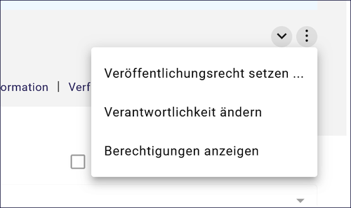
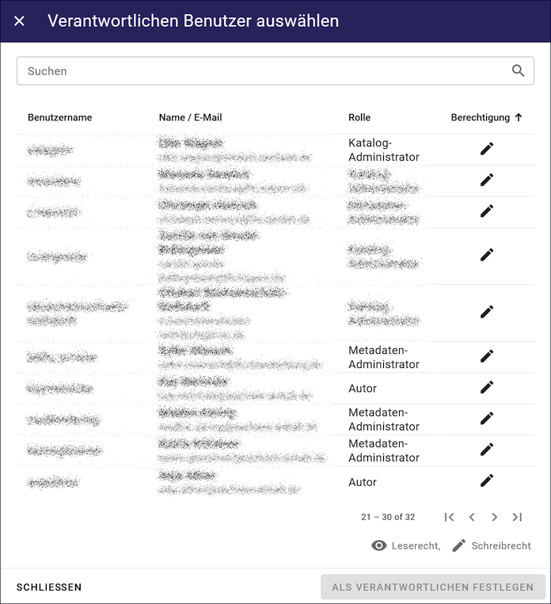
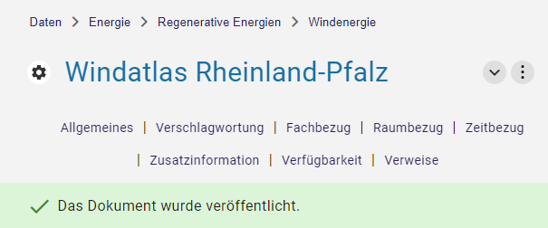
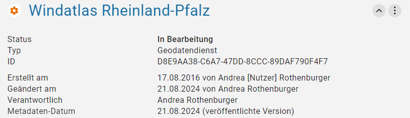
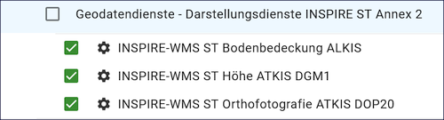
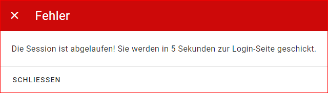

======================
Der neue InGrid Editor
======================

Der neue InGrid Editor zur Erfassung von ISO-Metadaten wurde technisch von Grund auf erneuert. Er enthält eine Vielzahl an Verbesserungen. Benutzerfreundlichkeit, Barrierefreiheit, responsives Layout für unterschiedliche Bildschirme sowie Touch-Bedienung für Tablets und Touch-Monitore, wurden berücksichtigt. Eine intuitive Bedienung erleichtert die Eingabe der Daten. Der Editor wurde für den Einsatz im BKG angepasst. 

InGrid Editor - Übersicht
-------------------------
 
 Nach Start des Editors wird dem Nutzer eine Übersicht der zuletzt bearbeiteten Metadaten angezeigt. Dazu erscheint ein Diagram, das die Anzahl der in Bearbeitung befindlichen und veröffentlichten Metadaten darstellt.

.. figure:: ../../img/ige/allgemein/uebersicht.png
   :align: left
   :scale: 100
   :figwidth: 100%
   
Abb.: Übersicht

Aufbau der Benutzeroberfläche
-----------------------------

   
Abb.: InGrid Editor - Benutzeroberfläche

Aufbau der Benutzeroberfläche:

* linke Seite - Navigation
* Seitenmitte - Ordnerstruktur
* rechte Seite - Datenerfassung

Strukturierung der Daten
------------------------

Im InGrid Editor können Daten strukturiert werden. Im BKG wurde die Struktur vom Fachverfahrensverantwortlichen vorbereitet. 

   
Abb.: InGrid Editor - Aufbau der Ordnerstruktur im BKG

 

Metadatentypen
--------------

Im InGrid-Editor gibt es verschiedene Arten von Metadaten- oder Adress-Typen. 

**Daten**

Im BKG erfassen wir aktuell ISO-Metadaten lediglich für "Geodatensätze", "Geodatendienste" und "Anwendungen". Daher sind bitte nur diese Objektarten zu verwenden.

Abb.: Metadatentypen in der Ordnerstruktur

**Adressen**

.. figure:: ../../img/ige/allgemein/icons-adressen.png
   :align: left
   :scale: 60
   :figwidth: 100%

Abb.: Adresstypen in der Ordnerstruktur

Im BKG werden Adressen nur vom Fachadministrator im Editor angelegt. Bitte nehmen Sie bei Bedarf an einer neuer Adresse Kontakt mit dem Fachverfahrensverantwortlichen der Anwendung auf. Die derzeit verfügbaren Adressen (Stand: März 2025) sind die in der folgenden Abbildung sichtbaren Adressdatensätze:

Abb.: Adresstypen in der Ordnerstruktur

Symbole - Bearbeitungsstatus
----------------------------

Neben den Metadaten- und Adresstypen zeigen die Icons auch den Bearbeitungsstatus an, um eine bessere Übersicht zu gewährleisten.

.. csv-table::
   :widths: 50, 150, 300

   Symbol , Farbe , Beschreibung
   .. figure:: ../../img/ige/allgemein/icon_bearbeitungsstatus-gespeichert.png , orange , Der Metadatensatz bzw. die Adresse wurde angelegt und gespeichert und befinden sich in Bearbeitung.
	.. figure:: ../../img/ige/allgemein/icon_bearbeitungsstatus-veroeffentlicht.png, schwarz , Der Metadatensatz bzw. die Adresse wurde veröffentlicht
   .. figure:: ../../img/ige/allgemein/icon_bearbeitungsstatus-in-bearbeitung.png , orange und schwarz , Es handelt sich um eine veröffentlichte Version des Metadatensatzes bzw. der Adresse - der Metadatensatz wurde bearbeitet aber noch nicht erneut veröffentlicht.

Berechtigungen zu den Metadaten 
-------------------------------
(Nur für Administratoren sichtbar.)

Über das Drei-Punkte-Menü, auf der rechten Seite der Erfassungsmaske können verschiedene Berechtigungen vergeben werden.

Veröffenlichungsrecht setzen ...
^^^^^^^^^^^^^^^^^^^^^^^^^^^^^^^^^^

.. figure:: ../../img/ige/erfassung/ige_metadaten/abschnitt-01_kopf/veroeffentlichungsrecht_setzen.png
   :align: left
   :scale: 50
   :figwidth: 100%

Abb.: Veröffentlichungsrechte für Internet, Intranet und amtsintern

Anhand der Symbole in der Ordnerstruktur wird durch einen Punkt das Veröffentlichungsrecht der Adresse oder des Metadatensatzes angezeigt.

.. csv-table::
   :widths: 50, 150, 300

   Symbol , Markierung , Beschreibung
   .. figure:: ../../img/ige/allgemein/icon_veroeffentlichungsrecht-internet.png , ohne Punkt , Der Metadatensatz bzw. die Adresse wird im Internet veröffentlicht
   .. figure:: ../../img/ige/allgemein/icon_veroeffentlichungsrecht-intranet.png, blauer Punkt , Der Metadatensatz bzw. die Adresse wird im Intranet veröffentlicht
   .. figure:: ../../img/ige/allgemein/icon_veroeffentlichungsrecht-amtsintern.png , roter Punkt , Der Metadatensatz bzw. die Adresse ist auf amtsintern gesetzt. Der Datensatz ist nur im Editor sichtbar.

.. hint:: Der neue InGrid Editor wurde um eine Funktion erweitert. Datensätze, die bereits im Internet veröffentlicht wurden, können über die Funktion "Veröffentlichung zurückziehen" (Menü - Pfeil neben dem Button VERÖFFENTLICHEN) wieder aus dem Internet zurückgezogen werden. Das Icon in der Ordnerstruktur erscheint dann wieder komplett orange.  In der Statistik der Übersichtsseite und in der Statistik der Berichte verringern sich dann die Zahlen der veröffentlichten Datensätze, die Zahlen der in Bearbeitung befindlichen Datensätze erhöhen sich. Das Veröffentlichungsrecht amtsintern ist dann noch ein zusätzlicher Schutz vor der Veröffentlichung im Internet.

Berechtigungen anzeigen
^^^^^^^^^^^^^^^^^^^^^^^

Abb.: Berechtigungen anzeigen

Verantwortlichkeit ändern
^^^^^^^^^^^^^^^^^^^^^^^^^
(Nur für Administratoren sichtbar.)

Abb.: Auswahl Verantwortung für den Metadatensatz

Nachdem ein neuer Metadatensatz erstellt wurde, wird automatisch die Person als verantwortlich eingetragen, die den Metadatensatz erstellt hat. In der Regel ist der Erfasser auch die fachlich verantwortliche Person (Standardeinstellung). Die Person, die für die Aktualisierung der Metadaten zuständig ist, sollte als Verantwortliche eingetragen werden.

Menü
----

.. figure:: ../../img/ige/allgemein/menue.png
   :align: left
   :scale: 60
   :figwidth: 100%
   
Abb.: Menü Symbole mit Beschriftung

   
Abb.: Menü verkleinern

.. figure:: ../../img/ige/allgemein/menue_verkleinert.png
   :align: left
   :scale: 70
   :figwidth: 100%
   
Abb.: Menü (verkleinernert) - Symbole

.. figure:: ../../img/ige/allgemein/menue_vergroessern.png
   :align: left
   :scale: 70
   :figwidth: 100%
   
Abb.: Menü vergrößern

Symbolleiste
------------

.. figure:: ../../img/ige/allgemein/toolbar.png
   :align: left
   :scale: 70
   :figwidth: 100%
   
Abb.: Symbolleiste

Hier im Einzelnen die zur Verfügung stehenden Werkzeuge: 

.. csv-table::
   :widths: 30, 400

    Symbol , Bezeichnung
    .. figure:: ../../img/ige/allgemein/symbolleiste_metadaten-anlegen.png , Adressdaten oder Metadaten anlegen
    .. figure:: ../../img/ige/allgemein/symbolleiste_ordner-erstellen.png , Ordner erstellen
    .. figure:: ../../img/ige/allgemein/symbolleiste_assistent.png , GetCapabilities-Assistent für Geodatendienste
	 .. figure:: ../../img/ige/allgemein/symbolleiste_vorschau-druckfunktion.png, Vorschau- und Druckfunktion 
    .. figure:: ../../img/ige/allgemein/symbolleiste_kopieren-verschieben.png , Kopieren / Verschieben
    .. figure:: ../../img/ige/allgemein/symbolleiste_iso.png , ISO-Ansicht
	 .. figure:: ../../img/ige/allgemein/symbolleiste_loeschen.png , Löschen
	 .. figure:: ../../img/ige/allgemein/symbolleiste_zum-letzten-dokument.png , Springe zum letzten Dokument
	 .. figure:: ../../img/ige/allgemein/symbolleiste_zum-naechsten-dokument.png , Springe zum nächsten Dokument

.. figure:: ../../img/ige/allgemein/toolbar_submenue.png
   :align: left
   :scale: 50
   :figwidth: 100%

Abb.: Symbolleiste - Untermenü für Kopieren / Verschieben

Der getCapabilities Assistent
-----------------------------

.. figure:: ../../img/ige/allgemein/assistent.png
   :align: left
   :scale: 50
   :figwidth: 100%

Abb.: Symbolleiste -  getCapabilities-Assistent

Für die Erfassung von Geodatendiensten (WMS, WFS, WCS, WCTS, WMTS und CSW) kann der getCapabilities-Assistent genutzt werden. Es ist neu, dass der Assistent über die Symbolleiste aufgerufen werden muss. In dem sich öffnenden Fenster muss die getCapabilities-URL eingetragen werden. Nachdem der Button "ÜBERNEHMEN" betätigt wurde, werden die Operationen im Hintergrund verarbeitet, wodurch die Erfassung von OGC-konformen Diensten erheblich vereinfacht wird. Die Analyseergebnisse werden angezeigt und es besteht die Möglichkeit, auszuwählen, welche Metadaten in den Metadatensatz übernommen werden sollen. Danach kann der Datensatz im InGrid Editor weiter bearbeitet und gespeichert werden.

Eine ausführliche Beschreibung für diese Funktion erfolgt im Datensatztyp `Geodatendienst <https://metaver-bedienungsanleitung.readthedocs.io/de/latest/ingrid-editor/erfassung/datensatztypen/datensatztyp-geodatendienst.html>`_.

.. hint:: Der Allgemeine Erfassungsassistent wurde aus dem neuen InGrid Editor entfernt.

Alle - Felder anzeigen
----------------------

Je nach gewähltem Datensatztyp werden in der Erfassungsmaske des InGrid-Editors verschiedene Felder angezeigt. Die Pflichtfelder sind abhängig von dem jeweiligen Datensatztyp und variieren dementsprechend. Der Datensatztyp "Geodatensatz" ist dabei am umfangreichsten, während der Typ "Fachaufgabe" am schnellsten zu befüllen ist.

Über den Schalter "Alle" oben rechts im grauen Bereich können weitere optionale Felder eingeblendet werden.

Abb.: Schalter für das Ein- und Ausblenden von optionalen Feldern

.. hint:: Grundsätzlich empfehlen wir, nicht nur die Pflichtfelder auszufüllen, sondern auch soweit wie möglich die optionalen Felder mit Einträgen zu versehen, um einen Mehrwert zu erzielen. 

Ordner-Navigation
-----------------

Im grauen Bereich der Erfassungsmaske befindet sich die Ordner-Navigation, die dem Benutzer anzeigt, in welcher Ordner-Ebene er sich gerade befindet.

Abb.: Ordner-Navigation

Sprungmarken
------------

Unter dem Titel des Datensatzes (ebenfalls im grauen Bereich) sind Sprungmarken zu finden, mit deren Hilfe Benutzer schnell zu verschiedenen Abschnitten der Erfassungsmaske springen können, ohne lange scrollen zu müssen.

Abb.: Sprungmarken

Eingabefelder
-------------

Im InGrid Editor stehen eine Vielzahl an Feldern zur Verfügung, doch nicht alle Felder müssen zwingend ausgefüllt werden. Jeder Metadatensatz oder jede Adresse hat jedoch Pflichtfelder, die unbedingt ausgefüllt werden müssen. Ohne die Befüllung dieser Pflichtfelder ist das Abspeichern des Datensatzes nicht möglich. Diese Pflichtfelder sind durch ein Sternchen gekennzeichnet. 

.. figure:: ../../img/ige/allgemein/felder.png
   :align: left
   :scale: 70
   :figwidth: 100%

Abb.: Eingabefelder mit * sind Pflichtfelder

Unterschiedliche Feldtypen
--------------------------

**Textfelder**

Zum Füllen von Textfeldern klicken Sie in das Feld. Zum Vergrößern des Feldes, ziehen Sie mit der Maus an der rechten unteren Ecke (linke Maustaste gedrückt halten).

Abb.:  Feldtyp - Textfeld

In Textfeldern dürfen die folgenden HTML-Tags verwendet werden:
<b></b>, <i></i>, <u></u>, 

,    , <strong></strong>, <ul></ul>, <ol></ol>, <li></li>

**Datumsangaben**

Der Kalender lässt sich über das Kalendersymbol auf der rechten Seite des Feldes öffnen.

**Auswahllisten**

Auswahl-Listen können über den Pfeil auf der rechten Seite des Feldes aufgeklappt werden. Das "Autocomplete"-Feature zeigt Vorschläge während der Eingabe an.

Abb.: Feldtyp - Auswahllisten und Datumsangabe

Speichern & Veröffentlichen
---------------------------

Im InGrid Editor gibt es zwei Speicheroptionen: "Speichern" speichert den bearbeiteten oder neu erstellten Datensatz, aber die Daten werden noch nicht im Internet veröffentlicht. Sie bleiben nur in der Ordnerstruktur des InGrid Editors sichtbar. Das Speichern ist jederzeit möglich, auch wenn alle Pflichtfelder noch nicht ausgefüllt wurden.

.. figure:: ../../img/ige/allgemein/speichern.png
   :align: left
   :scale: 100
   :figwidth: 100%

Abb.: Speichern

Mit dem abschließenden "VERÖFFENTLICHEN" werden die Daten für das Internet freigegeben.

Abb.: Veröffentlichen

Um den Vorgang "Veröffentlichen" zu ermöglichen, müssen alle Pflichtfelder ausgefüllt werden. Fehlen notwendige Angaben, erscheint beim Betätigen des Buttons "Veröffentlichen" eine Fehlermeldung und die Überschriften der fehlenden Felder werden rot angezeigt. 

Abb.: Hinweis - Alle Pflichtfelder ausfüllen

Um trotz der Fehlermeldung die Bearbeitung zu sichern, wählen Sie die Funktion "SPEICHERN".

.. figure:: ../../img/ige/allgemein/meldungen_ein-eintrag-erwartet.png
   :align: left
   :scale: 70
   :figwidth: 100%

Abb.: Hinweis am Feld - Dieses Feld muss ausgefüllt sein

Felder, die nicht korrekt ausgefüllt sind, werden mit der Anmerkung "Es wird mindestens ein Eintrag erwartet" gekennzeichnet.

Zeitgesteuerte Veröffentlichung
-------------------------------

   
Abb.: VERÖFFENTLICHEN

.. figure:: ../../img/ige/allgemein/veroeffentlichung_planen.png
   :align: left
   :scale: 50
   :figwidth: 100%

Abb.: Dialogfenster - Auswahl für Veröffentlichungsvarianten

.. figure:: ../../img/ige/allgemein/veroeffentlichung-planen-kalender.png
   :align: left
   :scale: 50
   :figwidth: 100%

Abb.: Dialogfenster - Auswahl für Veröffentlichungsdatum

Das Veröffentlichungsdatum wird danach im Kopfbereich des Datensatzes angezeigt.

.. figure:: ../../img/ige/allgemein/anzeige-veroeffentlichung.png
   :align: left
   :scale: 90
   :figwidth: 100%

Abb.: Kopfbereich der Eingabemaske - Anzeige des Veröffentlichungsdatums

Unterhalb des Veröffentlichungsdatums befindet sich ein Button mit der Beschriftung "Veröffentlichung abbrechen und Datensatz bearbeiten". Nach dem Klick darauf erscheint ein grünes Feld mit der Meldung: "Die geplante Veröffentlichung wurde abgebrochen".

Optionen für die Veröffentlichung
---------------------------------
   
Rechts neben VERÖFFENTLICHEN befindet sich der Button für verschiedene Optionen (Pfeil nach unten).

.. figure:: ../../img/ige/allgemein/veroeffentlichung_planen.png
   :align: left
   :scale: 60
   :figwidth: 100%

Abb.: Fenster mit Optionen für die Veröffentlichung
   

Option: "Jetzt veröffentlichen"
^^^^^^^^^^^^^^^^^^^^^^^^^^^^^^^

Der Button "Veröffentlichen" und die Option "Jetzt veröffentlichen" haben dieselbe Funktionalität.

.. figure:: ../../img/ige/allgemein/veroeffentlichung.png
   :align: left
   :scale: 80
   :figwidth: 100%

Abb.: Dialogfenster - Auswahl für Veröffentlichungsvarianten

Abb.: Meldung: Das Dokument wurde veröffentlicht

Option: "Veröffentlichung planen"
^^^^^^^^^^^^^^^^^^^^^^^^^^^^^^^^^

Datensätze können in Zukunft veröffentlicht werden. Nach der Validierung wird beim Veröffentlichen das Dialogfenster "Veröffentlichen" angezeigt, in dem das zukünftige Veröffentlichungsdatum "VERÖFFENTLICHUNG PLANEN" ausgewählt werden kann. Im Anschluss öffnet sich ein weiteres Fenster mit der Kalenderfunktion "Veröffentlichen planen", in dem das Veröffentlichungsdatum gewählt werden kann.

.. figure:: ../../img/ige/allgemein/veroeffentlichen_planen.png
   :align: left
   :scale: 70
   :figwidth: 100%

Abb.: Funktion Veröffentlichung planen - Angabe eines Datums

.. figure:: ../../img/ige/allgemein/veroeffentlichen_planen_meldung.png
   :align: left
   :scale: 100
   :figwidth: 100%

Abb.: Meldung für die geplante Veröffentlichung

.. figure:: ../../img/ige/allgemein/veroeffentlichung_abgebrochen.png
   :align: left
   :scale: 100
   :figwidth: 100%

Abb.: Meldung für: VERÖFFENTLICHUNG ABBRECHEN UND DATENSATZ BEARBEITEN

Option: "Auf letzte Veröffentlichung zurücksetzten"
^^^^^^^^^^^^^^^^^^^^^^^^^^^^^^^^^^^^^^^^^^^^^^^^^^^

Wenn ein Metadatensatz veröffentlicht und danach geändert und gespeichert wurde (Symbol orange/schwarz), kann die Änderung über die Funktion "Auf letzte Veröffentlichung zurücksetzen" (Symbol schwarz) rückgängig gemacht werden.

.. figure:: ../../img/ige/allgemein/veroeffentlichung_auf-letzte-veroeffentlichung-zuruecksetzen.png
   :align: left
   :scale: 100
   :figwidth: 100%

Abb.: Auf letzte Veröffentlichung zurücksetzen

Option: "Veröffentlichung zurückziehen"
^^^^^^^^^^^^^^^^^^^^^^^^^^^^^^^^^^^^^^^

Für diese Option müssen in den Bundesländern Regelungen getroffen werden, die festlegen, wann veröffentlichte Datensätze zurückgezogen werden dürfen.

.. figure:: ../../img/ige/allgemein/veroeffentlichung_zurueckziehen.png
   :align: left
   :scale: 80
   :figwidth: 100%

Abb.: Abfrage ob die Veröffentlichung wirklich zurückgezogen werden soll

.. figure:: ../../img/ige/allgemein/veroeffentlichung_zurueckgezogen.png
   :align: left
   :scale: 100
   :figwidth: 100%

Abb.: Die Veröffentlichung für diesen Datensatz wurde zurückgezogen.

Metadaten anzeigen
------------------

.. figure:: ../../img/ige/allgemein/kopf_metadaten-anzeigen.png
   :align: left
   :scale: 100
   :figwidth: 100%

Abb.: Metadaten - Menü für Metainformationen anzeigen

Abb.: Metadaten - Metainformationen  - Metadaten

Ordner/Metadaten verschieben
----------------------------

Wenn ein Ordner oder ein Metadatensatz in der Ordnerstruktur angeklickt wird, während die Steuerungstaste (STRG) gedrückt wird, erscheinen Kontrollkästchen vor den jeweiligen Ordnern oder Metadaten. Der Ordner oder Metadatensatz kann dann mit einem Haken markiert werden und durch Ziehen mit der linken Maustaste innerhalb der Ordnerstruktur verschoben werden. 

Abb.: Auswahl - per Drag and Drop verschieben

Die markierten Ordner und Metadaten können auch über das Symbol in der Symbolleiste verschoben oder kopiert werden.

Abb.: Verschieben / Kopieren

Dies funktioniert auch mit aktiviertem Kontrollkästchen "Auswahl" unterhalb der Symbolleiste. Dann erscheinen Kontrollkästchen für die Auswahl vor den Ordnern und Metadaten. 

Abb.: Kontrollkästchen "Auswahl"

Abb.: Auswahl - Kontrollkästchen

Bei aktiviertem Kontrollkästchen "Auswahl" erscheint das Wort "Alle". Wenn hier ein Haken gesetzt wird, werden alle Ordner und Metadaten mit einem Haken im Kontrollkästchen versehen.

Abb.: Auswahl - Kontrollkästchen  für "Alle"

Zur Beendigung der Auswahl muss das Kreuz im Kontrollkästchen unterhalb der Symbolleiste angeklickt werden.

Abb.: Auswahl - Beenden

Besuchszeit ist abgelaufen (Logout)
-----------------------------------

Wenn der Editor für eine längere Zeit (30 Minuten) nicht genutzt wird, läuft die Besuchszeit ab. 5 Minuten vor Ablauf der Besuchszeit erscheint oben auf der Seite ein Countdown. Ist der Countdown angelaufen wird der Benutzer aus dem InGrid Editor abgemeldet und muss sich neu anmelden. Der "Refresh-Button" kann optional betätigt werden, um den Countdown neu zu starten. 

.. hint:: Wenn Sie aus dem Editor ausgeloggt wurden, laden Sie die Login-Seite neu (Taste F5), sonst erhalten Sie bei einem erneuten Login-Versuch die Meldung: „Sie haben zu lange gebraucht, um sich anzumelden. Bitte versuchen Sie es erneut.“

.. figure:: ../../img/ige/allgemein/editor_countdown.png
   :align: left
   :scale: 70
   :figwidth: 100%

Abb.: Countdown für den Logout und "Session-refresh-Button"

Abb.: Meldung - Besuchszeit abgelaufen

Leider gehen alle Änderungen und Neueingaben verloren, die bis zu diesem Zeitpunkt nicht gespeichert wurden. Es erfolgt keine automatische Zwischenspeicherung! Daher empfiehlt es sich, während der Erfassung von Verfahren und Adressen regelmäßig zwischenspeichern. Eine automatische Zwischenspeicherung ist zukünftig vorgesehen.

InGrid Editor schließen
-----------------------

Soll der InGrid Editor beendet werden, müssen Sie auf der Seite oben rechts den Punkt für die Profilverwaltung anklicken

.. figure:: ../../img/ige/allgemein/abmeldung.png
   :align: left
   :scale: 50
   :figwidth: 100%

Abb.: Profilverwaltung mit Button "ABMELDEN"
