Metadaten erfassen
==================

.. important:: Bevor Sie mit der Erfassung der Metadaten beginnen, empfiehlt es sich, mit der Erfassung der Adressdaten anzufangen. Grund: Verweise von den Metadaten auf die Adressen.

Metadatensätze anlegen
-----------------------

Für eine übersichtliche Verwaltung der Metadatensätze, können hierarchische Strukturen mit Ordnern angelegt werden. Zum Anlegen eines neuen Metadatensatzes muss zunächst der Ordner im Strukturbaum ausgewählt werden, unter dem der neue Metadatensatz angelegt werden soll.

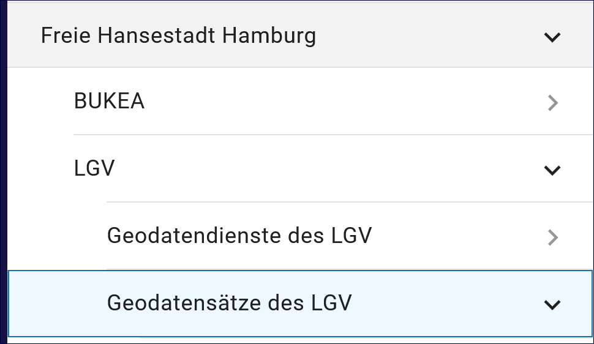

Abb.: Strukturbaum - Strukturierung mit Ordnern

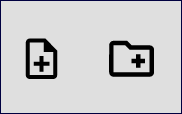

Abb.: Symbolleiste - Neuen Datensatz anlegen / Ordner erstellen

Um einen neuen Metadatensatz zu veröffentlichen, müssen alle Pflichtfelder ausgefüllt werden.

Ist der neue Metadatensatz angelegt, besteht die Möglichkeit den ihn über die Funktion "Speichern" in seinem aktuellen Bearbeitungsstand zu sichern. Der Metadatensatz erscheint in der Farbe Orange im Strukturbaum.

Abb.: Symbolleiste -  Speichern

Sind alle Pflichtfelder und erforderliche optionale Felder ausgefüllt, kann der neue Metadatensatz mit "Abschließendes Speichern & Veröffentlichen", gemäß der ausgewählten Veröffentlichungsbreite, freigegeben werden. Der Metadatensatz erschein dann im Strukturbaum in der Farbe Schwarz.

Abb.: Symbolleiste -  Veröffentlichen

Wird ein Metadatensatz erneut bearbeitet und gespeichert, escheint das Symbol in der Farbkombination Orange/Schwarz.

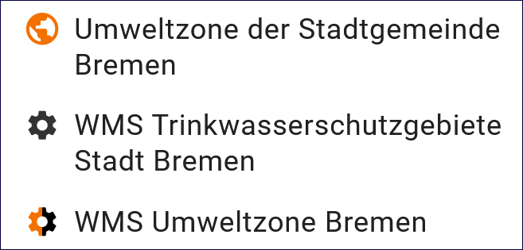

Abb.: Strukturbaum -  Symbolfarben

-----------------------------------------------------------------------------------------------------------------------

Pflichtfelder und optionale Felder
----------------------------------

Je nach Auswahl des Datensatztyps, werden in der Erfassungsmaske des InGrid Editors unterschiedliche Felder angezeigt. Die Pflichtfelder unterscheiden sich zwischen den Datensatztypen. Am umfangreichsten ist der Datensatztyp "Geodatensatz", der Typ "Fachaufgabe" ist dagegen am schnellsten zu befüllen.

.. hint:: Grundsätzlich wird empfohlen, nicht nur die Pflichtfelder auszufüllen, sondern auch die optionalen Felder (soweit möglich) mit Einträgen zu versehen, um einen Mehrwert zu erzielen.

Der getCapabilities Assistent
^^^^^^^^^^^^^^^^^^^^^^^^^^^^^

Für die Erfassung von Geodatendiensten (WMS, WFS, WCS, WCTS, WMTS und CSW) kann der getCapabilities-Assistent genutzt werden. Neu ist, dass der Assistent über die Symbolleiste aufgerufen werden muss. In dem sich öffnenden Fenster ist die getCapabilitie-URL einzutragen. Mit den Button "ÜBERNEHMEN" werden auf Grundlage der Informationen der getCapabilitie-URL die Opreationen im Hintergrund verarbeitet, so dass die Erfassung von OGC konformen Diensten erheblich vereinfacht wird. Die Ergebnisse der Analyse werden angezeigt, es kann eine Auswahl der Metadaten erfolgen, die in den Metadatensatz übernommen werden sollen. Anschließend kann der Datensatz im InGrid Editor weiterbearbeitet und gespeichert werden.

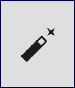

Abb.: Symbolleiste -  getCapabilities-Assistent

Eine ausführliche Beschreibung für diese Funktion erfolgt im Datensatztyp `Geodatendienst <https://metaver-bedienungsanleitung.readthedocs.io/de/igeng/ingrid-editor/erfassung/datensatztypen/datensatztyp-geodatendienst.html>`_ .

.. hint:: Der Allgemeine Erfassungsassistent ist im neuen InGrid Editor entfallen.

-----------------------------------------------------------------------------------------------------------------------

Datensatztypen ausfüllen
------------------------

Die nachfolgenden Felder der Erfassungsmaske wurden in diesem Dokument allgemein beschrieben. Spezielle und ausführliche Angaben sind unter dem Punkt "Objektklassen" beschrieben.

Kopf der Erfassungsmaske
------------------------

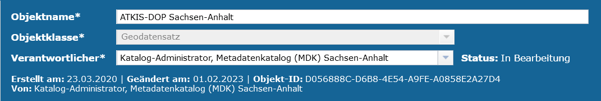

Abb.: Kopf der Erfassungsmaske

Nach dem Anlegen eines neuen Objektes stehen die Eingabefelder für das neue Objekt im rechten Inhaltsfenster zur Verfügung. Im ersten Schritt sollten die Basisinformationen in der Erfassungsmaske (Screenshot) bearbeitet werden. Hier wird automatisiert der Erfasser eingetragen, der das Objekt angelegt hat. An dieser Stelle sollte jedoch die Person stehen, die für die Aktualisierung zuständig ist. In der Regel ist der Erfasser auch die fachlich Verantwortliche Person (Standardeinstellung).

Datensatzname
^^^^^^^^^^^^^

Angabe einer kurzen prägnanten Bezeichnung. Soweit ein gängiges Kürzel vorhanden ist, ist dieses Kürzel mit anzugeben.

Objektklasse 
^^^^^^^^^^^^

Der die Objektklasse (bzw. der Objekt-Typ) richtet sich danach, welche Auswahl im Erfassungsassistenten getroffen wurde.

Beschreibung: `Objektklassen <https://metaver-bedienungsanleitung.readthedocs.io/de/latest/metaver_ige/ige_erfassung/ige_objektklassen/objektklassen.html>`_

.. hint:: Ein Wechsel der Objektklasse ist an dieser Stelle nicht mehr möglich.

Verantwortlicher
^^^^^^^^^^^^^^^^

Hier wird automatisiert der Erfasser eingetragen, der das Objekt angelegt hat. An dieser Stelle sollte jedoch die Person stehen, die für die Aktualisierung zuständig ist. In der Regel ist der Erfasser auch die fachlich Verantwortliche Person (Standardeinstellung).

Nach der Eingabe der Basisinformationen im Kopfbereich bietet es sich an, den Metadatensatz schon einmal zu speichern. Grundsätzlich empfiehlt es sich, beim Ausfüllen der Felder von Zeit zu Zeit die eingegebenen Daten zu sichern, um beispielsweise bei einer abgelaufenen Session, die eingegebenen Daten nicht zu verlieren. Das Zwischenspeichern ist jederzeit möglich, auch wenn noch nicht alle Pflichtfelder ausgefüllt sind.

Unter den ersten drei Feldern werden automatisiert weitere Informationen zum Objekt angezeigt.

  - Erstellt am: Erstellungsdatum
  - Geändert am: Änderungsdatum
  - Objekt-ID: Die Objekt-ID wird nach dem ersten Speichern automatisch vergeben.
  - Von: Max Mustermann (Bearbeiter)

Abschnitt Allgemeines
---------------------

Identifikator des übergeordneten Metadatensatzes
^^^^^^^^^^^^^^^^^^^^^^^^^^^^^^^^^^^^^^^^^^^^^^^^

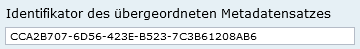

Abb.: Identifikator des übergeordneten Metadatensatzes

Für Datensätze in der obersten Ebene oder direkt unter einem Ordner, kann eine zusätzliche Referenz auf einen übergeordneten Metadatensatz vergeben werden. Dadurch ist es möglich, auch auf externe Datensätze zu verweisen.

Metadaten-Datum der veröffentlichten Version
^^^^^^^^^^^^^^^^^^^^^^^^^^^^^^^^^^^^^^^^^^^^

.. figure:: ../../img_ige/metaver_ige/ige_erfassung/ige_objekte/ige_abschnitt-02_allgemeines/ige-allgemeines_metadaten-datum.png
  :width: 300

Abb.: Metadaten-Datum der veröffentlichten Version

Datum, zu dem der Metadatensatz veröffentlicht wurde. Dieses Datum wird immer dann aktualisiert, wenn ein Metadatensatz veröffentlicht wird und dieser sich geändert hat. Die Änderung eines Metadatensatzes wird anhand der Änderung von Inhalt und Struktur erkannt. Dazu wird ein Fingerabdruck der ISO 19139 XML Daten erstellt und gespeichert. Das Metadaten-Datum wird nur aktualisiert, wenn sich bei einer Veröffentlichung auch der Fingerabdruck ändert. Dadurch wird sichergestellt, dass das Metadaten-Datum auch nicht-inhaltliche Änderungen reflektiert, die sich z.B. durch eine Anpassung der Struktur des Metadatensatzes ergibt. Dies ist wichtig, weil nachfolgende Systeme sich auf dieses Datum beziehen, um z.B. geänderte Metadatensätze zu ermitteln.

Dateibeschreibung der Vorschaugrafik
^^^^^^^^^^^^^^^^^^^^^^^^^^^^^^^^^^^^

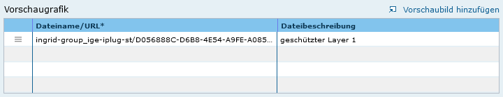

Abb.: Vorschaugrafik

Textliche Beschreibung des Inhalts der Grafik. Die Dateibeschreibung kann manuell geändert werden.
Grafik, die die Ressource darstellt (möglichst einschließlich Legende)

Kurzbezeichnung
^^^^^^^^^^^^^^^

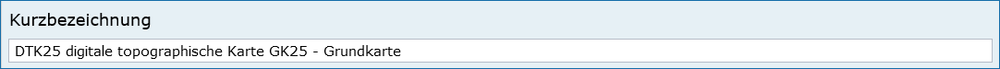

Abb.: Kurzbezeichnung

Angabe einer Kurzbezeichnung für ein Objekt. (Wird insbesondere von GeoMIS.Bund unterstützt.) Bei gewünschter Mehrsprachigkeit muss dieses Feld nach dem Schema "Deutscher Text#locale-eng:English text" gefüllt werden. Beispiel: Apfelbaum#locale-eng:apple tree

Beispiel: DTK25 digitale topographische Karte GK25 - Grundkarte

Im Bereich „Allgemeines“ erfolgt der Eintrag von allgemeinen Informationen zum Objekt (Beschreibung, Kontaktinformation).

Beschreibung
^^^^^^^^^^^^

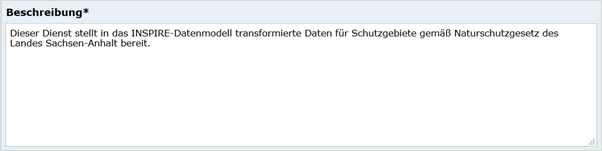

Abb.: Eingabefeld für die Beschreibung

In dieses Feld wird eine fachliche Inhaltsangabe eingetragen. Auf Verständlichkeit für fachfremde Dritte ist zu achten.

Adresse mit Objekt verknüpfen
^^^^^^^^^^^^^^^^^^^^^^^^^^^^^

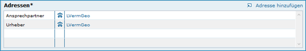

Abb.: Verknüpfung mit den Adressen

`Auswahlliste Adressen <https://metaver-bedienungsanleitung.readthedocs.io/de/latest/metaver_ige/ige_auswahllisten/auswahlliste_allgemeines_adressen.html>`_

Über den Link „Adresse hinzufügen“ wird die Adressverknüpfung angelegt. Als Auswahlmöglichkeit stehen alle im Adressstrukturbaum des Metadatenkataloges eingetragenen Adressdaten zur Verfügung.

Checkboxen
^^^^^^^^^^^

Checkbox INSPIRE-relevant
'''''''''''''''''''''''''

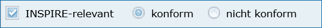

Abb.: Checkbox INSPIRE-relevant (konform, nicht konform)

  
Checkbox AdV kompatibel
'''''''''''''''''''''''

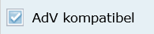

Abb.: Checkbox AdV kompatibel

Diese Checkboxen sind unter der `Objektklasse Geodatensatz im Abschnitt Allgemeines <https://metaver-bedienungsanleitung.readthedocs.io/de/latest/metaver_ige/ige_erfassung/ige_objektklassen/objektklasse-geodatensatz.html#abschnitt-allgemeines>`_ beschrieben.

Checkbox Open Data
''''''''''''''''''

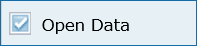

Abb.: Checkbox Open Data

Abschnitt Verschlagwortung
--------------------------

Freie Schlagworte erfassen
^^^^^^^^^^^^^^^^^^^^^^^^^^

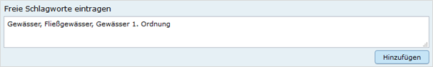

Abb.: Freie Schlagworte eintagen

In das Feld "Freie Schlagworte eintragen" werden die Schlagworte eingegeben, über die das Objekt schnell gefunden werden soll. Hier sollten prägnante Begriffe verwendet werden. Dies können spezielle Fachbegriffe, Mess-Methoden, Bestandteile o.ä. sein. Die Freien Suchbegriffe sind ergänzend zu den Thesaurus-Suchbegriffen anzugeben. Wenn Sie hier einen Begriff eingeben, der im Umwelt-Thesaurus des Umweltbundesamtes enthalten ist, dann wird dieser automatisch als "UMTHES" gekennzeichnet, ist es nicht im UMTHES enthalten, wird das Schlagwort mit "FREE" gekennzeichnet.

Beispiel für "FREE": DOP Sachsen-Anhalt, Befliegung

.. hint:: Einzelne Schlagworte können durch ein Leerzeichen, oder durch ein Komma getrennt, angegeben werden. Zusammengehörige Worte werden in Anführungszeichen gesetzt.

Optionale Schlagworte
^^^^^^^^^^^^^^^^^^^^^

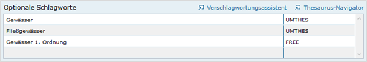

Abb.: Optionale Schlagworte erfassen

.. hint:: Die optionalen Schlagworte sind nur sichtbar, wenn der Abschnitt Verschlagwortung weiter ausgeklappt wird.

Verschlagwortungsassistent
''''''''''''''''''''''''''

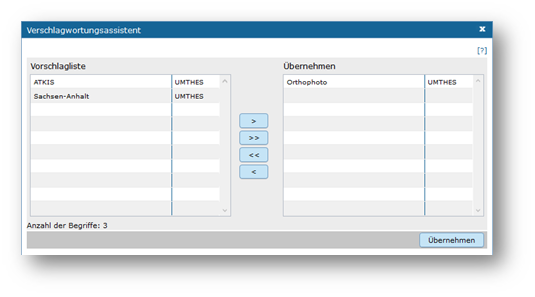

Abb.: Verschlagwortungsassistent

Mit STRG+Mausklick können Sie einen oder mehrere Schlagwörter markieren.
 
Über die Schaltfläche ">" werden die ausgewählten Schlüsselwörter aus der "Vorschlagsliste" in die Liste "Übernehmen" übernommen. Durch Betätigen der Schaltfläche ">>" können alle Begriffe mit einmal in die rechte Liste eingetragen werden. 

Die Schaltfläche "<" verschiebt die markierten Begriffe wieder aus der rechten Liste in die linke Liste. Die Schaltfläche "<<" verschiebt alle Begriffe aus der rechten Liste auf die linke Seite. 

Mit einem Klick auf die Schaltfläche "Übernehmen" werden alle Begriffe aus der Liste "Übernehmen" dem Metadatensatz als Schlagworte hinzugefügt. 

Thesaurusnavigator
'''''''''''''''''''

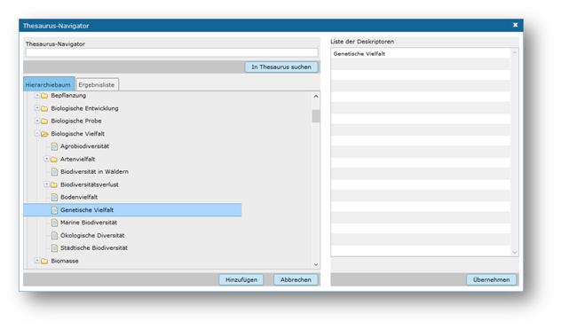

Abb.: Thesaurus-Navigator

Die Verschlagwortung über den Thesaurus-Navigator dient der themenbezogenen Suche der Objekte. Dafür müssen Schlagworte aus dem Thesaurus ausgewählt werden, die das Objekt so genau wie möglich, aber auch so allgemein wie nötig beschreiben.

Beispiel: Naturschutz, Schmetterling, Kartierung, Artenschutz

Der "Thesaurus-Navigator" ist unterteilt in: die Suche, den Hierarchiebaum, die Ergebnisliste und die Liste der Deskriptoren.

In die Suchzeile geben Sie einen beliebigen Suchbegriff ein. Abschließend betätigen Sie den Button "In Thesaurus suchen". Es erscheint der gewählte Suchbegriff in der Ergebnisliste. Betätigt man das blaue Symbol vor dem Suchbegriff, wechselt die Ansicht in den Hierarchiebaum (an die Stelle, an der dieser Suchbegriff eingeordnet ist). 

Im Strukturbaum können weitere Suchbegriffe ausgewählt werden. Durch Betätigen des Buttons „Hinzufügen“, werden die Schlagworte in die Liste der Deskriptoren übernommen. Abschließend betätigen Sie den Button "Übernehmen". Die gewählten Begriffe werden jetzt in die Tabelle "Optionalen Schlagworte" eingetragen.

Abschnitt Fachbezug
-------------------

Der Abschnitt Fachbezug richtet sich nach der gewählten Objektklasse, diese sind unter dem Punkt `Erfassung der Objektlassen <https://metaver-bedienungsanleitung.readthedocs.io/de/latest/metaver_ige/ige_erfassung/ige_objektklassen/objektklassen.html>`_ beschrieben.

**Beschreibungen der Fachbezüge zu den Objektklassen**

`Geodatensatz <https://metaver-bedienungsanleitung.readthedocs.io/de/latest/metaver_ige/ige_erfassung/ige_objektklassen/objektklasse-geodatensatz.html>`_ - Beschreibung von GIS-Daten, analoge Karten oder Kartenwerke.

`Geodatendienst <https://metaver-bedienungsanleitung.readthedocs.io/de/latest/metaver_ige/ige_erfassung/ige_objektklassen/objektklasse-geodatendienst.html>`_ - Dienste die raumbezogenen Daten zur Verfügung stellen, insbesondere Dienste im Rahmen von INSPIRE, der GDI-DE oder der GDIs der Länder.

`Anwendung <https://metaver-bedienungsanleitung.readthedocs.io/de/latest/metaver_ige/ige_erfassung/ige_objektklassen/objektklasse-anwendung.html>`_ - zentrale Auskunftssysteme, welche in der Regel auf eine oder mehrere Datenbanken zugreifen und diese zugänglich machen.

`Datenbank <https://metaver-bedienungsanleitung.readthedocs.io/de/latest/metaver_ige/ige_erfassung/ige_objektklassen/objektklasse-datenbank.html>`_ - Analoge oder digitale Sammlung von Daten. Beispiele: Messdaten, statistische Erhebungen, Modelldaten, Daten zu Anlagen.

`Dokument <https://metaver-bedienungsanleitung.readthedocs.io/de/latest/metaver_ige/ige_erfassung/ige_objektklassen/objektklasse-dokument.html>`_ - Broschüren, Bücher, Aufsätze, Gutachten, etc. Von Interesse sind insbesondere Dokumente, welche nicht über den Buchhandel oder über Bibliotheken erhältlich sind ('graue Literatur').

`Projekt <https://metaver-bedienungsanleitung.readthedocs.io/de/latest/metaver_ige/ige_erfassung/ige_objektklassen/objektklasse-projekt.html>`_ - Forschungs- und Entwicklungsvorhaben, Projekte unter Beteiligung anderer Institutionen oder privater Unternehmen, Schutzprogramme, von besonderem Interesse sind Vorhaben/Projekte/Programme, in denen umweltrelevante Datenbestände entstehen.

`Organisationseinheit <https://metaver-bedienungsanleitung.readthedocs.io/de/latest/metaver_ige/ige_erfassung/ige_objektklassen/objektklasse-organisationseinheit.html>`_ - Diese Objektklasse bildet eine Ausnahme, in dieser befindet sich keinen Abschnitt Fachbezug.

Abschnitt Raumbezugssystem
--------------------------

Im Abschnitt Raumbezugsystem werden Informationen über die räumliche Zuordnung des beschriebenen Datenbestands erfasst.

Geothesaurus-Raumbezug
^^^^^^^^^^^^^^^^^^^^^^

Geothesaurus oder auch Gazetteer (Ortsverzeichnis), hier soll ein Ort oder eine Region mit Koordinaten angegeben werden.

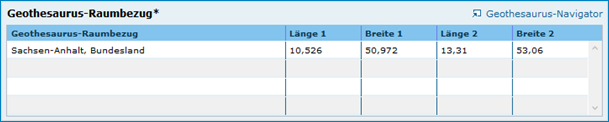

Abb.: Tabelle Geothesaurus-Raumbezug

Geothesaurus-Navigator
^^^^^^^^^^^^^^^^^^^^^^
Über den Geothesaurus-Navigator kann nach den Koordinaten einer räumlichen Einheit gesucht werden.

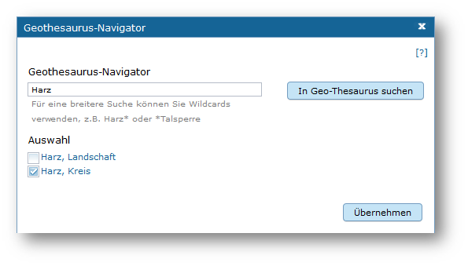

Abb.: Geothesaurus-Navigator

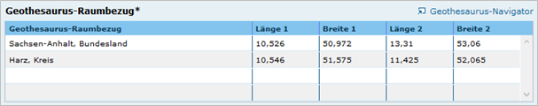

Abb.: Tabelle Geothesaurus-Raumbezug mit Eintrag Landkreis Harz

Im Abschnitt Geothesaurus-Raumbezug wird die räumliche Ausdehnung des betreffenden Objektes angezeigt. Es wird ein Begrenzungsrechteck (Bounding Box) aus geografischen Koordinaten ("Min" und "Max") angegeben, in dem die Ressource liegt.

Als Ausdehnung wird bei neuen Objekten automatisch standardmäßig das Bundesland Sachsen-Anhalt eingetragen. Diesen Eintrag können Sie bei Bedarf löschen (Zeile markieren, rechte Maustaste, "Zeile löschen"). 

Zur Eingabe eines anderen geografischen Bereichs wählen Sie den "Geothesaurus-Navigator". Sie öffnen ihn durch einen Klick auf den Link.

Über den Geothesaurus-Navigator kann nach den Koordinaten der räumlichen Einheit gesucht werden.
 
Geben Sie in das Suchfeld den geografischen Begriff (oder einen Teil des Begriffs) ein den Sie suchen. Nach dem Klicken auf die Schaltfläche „In Geo-Thesaurus suchen“ wird nach diesem Begriff im SNS (Semantic Network Service des Umweltbundesamtes) gesucht und die Ergebnisse werden unter Auswahl aufgelistet. Sie können einen oder mehrere Begriffe dieser Liste markieren und über die Schaltfläche "Übernehmen" als Raumbezug dem Objekt hinzufügen. Neben den geografischen Begriffen werden damit automatisch auch die Koordinaten des geografischen Bereiches in das Objekt übernommen. 

.. hint:: Für eine breitere Suche können Sie Wildcards (Stern+Ort) verwenden, z.B. Stern+Harz oder Stern+Talsperre.

Sollte der gewünschte geografische Begriff nicht vorhanden sein, besteht die Möglichkeit, diesen zusammen mit den Koordinaten manuell einzutragen. Wählen Sie unter der Tabelle "Freier Raumbezug" den Link "Raumbezug hinzufügen".

Umgerechnete Koordinaten
''''''''''''''''''''''''

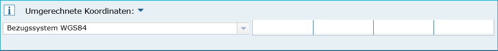

Abb.: Feld Umgerechnete Koordinaten

`Auswahlliste Koordinatensysteme <https://metaver-bedienungsanleitung.readthedocs.io/de/latest/metaver_ige/ige_auswahllisten/auswahlliste_raumbezug_koordinatensysteme.html>`_

Umrechnung, der unter Geothesaurus-Raumbezug ausgewählten Daten, in die in der Auswahllist zur Verfügung stehenden Koordinatensysteme.

Freier Raumbezug
^^^^^^^^^^^^^^^^

.. figure:: ../../img_ige/metaver_ige/ige_erfassung/ige_objekte/ige_abschnitt-06_raumbezugssystem/ige-abschnitt_raumbezugssystem_freier-raumbezug.png

Abb.: Tabelle Freier Raumbezug

| Beispiel: Landschaftsschutzgebiet
| LSG Aland-Elbe-Niederung (BoundingBox) 
| L1: 52.820884° B1: 11.600189° L2: 53.056760° B2: 12.058868°

.. hint:: Die Eingabe der Werte muss mit Komma erfolgen, sonst erscheint eine Fehlermeldung.

Informationen über die räumliche Zuordnung des im Objekt beschriebenen Datenbestandes. Es können frei wählbare Raumbezugs-Koordinaten hinzugefügt werden.

Der Wertebereich im WGS (World Geodetic System) ist folgendermaßen definiert:

| Breite (Latitude): -90 bis 90
| Länge (Longitude): -180 bis 180

 
Raumbezug hinzufügen
'''''''''''''''''''''

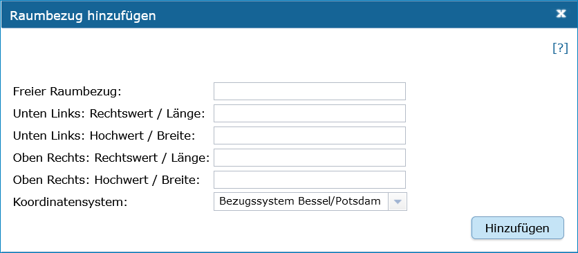

Abb.: Dialogfenster Raumbezug hinzufügen

`Auswahlliste Koordinatensysteme <https://metaver-bedienungsanleitung.readthedocs.io/de/latest/metaver_ige/ige_auswahllisten/auswahlliste_raumbezug_koordinatensysteme.html>`_

In dem sich öffnenden Dialog können Sie einen freien Raumbezug in dem Koordinatensystem angeben, welches Sie (im Dialogfester unten) ausgewählt haben. 

Mit einem Klick auf die Schaltfläche „Hinzufügen“ werden die Angaben in das Feld „Freier Raumbezug“ des Objektes übernommen. 
 

erben
'''''

Über den Link "erben" können alle freien Raumbezüge des übergeordneten Objektes übernommen werden. Dabei werden nur neue Raumbezüge übernommen.

Amtlicher Regionalschlüssel (ARS)
^^^^^^^^^^^^^^^^^^^^^^^^^^^^^^^^^

In den Objektklassen Geodatensatz und Geodatendienst kann ab der InGrid-Version 6.0.0 der Regionalschlüssel erfasst werden.

.. note:: Der zwölfstellige `Amtliche Regionalschlüssels (ARS) <https://de.wikipedia.org/wiki/Amtlicher_Gemeindeschl%C3%BCssel#Regionalschl%C3%BCssel>`_ löst den `Amtlichen Gemeindeschlüssel (AGS) <https://de.wikipedia.org/wiki/Amtlicher_Gemeindeschl%C3%BCssel>`_ ab und erweitert ihn um einen Verbandsschlüssel.

.. figure:: ../../img_ige/metaver_ige/ige_erfassung/ige_objekte/ige_abschnitt-06_raumbezugssystem/ige-raumbezug_regionalschluessel.png
   :width: 300

Abb.: Feld Regionalschlüssel - 150030000000 (Stadt Magdeburg)

.. tip:: Eine Suche nach Amtlichen Regionalschlüsseln ermöglicht das `ARS-Tool <https://opengovtech.de/ars/>`_ (externer Dienst).

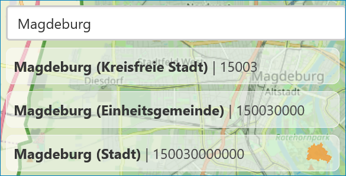

Abb.: ARS-Tool - Regionalschlüssel - Stadt Magdeburg

Der ARS ist wie folgt aufgebaut:

| 1.–2. Stelle   = Kennzahl des Bundeslandes
| 3. Stelle      = Kennzahl des Regierungsbezirks; wenn nicht vorhanden: 0
| 4.–5. Stelle   = Kennzahl des Landkreises oder der kreisfreien Stadt
| 6.–9. Stelle   = Verbandsschlüssel
| 10.–12. Stelle = Gemeindekennzahl

Test

.. figure:: ../../img_ige/metaver_ige/ige_erfassung/ige_objekte/ige_abschnitt-06_raumbezugssystem/ige-raumbezug_regionalschluessel_ars.png
   :width: 400

Abb.: ARS-Tool - Regionalschlüssel

**Beispiel:** Mit der Angabe des zwölfstelligen ARS 081150045045 kann die Stadt Sindelfingen eindeutig adressiert werden:

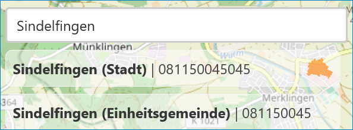

Abb.: ARS-Tool - ARS 081150045045 Stadt Sindelfingen

Werden nicht alle zwölf Stellen des ARS angegeben, sondern nur ein Prefix des ARS, so können statt einer spezifischen Gemeinde auch darüberliegende Kreise, Regierungsbezirke oder Bundesländer abgebildet werden. Wird ein solcher Prefix eines ARS angegeben, schließt dieser alle sich darin befindlichen Gliederungen mit ein.

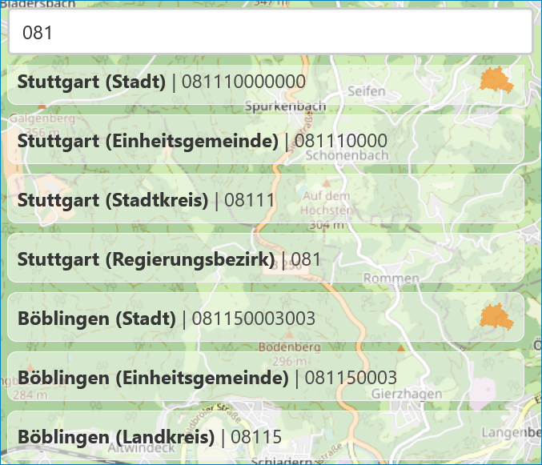

Abb.: ARS-Tool - ARS 081 Regierungsbezirk Stuttgart

**Beispiel:** Der ARS 081 steht für den Regierungsbezirk Stuttgart und schließt den darunterliegenden Stadtkreis Stuttgart (08111) sowie weitere Landkreise, Städte und Gemeinden, wie z.B. die Stadt Böblingen (ARS: 081150003003), im Regierungsbezirk mit ein.

Eine Einschränkung auf konkrete Verwaltungsebenen ist durch das Auffüllen des ARS auf zwölf Stellen mit Nullen möglich.

**Beispiel:** Der Schlüssel 081150000000 referenziert explizit nur den Kreis Böblingen, nicht jedoch beispielsweise die Stadt Leonberg (ARS: 081150028028), die im Kreis Böblingen liegt.

Berenzungspolygon als WKT
^^^^^^^^^^^^^^^^^^^^^^^^^

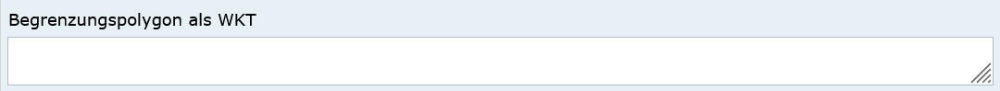

Abb.: Feld Berenzungspolygon als WKT

Obwohl das ISO-Element Polygon heißt, können in diesem Feld auch andere Geometrietypen angegeben werden. Genauer gesagt, werden diese WKT-Klassen unterstützt:

| **POINT: Ein einziger Punkt**
| **Beispiel:** POINT(10 10)

| **MULTIPOINT: Eine Punktsammlung**
| **Beispiel:** MULTIPOINT((0 0), (10 10), (1.3 9.5))

| **LINESTRING: Eine einzige Linie**
| **Beispiel:** LINESTRING(10 10, 20 20, 10 40)

| **MULTILINE: Eine Liniensammlung**
| **Beispiel:** MULTILINE((10 10, 20 20, 10 40), (5.1 9.3, 3.6 -1.8), (0 0, 1 0, 1 1, 0 1))

| **POLYGON: Ein einziges Polygon**
| **Beispiel:** POLYGON((0 0, 0 10, 10 10, 10 0, 0 0), (5 5, 5 7, 7 7, 7 5, 5 5))

| **MULTIPOLYGON: Eine Sammlung der Polygone**
| **Beispiel:** MULTIPOLYGON(((0 0, 0 10, 10 10, 10 0, 0 0),(5 5, 5 7, 7 7, 7 5, 5 5)), (15 20, 25 30, 33 25, 15 20)))

| **GEOMETRYCOLLECTION: Eine Sammlung von o.g. Geometrien**
| **Beispiel:** GEOMETRYCOLLECTION(POINT(10 10), LINESTRING(10 10, 20 20, 10 40), POLYGON((0 0, 0 10, 10 10, 10 0, 0 0)))

.. hint:: Die Koordinaten müssen zwingend im WGS84 Koordinatenreferenzsystem angegeben werden.

Raumbezugssystem
^^^^^^^^^^^^^^^^

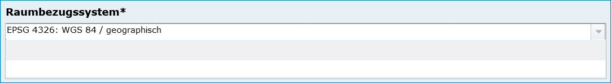

Abb.: Feld Raumbezugssystem

`Auswahlliste der Raumbezugssysteme <https://metaver-bedienungsanleitung.readthedocs.io/de/latest/metaver_ige/ige_auswahllisten/auswahlliste_raumbezug_raumbezugsysteme.html>`_

Über ein Dropdownmenü erfolgt an dieser Stelle die Auswahl des Raumbezugssystems, welches in der Ressource verwendet wurde. 

Beispiel: EPSG:4326 / WGS 84 / geographisch

.. note:: Die Arbeitsgemeinschaft der Vermessungsverwaltungen der Länder der Bundesrepublik Deutschland (AdV) hat 1991 die Einführung des ETRS89 als Bezugssystem Lage und 1995 die Einführung von UTM als ebenes Koordinatensystem für ETRS89 beschlossen. Dies geschieht im Einklang mit den Empfehlungen der EU zur Realisierung eines europaweiten Raumbezuges und somit zur Schaffung einer einheitlichen Basis für die zukunftsfähige Geodateninfrastruktur in Europa.

Höhe
^^^^

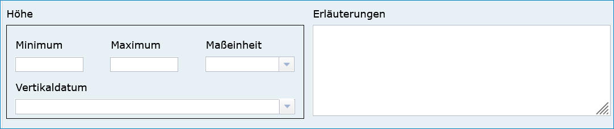

Abb.: Feld Höhe

Minimum / Maximum
'''''''''''''''''

Angabe der Werte für die Höhe über einem Punkt (siehe Pegel) eingegeben. Ist eine vertikale Ausdehnung vorhanden, so kann für das Maximum ein größerer Wert eingegeben werden. Sollte dies nicht der Fall sein, so ist die Eingabe eines Minimalwerts ausreichend, dieser Wert wird dann automatisch ebenso für den Maximalwert übernommen.

Beispiel: Minimum 100, Maximum 110

Maßeinheit
'''''''''''

Angabe der Maßeinheit, in der die Höhe gemessen wird.

Beispiel: Fuss, Kilometer, Meter, Zoll

Vertikaldatum
''''''''''''''

Angabe des Referenzpegels, zu dem die Höhe relativ gemessen wird. In Deutschland ist dies i.A. der Pegel Amsterdam.

Beispiel: Pegel Amsterdam

`Auswahlliste Vertikaldatum <https://metaver-bedienungsanleitung.readthedocs.io/de/latest/metaver_ige/ige_auswahllisten/auswahlliste_raumbezug_vertikaldatum.html>`_

Erläuterungen
'''''''''''''

Zusätzliche Angaben zum Raumbezug.

Beispiel: Die Koordinaten für die Fachliche Gebietseinheit sind ungefähre Angaben.

Abschnitt Zeitbezug
-------------------

.. figure:: ../../img_ige/metaver_ige/ige_erfassung/ige_objekte/ige_abschnitt-07_zeitbezug/ige-abschnitt_zeitbezug.png

.. important:: Unter Zeitbezug werden Zeitpunkte, Zeiträume, Zeitspannen, Perioden oder Intervalle **der zu beschreibenden Daten (Ressourcen)** eingetragen. Diese Angaben sind bei der Recherche nach Metadaten wichtig, um die gesuchten Daten (Ressourcen) zeitlich eingrenzen zukönnen.

Zeitbezug der Ressource
^^^^^^^^^^^^^^^^^^^^^^^

Mit Ressource ist das eigentliche Objekt gemeint, welches mit Metadaten beschrieben wird.

Mit "Zeitbezug der Ressource" sind die Datumsangaben gemeint, die sich auf das beschriebene Objekt beziehen.

Den Recherchierenden soll mit diesen Angaben die Aktualität der beschriebenen Daten mitgeteilt werden.

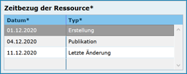

Abb.: Tabelle Zeitbezug der Ressource

Erläuterungen
^^^^^^^^^^^^^

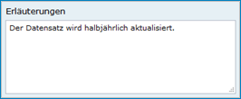

Abb.: Textfeld für Erläuterungen

Hier können z.B. die Angaben der Periodizität eingeschränkt, weitere Zeitangaben gemacht oder Unregelmäßigkeiten erklärt werden. Im Zusammenhang mit dem Eintrag im Feld Periodizität können hier Abstände, Perioden und Intervalle eingetragen werden, die sich nicht aus dem Zusammenhang der anderen Felder des Zeitbezuges erklären, z.B. Jahreszeiten, Dekaden, Tageszeiten.

Beispiel: Die Messungen erfolgten nur am Tag.

Durch die Ressource abgedeckte Zeitspanne
^^^^^^^^^^^^^^^^^^^^^^^^^^^^^^^^^^^^^^^^^^

Mit Ressource ist das eigentliche Objekt gemeint, welches mit Metadaten beschrieben wird.

Mit "Durch die Ressource abgedeckte Zeitspanne" sind die Datumsangaben (Zeiträume) gemeint, die sich auf das beschriebene Objekt beziehen.

Den Recherchierenden soll mit diesen Angaben der Zeitraum für eine Datenerhebung / einer Datenerfassung, einer Projektlaufzeit mitgeteilt werden.

Zeitbezug des Dateninhalts

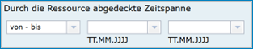

Abb.: Angabe von Zeitpunkten, Zeiträumen / Zeitspannen

Es soll die Zeitspanne oder der Zeitpunkt der Erhebung der eigentlichen Daten eingetragen werden. Ein Zeitpunkt wird mit "am" im Auswahlmenü angegeben. Die Zeitspanne kann auf unterschiedliche Weise ausgedrückt werden.

Beispiele: Zeitraum einer Erhebung von Messdaten, Entwicklungszeitraum einer Anwendung, Laufzeit eines Projektes, Laufzeit einer Studie, Zeitraum für die Erstellung einer Basiskarte, Zeitraum einer Befliegung

Zur Auswahl stehen:

.. figure:: ../../img_ige/metaver_ige/ige_erfassung/ige_objekte/ige_abschnitt-07_zeitbezug/ ige-zeitbezug_zeitspanne-tabelle.png
   :width: 500

Abb.: Tabelle für die Angaben von Zeitspannen

**Spalte: Auswahl 2**

+----------------------------+-------------------------------------------------+
| **Angabe im Editor**       | **Ausgabe im Portal**                           |
+----------------------------+-------------------------------------------------+
| bis: unbekannter Zeitpunkt | seit tt.mm.jjjj, gegenwärtige Aktualität unklar |
+----------------------------+-------------------------------------------------+
| bis: Zeitpunkt des Abrufs  | seit tt.mm.jjjj, gegenwärtig aktuell            |
+----------------------------+-------------------------------------------------+

Periodizität
^^^^^^^^^^^^

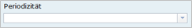

Abb.: Feld Priodizität

`Auswahlliste der Priodizität <https://metaver-bedienungsanleitung.readthedocs.io/de/latest/metaver_ige/ige_auswahllisten/auswahlliste_zeitbezug_periodizitaet.html>`_

Ist die Auswahl oder die Angabe des Zeitzyklus der Datenerhebung. Der Eintrag muss aus der Auswahlliste erfolgen, die über den Pfeil am Ende des Feldes geöffnet wird.

Status
^^^^^^

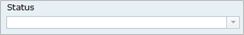

Abb.: Feld Status

`Auswahlliste Status <https://metaver-bedienungsanleitung.readthedocs.io/de/latest/metaver_ige/ige_auswahllisten/auswahlliste_zeitbezug_status.html>`_

Der Status beschreibt den Bearbeitungsstand eines Projektes oder einer der Messung etc. Diese können sich in unterschiedlichen Stadien befinden, d.h. Projekte, Programme oder Messungen können in Planung sein, derzeit durchgeführt werden oder schon abgeschlossen sein.

Im Intervall
^^^^^^^^^^^^

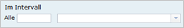

Abb.: Feld Im Intervall

`Auswahlliste - Im Intervall <https://metaver-bedienungsanleitung.readthedocs.io/de/latest/metaver_ige/ige_auswahllisten/auswahlliste_zeitbezug_intervalle.html>`_

Mit Intervall wird der zeitliche Abstand (Frequenz) der Datenerhebung angegeben. Erfolgt die Datenerhebung kontinuierlich oder periodisch (siehe Feld Periodizität), so wird diese Angabe hier präzisiert. Es stehen Felder für den freien Eintrag einer Ziffer und eine Auswahlliste zur Verfügung, die zeitliche Intervalle vorgibt. Der Eintrag von "10" und "Tage" bedeutet, dass die beschriebenen Daten alle 10 Tage aktualisiert werden.

Abschnitt Zusatzinformation
---------------------------

Der Abschnitt Zusatzinformation enthält Angaben von allgemeinen Informationen wie Sprache und Veröffentlichungsbreite des Metadatensatzes.

Sprache des Metadatensatzes
^^^^^^^^^^^^^^^^^^^^^^^^^^^^

Es erfolgt die Angabe der Sprache des Metadatensatzes, als Standard ist Deutsch voreingestellt.

Veröffentlichung
^^^^^^^^^^^^^^^^

Das Feld Veröffentlichung gibt an, welche Veröffentlichungsmöglichkeiten für das Objekt freigegeben sind. Die Liste der Möglichkeiten ist nach Freigabestufen hierarchisch geordnet. Wird einem Objekt eine niedrigere Freigabestufe zugeordnet (z.B. von Internet auf Intranet), werden automatisch auch alle untergeordneten Objekte dieser Stufe zugeordnet. Soll einem Objekt eine höhere Freigabestufe zugeordnet werden als die des übergeordneten Objektes, wird die Zuordnung verweigert. Wird einem Objekt eine höhere Freigabestufe zugeordnet (z.B. von amtsintern auf Intranet), kann auch allen untergeordneten Objekten die höhere Freigabestufe zugeordnet werden.

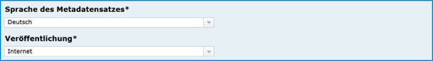

Abb.: Auswahlfelder - Sprache des Metadatensatzes und Veröffentlichung

Die Einstellung haben folgende Bedeutung:

 - Internet: Das Objekt darf auf allen Ebenen veröffentlicht werden.
 - Intranet: Das Objekt darf nur im Intranet veröffentlicht werden, aber nicht im Internet.
 - amtsintern: Das Objekt ist nur im internen Strukturbaum des Metadatenkataloges sichtbar. Es ist nicht für das Internet oder dem Intranet freigegeben.
 
.. hint:: Die Option Intranet wird für Sachsen-Anhalt nicht verwendet, da das System im Internet bereitgestellt wird.

Sprache der Ressource
^^^^^^^^^^^^^^^^^^^^^^

Abb.: Auswahlfeld - Sprache der Ressource

Es erfolgt die Angabe der Sprache des beschriebenen Datensatzes, als Standard ist Deutsch voreingestellt.

XML-Export-Kriterium
^^^^^^^^^^^^^^^^^^^^

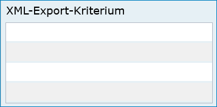

Abb.: Auswahlfeld - XML-Export-Kriterium

Eintrag eines Selektionskriteriums zur Steuerung des Exports der Daten. Um eine Teilmenge von Objekten exportieren zu können, kann in diesem Feld ein diese Teilmenge identifizierendes Schlagwort eingegeben werden. In der Exportfunktion kann dann eines der Schlagworte aus diesem Feld angegeben werden und alle Objekte exportiert werden, für die in diesem Feld das entsprechende Schlagwort vergeben wurde. Die Eingabe mehrerer Schlagworte ist möglich. Die Schlagworte können frei eingegeben werden. Zur Verhinderung von Schreibfehlern sollte jedoch der Eintrag aus der Auswahlliste vorgezogen werden.

Weitere Rechtliche Grundlagen
^^^^^^^^^^^^^^^^^^^^^^^^^^^^^

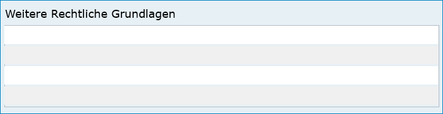

Abb.: Auswahlfeld - weitere rechtliche Grundlagen

Angabe der rechtlichen Grundlage, die die Erhebung der beschriebenen Daten veranlasst hat. Hier können Kürzel von Gesetzen, Erlassen, Verordnungen usw. eingetragen werden, in denen z. B. die Methode oder die Form der Erhebung der im Objekt beschriebenen Daten festgelegt oder beschrieben wird. Es ist bei Bedarf der Eintrag mehrerer Angaben möglich.

Herstellungszweck
^^^^^^^^^^^^^^^^^

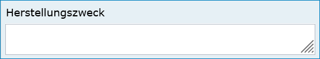

Abb.: Textfeld - Herstellungszweck

Zusammenfassung, für welchen Zweck oder mit welcher Absicht die Ressource erstellt wurde.
Bei gewünschter Mehrsprachigkeit muss dieses Feld nach dem Schema "Deutscher Text#locale-eng:English text" gefüllt werden. 
Beispiel: Apfelbaum#locale-eng:apple tree

Eignung/Nutzung
^^^^^^^^^^^^^^^

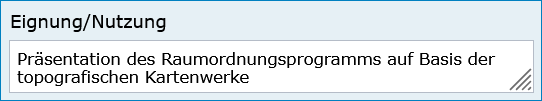

Abb.: Beispiel - Präsentation des Raumordnungsprogramms auf Basis der topografischen Kartenwerke

Spezifische Nutzung: kurze Beschreibung zur Verwendung der Ressource.
Angaben über die Verwendungsmöglichkeiten, die diese Daten in Verbindung mit weiteren Informationen erfüllen können.

Abschnitt Verfügbarkeit
-----------------------

.. figure:: ../../img_ige/metaver_ige/ige_erfassung/ige_objekte/ige_abschnitt-09_verfügbarkeit/ige-abschnitt_verfuegbarkeit.png

Im Abschnitt Verfügbarkeit wird angegeben, ob die zu beschreibenden Daten einer Zugriffsbeschränkung unterliegen und welche Nutzungsbedingungen für diese Daten gelten.

Zugriffsbeschränkungen
^^^^^^^^^^^^^^^^^^^^^^

.. figure:: ../../img_ige/metaver_ige/ige_erfassung/ige_objekte/ige_abschnitt-09_verfügbarkeit/ige-verfuegbarkeit_zugriffsbeschraenkungen.png

Abb.: Auswahlfeld - Zugriffsbeschränkungen

`Auswahlliste der Zugriffsbeschränkungen <https://metaver-bedienungsanleitung.readthedocs.io/de/latest/metaver_ige/ige_auswahllisten/auswahlliste_verfuegbarkeit_zugriffsbeschraenkungen.html>`_

Im Feld Zugriffsbeschränkungen kann aus einer Auswahlliste ein Grund angegeben werden, warum die Daten einer Einschränkung unterliegen. Trifft keiner dieser Gründe zu, ist der Eintrag „Es gelten keine Beschränkungen“ anzugeben.

.. hint:: Für INSPIRE-Daten ist dieses Feld ein Pflichtfeld.

Nutzungsbedingungen
^^^^^^^^^^^^^^^^^^^

.. figure:: ../../img_ige/metaver_ige/ige_erfassung/ige_objekte/ige_abschnitt-09_verfügbarkeit/ige-verfuegbarkeit_nutzungsbedingungen.png

Abb.: Beispiel - Nutzungsbed.: Datenlizenz Deutschland Namensnennung 2.0 / Quellvermerk: © GeoBasis-DE / BKG (Jahr des letzten Datenbezugs)

`Auswahlliste der Nutzungsbedingungen <https://metaver-bedienungsanleitung.readthedocs.io/de/latest/metaver_ige/ige_auswahllisten/auswahlliste_verfuegbarkeit_nutzungsbedingungen.html>`_

Nutzungsbedingungen sind ein einseitig vorformulierter Vertrag, mit dem der Anbieter (der Datenbereitsteller) die Nutzer der Daten über ihre Rechte und Pflichten informiert.
In der Tabellenspalte Nutzungsbedingungen ist eine Auswahlliste mit Lizenzen hinterlegt, diese beschreiben vordefinierte Nutzungsbedingungen. Weiterhin besteht die Möglichkeit Nutzungsbedingungen per Freitext in die Zeile einzutragen oder auf Nutzungsbedingungen zu verweisen.

Quellenvermerk
^^^^^^^^^^^^^^

In dieser Tabellenspalte wird das Copyright des Datenbreitstellers angegeben und die Angabe für das Jahr des Datenbezugs.

Beispiel: © GeoBasis-DE / BKG (Jahr des letzten Datenbezugs)

Anwendungseinschränkungen
^^^^^^^^^^^^^^^^^^^^^^^^^

.. figure:: ../../img_ige/metaver_ige/ige_erfassung/ige_objekte/ige_abschnitt-09_verfügbarkeit/ige-verfuegbarkeit_anwendungseinschraenkungen.png

Abb.: Beispiel - Nicht für Navigationszwecke geeignet oder Registrierung erforderlich

Das Feld Anwendungseinschränkungen dient der Beschreibung, welche Einschränkung oder Eignung auf die Ressourcen oder Metadaten zutreffen (ISO: useLimitation).

 
Datenformat
^^^^^^^^^^^

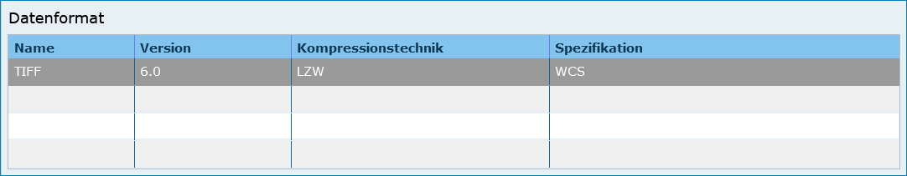

Abb.: Beispiel - TIFF / Version: 6.0 / Kompression: LZW / Spezifikation: WCS

Angabe des Formats der Daten in DV-technischer Hinsicht, in welchem diese verfügbar sind. Das Format wird durch 4 unterschiedliche Eingaben spezifiziert. Wenn die erste Spalte befüllt wird, müssen auch die anderen Eintragungen vorgenommen werden. 

 - Name: Angabe des Formatnamens, wie z.B. "Date" 
 - Version: Version der verfügbaren Daten (z.B. "Version 8" oder "Version vom 26.02.2020") 
 - Kompressionstechnik: Kompression, in welcher die Daten geliefert werden (z.B. "WinZip", "keine") 
 - Bildpunkttiefe: BitsPerSample

.. hint:: Bei der Auswahl des INSPIRE-Datenformates GML muss die Version eingetragen werden.

Medienoptionen
^^^^^^^^^^^^^^

.. figure:: ../../img_ige/metaver_ige/ige_erfassung/ige_objekte/ige_abschnitt-09_verfügbarkeit/ige-verfuegbarkeit_medienoptionen.png

Abb.: Beispiel - CD-ROM / 700 MB / Explorer Z:/Bereich_51/Metainformation/2020-02-26_Hilfetexte.doc

Angabe, auf welchen Medien die Daten zur Verfügung gestellt werden können. Hier können elektronische Datenträger als auch Medien in Papierform angegeben werden, auf denen die im Objekt beschriebenen Daten dem Nutzer zur Verfügung stehen. Es können mehrere Medien eingetragen werden. Medium: Angabe der Medien, auf denen der Datensatz bereitgestellt werden kann (ISO-Auswahlliste) Datenvolumen: Umfang des Datenvolumens in MB (Fließkommazahl) Speicherort: Ort der Datenspeicherung im Intranet/Internet, Angabe als Verweis.

`Auswahlliste Medium <https://metaver-bedienungsanleitung.readthedocs.io/de/latest/metaver_ige/ige_auswahllisten/auswahlliste_verfuegbarkeit_medienoption.html>`_

Bestellinformation
^^^^^^^^^^^^^^^^^^

.. figure:: ../../img_ige/metaver_ige/ige_erfassung/ige_objekte/ige_abschnitt-09_verfügbarkeit/ige-verfuegbarkeit_bestellinformation.png

Abb.: Beispiel - Die Lieferzeit beträgt 3 Wochen

Angabe von generellen Informationen wie Bedingungen oder Konditionen zur Bestellung.

Abschnitt Verweise
------------------

.. figure:: ../../img_ige/metaver_ige/ige_erfassung/ige_objekte/ige_abschnitt-10_verweise/ige-abschnitt_verweise.png

Im Abschnitt Verweise können Verlinkungen zu anderen Objekten innerhalb des Kataloges angelegt, oder es können Verweise mit URLs angelegt werden. Bereits angelegte Verweise lassen sich erneut bearbeiten.

Verweise zu
^^^^^^^^^^^

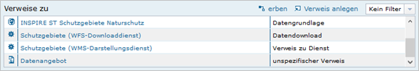

Abb.: Tabelle - Verweise zu ...

Es besteht die Möglichkeit, Verweise von einem Objekt zu einem anderen Objekt oder zu einer Internetadresse (URL) zu erstellen. In dieser Tabelle werden alle Verweise zusammenfassend aufgeführt, welche im aktuellen Objekt angelegt wurden. Über dem Link „Verweis anlegen“ öffnet sich ein Dialog, mit dem weitere Einzelheiten zu den Verweisen eingesehen und editiert werden können. Es ist möglich, weitere Verweise über das Dialogfenster „Verweis bearbeiten“ hinzuzufügen (siehe 2. Verweise anlegen).

.. hint:: Wenn Open Data ausgewählt ist, muss mindestens ein Verweis vom Typ „Datendownload“ vorhanden sein, bevor das Objekt veröffentlicht werden kann!

Verweise von
^^^^^^^^^^^^

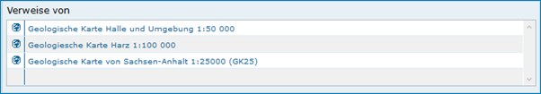

Abb.: Tabelle - Verweise von ...

In Tabelle „Verweise von“ werden alle Verweise von denjenigen Objekten aufgeführt, welche auf das aktuelle Objekt verweisen.

Das Editieren oder Hinzufügen ist an dieser Stelle nicht möglich. Sollen die Verweise gelöscht oder ergänzt werden, so muss zu dem entsprechenden Objekt gewechselt werden. Beim Löschen können Sie in der Tabelle „Verweise von“ einfach auf den Namen des entsprechenden Objektes klicken. Der InGrid-Editor wechselt dann automatisch in das ausgewählte Objekt. Im Abschnitt „Verweise“, Tabelle „Verweis zu“ kann jetzt der Verweis gelöscht bzw. ein neuer Verweis angelegt werden.

Verweise anlegen
----------------

Abb.: Tabelle - Verweise zu ...

Im Abschnitt „Verweise“ besteht die Möglichkeit, Verweise von einem MDK-Objekt auf ein anderes MDK-Objekt oder zu einer Internetadresse (URL) zu erstellen. Alle eingegebenen Verweise werden in der Tabelle „Verweise zu“ aufgelistet.

Über den Link „Verweis anlegen“ öffnet sich ein Dialogfenster.
Es gibt zwei mögliche Verweisziele:
 - Verweisziel Objekt: Querverweise zwischen Objekten innerhalb des MDK
 - Verweisziel URL: Verweis auf Informationen im Internet
 
 
Verweistyp
^^^^^^^^^^

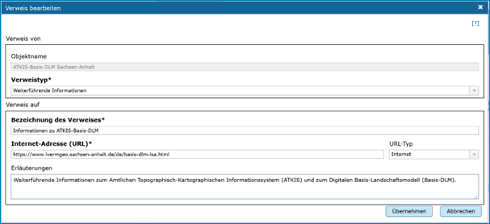

Abb.: Dialogfenster - Verweis bearbeiten - Verweistyp

Angabe des fachlichen Bezuges, der zwischen dem aktuellen Objekt und dem Verweisobjekt besteht. Wird das Dialogfenster im Abschnitt Verweise geöffnet, so kann über das Dropdown-Menü (ausklappbar über den Pfeil an der rechten Seite des Feldes) aus einer Auswahlliste ein Eintrag gewählt werden. Es sind dann auch freie Einträge für den Verweistyp möglich.

Wurde der Dialog von einem Feld in einer anderen Rubrik (z.B. Objektklasse Anwendung, Rubrik Fachbezug, Feld: Basisdaten, Verweise) geöffnet, so wird automatisch der betreffende Feldname eingetragen und angezeigt.

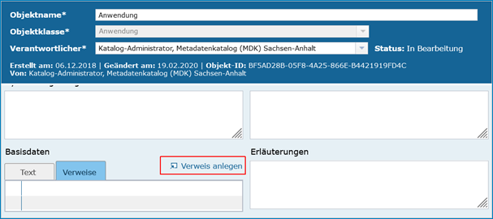

Abb.: Erfassungsmaske - Eingabefelder mit Verweisen

`Auswahlliste der Verweistypen <https://metaver-bedienungsanleitung.readthedocs.io/de/latest/metaver_ige/ige_auswahllisten/auswahlliste_verweise_verweistypen.html>`_

Beispiel: Objektklasse Datenbank / Verweistyp: Methode / Datengrundlage

Die angebotenen Eintragungen der Dropdown-Liste hängen von dem gewählten Objekttyp ab. Es kann daher auch vorkommen, dass weniger Listeneinträge im Dropdown-Menü angezeigt werden.

Verweisziel: „Objekt“
^^^^^^^^^^^^^^^^^^^^^

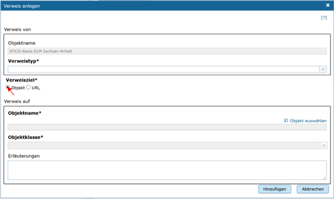

Abb.: Verweisziel Objekt

Über dieses Verweisziel werden Querverweise zwischen den Objekten des MDK definiert. Das Dialogfenster zeigt die entsprechenden Eingabefelder an.

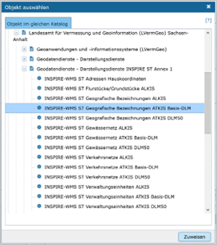

Abb.: Verweisziel: Objekt

Objekt auswählen
^^^^^^^^^^^^^^^^

Über „Objekt auswählen“ öffnet sich der Objektstrukturbaum, aus dem das Zielobjekt auszuwählen ist.
Ist das Objekt markiert, zu dem ein Verweis erstellt werden soll, kann der Eintrag durch einen Klick auf den Button „Zuweisen“ übernommen werden. Die Pflichtangaben „Objektname“ und „Objektklasse“ werden automatisch mit den entsprechenden Daten des ausgewählten Objekts gefüllt.

Erläuterung
^^^^^^^^^^^

Hier können weitergehende Informationen zu dem Objekt eingegeben werden. Es können auch Erläuterungen zu der Beziehung zwischen den beschriebenen Daten des aktuellen Objektes und den Daten des Verweis-Objektes gegeben werden.

Hinzufügen
^^^^^^^^^^

Sind alle Pflichtfelder und die gewünschten optionalen Felder gefüllt, kann der Verweis mit der Schaltfläche „Hinzufügen“ in der Tabelle angelegt werden.

Verweisziel "URL"
^^^^^^^^^^^^^^^^^^

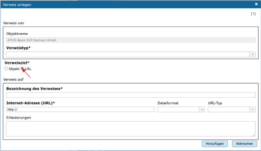

Abb.: Verweisziel: URL

Soll auf eine Internetseite oder eine externe Datenquelle im Internet verwiesen werden, so ist das Verweisziel „URL“ auszuwählen. Das Dialogfenster zeigt die entsprechenden Eingabefelder an.

Die Auswahl erfolgt wie im Abschnitt „Verweistyp“ beschrieben.

Weitere Pflichtfelder sind die „Bezeichnung des Verweises“ sowie „Internet-Adresse (URL)“.

Abb.: Verweis bearbeiten

Bezeichnung des Verweises
^^^^^^^^^^^^^^^^^^^^^^^^^

Im Feld „Bezeichnung des Verweises“ soll eine möglichst aussagekräftige Bezeichnung für den Verweis angegeben werden, beispielsweise kann der dementsprechende Name der Webseite eingetragen werden. Die Eintragungen, die Sie hier angeben, erscheinen im Portal als Link. Klickt der Nutzer auf diesen Link, kommt er auf die Internetseite, die in dem Feld „Internet-Adresse (URL)“ angegeben wurde.

Internet-Adresse (URL)
^^^^^^^^^^^^^^^^^^^^^^

Im Feld „Internet-Adresse (URL)“ wird die URL der Internetseite eingetragen, auf die verwiesen werden soll. Wichtig ist, die vollständige Internetadresse anzugeben, beginnend mit „https://“.

Dateiformat
^^^^^^^^^^^

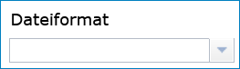

Abb.: Beispiel - Dateiformat für die Objektklasse Datensatz

Es sind verschiedene Dateiformat-Einträge möglich, die angezeigten Dateiformate richten sich nach der gewählten Objektklasse.

`Auswahlliste der Dateiformate <https://metaver-bedienungsanleitung.readthedocs.io/de/latest/metaver_ige/ige_auswahllisten/auswahlliste_verweise_dateiformate.html>`_

metaver_ige/ige_auswahllisten/auswahlliste_verweise_dateiformate.html
metaver_ige\ige_auswahllisten/auswahlliste_verweise_dateiformate.html

URL-Typ
^^^^^^^^

Bei URL-Verweisen für ein Objekt wird unterschieden ob diese URL für das Internet oder für das Intranet gilt.

Sollte die URL (noch) nicht bekannt sein, weil erst noch der entsprechende Dienst erstellt werden muss, für den Dienst soll aber bereits ein Metadatensatz angelegt werden („Henne-Ei-Problem“), dann bitte wie folgt verfahren:

 - Für den Downloadverweis folgende Dummy-Download-Ressource eintragen: 
   - https://metaver-bedienungsanleitung.readthedocs.io/de/latest/metaver_ige/ige_erfassung/ige_download/ige_download-dummy.html

 - die Veröffentlichungsbreite auf „amtsintern“ ändern
 
Auf diese Weise kann der Metadatensatz abschließend gespeichert werden. Sobald der Dienst zur Verfügung steht, wird die richtige Download-URL im Metadatensatz eingetragen und die Veröffentlichungsbreite auf „Internet“ gesetzt. Durch einen Klick auf die Schaltfläche „Hinzufügen“ wird der Internet-Verweis in die Tabelle aufgenommen.

Abb.: Tabelle Verweise zu

In der Tabelle „Verweise zu“ werden in der ersten Spalte durch entsprechende Symbole die Verweisziele und in der letzten Spalte die ausgewählten Verweistypen dargestellt.

Filter für Verweistypen
^^^^^^^^^^^^^^^^^^^^^^^^

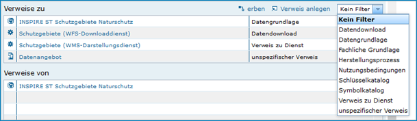

Abb.: Tabelle Verweise - Filter

Es besteht die Möglichkeit die Verweistypen zu filtern. Die Einträge für die Filterfunktion können über ein Dropdown-Menu geöffnet und ausgewählt werden. Es werden dann nur Verweise eines bestimmten Typs gelistet: z.B. nur Verweise vom Typ „unspezifischer Verweis“.

Zeile löschen / bearbeiten
^^^^^^^^^^^^^^^^^^^^^^^^^^

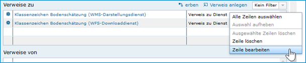

Abb.: Tabelle Verweise - Zeile löschen / bearbeiten

Möchten Sie einen bestehenden Verweis löschen oder ändern, so klicken Sie bitte in der Tabelle mit der rechten Maustaste auf den Verweis, der geändert oder gelöscht werden soll. Es öffnet sich eine Liste zur Auswahl des passenden Befehls.

Mit „Zeile löschen“ wird der ausgewählte Verweis sofort gelöscht.
Der Befehl „Zeile bearbeiten“ öffnet wieder das bekannte Dialogfenster mit den Einzelheiten zum Verweis. Hier können Sie die Änderungen vornehmen und mit „Hinzufügen“ den Vorgang abschließen.

**Hinweis:** *Es erfolgt keine Sicherheitsabfrage, ob der Verweis wirklich gelöscht werden soll!*

Verweise erben
^^^^^^^^^^^^^^

Abb.: Tabelle Verweise - erben

Über den Link „erben“ können die Inhalte der Tabelle „Verweise zu“ vom übergeordneten Objekt übernommen werden. 

Verweis zu
''''''''''

Es gibt die Möglichkeit, Verweise von einem Objekt zu einem anderen Objekt oder zu einer Internetadresse (URL) zu erstellen. In dieser Tabelle werden alle Verweise zusammenfassend aufgeführt, welche im aktuellen Objekt angelegt wurden. Über dem Link "Verweise anlegen/bearbeiten" öffnet sich ein Dialog, mit dem weitere Einzelheiten zu den Verweisen eingesehen und editiert werden können. Es ist ferner möglich, weitere Verweise über diesen Dialog hinzuzufügen. Wenn Open-Data ausgewählt ist, muss mindestens ein Verweis vom Typ "Datendownload" vorhanden sein, bevor das Objekt veröffentlicht werden kann!

Verweis von
'''''''''''

In dieser Tabelle werden alle Verweise von denjenigen Objekten aufgeführt, welche auf das aktuelle Objekt verweisen. Das Editieren oder Hinzufügen ist nicht möglich. Sollen die Verweise geändert oder ergänzt werden, so muss zu dem entsprechenden Objekt gewechselt werden.

