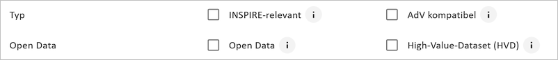
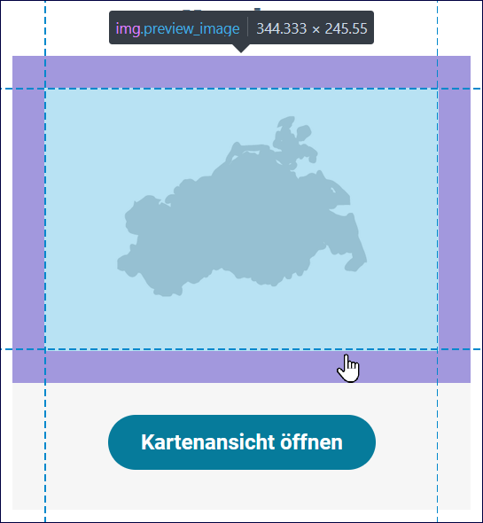
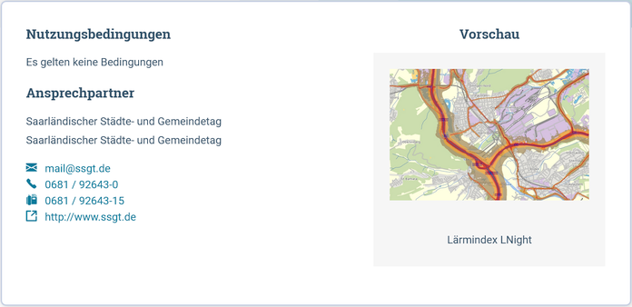
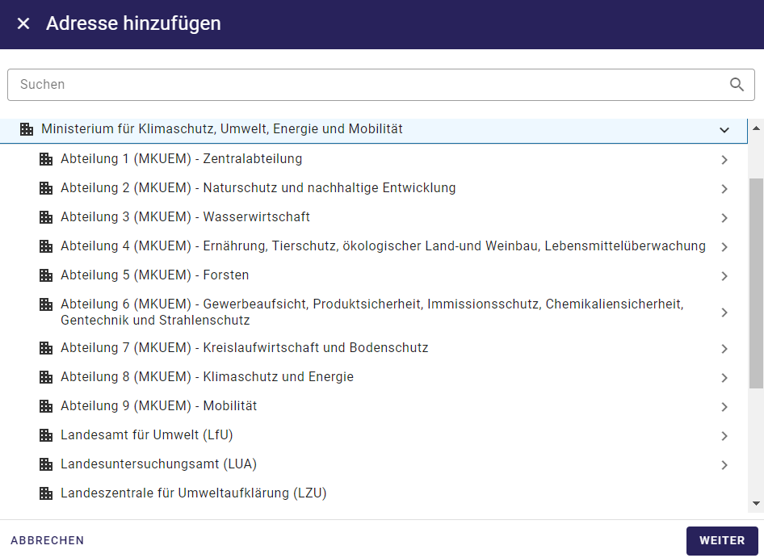
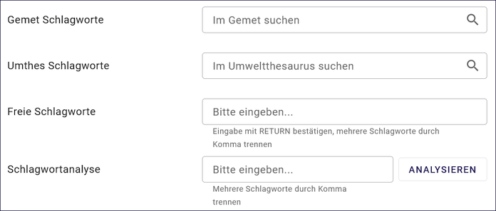
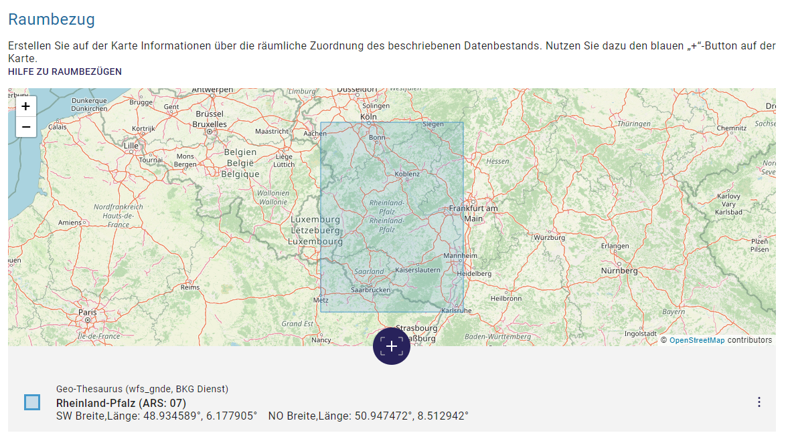
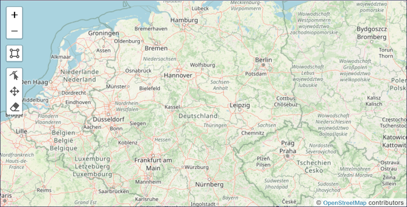

Metadaten erfassen
==================

.. important:: Bevor Sie mit der Erfassung der Metadaten beginnen, empfiehlt es sich, mit der Erfassung der Adressdaten anzufangen. Grund: Verweise von den Metadaten auf die Adressen.

Metadatensätze anlegen
-----------------------

Für eine übersichtliche Verwaltung der Metadatensätze, können hierarchische Strukturen mit Ordnern angelegt werden. Zum Anlegen eines neuen Metadatensatzes muss zunächst der Ordner im Strukturbaum ausgewählt werden, unter dem der neue Metadatensatz angelegt werden soll.

.. figure:: ../../img/ige/erfassung/ige_metadaten/strukturbaum/ordner.png
   :align: left
   :scale: 40
   :figwidth: 100%

Abb.: Ordnerstruktur

Abb.: Symbolleiste - Neuen Datensatz anlegen / Ordner erstellen

Um einen neuen Metadatensatz zu veröffentlichen, müssen alle Pflichtfelder ausgefüllt werden.

Ist der neue Metadatensatz angelegt, besteht die Möglichkeit den ihn über die Funktion "Speichern" in seinem aktuellen Bearbeitungsstand zu sichern. Der Metadatensatz erscheint in der Farbe Orange im Strukturbaum.

Abb.: Symbolleiste -  Speichern

Sind alle Pflichtfelder und erforderliche optionale Felder ausgefüllt, kann der neue Metadatensatz mit "Abschließendes Speichern & Veröffentlichen", gemäß der ausgewählten Veröffentlichungsbreite, freigegeben werden. Der Metadatensatz erschein dann im Strukturbaum in der Farbe Schwarz.

.. figure:: ../../img/ige/erfassung/ige_metadaten/symbolleiste/veroeffentlichen.png
   :align: left
   :scale: 50
   :figwidth: 100%

Abb.: Symbolleiste -  Veröffentlichen

Bedeutung der Symbolfarben:

- orange: in Bearbeitung
- schwarz: Veröffentlicht
- orange/schwarz: Veröffentlicht, danach erneut bearbeitet, die Änderungen sind noch nicht veröffentlicht

.. figure:: ../../img/ige/erfassung/ige_metadaten/strukturbaum/symbolfarben.png
   :align: left
   :scale: 50
   :figwidth: 100%

Abb.: Ordnerstruktur -  Symbolfarben

.. seealso:: Der neue InGrid Editor: `Symbole - Bearbeitungsstatus, Berechtigungen zu den Metadaten <https://metaver-bedienungsanleitung.readthedocs.io/de/igeng/ingrid-editor/erfassung/erfassung-allgemeines.html>`_ 

-----------------------------------------------------------------------------------------------------------------------

Erfassungsmasken ausfüllen
^^^^^^^^^^^^^^^^^^^^^^^^^^

Die nachfolgenden Felder der Erfassungsmasken wurden in diesem Dokument allgemein beschrieben. Spezielle und ausführliche Angaben, sind unter dem Punkt `Datensatztypen <https://metaver-bedienungsanleitung.readthedocs.io/de/igeng/ingrid-editor/erfassung/datensatztypen/datensatztypen.html>`_ beschrieben.

Feld: Titel
"""""""""""

Angabe einer kurzen prägnanten Bezeichnung. Soweit ein gängiges Kürzel vorhanden ist, ist dieses Kürzel mit anzugeben.

.. figure:: ../../img/ige/erfassung/ige_metadaten/abschnitt-02_allgemeines/titel.png
   :align: left
   :scale: 50
   :figwidth: 100%

Abb.: Titel eines Metadatensatzes

-----------------------------------------------------------------------------------------------------------------------

Kopf der Erfassungsmaske
""""""""""""""""""""""""

Oben, rechts (im grauen Bereich) in der Erfassungsmaske befindet sich das Menü für den Kopf bzw. den Metadaten des jeweiligen Datensatzes.

Abb.: Zweipunktemenü

Wird der Pfeil nach unten betätigt, öffnen sich die Metadaten des Datensatzes.

.. figure:: ../../img/ige/erfassung/ige_metadaten/abschnitt-01_kopf/metadaten.png
   :align: left
   :scale: 40
   :figwidth: 100%

Abb.: Metadaten des Datensatzes

.. hint:: Nach der Eingabe der Basisinformationen bietet es sich an, den Metadatensatz schon einmal zu speichern. Grundsätzlich empfiehlt es sich, beim Ausfüllen der Felder von Zeit zu Zeit die eingegebenen Daten zu sichern, um beispielsweise bei einer abgelaufenen Session, die eingegebenen Daten nicht zu verlieren. Das Zwischenspeichern ist jederzeit möglich, auch wenn noch nicht alle Pflichtfelder ausgefüllt sind.

Metadaten (-Kopf) zum Metadatensatz

- **Status:** in Bearbeitung oder Veröffentlichung geplant oder Veröffentlicht
- **Typ:** Datensatztypbezeichnung (Wird bei der Erstellung des Metadatensatzes erstellt.)
- **ID:** ID des Metadatensatzes (Wird nach dem ersten Speichern automatisch vergeben.)
- **Erstellt am:** Erstellungsdatum für den Metadatensatz (wird atomaisch gesetzt)
- **Geändert am:** Änderungsdatum für den Metadatensatz (wird atomaisch gesetzt)
- **Verantwortlich:** zuständiger Bearbeiter für die Metadaten (Wird automatisch bei der Erstellung gesetzt, kann aber geändert werden.)
- **Metadaten-Datum:** Datum der veröffentlichten Version (wird automatisch gesetzt)

**Verantwortlich:** Hier wird automatisiert der Erfasser eingetragen, der das Objekt angelegt hat. An dieser Stelle sollte jedoch die Person stehen, die für die Aktualisierung zuständig ist. In der Regel ist der Erfasser auch die fachlich Verantwortliche Person (Standardeinstellung).

**Metadaten-Datum:** Datum, zu dem der Metadatensatz veröffentlicht wurde. Dieses Datum wird immer dann aktualisiert, wenn ein Metadatensatz veröffentlicht wird und dieser sich geändert hat. Die Änderung eines Metadatensatzes wird anhand der Änderung von Inhalt und Struktur erkannt. Dazu wird ein Fingerabdruck der ISO 19139 XML Daten erstellt und gespeichert. Das Metadaten-Datum wird nur aktualisiert, wenn sich bei einer Veröffentlichung auch der Fingerabdruck ändert. Dadurch wird sichergestellt, dass das Metadaten-Datum auch nicht-inhaltliche Änderungen reflektiert, die sich z.B. durch eine Anpassung der Struktur des Metadatensatzes ergibt. Dies ist wichtig, weil nachfolgende Systeme sich auf dieses Datum beziehen, um z.B. geänderte Metadatensätze zu ermitteln.

-----------------------------------------------------------------------------------------------------------------------

Option: Veröffentlichungsrecht setzen ...
"""""""""""""""""""""""""""""""""""""""""

Wird das Dreipunktemenü betätigt, öffnet sich die Optionen: Veröffentlichungsrecht setzen ...

Abb.: Option Veröffentlichungsrecht setzen ...

.. figure:: ../../img/ige/erfassung/ige_metadaten/abschnitt-01_kopf/veroeffentlichungsrecht_setzen.png
   :align: left
   :scale: 50
   :figwidth: 100%

Abb.: Veröffentlichungsrecht setzten

-----------------------------------------------------------------------------------------------------------------------

Optionen: Typ
"""""""""""""

Unter "Typ" werden Optionen zu den einzelnen Datensatztypen angezeigt, die aktiviert werden können. Sie bewirken, dass zusätzliche Eingabefelder im Metadatensatz erscheinen. 

Datensatztypen mit den entsprechenden Optionen:

  - **Datensammlung:** OpenData
  - **Geodatensatz:** INSPIRE-relevant, AdV kompatibel, OpenData
  - **Geodatendienst:** INSPIRE-relevant, AdV kompatibel, OpenData
  - **Informationssystem:** INSPIRE-relevant, AdV kompatibel, OpenData
  - **Literatur:** OpenData
  - **Projekt:** -
  - **Fachaufgabe:** - 

Abb.: Optionen

-----------------------------------------------------------------------------------------------------------------------

Abschnitt Allgemeines
---------------------

Feld: Identifikator des übergeordneten Metadatensatzes
^^^^^^^^^^^^^^^^^^^^^^^^^^^^^^^^^^^^^^^^^^^^^^^^^^^^^^^

Abb.: Identifikator des übergeordneten Metadatensatzes

Für Datensätze in der obersten Ebene oder direkt unter einem Ordner, kann eine zusätzliche Referenz auf einen übergeordneten Metadatensatz vergeben werden. Dadurch ist es möglich, auch auf externe Datensätze zu verweisen.

Feld: Kurzbezeichnung
^^^^^^^^^^^^^^^^^^^^^

Abb.: Kurzbezeichnung

Angabe einer Kurzbezeichnung für ein Objekt.

.. hint:: Bei gewünschter Mehrsprachigkeit muss dieses Feld nach dem Schema "Deutscher Text#locale-eng:English text" gefüllt werden. Beispiel: Apfelbaum#locale-eng:apple tree

.. figure:: ../../img/ige/erfassung/ige_metadaten/abschnitt-02_allgemeines/titel.png
   :align: left
   :scale: 50
   :figwidth: 100%

Abb.: Beispiel Portalansicht in METAVER - Titel

Abb.: Beispiel Portalansicht in METAVER - Kurzbezeichnung

Feld: Beschreibung
^^^^^^^^^^^^^^^^^^

.. figure:: ../../img/ige/erfassung/ige_metadaten/abschnitt-02_allgemeines/beschreibung.png
   :align: left
   :scale: 40
   :figwidth: 100%

Abb.: Eingabefeld für die Beschreibung

(Zum Vergrößern des Eingabefeldes im Editor an der Ecke rechts, unten ziehen.)

In dieses Feld wird eine fachliche Inhaltsangabe eingetragen. Auf Verständlichkeit für fachfremde Dritte ist zu achten.

Feld: Vorschaugrafik
^^^^^^^^^^^^^^^^^^^^

.. figure:: ../../img/ige/erfassung/ige_metadaten/abschnitt-02_allgemeines/vorschaugrafik.png
   :align: left
   :scale: 50
   :figwidth: 100%

Abb.: Vorschaugrafik hochladen oder Link angeben

Grafik (-en) zu zum bereitgestellten Dateninhalt (einschließlich Legenden) hochladen oder einen Link zu einer Grafik angeben (Beispiel: https://domain.de/pfad/grafik.png).

Abb.: Vorschaugrafiken im InGrid Editor

Die Dateibeschreibung kann in der hochgeladenen Grafik bearbeitet werden (Stift in der Grafik).

- Unterstütze Grafikformate: .png, .webp, .gif,
- Empfohlene Breite: 600 px
- Empfohlene längste Breite/Länge bis max.: 1.200 px
- Empfohlene PNG-Komprimierung: 0-6
- Empfohlene Größe bis max.: 1 MB

Abb.: Beispiel - MV 600x400 px (für Originalgröße Grafik anklicken)

Abb.: Ausgabegröße einer Vorschaugrafik in der METAVER Portalausgabe

Abb.: Beispiel - MV 344x245 px - Vorschaugrafik in der METAVER Portalausgabe

Metadatensatz mit Adressen verküpfen
^^^^^^^^^^^^^^^^^^^^^^^^^^^^^^^^^^^^

Grundsätzlich ist es ratsam erst die Adressen anzulegen, bevor die eigentlichen Metadaten erfasst werden.

Über den Button "Hinzufügen" wird die Adressverknüpfung angelegt.

Es sind mindestens zwei Adressen anzugeben:

  1. Es muss ein Ansprechpartner für die Daten angegeben werden (Adresstyp: Ansprechparter).
  2. Es muss ein Ansprechpartner für die Metadaten angegeben werden (Adresstyp: Ansprechpartner MD).

Abb.: Verknüpfung des Metadatensatzes mit Adressdatensätzen

`Auswahlliste Adressen <https://metaver-bedienungsanleitung.readthedocs.io/de/latest/metaver_ige/ige_auswahllisten/auswahlliste_allgemeines_adressen.html>`_

Abb.: Adressen bearbeiten

Über das Dreipunkt-Menü können die Optionen "Bearbeiten", "Hinzufügen" und "Entfernen" gewählt werden.

Querverweis: `Adressen anlegen <https://metaver-bedienungsanleitung.readthedocs.io/de/igeng/ingrid-editor/erfassung/erfassung-adressen.html>`_

-----------------------------------------------------------------------------------------------------------------------

Abschnitt Verschlagwortung
--------------------------

Abb.: Felder für eine einfache Verschlagwortung

In die Felder für die Verschlagwortung werden die Begriffe eingegeben, über die der Metadatensatz schnell gefunden werden soll. Hier sollten prägnante Suchbegriffe verwendet werden.

Werden in die Felder "GEMET-" und "UMTHES Schlagworte" Wörter eingetragen, dann werden während des Schreibens bereits Vorschläge angezeigt. 

Feld GEMET Schlagworte
^^^^^^^^^^^^^^^^^^^^^^

GEneral Multilingual Environmental Thesaurus (Allgemeiner Mehrsprachiger Umwelt-Thesaurus)

Der Gemet ist eine Entwicklung im Auftrag der Europäischen Umweltagentur (EUA) und wird vom Europäischen Umweltinformations- und Umweltbeobachtungsnetz (European Environment Information and Observation Network – EIONET) verwaltet und publiziert.

GEMET ist eine Zusammenfassung mehrerer kontrollierter mehrsprachiger Vokabulare, und wurde als allgemeiner Thesaurus mit dem Ziel konzipiert, eine gemeinsame Terminologie für umweltrelevante Begriffe im europäischen Kontext zu finden.

(Quelle: Wikipedia)

Feld UMTHES Schlagworte
^^^^^^^^^^^^^^^^^^^^^^^

Umweltthesaurus des Umweltbundesamtes

Der Umweltthesaurus UMTHES thematisiert das Dokumentationsgebiet Umwelt. Neben Begriffen zu den Aspekten Umweltnutzung, Umweltbelastung und des Umweltschutzes sind im Umweltthesaurus auch umweltrelevante Fachbegriffe aus flankierenden Bereichen wie z.B. Recht, Soziologie oder Ökonomie zu finden.

(Quelle: Umweltbundesamt)

.. hint:: Ein Thesaurus ist ein strukturiertes Fachwörterbuch. Die enthaltenen Begriffe dienen dem Wiederauffinden durch Suchfunktionen.

Feld Freie Schlagworte:
^^^^^^^^^^^^^^^^^^^^^^^

In dieses Feld können Schlagworte eingetragen werden, die nicht in einem Thesaurus enthalten sind.

Beispiel: Schlagwort "Kindergarten"

Feld Schlagwortanalyse
^^^^^^^^^^^^^^^^^^^^^^

Werden Begriffe in die Schlagwortanalyse eingegeben, die im "GEMET" oder im "UMTHES" enthalten sind, dann werden diese Bergriffe automatisch den entsprechenden Eingabefeldern zugeordnet. Sind diese Begriffe nicht in einem Thesarus enthalten, werden sie dem Feld "Freie Schlagworte" zugewiesen.

Beispiele für die Zuordung von Suchbegriffen: 

- "INSPIRE" automatische Zuordnung dem Feld "GEMET Schlagworte"
- "Geodaten" automatische Zuordnung dem Feld "UMTHES Schlagworte"
- "Kindergarten" automatische Zuordnung dem Feld "UMTHES Schlagworte" als Synonym "Kindertagesstätte"

.. seealso:: Weitere Eingabefelder für die Verschlagwortung, werden in den unterschiedlichen Datensatztypen, bei der Aktivierung der Optionen (OpenData, INSPIRE-relevant, AdV kompatibel) angezeigt. Die Beschreibung dieser Felder erfolgt unter den entsprechenden `Datensatztypen <https://metaver-bedienungsanleitung.readthedocs.io/de/igeng/ingrid-editor/erfassung/datensatztypen/datensatztypen.html>`_.

-----------------------------------------------------------------------------------------------------------------------

Abschnitt Fachbezug
-------------------

.. hint:: Die Eingabemasken im Abschnitt Fachbezug richten sich nach dem gewählten `Datensatztyp <https://metaver-bedienungsanleitung.readthedocs.io/de/igeng/ingrid-editor/erfassung/datensatztypen/datensatztypen.>`_.

**Beschreibung der Datensatztypen**

Nachfolgend sind die zusätzlichen Eingabefelder in den verschiedenen Datensatztypen beschrieben (Verlinkung folgen).

| `Geodatensatz <https://metaver-bedienungsanleitung.readthedocs.io/de/igeng/ingrid-editor/erfassung/datensatztypen/datensatztyp-geodatensatz.html>`_

  | Beschreibung von digitalen Geodaten, analoge Karten oder Kartenwerke.

| `Geodatendienst <https://metaver-bedienungsanleitung.readthedocs.io/de/igeng/ingrid-editor/erfassung/datensatztypen/datensatztyp-geodatendienst.html>`_

  | Dienste die raumbezogenen Daten zur Verfügung stellen, insbesondere Dienste im Rahmen von INSPIRE, der GDI-DE oder der GDIs der Länder.

| `Informationssystem <https://metaver-bedienungsanleitung.readthedocs.io/de/igeng/ingrid-editor/erfassung/datensatztypen/datensatztyp-informationssystem.html>`_

  | Zentrale Auskunftssysteme, welche in der Regel auf eine oder mehrere Datenbanken zugreifen und diese zugänglich machen.

| `Datensammlung <https://metaver-bedienungsanleitung.readthedocs.io/de/igeng/ingrid-editor/erfassung/datensatztypen/datensatztyp-datensammlung.html>`_

  | Digitale Sammlung von Daten. Beispiele: Messdaten, statistische Erhebungen, Modelldaten, Daten zu Anlagen.

| `Literatur <https://metaver-bedienungsanleitung.readthedocs.io/de/igeng/ingrid-editor/erfassung/datensatztypen/datensatztyp-literatur.html>`_

  | Bücher, Broschüren, Aufsätze, Berichte, Gutachten etc. Von Interesse sind insbesondere Dokumente, welche nicht über den Buchhandel oder über Bibliotheken erhältlich sind (graue Literatur).

| `Projekt <https://metaver-bedienungsanleitung.readthedocs.io/de/igeng/ingrid-editor/erfassung/datensatztypen/datensatztyp-projekt.html>`_

  | Forschungs- und Entwicklungsvorhaben, Projekte unter Beteiligung anderer Institutionen oder privater Unternehmen, Schutzprogramme - Von besonderem Interesse sind Vorhaben/Projekte/Programme, in denen umweltrelevante Datenbestände entstehen.

| `Fachaufgabe <https://metaver-bedienungsanleitung.readthedocs.io/de/igeng/ingrid-editor/erfassung/datensatztypen/datensatztyp-fachaufgabe.html>`_

  | In diesen Datensatztyp befindet sich kein Abschnitt Fachbezug. Der Datensatztyp Fachaufgabe kann für Verweise auf Webseiten verwendet werden (z.B informationen zu Bebauungsplänen). Fachaufgabe ist der einzige Datensatztyp, dem keine weiteren Optionen zugeordnen werden können (z.B. OpenData).

-----------------------------------------------------------------------------------------------------------------------

Abschnitt Raumbezug
-------------------

Im Abschnitt Raumbezug werden Informationen über die räumliche Zuordnung der beschriebenen Daten erfasst.

Einen Raumbezug anlegen
^^^^^^^^^^^^^^^^^^^^^^^

Raumbezug erstellen - in der Karte das blaue Kreuz anklicken. Es öffnet sich das Fenster "Raumbezug hinzufügen".

Abb.: Raumbezug hinzufügen

Suchen Sie nach einem Gebiet oder Ort und wählen Sie aus der angezeigten Liste einen Vorschlag zur Darstellung auf der Karte aus. Nach einem Klick auf "ÜBERNEHMEN" werden die zugehörigen Breiten-/Längenkoordinaten automatisch angezeigt. 

.. figure:: ../../img/ige/erfassung/ige_metadaten/abschnitt-06_raumbezug/raumbezug_ort.png
   :align: left
   :scale: 50
   :figwidth: 100%

Abb.: Raumbezug-Typ - Freie Eingabe - Suche nach Orten

Abb.: Symbole im Kartenviewer

Die Symbole im Kartenviewer haben folgende Bedeutung: 

| **Plus:** Karte vergrößern

| **Minus:** Karte verkleinern

| **Rechteck:** Rechteck angegen - Dazu in die Karte klicken und ein Rechteck aufspannen und wieder in die Karte klicken.

| **Linie mit Punkt:** Rechteck ändern - Mit der Maus auf einen Punkt klicken und das Rechteck verändern.

| **Kreuz:** Rechteck verschieben - In das Rechteck klicken und auf der Karte verschieben.

| **Radiergummi:** Rechteck löschen - Symbol anklicken und anschließend auf das Rechteck in der Karte.

.. figure:: ../../img/ige/erfassung/ige_metadaten/abschnitt-06_raumbezug/raumbezug_typ.png
   :align: left
   :scale: 50
   :figwidth: 100%

Abb.: Raumbezug Typen

Freier Raumbezug
""""""""""""""""

Im Hintergrund arbeitet hier Nominatim, ein OpenStreetMap Werkzeug zum Auffinden von Adressen. Es kann nach Orten oder Naturräumen gesucht werden.

.. figure:: ../../img/ige/erfassung/ige_metadaten/abschnitt-06_raumbezug/raumbezug_freier.png
   :align: left
   :scale: 50
   :figwidth: 100%

Abb.: Raumbezugtyp: Freier Raumbezug

Raumbezug (WKT)
"""""""""""""""

WKT steht für Well-Known Text, dieses Feld dient der Eingabe von Geometrien. Unterstützt werden Punkte, Linien, mehrere Linien, Polygone, mehrere Polygone, unterschiedliche Geometrietypen. Die Angabe muss konform zur Spezifikation "OpenGIS Implementation Specification for Geographic information – Simple feature access" erfolgen.

.. seealso:: `Ausfühliche Bescheibung Erfassung von WKT <https://metaver-bedienungsanleitung.readthedocs.io/de/igeng/ingrid-editor/erfassung/raumbezug/wkt.html>`_

.. figure:: ../../img/ige/erfassung/ige_metadaten/abschnitt-06_raumbezug/raumbezug_wkt.png
   :align: left
   :scale: 50
   :figwidth: 100%

Abb.: Raumbezugtyp: WKT (Polygon)

Geothesaurus (wfs_gnde, BKG Dienst)
"""""""""""""""""""""""""""""""""""

wfs_gnde steht für Geographische Namen und ist ein Gazetteer (Ortsverzeichnis) des Bundesamt für Kartographie und Geodäsie. Dieses Werkzeug enthält den Amtlichen Regionalschlüssel (ASR)

.. figure:: ../../img/ige/erfassung/ige_metadaten/abschnitt-06_raumbezug/raumbezug_wkt.png
   :align: left
   :scale: 50
   :figwidth: 100%

Abb.: Raumbezugtyp: GN-DE mit Amtlichen Regionalschlüssel (ASR)

Der Amtliche Regionalschlüssel ist wie folgt aufgebaut:

| 1.–2. Stelle   = Kennzahl des Bundeslandes
| 3. Stelle      = Kennzahl des Regierungsbezirks; wenn nicht vorhanden: 0
| 4.–5. Stelle   = Kennzahl des Landkreises oder der kreisfreien Stadt
| 6.–9. Stelle   = Verbandsschlüssel
| 10.–12. Stelle = Gemeindekennzahl

.. figure:: ../../img/ige/erfassung/ige_metadaten/abschnitt-06_raumbezug/raumbezug_wkt.png
   :align: left
   :scale: 50
   :figwidth: 100%

Abb.: unterschiedliche Raumbezugtüpen nach der ÜBERNEHMEN in die Metadaten

Für das Bearbeiten des Raumbezuges, auf der rechten Seite auf die drei Punkte klicken, dann öffnet sich ein Menü.

.. figure:: ../../img/ige/erfassung/ige_metadaten/abschnitt-06_raumbezug/raumbezug_bearbeiten.png
   :align: left
   :scale: 50
   :figwidth: 100%

Abb.: Raumbezug bearbeiten

Raumbezugssystem
^^^^^^^^^^^^^^^^

.. figure:: ../../img_ige/metaver_ige/ige_erfassung/ige_objekte/ige_abschnitt-06_raumbezugssystem/ige-raumbezug_raumbezugssystem-liste.png

Abb.: Feld Raumbezugssystem

`Auswahlliste der Raumbezugssysteme <https://metaver-bedienungsanleitung.readthedocs.io/de/latest/metaver_ige/ige_auswahllisten/auswahlliste_raumbezug_raumbezugsysteme.html>`_

Über ein Dropdownmenü erfolgt an dieser Stelle die Auswahl des Raumbezugssystems, welches in der Ressource verwendet wurde. 

Beispiel: EPSG:4326 / WGS 84 / geographisch

.. note:: Die Arbeitsgemeinschaft der Vermessungsverwaltungen der Länder der Bundesrepublik Deutschland (AdV) hat 1991 die Einführung des ETRS89 als Bezugssystem Lage und 1995 die Einführung von UTM als ebenes Koordinatensystem für ETRS89 beschlossen. Dies geschieht im Einklang mit den Empfehlungen der EU zur Realisierung eines europaweiten Raumbezuges und somit zur Schaffung einer einheitlichen Basis für die zukunftsfähige Geodateninfrastruktur in Europa.

Höhe
^^^^

.. figure:: ../../img_ige/metaver_ige/ige_erfassung/ige_objekte/ige_abschnitt-06_raumbezugssystem/ige-raumbezug_hoehe.png
   :width: 500

Abb.: Feld Höhe

Minimum / Maximum
'''''''''''''''''

Angabe der Werte für die Höhe über einem Punkt (siehe Pegel) eingegeben. Ist eine vertikale Ausdehnung vorhanden, so kann für das Maximum ein größerer Wert eingegeben werden. Sollte dies nicht der Fall sein, so ist die Eingabe eines Minimalwerts ausreichend, dieser Wert wird dann automatisch ebenso für den Maximalwert übernommen.

Beispiel: Minimum 100, Maximum 110

Maßeinheit
'''''''''''

Angabe der Maßeinheit, in der die Höhe gemessen wird.

Beispiel: Fuss, Kilometer, Meter, Zoll

Vertikaldatum
''''''''''''''

Angabe des Referenzpegels, zu dem die Höhe relativ gemessen wird. In Deutschland ist dies i.A. der Pegel Amsterdam.

Beispiel: Pegel Amsterdam

`Auswahlliste Vertikaldatum <https://metaver-bedienungsanleitung.readthedocs.io/de/latest/metaver_ige/ige_auswahllisten/auswahlliste_raumbezug_vertikaldatum.html>`_

Erläuterungen
'''''''''''''

Zusätzliche Angaben zum Raumbezug.

Beispiel: Die Koordinaten für die Fachliche Gebietseinheit sind ungefähre Angaben.

Abschnitt Zeitbezug
-------------------

.. figure:: ../../img_ige/metaver_ige/ige_erfassung/ige_objekte/ige_abschnitt-07_zeitbezug/ige-abschnitt_zeitbezug.png

.. important:: Unter Zeitbezug werden Zeitpunkte, Zeiträume, Zeitspannen, Perioden oder Intervalle **der zu beschreibenden Daten (Ressourcen)** eingetragen. Diese Angaben sind bei der Recherche nach Metadaten wichtig, um die gesuchten Daten (Ressourcen) zeitlich eingrenzen zukönnen.

Zeitbezug der Ressource
^^^^^^^^^^^^^^^^^^^^^^^

Mit Ressource ist das eigentliche Objekt gemeint, welches mit Metadaten beschrieben wird.

Mit "Zeitbezug der Ressource" sind die Datumsangaben gemeint, die sich auf das beschriebene Objekt beziehen.

Den Recherchierenden soll mit diesen Angaben die Aktualität der beschriebenen Daten mitgeteilt werden.

.. figure:: ../../img_ige/metaver_ige/ige_erfassung/ige_objekte/ige_abschnitt-07_zeitbezug/ige-zeitbezug_der-ressource.png
   :width: 300

Abb.: Tabelle Zeitbezug der Ressource

Erläuterungen
^^^^^^^^^^^^^

.. figure:: ../../img_ige/metaver_ige/ige_erfassung/ige_objekte/ige_abschnitt-07_zeitbezug/ige-zeitbezug_der-ressource_erlaeuterung.png
   :width: 300

Abb.: Textfeld für Erläuterungen

Hier können z.B. die Angaben der Periodizität eingeschränkt, weitere Zeitangaben gemacht oder Unregelmäßigkeiten erklärt werden. Im Zusammenhang mit dem Eintrag im Feld Periodizität können hier Abstände, Perioden und Intervalle eingetragen werden, die sich nicht aus dem Zusammenhang der anderen Felder des Zeitbezuges erklären, z.B. Jahreszeiten, Dekaden, Tageszeiten.

Beispiel: Die Messungen erfolgten nur am Tag.

Durch die Ressource abgedeckte Zeitspanne
^^^^^^^^^^^^^^^^^^^^^^^^^^^^^^^^^^^^^^^^^^

Mit Ressource ist das eigentliche Objekt gemeint, welches mit Metadaten beschrieben wird.

Mit "Durch die Ressource abgedeckte Zeitspanne" sind die Datumsangaben (Zeiträume) gemeint, die sich auf das beschriebene Objekt beziehen.

Den Recherchierenden soll mit diesen Angaben der Zeitraum für eine Datenerhebung / einer Datenerfassung, einer Projektlaufzeit mitgeteilt werden.

Zeitbezug des Dateninhalts

.. figure:: ../../img_ige/metaver_ige/ige_erfassung/ige_objekte/ige_abschnitt-07_zeitbezug/ige-zeitbezug_zeitspanne.png
   :width: 400

Abb.: Angabe von Zeitpunkten, Zeiträumen / Zeitspannen

Es soll die Zeitspanne oder der Zeitpunkt der Erhebung der eigentlichen Daten eingetragen werden. Ein Zeitpunkt wird mit "am" im Auswahlmenü angegeben. Die Zeitspanne kann auf unterschiedliche Weise ausgedrückt werden.

Beispiele: Zeitraum einer Erhebung von Messdaten, Entwicklungszeitraum einer Anwendung, Laufzeit eines Projektes, Laufzeit einer Studie, Zeitraum für die Erstellung einer Basiskarte, Zeitraum einer Befliegung

Zur Auswahl stehen:

.. figure:: ../../img_ige/metaver_ige/ige_erfassung/ige_objekte/ige_abschnitt-07_zeitbezug/ ige-zeitbezug_zeitspanne-tabelle.png
   :width: 500

Abb.: Tabelle für die Angaben von Zeitspannen

**Spalte: Auswahl 2**

+----------------------------+-------------------------------------------------+
| **Angabe im Editor**       | **Ausgabe im Portal**                           |
+----------------------------+-------------------------------------------------+
| bis: unbekannter Zeitpunkt | seit tt.mm.jjjj, gegenwärtige Aktualität unklar |
+----------------------------+-------------------------------------------------+
| bis: Zeitpunkt des Abrufs  | seit tt.mm.jjjj, gegenwärtig aktuell            |
+----------------------------+-------------------------------------------------+

Periodizität
^^^^^^^^^^^^

.. figure:: ../../img_ige/metaver_ige/ige_erfassung/ige_objekte/ige_abschnitt-07_zeitbezug/ige-zeitbezug_periodizitaet.png

Abb.: Feld Priodizität

`Auswahlliste der Priodizität <https://metaver-bedienungsanleitung.readthedocs.io/de/latest/metaver_ige/ige_auswahllisten/auswahlliste_zeitbezug_periodizitaet.html>`_

Ist die Auswahl oder die Angabe des Zeitzyklus der Datenerhebung. Der Eintrag muss aus der Auswahlliste erfolgen, die über den Pfeil am Ende des Feldes geöffnet wird.

Status
^^^^^^

.. figure:: ../../img_ige/metaver_ige/ige_erfassung/ige_objekte/ige_abschnitt-07_zeitbezug/ige-zeitbezug_status.png

Abb.: Feld Status

`Auswahlliste Status <https://metaver-bedienungsanleitung.readthedocs.io/de/latest/metaver_ige/ige_auswahllisten/auswahlliste_zeitbezug_status.html>`_

Der Status beschreibt den Bearbeitungsstand eines Projektes oder einer der Messung etc. Diese können sich in unterschiedlichen Stadien befinden, d.h. Projekte, Programme oder Messungen können in Planung sein, derzeit durchgeführt werden oder schon abgeschlossen sein.

Im Intervall
^^^^^^^^^^^^

.. figure:: ../../img_ige/metaver_ige/ige_erfassung/ige_objekte/ige_abschnitt-07_zeitbezug/ige-zeitbezug_intervall.png

Abb.: Feld Im Intervall

`Auswahlliste - Im Intervall <https://metaver-bedienungsanleitung.readthedocs.io/de/latest/metaver_ige/ige_auswahllisten/auswahlliste_zeitbezug_intervalle.html>`_

Mit Intervall wird der zeitliche Abstand (Frequenz) der Datenerhebung angegeben. Erfolgt die Datenerhebung kontinuierlich oder periodisch (siehe Feld Periodizität), so wird diese Angabe hier präzisiert. Es stehen Felder für den freien Eintrag einer Ziffer und eine Auswahlliste zur Verfügung, die zeitliche Intervalle vorgibt. Der Eintrag von "10" und "Tage" bedeutet, dass die beschriebenen Daten alle 10 Tage aktualisiert werden.

Abschnitt Zusatzinformation
---------------------------

.. figure:: ../../img_ige/metaver_ige/ige_erfassung/ige_objekte/ige_abschnitt-08_zusatzinformation/ige-abschnitt_zusatzinformation.png

Der Abschnitt Zusatzinformation enthält Angaben von allgemeinen Informationen wie Sprache und Veröffentlichungsbreite des Metadatensatzes.

Sprache des Metadatensatzes
^^^^^^^^^^^^^^^^^^^^^^^^^^^^

Es erfolgt die Angabe der Sprache des Metadatensatzes, als Standard ist Deutsch voreingestellt.

Veröffentlichung
^^^^^^^^^^^^^^^^

Das Feld Veröffentlichung gibt an, welche Veröffentlichungsmöglichkeiten für das Objekt freigegeben sind. Die Liste der Möglichkeiten ist nach Freigabestufen hierarchisch geordnet. Wird einem Objekt eine niedrigere Freigabestufe zugeordnet (z.B. von Internet auf Intranet), werden automatisch auch alle untergeordneten Objekte dieser Stufe zugeordnet. Soll einem Objekt eine höhere Freigabestufe zugeordnet werden als die des übergeordneten Objektes, wird die Zuordnung verweigert. Wird einem Objekt eine höhere Freigabestufe zugeordnet (z.B. von amtsintern auf Intranet), kann auch allen untergeordneten Objekten die höhere Freigabestufe zugeordnet werden.

.. figure:: ../../img_ige/metaver_ige/ige_erfassung/ige_objekte/ige_abschnitt-08_zusatzinformation/ige-zusatzinformation_datensatz-sprache.png

Abb.: Auswahlfelder - Sprache des Metadatensatzes und Veröffentlichung

Die Einstellung haben folgende Bedeutung:

 - Internet: Das Objekt darf auf allen Ebenen veröffentlicht werden.
 - Intranet: Das Objekt darf nur im Intranet veröffentlicht werden, aber nicht im Internet.
 - amtsintern: Das Objekt ist nur im internen Strukturbaum des Metadatenkataloges sichtbar. Es ist nicht für das Internet oder dem Intranet freigegeben.
 
.. hint:: Die Option Intranet wird für Sachsen-Anhalt nicht verwendet, da das System im Internet bereitgestellt wird.

Sprache der Ressource
^^^^^^^^^^^^^^^^^^^^^^

.. figure:: ../../img_ige/metaver_ige/ige_erfassung/ige_objekte/ige_abschnitt-08_zusatzinformation/ige-zusatzinformation_datensatz-sprache.png

Abb.: Auswahlfeld - Sprache der Ressource

Es erfolgt die Angabe der Sprache des beschriebenen Datensatzes, als Standard ist Deutsch voreingestellt.

XML-Export-Kriterium
^^^^^^^^^^^^^^^^^^^^

.. figure:: ../../img_ige/metaver_ige/ige_erfassung/ige_objekte/ige_abschnitt-08_zusatzinformation/ige-zusatzinformation_xml-export-kriterium.png

Abb.: Auswahlfeld - XML-Export-Kriterium

Eintrag eines Selektionskriteriums zur Steuerung des Exports der Daten. Um eine Teilmenge von Objekten exportieren zu können, kann in diesem Feld ein diese Teilmenge identifizierendes Schlagwort eingegeben werden. In der Exportfunktion kann dann eines der Schlagworte aus diesem Feld angegeben werden und alle Objekte exportiert werden, für die in diesem Feld das entsprechende Schlagwort vergeben wurde. Die Eingabe mehrerer Schlagworte ist möglich. Die Schlagworte können frei eingegeben werden. Zur Verhinderung von Schreibfehlern sollte jedoch der Eintrag aus der Auswahlliste vorgezogen werden.

Weitere Rechtliche Grundlagen
^^^^^^^^^^^^^^^^^^^^^^^^^^^^^

.. figure:: ../../img_ige/metaver_ige/ige_erfassung/ige_objekte/ige_abschnitt-08_zusatzinformation/ige-zusatzinformation_weitere-rechtliche-grundlagen.png

Abb.: Auswahlfeld - weitere rechtliche Grundlagen

Angabe der rechtlichen Grundlage, die die Erhebung der beschriebenen Daten veranlasst hat. Hier können Kürzel von Gesetzen, Erlassen, Verordnungen usw. eingetragen werden, in denen z. B. die Methode oder die Form der Erhebung der im Objekt beschriebenen Daten festgelegt oder beschrieben wird. Es ist bei Bedarf der Eintrag mehrerer Angaben möglich.

Herstellungszweck
^^^^^^^^^^^^^^^^^

.. figure:: ../../img_ige/metaver_ige/ige_erfassung/ige_objekte/ige_abschnitt-08_zusatzinformation/ige-zusatzinformation_herstellungszweck.png

Abb.: Textfeld - Herstellungszweck

Zusammenfassung, für welchen Zweck oder mit welcher Absicht die Ressource erstellt wurde.
Bei gewünschter Mehrsprachigkeit muss dieses Feld nach dem Schema "Deutscher Text#locale-eng:English text" gefüllt werden. 
Beispiel: Apfelbaum#locale-eng:apple tree

Eignung/Nutzung
^^^^^^^^^^^^^^^

.. figure:: ../../img_ige/metaver_ige/ige_erfassung/ige_objekte/ige_abschnitt-08_zusatzinformation/ige-zusatzinformation_eignung-nutzung.png

Abb.: Beispiel - Präsentation des Raumordnungsprogramms auf Basis der topografischen Kartenwerke

Spezifische Nutzung: kurze Beschreibung zur Verwendung der Ressource.
Angaben über die Verwendungsmöglichkeiten, die diese Daten in Verbindung mit weiteren Informationen erfüllen können.

Abschnitt Verfügbarkeit
-----------------------

.. figure:: ../../img_ige/metaver_ige/ige_erfassung/ige_objekte/ige_abschnitt-09_verfügbarkeit/ige-abschnitt_verfuegbarkeit.png

Im Abschnitt Verfügbarkeit wird angegeben, ob die zu beschreibenden Daten einer Zugriffsbeschränkung unterliegen und welche Nutzungsbedingungen für diese Daten gelten.

Zugriffsbeschränkungen
^^^^^^^^^^^^^^^^^^^^^^

.. figure:: ../../img_ige/metaver_ige/ige_erfassung/ige_objekte/ige_abschnitt-09_verfügbarkeit/ige-verfuegbarkeit_zugriffsbeschraenkungen.png

Abb.: Auswahlfeld - Zugriffsbeschränkungen

`Auswahlliste der Zugriffsbeschränkungen <https://metaver-bedienungsanleitung.readthedocs.io/de/latest/metaver_ige/ige_auswahllisten/auswahlliste_verfuegbarkeit_zugriffsbeschraenkungen.html>`_

Im Feld Zugriffsbeschränkungen kann aus einer Auswahlliste ein Grund angegeben werden, warum die Daten einer Einschränkung unterliegen. Trifft keiner dieser Gründe zu, ist der Eintrag „Es gelten keine Beschränkungen“ anzugeben.

.. hint:: Für INSPIRE-Daten ist dieses Feld ein Pflichtfeld.

Nutzungsbedingungen
^^^^^^^^^^^^^^^^^^^

.. figure:: ../../img_ige/metaver_ige/ige_erfassung/ige_objekte/ige_abschnitt-09_verfügbarkeit/ige-verfuegbarkeit_nutzungsbedingungen.png

Abb.: Beispiel - Nutzungsbed.: Datenlizenz Deutschland Namensnennung 2.0 / Quellvermerk: © GeoBasis-DE / BKG (Jahr des letzten Datenbezugs)

`Auswahlliste der Nutzungsbedingungen <https://metaver-bedienungsanleitung.readthedocs.io/de/latest/metaver_ige/ige_auswahllisten/auswahlliste_verfuegbarkeit_nutzungsbedingungen.html>`_

Nutzungsbedingungen sind ein einseitig vorformulierter Vertrag, mit dem der Anbieter (der Datenbereitsteller) die Nutzer der Daten über ihre Rechte und Pflichten informiert.
In der Tabellenspalte Nutzungsbedingungen ist eine Auswahlliste mit Lizenzen hinterlegt, diese beschreiben vordefinierte Nutzungsbedingungen. Weiterhin besteht die Möglichkeit Nutzungsbedingungen per Freitext in die Zeile einzutragen oder auf Nutzungsbedingungen zu verweisen.

Quellenvermerk
^^^^^^^^^^^^^^

In dieser Tabellenspalte wird das Copyright des Datenbreitstellers angegeben und die Angabe für das Jahr des Datenbezugs.

Beispiel: © GeoBasis-DE / BKG (Jahr des letzten Datenbezugs)

Anwendungseinschränkungen
^^^^^^^^^^^^^^^^^^^^^^^^^

.. figure:: ../../img_ige/metaver_ige/ige_erfassung/ige_objekte/ige_abschnitt-09_verfügbarkeit/ige-verfuegbarkeit_anwendungseinschraenkungen.png

Abb.: Beispiel - Nicht für Navigationszwecke geeignet oder Registrierung erforderlich

Das Feld Anwendungseinschränkungen dient der Beschreibung, welche Einschränkung oder Eignung auf die Ressourcen oder Metadaten zutreffen (ISO: useLimitation).

 
Datenformat
^^^^^^^^^^^

.. figure:: ../../img_ige/metaver_ige/ige_erfassung/ige_objekte/ige_abschnitt-09_verfügbarkeit/ige-verfuegbarkeit_datenformat.png

Abb.: Beispiel - TIFF / Version: 6.0 / Kompression: LZW / Spezifikation: WCS

Angabe des Formats der Daten in DV-technischer Hinsicht, in welchem diese verfügbar sind. Das Format wird durch 4 unterschiedliche Eingaben spezifiziert. Wenn die erste Spalte befüllt wird, müssen auch die anderen Eintragungen vorgenommen werden. 

 - Name: Angabe des Formatnamens, wie z.B. "Date" 
 - Version: Version der verfügbaren Daten (z.B. "Version 8" oder "Version vom 26.02.2020") 
 - Kompressionstechnik: Kompression, in welcher die Daten geliefert werden (z.B. "WinZip", "keine") 
 - Bildpunkttiefe: BitsPerSample

.. hint:: Bei der Auswahl des INSPIRE-Datenformates GML muss die Version eingetragen werden.

Medienoptionen
^^^^^^^^^^^^^^

.. figure:: ../../img_ige/metaver_ige/ige_erfassung/ige_objekte/ige_abschnitt-09_verfügbarkeit/ige-verfuegbarkeit_medienoptionen.png

Abb.: Beispiel - CD-ROM / 700 MB / Explorer Z:/Bereich_51/Metainformation/2020-02-26_Hilfetexte.doc

Angabe, auf welchen Medien die Daten zur Verfügung gestellt werden können. Hier können elektronische Datenträger als auch Medien in Papierform angegeben werden, auf denen die im Objekt beschriebenen Daten dem Nutzer zur Verfügung stehen. Es können mehrere Medien eingetragen werden. Medium: Angabe der Medien, auf denen der Datensatz bereitgestellt werden kann (ISO-Auswahlliste) Datenvolumen: Umfang des Datenvolumens in MB (Fließkommazahl) Speicherort: Ort der Datenspeicherung im Intranet/Internet, Angabe als Verweis.

`Auswahlliste Medium <https://metaver-bedienungsanleitung.readthedocs.io/de/latest/metaver_ige/ige_auswahllisten/auswahlliste_verfuegbarkeit_medienoption.html>`_

Bestellinformation
^^^^^^^^^^^^^^^^^^

.. figure:: ../../img_ige/metaver_ige/ige_erfassung/ige_objekte/ige_abschnitt-09_verfügbarkeit/ige-verfuegbarkeit_bestellinformation.png

Abb.: Beispiel - Die Lieferzeit beträgt 3 Wochen

Angabe von generellen Informationen wie Bedingungen oder Konditionen zur Bestellung.

Abschnitt Verweise
------------------

.. figure:: ../../img_ige/metaver_ige/ige_erfassung/ige_objekte/ige_abschnitt-10_verweise/ige-abschnitt_verweise.png

Im Abschnitt Verweise können Verlinkungen zu anderen Objekten innerhalb des Kataloges angelegt, oder es können Verweise mit URLs angelegt werden. Bereits angelegte Verweise lassen sich erneut bearbeiten.

Verweise zu
^^^^^^^^^^^

.. figure:: ../../img_ige/metaver_ige/ige_erfassung/ige_objekte/ige_abschnitt-10_verweise/ige-verweise_verweis-zu_tabelle.png

Abb.: Tabelle - Verweise zu ...

Es besteht die Möglichkeit, Verweise von einem Objekt zu einem anderen Objekt oder zu einer Internetadresse (URL) zu erstellen. In dieser Tabelle werden alle Verweise zusammenfassend aufgeführt, welche im aktuellen Objekt angelegt wurden. Über dem Link „Verweis anlegen“ öffnet sich ein Dialog, mit dem weitere Einzelheiten zu den Verweisen eingesehen und editiert werden können. Es ist möglich, weitere Verweise über das Dialogfenster „Verweis bearbeiten“ hinzuzufügen (siehe 2. Verweise anlegen).

.. hint:: Wenn Open Data ausgewählt ist, muss mindestens ein Verweis vom Typ „Datendownload“ vorhanden sein, bevor das Objekt veröffentlicht werden kann!

Verweise von
^^^^^^^^^^^^

.. figure:: ../../img_ige/metaver_ige/ige_erfassung/ige_objekte/ige_abschnitt-10_verweise/ige-verweise_verweis-von.png

Abb.: Tabelle - Verweise von ...

In Tabelle „Verweise von“ werden alle Verweise von denjenigen Objekten aufgeführt, welche auf das aktuelle Objekt verweisen.

Das Editieren oder Hinzufügen ist an dieser Stelle nicht möglich. Sollen die Verweise gelöscht oder ergänzt werden, so muss zu dem entsprechenden Objekt gewechselt werden. Beim Löschen können Sie in der Tabelle „Verweise von“ einfach auf den Namen des entsprechenden Objektes klicken. Der InGrid-Editor wechselt dann automatisch in das ausgewählte Objekt. Im Abschnitt „Verweise“, Tabelle „Verweis zu“ kann jetzt der Verweis gelöscht bzw. ein neuer Verweis angelegt werden.

Verweise anlegen
----------------

.. figure:: ../../img_ige/metaver_ige/ige_erfassung/ige_objekte/ige_abschnitt-10_verweise/ige-verweise_verweis-zu_tabelle.png

Abb.: Tabelle - Verweise zu ...

Im Abschnitt „Verweise“ besteht die Möglichkeit, Verweise von einem MDK-Objekt auf ein anderes MDK-Objekt oder zu einer Internetadresse (URL) zu erstellen. Alle eingegebenen Verweise werden in der Tabelle „Verweise zu“ aufgelistet.

Über den Link „Verweis anlegen“ öffnet sich ein Dialogfenster.
Es gibt zwei mögliche Verweisziele:
 - Verweisziel Objekt: Querverweise zwischen Objekten innerhalb des MDK
 - Verweisziel URL: Verweis auf Informationen im Internet
 
 
Verweistyp
^^^^^^^^^^

.. figure:: ../../img_ige/metaver_ige/ige_erfassung/ige_objekte/ige_abschnitt-10_verweise/ige-verweise_verweis_bearbeiten.png

Abb.: Dialogfenster - Verweis bearbeiten - Verweistyp

Angabe des fachlichen Bezuges, der zwischen dem aktuellen Objekt und dem Verweisobjekt besteht. Wird das Dialogfenster im Abschnitt Verweise geöffnet, so kann über das Dropdown-Menü (ausklappbar über den Pfeil an der rechten Seite des Feldes) aus einer Auswahlliste ein Eintrag gewählt werden. Es sind dann auch freie Einträge für den Verweistyp möglich.

Wurde der Dialog von einem Feld in einer anderen Rubrik (z.B. Objektklasse Anwendung, Rubrik Fachbezug, Feld: Basisdaten, Verweise) geöffnet, so wird automatisch der betreffende Feldname eingetragen und angezeigt.

.. figure:: ../../img_ige/metaver_ige/ige_erfassung/ige_objekte/ige_abschnitt-10_verweise/ige-verweise_verweis-anlegen.png

Abb.: Erfassungsmaske - Eingabefelder mit Verweisen

`Auswahlliste der Verweistypen <https://metaver-bedienungsanleitung.readthedocs.io/de/latest/metaver_ige/ige_auswahllisten/auswahlliste_verweise_verweistypen.html>`_

Beispiel: Objektklasse Datenbank / Verweistyp: Methode / Datengrundlage

Die angebotenen Eintragungen der Dropdown-Liste hängen von dem gewählten Objekttyp ab. Es kann daher auch vorkommen, dass weniger Listeneinträge im Dropdown-Menü angezeigt werden.

Verweisziel: „Objekt“
^^^^^^^^^^^^^^^^^^^^^

.. figure:: ../../img_ige/metaver_ige/ige_erfassung/ige_objekte/ige_abschnitt-10_verweise/ige-verweise_verweisziel_objekt.png

Abb.: Verweisziel Objekt

Über dieses Verweisziel werden Querverweise zwischen den Objekten des MDK definiert. Das Dialogfenster zeigt die entsprechenden Eingabefelder an.

.. figure:: ../../img_ige/metaver_ige/ige_erfassung/ige_objekte/ige_abschnitt-10_verweise/ige-verweise_verweisziel_objekt-auswaehlen.png

Abb.: Verweisziel: Objekt

Objekt auswählen
^^^^^^^^^^^^^^^^

Über „Objekt auswählen“ öffnet sich der Objektstrukturbaum, aus dem das Zielobjekt auszuwählen ist.
Ist das Objekt markiert, zu dem ein Verweis erstellt werden soll, kann der Eintrag durch einen Klick auf den Button „Zuweisen“ übernommen werden. Die Pflichtangaben „Objektname“ und „Objektklasse“ werden automatisch mit den entsprechenden Daten des ausgewählten Objekts gefüllt.

Erläuterung
^^^^^^^^^^^

Hier können weitergehende Informationen zu dem Objekt eingegeben werden. Es können auch Erläuterungen zu der Beziehung zwischen den beschriebenen Daten des aktuellen Objektes und den Daten des Verweis-Objektes gegeben werden.

Hinzufügen
^^^^^^^^^^

Sind alle Pflichtfelder und die gewünschten optionalen Felder gefüllt, kann der Verweis mit der Schaltfläche „Hinzufügen“ in der Tabelle angelegt werden.

Verweisziel "URL"
^^^^^^^^^^^^^^^^^^

.. figure:: ../../img_ige/metaver_ige/ige_erfassung/ige_objekte/ige_abschnitt-10_verweise/ige-verweise_verweisziel_url.png

Abb.: Verweisziel: URL

Soll auf eine Internetseite oder eine externe Datenquelle im Internet verwiesen werden, so ist das Verweisziel „URL“ auszuwählen. Das Dialogfenster zeigt die entsprechenden Eingabefelder an.

Die Auswahl erfolgt wie im Abschnitt „Verweistyp“ beschrieben.

Weitere Pflichtfelder sind die „Bezeichnung des Verweises“ sowie „Internet-Adresse (URL)“.

.. figure:: ../../img_ige/metaver_ige/ige_erfassung/ige_objekte/ige_abschnitt-10_verweise/ige-verweise_verweis_bearbeiten.png

Abb.: Verweis bearbeiten

Bezeichnung des Verweises
^^^^^^^^^^^^^^^^^^^^^^^^^

Im Feld „Bezeichnung des Verweises“ soll eine möglichst aussagekräftige Bezeichnung für den Verweis angegeben werden, beispielsweise kann der dementsprechende Name der Webseite eingetragen werden. Die Eintragungen, die Sie hier angeben, erscheinen im Portal als Link. Klickt der Nutzer auf diesen Link, kommt er auf die Internetseite, die in dem Feld „Internet-Adresse (URL)“ angegeben wurde.

Internet-Adresse (URL)
^^^^^^^^^^^^^^^^^^^^^^

Im Feld „Internet-Adresse (URL)“ wird die URL der Internetseite eingetragen, auf die verwiesen werden soll. Wichtig ist, die vollständige Internetadresse anzugeben, beginnend mit „https://“.

Dateiformat
^^^^^^^^^^^

.. figure:: ../../img_ige/metaver_ige/ige_erfassung/ige_objekte/ige_abschnitt-10_verweise/ige-verweise_dateiformat.png

Abb.: Beispiel - Dateiformat für die Objektklasse Datensatz

Es sind verschiedene Dateiformat-Einträge möglich, die angezeigten Dateiformate richten sich nach der gewählten Objektklasse.

`Auswahlliste der Dateiformate <https://metaver-bedienungsanleitung.readthedocs.io/de/latest/metaver_ige/ige_auswahllisten/auswahlliste_verweise_dateiformate.html>`_

metaver_ige/ige_auswahllisten/auswahlliste_verweise_dateiformate.html
metaver_ige\ige_auswahllisten/auswahlliste_verweise_dateiformate.html

URL-Typ
^^^^^^^^

Bei URL-Verweisen für ein Objekt wird unterschieden ob diese URL für das Internet oder für das Intranet gilt.

Sollte die URL (noch) nicht bekannt sein, weil erst noch der entsprechende Dienst erstellt werden muss, für den Dienst soll aber bereits ein Metadatensatz angelegt werden („Henne-Ei-Problem“), dann bitte wie folgt verfahren:

 - Für den Downloadverweis folgende Dummy-Download-Ressource eintragen: 
   - https://metaver-bedienungsanleitung.readthedocs.io/de/latest/metaver_ige/ige_erfassung/ige_download/ige_download-dummy.html

 - die Veröffentlichungsbreite auf „amtsintern“ ändern
 
Auf diese Weise kann der Metadatensatz abschließend gespeichert werden. Sobald der Dienst zur Verfügung steht, wird die richtige Download-URL im Metadatensatz eingetragen und die Veröffentlichungsbreite auf „Internet“ gesetzt. Durch einen Klick auf die Schaltfläche „Hinzufügen“ wird der Internet-Verweis in die Tabelle aufgenommen.

.. figure:: ../../img_ige/metaver_ige/ige_erfassung/ige_objekte/ige_abschnitt-10_verweise/ige-verweise_verweis-zu_tabelle.png

Abb.: Tabelle Verweise zu

In der Tabelle „Verweise zu“ werden in der ersten Spalte durch entsprechende Symbole die Verweisziele und in der letzten Spalte die ausgewählten Verweistypen dargestellt.

Filter für Verweistypen
^^^^^^^^^^^^^^^^^^^^^^^^

.. figure:: ../../img_ige/metaver_ige/ige_erfassung/ige_objekte/ige_abschnitt-10_verweise/ige-verweise_verweis-zu_filter.png

Abb.: Tabelle Verweise - Filter

Es besteht die Möglichkeit die Verweistypen zu filtern. Die Einträge für die Filterfunktion können über ein Dropdown-Menu geöffnet und ausgewählt werden. Es werden dann nur Verweise eines bestimmten Typs gelistet: z.B. nur Verweise vom Typ „unspezifischer Verweis“.

Zeile löschen / bearbeiten
^^^^^^^^^^^^^^^^^^^^^^^^^^

.. figure:: ../../img_ige/metaver_ige/ige_erfassung/ige_objekte/ige_abschnitt-10_verweise/ige-verweise_verweis-zu_zeile-bearbeiten.png

Abb.: Tabelle Verweise - Zeile löschen / bearbeiten

Möchten Sie einen bestehenden Verweis löschen oder ändern, so klicken Sie bitte in der Tabelle mit der rechten Maustaste auf den Verweis, der geändert oder gelöscht werden soll. Es öffnet sich eine Liste zur Auswahl des passenden Befehls.

Mit „Zeile löschen“ wird der ausgewählte Verweis sofort gelöscht.
Der Befehl „Zeile bearbeiten“ öffnet wieder das bekannte Dialogfenster mit den Einzelheiten zum Verweis. Hier können Sie die Änderungen vornehmen und mit „Hinzufügen“ den Vorgang abschließen.

**Hinweis:** *Es erfolgt keine Sicherheitsabfrage, ob der Verweis wirklich gelöscht werden soll!*

Verweise erben
^^^^^^^^^^^^^^

.. figure:: ../../img_ige/metaver_ige/ige_erfassung/ige_objekte/ige_abschnitt-10_verweise/ige-verweise_verweis-zu_erben.png

Abb.: Tabelle Verweise - erben

Über den Link „erben“ können die Inhalte der Tabelle „Verweise zu“ vom übergeordneten Objekt übernommen werden. 

Verweis zu
''''''''''

Es gibt die Möglichkeit, Verweise von einem Objekt zu einem anderen Objekt oder zu einer Internetadresse (URL) zu erstellen. In dieser Tabelle werden alle Verweise zusammenfassend aufgeführt, welche im aktuellen Objekt angelegt wurden. Über dem Link "Verweise anlegen/bearbeiten" öffnet sich ein Dialog, mit dem weitere Einzelheiten zu den Verweisen eingesehen und editiert werden können. Es ist ferner möglich, weitere Verweise über diesen Dialog hinzuzufügen. Wenn Open-Data ausgewählt ist, muss mindestens ein Verweis vom Typ "Datendownload" vorhanden sein, bevor das Objekt veröffentlicht werden kann!

Verweis von
'''''''''''

In dieser Tabelle werden alle Verweise von denjenigen Objekten aufgeführt, welche auf das aktuelle Objekt verweisen. Das Editieren oder Hinzufügen ist nicht möglich. Sollen die Verweise geändert oder ergänzt werden, so muss zu dem entsprechenden Objekt gewechselt werden.

