==================
Metadaten erfassen
==================

.. important::  Bevor Sie die Erfassung der Metadaten beginnen, empfehlen wir Ihnen, mit der Erfassung der Adressdaten zu beginnen. Der Grund hierfür sind Verweise der Metadaten auf die Adressen.

Metadatensätze anlegen
-----------------------

Für eine übersichtliche Verwaltung der Metadatensätze können hierarchische Strukturen mit Ordnern angelegt werden. Um einen neuen Metadatensatz anzulegen, muss zunächst der Ordner in der Ordnerstruktur ausgewählt werden, unter dem der neue Metadatensatz angelegt werden soll.

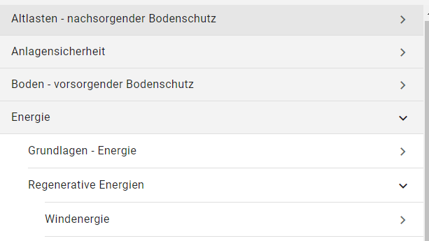

Abb.: Ordnerstruktur

.. figure:: ../../img/ige/erfassung/ige_metadaten/symbolleiste/neu-anlegen.png
   :align: left
   :scale: 50
   :figwidth: 100%

Abb.: Symbolleiste - Neuen Datensatz anlegen / Ordner erstellen

Um einen neuen Metadatensatz zu veröffentlichen, müssen alle Pflichtfelder ausgefüllt werden.

Nachdem der neue Metadatensatz angelegt wurde, kann er über die Funktion "Speichern" in seinem aktuellen Bearbeitungsstand gespeichert werden. Der Metadatensatz wird in der Ornerstruktur orange dargestellt.

.. figure:: ../../img/ige/erfassung/ige_metadaten/symbolleiste/speichern.png
   :align: left
   :scale: 60
   :figwidth: 100%

Abb.: Symbolleiste -  Speichern

Wenn alle Pflichtfelder und alle erforderlichen optionalen Felder ausgefüllt sind, kann der neue Metadatensatz mit "Speichern & Veröffentlichen" entsprechend der gewählten Veröffentlichungsbreite freigegeben werden. Der Metadatensatz erscheint dann im Gliederungsbaum in schwarzer Farbe.

Abb.: Symbolleiste -  Veröffentlichen

Bedeutung der Symbolfarben:

- orange: in Bearbeitung
- schwarz: Veröffentlicht
- orange/schwarz: Veröffentlicht, danach erneut bearbeitet, die Änderungen sind noch nicht veröffentlicht

Abb.: Ordnerstruktur -  Symbolfarben

.. seealso:: Der neue InGrid Editor: `Symbole - Bearbeitungsstatus, Berechtigungen zu den Metadaten <https://metaver-bedienungsanleitung.readthedocs.io/de/latest/ingrid-editor/erfassung/erfassung-allgemeines.html>`_ 

-----------------------------------------------------------------------------------------------------------------------

Erfassungsmasken ausfüllen
^^^^^^^^^^^^^^^^^^^^^^^^^^

Die nachfolgenden Felder der Erfassungsmasken wurden in diesem Dokument allgemein beschrieben. Spezielle und ausführliche Angaben, sind unter dem Punkt `Datensatztypen <https://metaver-bedienungsanleitung.readthedocs.io/de/latest/ingrid-editor/erfassung/datensatztypen/datensatztypen.html>`_ beschrieben.

Feld: Titel
"""""""""""

Angabe einer kurzen prägnanten Bezeichnung. Soweit ein gängiges Kürzel vorhanden ist, ist dieses Kürzel mit anzugeben.

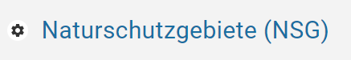

Abb.: Titel eines Metadatensatzes

-----------------------------------------------------------------------------------------------------------------------

Kopf der Erfassungsmaske
""""""""""""""""""""""""

Oben, rechts (im grauen Bereich) in der Erfassungsmaske befindet sich das Menü für den Kopf bzw. den Metadaten des jeweiligen Datensatzes.

.. figure:: ../../img/ige/erfassung/ige_metadaten/abschnitt-01_kopf/menue.png
   :align: left
   :scale: 50
   :figwidth: 100%

Abb.: Zweipunktemenü

Wird der Pfeil nach unten betätigt, öffnen sich die Metadaten des Datensatzes.

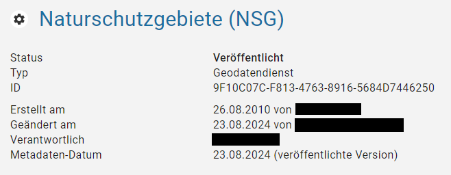

Abb.: Metadaten des Datensatzes

.. hint:: Nach der Eingabe der Basisinformationen bietet es sich an, den Metadatensatz schon einmal zu speichern. Grundsätzlich empfiehlt es sich, beim Ausfüllen der Felder von Zeit zu Zeit die eingegebenen Daten zu sichern, um beispielsweise bei einer abgelaufenen Session, die eingegebenen Daten nicht zu verlieren. Das Zwischenspeichern ist jederzeit möglich, auch wenn noch nicht alle Pflichtfelder ausgefüllt sind.

Metadatenkopf

- **Status:** in Bearbeitung oder Veröffentlichung geplant oder Veröffentlicht
- **Typ:** Datensatztypbezeichnung (Wird bei der Erstellung des Metadatensatzes erstellt.)
- **ID:** ID des Metadatensatzes (Wird nach dem ersten Speichern automatisch vergeben.)
- **Erstellt am:** Erstellungsdatum für den Metadatensatz (wird atomatisch gesetzt)
- **Geändert am:** Änderungsdatum für den Metadatensatz (wird atomatisch gesetzt)
- **Verantwortlich:** zuständiger Bearbeiter für die Metadaten (Wird beim Anlegen automatisch gesetzt, kann aber geändert werden.)
- **Metadaten-Datum:** Datum der veröffentlichten Version (wird automatisch gesetzt)

**Verantwortlich:** Hier wird automatisch der Erfasser eingetragen, der das Objekt angelegt hat. Hier sollte jedoch die für die Aktualisierung verantwortliche Person eingetragen werden. In der Regel ist der Erfasser auch der fachlich Verantwortliche (Standardeinstellung).

**Metadaten-Datum:** Datum, an dem der Metadatensatz veröffentlicht wurde. Dieses Datum wird jedes Mal aktualisiert, wenn ein Metadatensatz veröffentlicht wird und sich geändert hat. Die Änderung eines Metadatensatzes wird anhand der Änderung von Inhalt und Struktur erkannt. Dazu wird ein Fingerprint der ISO 19139 XML-Daten erstellt und gespeichert. Der Metadatensatz wird nur dann aktualisiert, wenn sich der Fingerprint bei einer Veröffentlichung ändert. Damit wird sichergestellt, dass das Metadatendatum auch nicht inhaltliche Änderungen widerspiegelt, die sich z.B. durch eine Anpassung der Struktur des Metadatensatzes ergeben. Dies ist wichtig, da nachfolgende Systeme auf dieses Datum zurückgreifen, um z.B. geänderte Metadatensätze zu identifizieren.

-----------------------------------------------------------------------------------------------------------------------

Option: Veröffentlichungsrecht setzen ...
"""""""""""""""""""""""""""""""""""""""""

Wird das Dreipunktemenü betätigt, öffnet sich die Optionen: Veröffentlichungsrecht setzen ...

.. figure:: ../../img/ige/erfassung/ige_metadaten/abschnitt-01_kopf/option_veroeffentlichungsrecht_setzen.png
   :align: left
   :scale: 60
   :figwidth: 100%

Abb.: Option Veröffentlichungsrecht setzen ...

.. figure:: ../../img/ige/erfassung/ige_metadaten/abschnitt-01_kopf/veroeffentlichungsrecht_setzen.png
   :align: left
   :scale: 50
   :figwidth: 100%

Abb.: Veröffentlichungsrecht setzten

-----------------------------------------------------------------------------------------------------------------------

Optionen: Merkmale
"""""""""""""

Es werden die verschiedenen Merkmale der Datensätze angezeigt, deren Aktivierung zusätzliche Eingabefelder im Metadatensatz freischaltet.

Abb.: Merkmale der Datensätze

Datensatztypen mit den entsprechenden Merkmalen:

- **Geodatensatz:** Datensatz / Datenserie, OpenData + HVD | INSPIRE-relevant + InVeKoS | AdV kompatibel
- **Geodatendienst:** OpenData | INSPIRE-relevant | AdV kompatibel
- **Anwendung:** OpenData | INSPIRE-relevant | AdV kompatibel
- **Datenbank:** OpenData
- **Dokument:** OpenData
- **Projekt:** -
- **Organisationseinheit:** - 

Die Merkmale können auf "NUR MARKIERTE ANZEIGEN" eingeschränkt werden.

Abb.: Nur Markierte Merkmale 

-----------------------------------------------------------------------------------------------------------------------

Abschnitt Allgemeines
---------------------

Feld: Identifikator des übergeordneten Metadatensatzes
^^^^^^^^^^^^^^^^^^^^^^^^^^^^^^^^^^^^^^^^^^^^^^^^^^^^^^^

.. figure:: ../../img/ige/erfassung/ige_metadaten/abschnitt-02_allgemeines/identifikator-des-uebergeordneten-datensatzes.png
   :align: left
   :scale: 70
   :figwidth: 100%

Abb.: Identifikator des übergeordneten Metadatensatzes

Für Datensätze in der obersten Ebene oder direkt unter einem Ordner, kann eine zusätzliche Referenz auf einen übergeordneten Metadatensatz vergeben werden. Dadurch ist es möglich, auch auf externe Datensätze zu verweisen.

Feld: Kurzbezeichnung
^^^^^^^^^^^^^^^^^^^^^

.. figure:: ../../img/ige/erfassung/ige_metadaten/abschnitt-02_allgemeines/kurzbezeichnung.png
   :align: left
   :scale: 70
   :figwidth: 100%

Abb.: Kurzbezeichnung

Angabe einer Kurzbezeichnung für ein Objekt.

.. hint:: Bei gewünschter Mehrsprachigkeit muss dieses Feld nach dem Schema "Deutscher Text#locale-eng:English text" gefüllt werden. Beispiel: Apfelbaum#locale-eng:apple tree

Abb.: Beispiel Portalansicht in METAVER - Titel

.. figure:: ../../img/ige/erfassung/ige_metadaten/abschnitt-02_allgemeines/kurzbezeichnung_beispiel.png
   :align: left
   :scale: 70
   :figwidth: 100%

Abb.: Beispiel Portalansicht in METAVER - Kurzbezeichnung

Feld: Beschreibung
^^^^^^^^^^^^^^^^^^

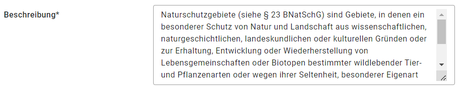

Abb.: Eingabefeld für die Beschreibung

(Zum Vergrößern des Eingabefeldes im Editor an der Ecke rechts, unten ziehen.)

In dieses Feld wird eine fachliche Inhaltsangabe eingetragen. Auf Verständlichkeit für fachfremde Dritte ist zu achten.

Feld: Vorschaugrafik
^^^^^^^^^^^^^^^^^^^^

.. figure:: ../../img/ige/erfassung/ige_metadaten/abschnitt-02_allgemeines/vorschaugrafik.png
   :align: left
   :scale: 70
   :figwidth: 100%

Abb.: Vorschaugrafik hochladen oder Link angeben

Grafik (-en) zu zum bereitgestellten Dateninhalt (einschließlich Legenden) hochladen oder einen Link zu einer Grafik angeben (Beispiel: https://domain.de/pfad/grafik.png).

.. figure:: ../../img/ige/erfassung/ige_metadaten/abschnitt-02_allgemeines/vorschaugrafik_editor.png
   :align: left
   :scale: 70
   :figwidth: 100%

Abb.: Vorschaugrafiken im InGrid Editor

Die Dateibeschreibung kann in der hochgeladenen Grafik bearbeitet werden (Stift in der Grafik).

- Unterstütze Grafikformate: .png, .webp, .gif,
- Empfohlene Breite: 600 px
- Empfohlene längste Breite/Länge bis max.: 1.200 px
- Empfohlene PNG-Komprimierung: 0-6
- Empfohlene Größe bis max.: 1 MB

.. figure:: ../../img/ige/erfassung/ige_metadaten/abschnitt-02_allgemeines/image_map_mv.png
   :align: left
   :scale: 50
   :figwidth: 100%

Abb.: Beispiel - MV 600x400 px (für Originalgröße Grafik anklicken)

.. figure:: ../../img/ige/erfassung/ige_metadaten/abschnitt-02_allgemeines/vorschaugrafik_ausgabe.png
   :align: left
   :scale: 50
   :figwidth: 100%

Abb.: Ausgabegröße einer Vorschaugrafik in der METAVER Portalausgabe

.. figure:: ../../img/ige/erfassung/ige_metadaten/abschnitt-02_allgemeines/vorschaugrafik_portalausgabe.png
   :align: left
   :scale: 80
   :figwidth: 100%

Abb.: Beispiel - MV 344x245 px - Vorschaugrafik in der METAVER Portalausgabe

Metadatensatz mit Adressen verküpfen
^^^^^^^^^^^^^^^^^^^^^^^^^^^^^^^^^^^^

Grundsätzlich ist es ratsam erst die Adressen anzulegen, bevor die eigentlichen Metadaten erfasst werden.

Über den Button "Hinzufügen" wird die Adressverknüpfung angelegt.

Es sind mindestens zwei Adressen anzugeben:

  1. Es muss ein Ansprechpartner für die Daten angegeben werden (Adresstyp: Ansprechparter).
  2. Es muss ein Ansprechpartner für die Metadaten angegeben werden (Adresstyp: Ansprechpartner MD).

.. figure:: ../../img/ige/erfassung/ige_metadaten/abschnitt-02_allgemeines/adressen_anlegen.png
   :align: left
   :scale: 70
   :figwidth: 100%

Abb.: Verknüpfung des Metadatensatzes mit Adressdatensätzen

`Auswahlliste Adressen <https://metaver-bedienungsanleitung.readthedocs.io/de/latest/ingrid-editor/auswahllisten/auswahlliste_allgemeines_adressen.html>`_

.. figure:: ../../img/ige/erfassung/ige_metadaten/abschnitt-02_allgemeines/adressen_bearbeiten.png
   :align: left
   :scale: 70
   :figwidth: 100%

Abb.: Adressen bearbeiten

Über das Dreipunkt-Menü können die Optionen "Bearbeiten", "Hinzufügen" und "Entfernen" gewählt werden.

Querverweis: `Adressen anlegen <https://metaver-bedienungsanleitung.readthedocs.io/de/latest/ingrid-editor/erfassung/erfassung-adressen.html>`_

-----------------------------------------------------------------------------------------------------------------------

Abschnitt Verschlagwortung
--------------------------

.. figure:: ../../img/ige/erfassung/ige_metadaten/abschnitt-03_verschlagwortung/verschlagwortung.png
   :align: left
   :scale: 80
   :figwidth: 100%

Abb.: Felder für eine einfache Verschlagwortung

In die Felder für die Verschlagwortung werden die Begriffe eingegeben, über die der Metadatensatz schnell gefunden werden soll. Hier sollten prägnante Suchbegriffe verwendet werden.

Werden in die Felder "GEMET-" und "UMTHES Schlagworte" Wörter eingetragen, dann werden während des Schreibens bereits Vorschläge angezeigt. 

Feld: GEMET Schlagworte
^^^^^^^^^^^^^^^^^^^^^^

GEneral Multilingual Environmental Thesaurus (Allgemeiner Mehrsprachiger Umwelt-Thesaurus)

Der Gemet ist eine Entwicklung im Auftrag der Europäischen Umweltagentur (EUA) und wird vom Europäischen Umweltinformations- und Umweltbeobachtungsnetz (European Environment Information and Observation Network – EIONET) verwaltet und publiziert.

GEMET ist eine Zusammenfassung mehrerer kontrollierter mehrsprachiger Vokabulare, und wurde als allgemeiner Thesaurus mit dem Ziel konzipiert, eine gemeinsame Terminologie für umweltrelevante Begriffe im europäischen Kontext zu finden.

(Quelle: Wikipedia)

Feld: UMTHES Schlagworte
^^^^^^^^^^^^^^^^^^^^^^^

Umweltthesaurus des Umweltbundesamtes

Der Umweltthesaurus UMTHES thematisiert das Dokumentationsgebiet Umwelt. Neben Begriffen zu den Aspekten Umweltnutzung, Umweltbelastung und des Umweltschutzes sind im Umweltthesaurus auch umweltrelevante Fachbegriffe aus flankierenden Bereichen wie z.B. Recht, Soziologie oder Ökonomie zu finden.

(Quelle: Umweltbundesamt)

.. hint:: Ein Thesaurus ist ein strukturiertes Fachwörterbuch. Die enthaltenen Begriffe dienen dem Wiederauffinden durch Suchfunktionen.

Feld: Freie Schlagworte:
^^^^^^^^^^^^^^^^^^^^^^^

In dieses Feld können Schlagworte eingetragen werden, die nicht in einem Thesaurus enthalten sind.

Beispiel: Schlagwort "Kindergarten"

Feld: Schlagwortanalyse
^^^^^^^^^^^^^^^^^^^^^^

Werden Begriffe in die Schlagwortanalyse eingegeben, die im "GEMET" oder im "UMTHES" enthalten sind, dann werden diese Bergriffe automatisch den entsprechenden Eingabefeldern zugeordnet. Sind diese Begriffe nicht in einem Thesarus enthalten, werden sie dem Feld "Freie Schlagworte" zugewiesen.

Beispiele für die Zuordung von Suchbegriffen: 

- "INSPIRE" automatische Zuordnung dem Feld "GEMET Schlagworte"
- "Geodaten" automatische Zuordnung dem Feld "UMTHES Schlagworte"
- "Kindergarten" automatische Zuordnung dem Feld "UMTHES Schlagworte" als Synonym "Kindertagesstätte"

.. seealso:: Weitere Eingabefelder für die Verschlagwortung, werden in den unterschiedlichen Datensatztypen, bei der Aktivierung der Optionen (OpenData, INSPIRE-relevant, AdV kompatibel) angezeigt. Die Beschreibung dieser Felder erfolgt unter den entsprechenden `Datensatztypen <https://metaver-bedienungsanleitung.readthedocs.io/de/latest/ingrid-editor/erfassung/datensatztypen/datensatztypen.html>`_.

-----------------------------------------------------------------------------------------------------------------------

Abschnitt Fachbezug
-------------------

.. hint:: Die Eingabemasken im Abschnitt Fachbezug richten sich nach dem gewählten `Datensatztyp <https://metaver-bedienungsanleitung.readthedocs.io/de/latest/ingrid-editor/erfassung/datensatztypen/datensatztypen.>`_.

**Beschreibung der Datensatztypen**

Nachfolgend sind in den verschiedenen Datensatztypen (Verlinkung folgen) die zusätzlichen Eingabefelder beschrieben.

| `Geodatensatz <https://metaver-bedienungsanleitung.readthedocs.io/de/latest/ingrid-editor/erfassung/datensatztypen/datensatztyp-geodatensatz.html>`_

  | Beschreibung von digitalen Geodaten, analoge Karten oder Kartenwerke.

| `Geodatendienst <https://metaver-bedienungsanleitung.readthedocs.io/de/latest/ingrid-editor/erfassung/datensatztypen/datensatztyp-geodatendienst.html>`_

  | Dienste die raumbezogenen Daten zur Verfügung stellen, insbesondere Dienste im Rahmen von INSPIRE, der GDI-DE oder der GDIs der Länder.

| `Informationssystem <https://metaver-bedienungsanleitung.readthedocs.io/de/latest/ingrid-editor/erfassung/datensatztypen/datensatztyp-informationssystem.html>`_

  | Zentrale Auskunftssysteme, welche in der Regel auf eine oder mehrere Datenbanken zugreifen und diese zugänglich machen.

| `Datensammlung <https://metaver-bedienungsanleitung.readthedocs.io/de/latest/ingrid-editor/erfassung/datensatztypen/datensatztyp-datensammlung.html>`_

  | Digitale Sammlung von Daten. Beispiele: Messdaten, statistische Erhebungen, Modelldaten, Daten zu Anlagen.

| `Dokument <https://metaver-bedienungsanleitung.readthedocs.io/de/latest/ingrid-editor/erfassung/datensatztypen/datensatztyp-dokument.html>`_

  | Bücher, Broschüren, Aufsätze, Berichte, Gutachten etc. Von Interesse sind insbesondere Dokumente, welche nicht über den Buchhandel oder über Bibliotheken erhältlich sind (graue Literatur).

| `Projekt <https://metaver-bedienungsanleitung.readthedocs.io/de/latest/ingrid-editor/erfassung/datensatztypen/datensatztyp-projekt.html>`_

  | Forschungs- und Entwicklungsvorhaben, Projekte unter Beteiligung anderer Institutionen oder privater Unternehmen, Schutzprogramme - Von besonderem Interesse sind Vorhaben/Projekte/Programme, in denen umweltrelevante Datenbestände entstehen.

| `Fachaufgabe <https://metaver-bedienungsanleitung.readthedocs.io/de/latest/ingrid-editor/erfassung/datensatztypen/datensatztyp-fachaufgabe.html>`_

  | In diesen Datensatztyp befindet sich kein Abschnitt Fachbezug. Der Datensatztyp Fachaufgabe kann für Verweise auf Webseiten verwendet werden (z.B Informationen zu Bebauungsplänen). Fachaufgabe ist der einzige Datensatztyp, dem keine weiteren Optionen (z.B. OpenData) zugeordnen werden können.

-----------------------------------------------------------------------------------------------------------------------

Abschnitt Raumbezug
-------------------

Im Abschnitt Raumbezug werden Informationen über die räumliche Zuordnung der beschriebenen Daten erfasst.

Raumbezugssystem
^^^^^^^^^^^^^^^^

Im Raumbezugssystem einen Raumbezug hinzufügen - In der Karte auf das blaue Kreuz klicken. Es öffnet sich das Fenster des Raumbezugsystems.

.. figure:: ../../img/ige/erfassung/ige_metadaten/abschnitt-06_raumbezug/raumbezug.png
   :align: left
   :scale: 90
   :figwidth: 100%

Abb.: Raumbezug hinzufügen

Suchen Sie nach einem Gebiet oder Ort und wählen Sie aus der angezeigten Liste einen Vorschlag zur Darstellung auf der Karte aus. Nach einem Klick auf "ÜBERNEHMEN" werden die zugehörigen Breiten-/Längenkoordinaten automatisch angezeigt. 

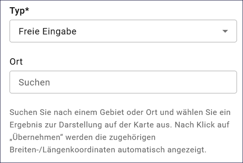

Abb.: Raumbezug-Typ - Freie Eingabe - Suche nach Orten

.. figure:: ../../img/ige/erfassung/ige_metadaten/abschnitt-06_raumbezug/kartenviewer_symbole.png
   :align: left
   :scale: 90
   :figwidth: 100%

Abb.: Symbole im Kartenviewer

Die Symbole im Kartenviewer haben folgende Bedeutung: 

| **Plus:** Karte vergrößern

| **Minus:** Karte verkleinern

| **Rechteck:** Rechteck angegen - Dazu in die Karte klicken und ein Rechteck aufspannen und wieder in die Karte klicken.

| **Linie mit Punkt:** Rechteck ändern - Mit der Maus auf einen Punkt klicken und das Rechteck verändern.

| **Kreuz:** Rechteck verschieben - In das Rechteck klicken und auf der Karte verschieben.

| **Radiergummi:** Rechteck löschen - Symbol anklicken und anschließend auf das Rechteck in der Karte.

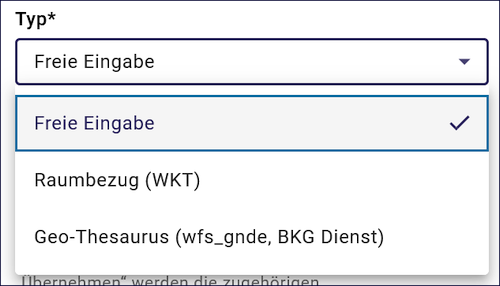

Abb.: Raumbezug Typen

Option: Freie Eingabe
"""""""""""""""""""""

Im Hintergrund arbeitet hier Nominatim, ein OpenStreetMap Werkzeug zum Auffinden von Adressen. Es kann nach Orten oder Naturräumen gesucht werden.

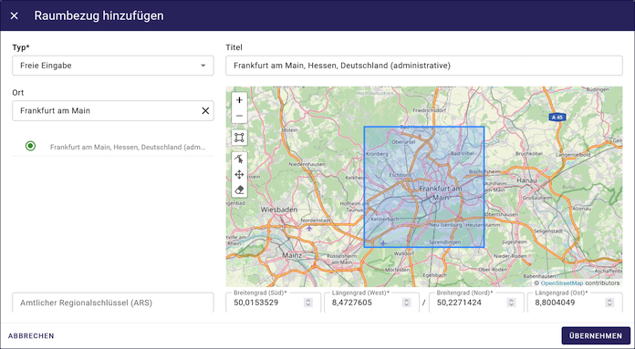

Abb.: Raumbezugtyp: Freier Raumbezug

Option: Raumbezug (WKT)
"""""""""""""""""""""""

WKT steht für Well-Known Text, dieses Feld dient der Eingabe von Geometrien. Unterstützt werden Punkte, Linien, mehrere Linien, Polygone, mehrere Polygone, unterschiedliche Geometrietypen. Die Angabe muss konform zur Spezifikation "OpenGIS Implementation Specification for Geographic information – Simple feature access" erfolgen.

.. seealso:: `Ausfühliche Bescheibung Erfassung von WKT <https://metaver-bedienungsanleitung.readthedocs.io/de/latest/ingrid-editor/erfassung/raumbezug/wkt.html>`_

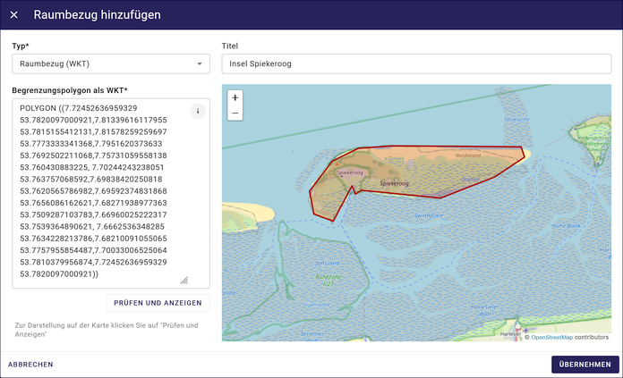

Abb.: Raumbezugtyp: WKT (Polygon)

Option: Geothesaurus (wfs_gnde, BKG Dienst)
"""""""""""""""""""""""""""""""""""""""""""

wfs_gnde steht für Geographische Namen und ist ein Gazetteer (Ortsverzeichnis) des Bundesamt für Kartographie und Geodäsie. Dieses Werkzeug enthält den Amtlichen Regionalschlüssel (ASR)

Abb.: Raumbezugtyp: GN-DE mit Amtlichen Regionalschlüssel (ASR)

Feld: Amtlicher Regionalschlüssel (ARS)
"""""""""""""""""""""""""""""""""""""""

Den `Amtlichen Regionalschlüssel (ARS) <https://metaver-bedienungsanleitung.readthedocs.io/de/latest/ingrid-editor/erfassung/raumbezug/asr.html>`_ erfassen.

Abb.: Unterschiedliche Raumbezugtypen nach ÜBERNEHMEN in die Metadaten

Für das Bearbeiten des Raumbezuges, auf der rechten Seite auf die drei Punkte klicken, dann öffnet sich ein Menü.

Abb.: Raumbezug bearbeiten

Feld: Raumbezugssystem (Koordinatenreferenzsystem oder Koordinatenbezugsystem)
^^^^^^^^^^^^^^^^^^^^^^^^^^^^^^^^^^^^^^^^^^^^^^^^^^^^^^^^^^^^^^^^^^^^^^^^

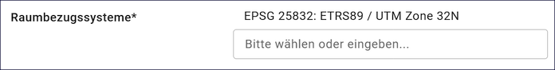

Abb.: Felde Koordinatenreferenzsystem

`Auswahlliste Koordinatenrefernzsystem <https://metaver-bedienungsanleitung.readthedocs.io/de/latest/ingrid-editor/auswahllisten/auswahlliste_raumbezug_raumbezugsysteme.html>`_

Über ein Dropdownmenü erfolgt an dieser Stelle die Auswahl des Raumbezugssystems, welches in der Ressource verwendet wurde. 

Beispiel: EPSG:4326 / WGS 84 / geographisch

Höhe
^^^^
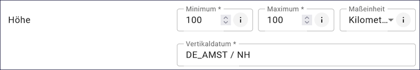

Abb.: Felder für Höhenangaben

Felder: Minimum / Maximum
"""""""""""""""""""""""""

Angabe der Werte für die Höhe über einem Punkt (siehe Pegel) eingegeben. Ist eine vertikale Ausdehnung vorhanden, so kann für das Maximum ein größerer Wert eingegeben werden. Sollte dies nicht der Fall sein, so ist die Eingabe eines Minimalwerts ausreichend, dieser Wert wird dann automatisch ebenso für den Maximalwert übernommen.

Beispiel: Minimum 100, Maximum 110

Feld: Maßeinheit
""""""""""""""""

Angabe der Maßeinheit, in der die Höhe gemessen wird.

Beispiel: Fuss, Kilometer, Meter, Zoll

Feld: Vertikaldatum
"""""""""""""""""""

Angabe des Referenzpegels, zu dem die Höhe relativ gemessen wird. In Deutschland ist dies i.A. der Pegel Amsterdam.

Beispiel: Pegel Amsterdam

`Auswahlliste Vertikaldatum <https://metaver-bedienungsanleitung.readthedocs.io/de/latest/ingrid-editor/auswahllisten/auswahlliste_raumbezug_vertikaldatum.html>`_

Feld: Erläuterungen
"""""""""""""""""""

.. figure:: ../../img/ige/erfassung/ige_metadaten/abschnitt-06_raumbezug/raumbezug_erlaeuterungen.png
   :align: left
   :scale: 80
   :figwidth: 100%

Abb.: Feld Erläuterungen für Zusätzliche Angaben zum Raumbezu

Beispiel: Die Koordinaten für die Fachliche Gebietseinheit sind ungefähre Angaben.

-----------------------------------------------------------------------------------------------------------------------

Abschnitt Zeitbezug
-------------------

Unter Zeitbezug werden Zeitpunkte, Zeiträume, Zeitspannen, Perioden oder Intervalle **der zu beschreibenden Daten (Ressourcen)** eingetragen. Diese Angaben sind bei der Recherche nach Metadaten wichtig, um die gesuchten Daten (Ressourcen) zeitlich eingrenzen zukönnen.

Feld: Zeitbezug der Ressource
^^^^^^^^^^^^^^^^^^^^^^^^^^^^^

Mit "Ressource" ist der eigentliche Datensatz gemeint, welcher mit Metadaten beschrieben wird. Mit "Zeitbezug der Ressource" sind die Datumsangaben gemeint, die sich auf den beschriebenen Datensatz beziehen. Den Recherchierenden soll mit diesen Angaben die Aktualität der beschriebenen Daten mitgeteilt werden.

.. figure:: ../../img/ige/erfassung/ige_metadaten/abschnitt-07_zeitbezug/ressource.png
   :align: left
   :scale: 80
   :figwidth: 100%

Abb.: Felder für den Zeitbezug der Ressource

Durch festhalten der sechs Punkte können mehrere Angaben durch verschieben sortiert werden.

Feld: Durch die Ressource abgedeckte Zeitspanne
^^^^^^^^^^^^^^^^^^^^^^^^^^^^^^^^^^^^^^^^^^^^^^^^

Mit Ressource ist das eigentliche Objekt gemeint, welches mit Metadaten beschrieben wird. Mit "Durch die Ressource abgedeckte Zeitspanne" sind die Datumsangaben (Zeiträume) gemeint, die sich auf das beschriebene Objekt beziehen. Den Recherchierenden soll mit diesen Angaben der Zeitraum für eine Datenerhebung / einer Datenerfassung, einer Projektlaufzeit mitgeteilt werden.

Abb.: Angabe von Zeitpunkten, Zeiträumen / Zeitspannen

Es soll die Zeitspanne oder der Zeitpunkt der Erhebung der eigentlichen Daten eingetragen werden. 

Die Zeitspannen werden mit fogenden Werten angegeben:

**Beginn**
 - am
 - bis
 - von

**Ende**
 - bis: gegenwärtige Aktualität unklar
 - bis: gegenwärtig aktuell
 - bis: genaues Datum

Beispiele: Zeitraum einer Erhebung von Messdaten, Entwicklungszeitraum einer Anwendung, Laufzeit eines Projektes, Laufzeit einer Studie, Zeitraum für die Erstellung einer Basiskarte, Zeitraum einer Befliegung

Feld: Status
^^^^^^^^^^^^

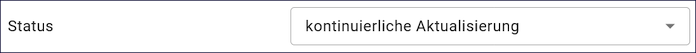

Abb.: Feld Status

`Auswahlliste Status <https://metaver-bedienungsanleitung.readthedocs.io/de/latest/ingrid-editor/auswahllisten/auswahlliste_zeitbezug_status.html>`_

Das Feld Status beschreibt den Bearbeitungsstand eines Projektes oder eine der Messung etc. Diese können sich in unterschiedlichen Stadien befinden, d.h. Projekte, Programme oder Messungen können in Planung sein, derzeit durchgeführt werden oder schon abgeschlossen sein.

Feld: Periodizität
^^^^^^^^^^^^^^^^^^

Abb.: Feld Priodizität

`Auswahlliste der Priodizität <https://metaver-bedienungsanleitung.readthedocs.io/de/latest/ingrid-editor/auswahllisten/auswahlliste_zeitbezug_periodizitaet.html>`_

Im Feld Periodizität wird der Zeitzyklus der Datenerhebung angegeben.

Feld: Intervall der Erhebung
^^^^^^^^^^^^^^^^^^^^^^^^^^^^

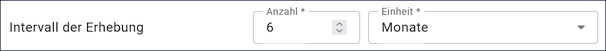

Abb.: Feld Im Intervall der Erhebung

`Auswahlliste Intervall <https://metaver-bedienungsanleitung.readthedocs.io/de/latest/ingrid-editor/auswahllisten/auswahlliste_zeitbezug_intervalle.html>`_

Mit Intervall wird der zeitliche Abstand (Frequenz) der Datenerhebung angegeben. Erfolgt die Datenerhebung kontinuierlich oder periodisch (siehe Feld Periodizität), so wird diese Angabe hier präzisiert. Es stehen Felder für den Eintrag einer Anzahl und eine Auswahlliste für die Einheit zur Verfügung. Der Eintrag von "6" und "Monaten" bedeutet, dass die beschriebenen Daten alle 6 Monate aktualisiert werden.

Feld: Erläuterungen
^^^^^^^^^^^^^^^^^^^

.. figure:: ../../img/ige/erfassung/ige_metadaten/abschnitt-07_zeitbezug/erlaeuterungen.png
   :align: left
   :scale: 80
   :figwidth: 100%

Abb.: Textfeld für Erläuterungen - Beispiel: Die Messungen erfolgten nur am Tag.

Hier können z.B. die Angaben der Periodizität eingeschränkt, weitere Zeitangaben gemacht oder Unregelmäßigkeiten erklärt werden. Im Zusammenhang mit dem Eintrag im Feld Periodizität können hier Abstände, Perioden und Intervalle eingetragen werden, die sich nicht aus dem Zusammenhang der anderen Felder des Zeitbezuges erklären, z.B. Jahreszeiten, Dekaden, Tageszeiten.

-----------------------------------------------------------------------------------------------------------------------

Abschnitt Zusatzinformation
---------------------------

Der Abschnitt Zusatzinformation enthält Angaben von allgemeinen Informationen wie Sprache und Veröffentlichungsbreite des Metadatensatzes.

Feld: Sprache des Metadatensatzes
^^^^^^^^^^^^^^^^^^^^^^^^^^^^^^^^^^

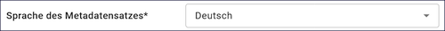

Abb.: Auswahlfeld - Sprache des Metadatensatzes

Es erfolgt die Angabe der Sprache des Metadatensatzes, als Standard ist Deutsch voreingestellt.

Feld: Sprache der Ressource
^^^^^^^^^^^^^^^^^^^^^^^^^^^^

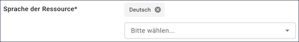

Abb.: Auswahlfeld - Sprache der Ressource

Es erfolgt die Angabe der Sprache des beschriebenen Datensatzes, als Standard ist Deutsch voreingestellt.

Feld: Weitere rechtliche Grundlagen
^^^^^^^^^^^^^^^^^^^^^^^^^^^^^^^^^^^^

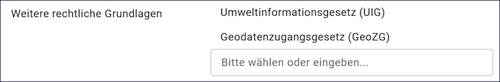

Abb.: Auswahl-/Eingabefeld - weitere rechtliche Grundlagen

Angabe der rechtlichen Grundlage, die die Erhebung der beschriebenen Daten veranlasst hat. Hier können Kürzel von Gesetzen, Erlassen, Verordnungen usw. eingetragen werden, in denen z. B. die Methode oder die Form der Erhebung der im Datensatz beschriebenen Daten festgelegt oder beschrieben wird. Es ist bei Bedarf der Eintrag mehrerer Angaben möglich.

Felder: Weiteres
^^^^^^^^^^^^^^^^

Feld: Herstellungszweck
"""""""""""""""""""""""

Abb.: Textfeld - Herstellungszweck / Eignung Nutzung

Zusammenfassung, für welchen Zweck oder mit welcher Absicht die Ressource erstellt wurde. 

Beispiel: Potentiale für Grünfächen, Fassadenbegrünung, Dachbegrünung und Flächen für Baumpflanzungen

Bei gewünschter Mehrsprachigkeit muss dieses Feld nach dem Schema "Deutscher Text#locale-eng:English text" gefüllt werden. 
Beispiel: Baumfällungen#locale-eng:Tree felling

Feld: Eignung/Nutzung
"""""""""""""""""""""

Beispiel: Grunlage für Planung von Anpassungsmaßnahmen an den Klimawandel

Spezifische Nutzung: kurze Beschreibung zur Verwendung der Ressource.
Angaben über die Verwendungsmöglichkeiten, die diese Daten in Verbindung mit weiteren Informationen erfüllen können.

-----------------------------------------------------------------------------------------------------------------------

Abschnitt Verfügbarkeit
-----------------------

Im Abschnitt Verfügbarkeit wird angegeben, ob die zu beschreibenden Daten einer Zugriffsbeschränkung unterliegen und welche Nutzungsbedingungen für diese Daten gelten.

Feld: Zugriffsbeschränkungen
^^^^^^^^^^^^^^^^^^^^^^^^^^^^

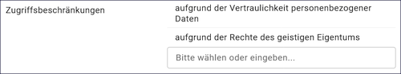

Abb.: Auswahl-/Eingabefeld - Zugriffsbeschränkungen

`Auswahlliste der Zugriffsbeschränkungen <https://metaver-bedienungsanleitung.readthedocs.io/de/latest/ingrid-editor/auswahllisten/auswahlliste_verfuegbarkeit_zugriffsbeschraenkungen.html>`_

Im Feld Zugriffsbeschränkungen kann aus einer Auswahlliste ein Grund angegeben werden, warum die Daten einer Einschränkung unterliegen. Trifft keiner dieser Gründe zu, ist der Eintrag „Es gelten keine Beschränkungen“ anzugeben.

Felder für Nutzungsbedingungen
^^^^^^^^^^^^^^^^^^^^^^^^^^^^^^^

Feld: Lizenz
""""""""""""

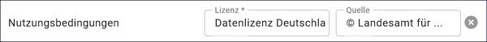

Abb.: Beispiel - Nutzungsbed.: Datenlizenz Deutschland Namensnennung 2.0 / Quellvermerk: © GeoBasis-DE / BKG (Jahr des letzten Datenbezugs)

`Auswahlliste der Nutzungsbedingungen <https://metaver-bedienungsanleitung.readthedocs.io/de/latest/ingrid-editor/auswahllisten/auswahlliste_verfuegbarkeit_nutzungsbedingungen.html>`_

Nutzungsbedingungen sind ein einseitig vorformulierter Vertrag, mit dem der Anbieter (der Datenbereitsteller) die Nutzer der Daten über ihre Rechte und Pflichten informiert.
In der Tabellenspalte Nutzungsbedingungen ist eine Auswahlliste mit Lizenzen hinterlegt, diese beschreiben vordefinierte Nutzungsbedingungen. Weiterhin besteht die Möglichkeit Nutzungsbedingungen per Freitext in die Zeile einzutragen oder unter Verweise Nutzungsbedingungen zu verlinken.

Feld: Quellenvermerk
""""""""""""""""""""

In dieser Tabellenspalte wird das Copyright des Datenbreitstellers angegeben und optional die Angabe für das Jahr des Datenbezugs.

Beispiel: © Landesamt für ... - jjjj

Feld: Anwendungseinschränkungen
^^^^^^^^^^^^^^^^^^^^^^^^^^^^^^^

Abb.: Beispiel - Nicht für Navigationszwecke geeignet oder Registrierung erforderlich

Das Feld Anwendungseinschränkungen dient der Beschreibung, welche Einschränkung oder Eignung auf die Ressourcen oder Metadaten zutreffen (ISO: useLimitation).

 
Felder für Datenformat
^^^^^^^^^^^^^^^^^^^^^^

Abb.: Beispiel für Datenformatangaben

`Auswahlliste Datenformat <https://metaver-bedienungsanleitung.readthedocs.io/de/latest/ingrid-editor/auswahllisten/auswahlliste_verfuegbarkeit_datenformate.html>`_

Angabe des Formats der Daten in DV-technischer Hinsicht, in welchem diese verfügbar sind. Das Format wird durch 4 unterschiedliche Eingaben spezifiziert. Wenn das erste Feld befüllt wird, müssen auch die anderen Eintragungen vorgenommen werden. 

| **Feld: Name**

  - Angabe des Formatnamens (Beispiel: GML) 

| **Feld: Version**

  - Version der verfügbaren Daten (Beispiel: Version: 3.2.1 oder "Version vom tt.mm.jjjj") 

| **Feld: Kompressionstechnik**

  - Kompression, in welcher die Daten geliefert werden (Beispiel: Zip, keine)

| **Feld: Spezifikation**

  - Details zur Spezifikation (Beispiel: XML-basiertes Datenaustauschformat (OGC/ISO TC211)).

Felder: Medienoption
^^^^^^^^^^^^^^^^^^^^

Abb.: Beispiel für Medienoptionangaben

Angabe auf welchen Medien oder über welche Medien die Daten zur Verfügung gestellt werden können (digital und analog). Es können mehrere Medien eingetragen werden.

| **Feld: Medium**

  - Bezeichnung des Mediums, auf dem die Ressource erhältlich ist (Beispiel: HDD)

| **Feld: Datenvolumen**

  - Angabe des Datenvolumens in MB (Beispiel: 20 MB)

| **Feld: Speicherort**

  - Angabe eines Ortes, an dem die Daten abgelegt sind (Beispiel: Ordner: Daten/.../.../)

`Auswahlliste Medium <https://metaver-bedienungsanleitung.readthedocs.io/de/latest/ingrid-editor/auswahllisten/auswahlliste_verfuegbarkeit_medienoption.html>`_

Angabe von generellen Informationen zur Bestellung, wie z.B. Bedingungen oder Konditionen.

Feld: Bestellinformation
^^^^^^^^^^^^^^^^^^^^^^^^

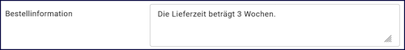

Abb.: Beispiel für eine Bestellinformation - Die Lieferzeit beträgt 3 Wochen.

-----------------------------------------------------------------------------------------------------------------------

Abschnitt Verweise
------------------

Eingabefelder unter Verweise
^^^^^^^^^^^^^^^^^^^^^^^^^^^^

Abb.: Verweise hinzufügen

.. hint:: Wenn die Option Open Data ausgewählt wurde, muss mindestens ein Verweis vom Typ „Datendownload“ angelegt werden, bevor der Metadatensatz veröffentlicht werden kann.

Abb.: Verweise bearbeiten

| **Feld Typ:** `Auswahlliste <https://metaver-bedienungsanleitung.readthedocs.io/de/latest/ingrid-editor/auswahllisten/auswahlliste_verweise_verweistypen.html>`_
| **Feld Titel:** Titel, der mit einem Link hinterlegt werden soll.
| **Feld URL:** Angabe einer Webseite-URL oder einer Download-URL, auf die verwiesen werden soll.
| **Feld Datensatzverweis:** Verweise auf interne und Externe Metadatensätze (UUID)
| **Feld Erläuterungen:** Ergänzende Erläuerung zu einer Verlinkung

Beispiel für eine Erläuterung: Downloadmöglichkeit der Landesfläche in 4 Teilen

Im Feld Datensatzverweis muss die Datensatz-UUID (Beispiel: 19bd40ac-8be8-464a-8273-f2ce87e0fe32) des Metadatensatzes angegeben werden, auf den intern bzw. extern verlinkt werden soll. Die Datensatz-UUIDs befinden sich versteckt im Kopf der Erfassungsmasken (mit Pfeil ausklappen).

.. figure:: ../../img/ige/erfassung/ige_metadaten/abschnitt-10_verweise/verweis-unspezifisch.png
   :align: left
   :scale: 80
   :figwidth: 100%

Abb.: Beispiel für einen Verweis auf eine Webseite

.. hint:: Der Inhalt der Auswahlliste im Feld: Verweistyp richtet sich nach den gewählten Datensatztyp.

Kataloginterne und externe Verweise
^^^^^^^^^^^^^^^^^^^^^^^^^^^^^^^^^^^

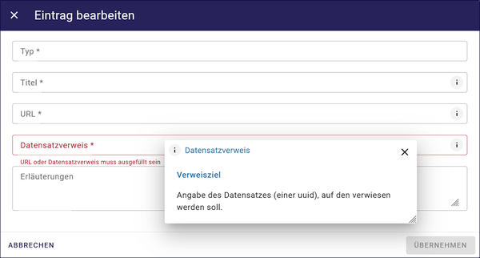

Abb.: Feld Datensatzverweis - Angabe einer Datensatz-ID

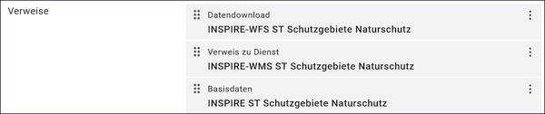

Abb.: Beispiele für Kataloginterne Verweise

Abb.: Interner Verweis auf einen Datendownload

Abb.: Interner Verweis auf einen Dienst

Abb.: Interner Verweis auf Basisdaten

Abb.: Interner Verweis auf eine Fachliche Grundlage

.. hint:: Für Verweise auf externe Metadaten ist die Vorgehensweise gleich.